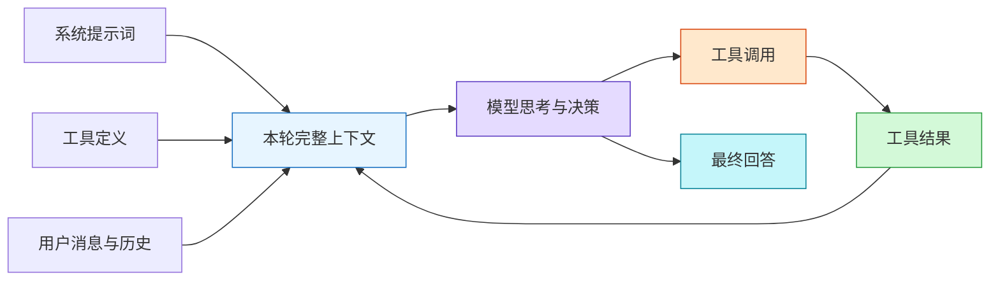
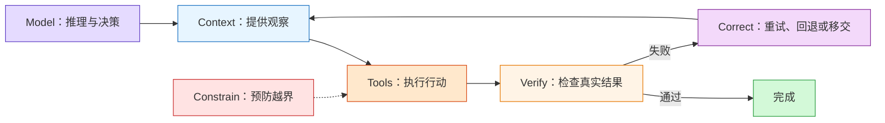
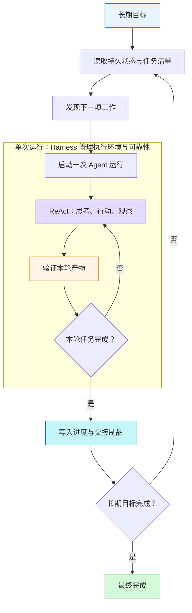
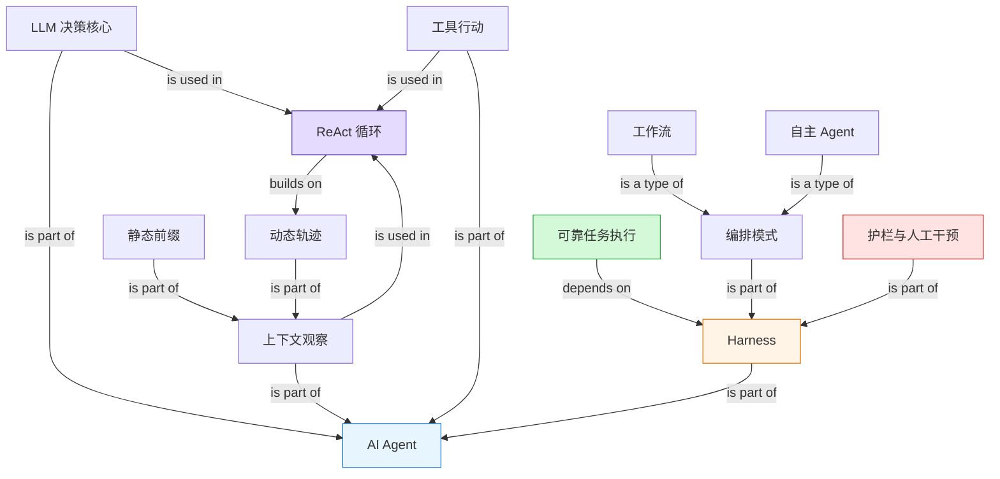

# 第一章：AI Agent 入门

> Source: [`materials/book/chapter1.md`](../../materials/book/chapter1.md)  
> Refreshed: 2026-07-22  
> Scope note: 本笔记忠实整理本地章节。Kimi K3、GPT-5.6、框架能力与榜单数字均作为“原文中的案例”记录，不在此处独立验证其当前状态。

### 1. Topic Overview

- **What this is about**：本章是全书的概念地图，先解释 Agent 的组成与运行循环，再解释生产级 Agent 为什么需要 Harness、编排与安全机制。
- **Why it matters**：它给后续章节建立统一坐标。以后遇到提示词、RAG、MCP、代码执行、评估或多 Agent，都可以追问：它属于模型、上下文、工具，还是外围 Harness？
- **Difficulty**：中等。概念本身不难，难点在于区分不同抽象层：组成公式、执行循环、生产工程与编排方式不是同一层的问题。
- **Prerequisites**：无需强化学习背景。Policy / Observation Space / Action Space 只是可选映射。

#### Source-grounded roadmap

1. 用“脑—眼—手脚”识别 Agent 的三大组成。
2. 看懂工具调用四步，以及 LLM、上下文、工具如何形成 ReAct 闭环。
3. 区分三种学习机制，并理解上下文为什么是 Agent 的即时视野。
4. 从最小 Agent 扩展到生产级 Harness：上下文、工具、约束、验证、纠正。
5. 用控制权归属区分单次调用、工作流、自主 Agent 与混合模式。
6. 用输入—执行—输出三层护栏和人工干预管理风险。

### 2. Core Concepts

#### Schema 1：把 Agent 拆成决策、观察与行动

- **Definition**：`Agent = LLM + 上下文 + 工具`。
  - LLM 是“大脑”：理解意图、规划、判断下一步。
  - 上下文是“眼睛”：决定模型在当前决策点能看到什么。
  - 工具是“手脚”：决定系统能获取什么、改变什么、与谁协作。
- **Intuition**：只有大脑而没有眼睛和手脚，系统可以讨论任务，却既看不到真实环境，也不能改变真实环境。
- **Academic mapping（可选）**：LLM 对应策略，Context 对应观察空间，Tools 对应动作空间。
- **Example**：Coding Agent 用代码库、需求和终端输出作为眼睛；用搜索、编辑、命令执行作为手脚；由 LLM 决定搜索哪里、改什么、是否继续调试。
- **Common mistakes**：
  - 把 Agent 简化成“一个会聊天的 LLM”。
  - 把上下文只理解成用户当前的一句话。
  - 把工具只理解成几个 API，忽略代码生成、子 Agent、用户沟通和事件触发。
  - 只看是否调用过工具，不看系统是否能根据反馈继续决策。

#### Schema 2：按交互方向识别工具，并跑通工具调用四步

- **Definition**：广义工具体系包含五类。
  1. 感知工具：搜索、文件读取、数据库、外部 API。
  2. 执行工具：代码执行、文件写入、系统命令、业务 API。
  3. 协作工具：委托子 Agent、请求人类确认、多 Agent 协调。
  4. 事件触发工具：邮件、定时器、Webhook 等外部事件启动任务。
  5. 用户沟通工具：消息、邮件、语音等主动触达渠道。
- **Intuition**：前两类回答“怎么知道、怎么做”；后三类扩展“谁来触发、和谁合作、怎样汇报”。
- **Tool calling flow**：
  1. 把工具名、用途与参数定义放进上下文。
  2. 模型决定是否调用、调用哪个、传什么参数。
  3. 框架真正执行工具，并把结果追加到上下文。
  4. 模型读取结果，决定继续行动还是给出最终回答。
- **Example**：`get_weather(city="北京")` 的真实天气不是模型生成的；模型只生成结构化调用，天气服务执行后把 JSON 结果交还给模型。
- **Common mistakes**：
  - 误以为“模型调用工具”表示工具实现已经写进模型权重。
  - 只设计成功路径，不设计错误返回、权限和超时处理。
  - 一味追求专用小工具；原文更偏向“通用工具 + 安全沙盒”，因为组合空间更大。

#### Schema 3：区分模型能力与三种学习机制

- **LLM role**：预训练提供世界知识、语言能力与结构化推演基础；后训练可把决策策略进一步固化进参数。零样本是“无示例也能组合已有知识”，少样本是“看少量示例后套用模式”。
- **Three learning modes**：

| 机制 | 发生时间 | 改变什么 | 持久性 | 主要边界 |
| --- | --- | --- | --- | --- |
| 后训练 | 训练时 | 模型参数/策略 | 持久、跨任务 | 成本高、更新慢 |
| 上下文学习 | 推理时 | 当前窗口中的注意与模式匹配 | 临时 | 会话结束即消失，难以发现全新规律 |
| 外部化学习 | 运行时 | 知识库、笔记、流程与工具代码 | 持久、可更新、可解释 | 需要专门整理和维护 |

- **Example**：把“何时调用搜索”练进参数是后训练；把三条客服示例放进提示词是上下文学习；把退款流程固化成可执行工具是外部化学习。
- **Common mistake**：看到“学习”二字就认为一定发生了梯度更新。上下文学习更接近临时模式检索，外部化学习则把能力放在模型之外。

#### Schema 4：把上下文分成静态前缀与动态轨迹

- **Definition**：每次 LLM 调用看到的上下文由五部分组成。
  - 静态前缀：系统提示词、工具定义。
  - 动态轨迹：用户消息、模型回复、工具执行结果。
- **System prompt**：岗位说明书，定义身份、权限和行为准则，也可注入用户记忆与环境状态。
- **Tool definitions**：声明可用能力及参数边界。
- **User messages**：用户输入，也可携带 RAG 检索得到的外部知识。
- **Assistant messages**：此前的 reasoning、content 和 tool calls。
- **Tool results**：环境对行动的反馈，是下一步决策的直接依据。
- **Ablation evidence in the chapter**：
  - 无工具定义：不会调用工具。
  - 无工具结果：看不到反馈，容易重复调用并盲目循环。
  - 无先前推理：决策可能前后不连贯。
  - 无历史消息：忘记已做步骤，从头重复任务。
- **Common mistake**：把上下文当作“提示词文案”。提示词只是上下文的一部分；上下文管理还包括工具 schema、历史、状态、知识和结果反馈。

#### Visual Model：静态前缀和轨迹怎样驱动 ReAct？



- **How to read**：静态前缀与不断增长的轨迹合成本轮上下文；模型据此行动，工具结果又回流，直到模型输出最终答案。
- **Source anchor**：[`chapter1.md`，“上下文：Agent 的眼睛”与“ReAct 循环”](../../materials/book/chapter1.md#上下文agent-的眼睛)。
- **Boundary**：图把多个历史消息压成一个节点，没有展开 token 成本、压缩与缓存策略。

#### Schema 5：用 ReAct 把三大组件跑成闭环

- **Definition**：ReAct 是 `Reasoning -> Acting -> Observing` 的重复循环。
- **Mechanism**：
  1. LLM 基于当前上下文思考下一步。
  2. 通过工具对外行动。
  3. 把工具结果作为观察追加到轨迹。
  4. 新一轮 LLM 调用读取“静态前缀 + 完整轨迹”。
  5. 达到完成条件时停止。
- **Example**：多币种汇总任务中，第一轮并行换汇，第二轮用代码解释器汇总，第三轮输出总收入和平均值。轨迹让每轮知道已经得到哪些结果。
- **Exit conditions**：任务完成、调用最终输出工具、模型不再请求工具、达到最大轮次、错误次数超限。
- **Common mistakes**：
  - 把 ReAct 误记成一次“先想后做”，漏掉观察与反馈循环。
  - 认为轨迹只是日志；实际上它既是记录，也是下一轮决策输入。
  - 不设置退出条件，导致死循环或过度执行。

#### Schema 6：分清“模型即 Agent”中的决策归属与执行归属

- **Definition**：先进模型可通过后训练把“何时调用、调用哪个、传什么参数、是否继续”的决策策略内化；工具实现、执行环境、结果回传仍在模型之外。
- **Intuition**：模型学会的是“怎样使用锤子”，不是把真实锤子装进参数。
- **Example from the chapter**：Kimi K3 与 GPT-5.6 被用来说明原生 Agent 能力和服务端内置工具。客户端编排可以变薄或移到 API 服务端，但工具循环并未凭空消失。
- **Common mistake**：把“无需客户端手写编排”误解为“不再需要 Harness 或工具执行层”。

#### Schema 7：用 Harness 把“能做事”升级为“可靠地做事”

- **Definition**：

  `Agent = LLM + [上下文 + 工具 + 约束 + 验证 + 纠正] = Model + Harness`

- **Two abstraction levels**：
  - `LLM + Context + Tools` 描述 Agent 的内部组成。
  - `Model + Harness` 描述生产工程实现。
  - 两者不是竞争公式；Harness 的核心正是 Context 与 Tools，再在外围增加保障。
- **Five functions**：

| 功能 | 作用 | 核心原则 |
| --- | --- | --- |
| Context | 提供足够感知信息 | 信息充分性 |
| Tools | 提供行动手段 | 接口清晰 |
| Constrain | 事前限制越界 | 故障安全默认值，能力需显式开放 |
| Verify | 事后判断结果是否正确 | 优先验证结构化、隔离的数据 |
| Correct | 失败后重试、回退或移交 | 确认不可恢复前不暴露中间态 |

- **Example**：退款政策放进上下文；`query_order` 与 `process_refund` 是工具；退款金额不得超过订单金额是约束；查询数据库确认状态是验证；API 超时自动重试是纠正。
- **Common mistakes**：
  - 把“上下文中的退款政策”和“程序强制金额上限”都叫规则，忽略软信息与硬约束的边界。
  - 只验证模型说“成功”，不验证外部系统的真实状态。
  - 把 Harness 当作限制模型的累赘；它的目标是把不稳定能力导向可靠执行。

#### Visual Model：Harness 如何围绕模型闭合可靠性循环？



- **How to read**：Context 与 Tools 让任务能推进；Constrain 在行动前缩小风险；Verify 读取真实结果；Correct 将失败重新送回下一轮决策或交给人类。
- **Source anchor**：[`chapter1.md`，“Harness 工程：模型之外的竞争力”](../../materials/book/chapter1.md#harness-工程模型之外的竞争力)。
- **Boundary**：真实系统中约束、验证和纠正会分布在多个组件，不一定各自对应一个独立模块。

#### Schema 8：按关注范围理解工程范式的层层包含

- **Progression**：软件工程是共同基础；提示工程关注指令；上下文工程扩大到模型看见的全部信息；Harness 工程再扩大到模型运行的外围系统；Loop 工程继续扩大到跨轮次持续自主运行。
- **Containment**：`提示工程 ⊂ 上下文工程 ⊂ Harness 工程 ⊂ Loop 工程`。
- **Intuition**：不是新名词淘汰旧名词，而是工程师可以干预的系统边界不断扩大。
- **Common mistake**：认为模型升级后外部工程会消失。原文立场是“方向认同，节奏务实”：模型会逐步内化部分能力，但工程上仍需兜底当前能力边界。

#### Visual Model：Loop Engineering 与 ReAct、Harness 的时间边界在哪里？



- **How to read**：ReAct 是一次运行内部的“小循环”；Harness 保障这次运行能安全、可验证地推进；Loop Engineering 管外层“大循环”，负责跨运行读取状态、发现下一项工作，以及判断长期目标是否真正完成。
- **Source anchor**：[`chapter1.md`，“从提示工程到 Loop 工程”与“本书作为 Harness 工程的实践指南”](../../materials/book/chapter1.md#从提示工程到-loop-工程工程范式的演进)。
- **Boundary**：图把外层控制统一画成 Loop Engineering；真实系统可以由调度器、持久任务清单、初始化/执行 Agent 或多 Agent 协作共同实现。

#### Schema 9：用执行路径控制权选择编排模式

- **Decision ladder**：
  1. 单个 LLM 调用能解决，就不要引入多步系统。
  2. 步骤固定、业务规则严格，使用工作流。
  3. 步骤数量难预测、必须根据反馈动态调整，使用自主 Agent。
  4. 合规主干固定、局部需要灵活决策，使用混合模式。
- **Workflow**：代码预定义节点与顺序；LLM 只在节点内部理解或生成。优势是可控、安全、易审计；缺点是遇到未覆盖情况缺乏变通。
- **Autonomous Agent**：模型依据环境反馈实时决定下一步，本质是带退出条件的工具循环。优势是适合开放式任务；代价是延迟、成本和复合错误风险更高。
- **Example**：订机票的身份核验、付款、出票可由工作流强制顺序；航班取消后的替代路线搜索可交给自主 Agent；关键付款前再回到人工确认。
- **Common mistake**：只要节点内部用了 LLM 就称为自主 Agent。真正边界是“节点间路径由代码决定，还是由模型根据反馈决定”。

#### Schema 10：把安全设计成分层防线与升级机制

- **Input guardrails**：相关性、安全分类、内容审核、确定性规则；重点拦截越狱、外部提示注入与已知输入威胁。
- **Execution guardrails**：工具风险评级，根据可逆性、权限和财务影响决定是否额外审查或人工确认。
- **Output guardrails**：PII 过滤与输出验证，避免泄露或不符合品牌要求的内容。
- **Human in the loop**：两类主要触发器是超过失败阈值，以及敏感、不可逆、高风险操作。
- **Defense in depth**：单个护栏不能覆盖全部风险，多层专用机制组合才有韧性。
- **Common mistakes**：
  - 把安全当上线前的过滤器，而不是跨模型、上下文、工具与协作的架构问题。
  - 只根据工具名评估风险，不根据参数、目标对象和当前状态动态调整风险。
  - 只会“停止”，不会把状态和证据清楚移交给人类。

#### Practical selection principles

- **Build simply**：从单次调用和直接 API 开始，只在必要时增加复杂度。
- **Keep execution transparent**：保留计划、轨迹和工具日志，以便用户信任与工程调试。
- **Design ACI for the model**：名称、参数、示例和边界应让 Agent 容易正确使用，尽量用防呆设计消除误用。
- **Choose models on your own task**：重点评估推理与工具调用、延迟、输出速度、多模态、成本、部署与合规；不要只看排行榜。
- **Choose frameworks by Harness fit**：关注上下文管理、工具生态、约束、验证、纠正及抽象层是否足够薄，而非追逐最复杂的编排框架。

### 3. Deep Understanding

#### 3.1 整章的因果链

1. LLM 提供决策能力，但自身无法看到实时环境，也不能直接改变外界。
2. 上下文提供观察，工具提供动作，于是系统具备最小 Agent 形态。
3. ReAct 把观察、决策与动作组成闭环；轨迹让下一轮知道先前发生了什么。
4. 闭环越长，自主空间越大，幻觉、误用工具、重复循环和复合错误的风险越高。
5. Harness 用约束、验证与纠正把能力限制在可靠边界内。
6. 编排模式决定路径控制权放在代码还是模型；护栏与人工干预决定何时停止或移交。

#### 3.2 为什么“模型更强”与“更需要 Harness”可以同时成立

模型更强意味着它可以接管更多动态决策，但每次错误可能传播到更多后续行动。模型厂商可以把一部分编排策略内化进参数或服务端，外部框架则把重心移动到上下文管理、工具执行、安全、验证、恢复和长期状态。被模型吃掉的是某些实现细节，不是“可靠性需求”本身。

#### 3.3 三组关键权衡

- **自主性 vs 可控性**：未知路径越多，自主 Agent 越有价值；合规和顺序约束越强，工作流越有价值。
- **通用工具 vs 风险面**：代码解释器和文件系统组合力强，但必须配合沙盒、权限和验证。
- **完整轨迹 vs 成本**：完整历史提高连贯性和可调试性，却导致上下文越来越长；后续上下文工程需要压缩、摘要、检索和缓存。

### 4. Minimal Working Example

#### 场景：为用户退掉三天前的订单

**最小但脆弱的实现**：用户提出退款 -> LLM 生成“退款成功”。它也许语言流畅，但没有读取政策、没有调用订单系统，也没有确认真实状态。

**生产级执行流**：

1. Context：系统提示与知识库提供“7 天内可退款”的政策；用户消息给出订单号。
2. Reason：模型判断需要先查询订单，再执行退款。
3. Tool：调用 `query_order(order_id)` 获取金额、状态和用户归属。
4. Constrain：程序检查订单属于当前用户，退款额不超过订单额，且操作未重复执行。
5. Tool：调用 `process_refund(order_id, amount)`。
6. Verify：重新查询支付或订单数据库，确认状态真的变成 `refunded`。
7. Correct：若 API 超时，使用幂等键静默重试；连续失败则熔断，并携带订单状态移交人工。
8. Final：只有验证通过后，才向用户报告退款完成。

**Reasoning flow**：

```text
政策与订单信息
-> 判断是否满足退款条件
-> 调用真实业务工具
-> 验证外部系统状态
-> 成功则回复；失败则纠正或移交
```

这条流程同时展示了三大组件、ReAct、Harness 五功能、退出条件与人工干预。

### 5. Chapter Knowledge Map



### 6. Self-Test Questions

#### Recall

1. `Agent = LLM + 上下文 + 工具` 中，三者各自解决什么问题？
2. 上下文的静态前缀和动态轨迹分别包含哪些内容？
3. Harness 的五个功能是什么？约束、验证、纠正分别发生在什么阶段？

#### Application / transfer

4. 一个旅行客服的订票步骤固定，但航班取消后的替代方案无法预先枚举。你会怎样混合工作流与自主 Agent？控制权在何处切换？
5. `delete_file(path)` 通常是低风险工具，但 `path=/etc/...` 时风险很高。请从约束、验证和人工干预三层设计保护。

#### Explain like I am five

6. 用“聪明的大脑、桌上的资料、可以操作的手、旁边的安全员”解释 Model、Context、Tools 和 Harness 的关系。

#### Source thought-question index

原文章末还要求读者继续推演：三组件资源取舍、长轨迹的二次方成本、模型即 Agent 与 Harness 的共存、死循环检测、用感知/行动/策略分析产品、混合编排、动态工具风险、受限动作空间、异步人工移交，以及哪些设计原则可能随模型进步而过时。

### 7. Weak Point Detection

- **组成层与工程层混淆**：把 `LLM + Context + Tools` 和 `Model + Harness` 当成两个互斥定义。
- **工具决策与工具执行混淆**：认为 RL 把搜索引擎、代码沙盒本身训练进模型参数。
- **上下文范围过窄**：只记住提示词，忘记工具定义、轨迹、状态和工具反馈。
- **ReAct 缺观察**：能背 Reasoning + Acting，却解释不了结果怎样进入下一轮。
- **把轨迹只当日志**：忽略它是下一轮模型调用的输入。
- **工作流与自主 Agent 只看“是否用了 LLM”**：没有检查执行路径由代码还是模型控制。
- **可靠性只靠模型自检**：让模型验证自己的自然语言，而不读取外部结构化事实。
- **自主性没有停止条件**：缺最大轮次、错误阈值、幂等与熔断。
- **护栏单点化**：只做输入过滤，没有执行侧权限、输出验证与人工移交。
