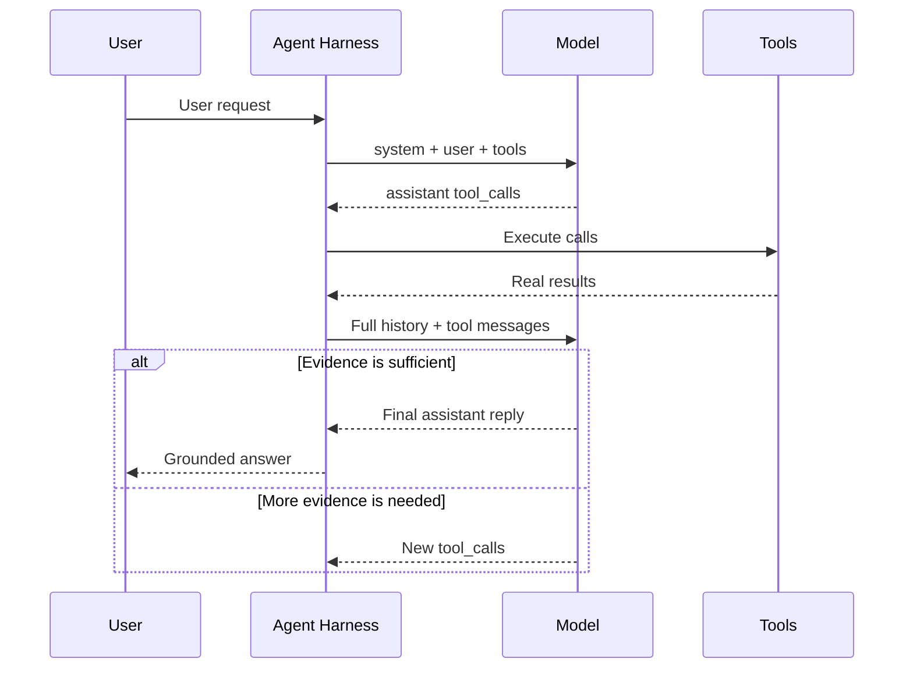
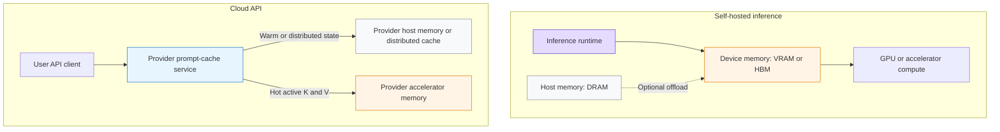
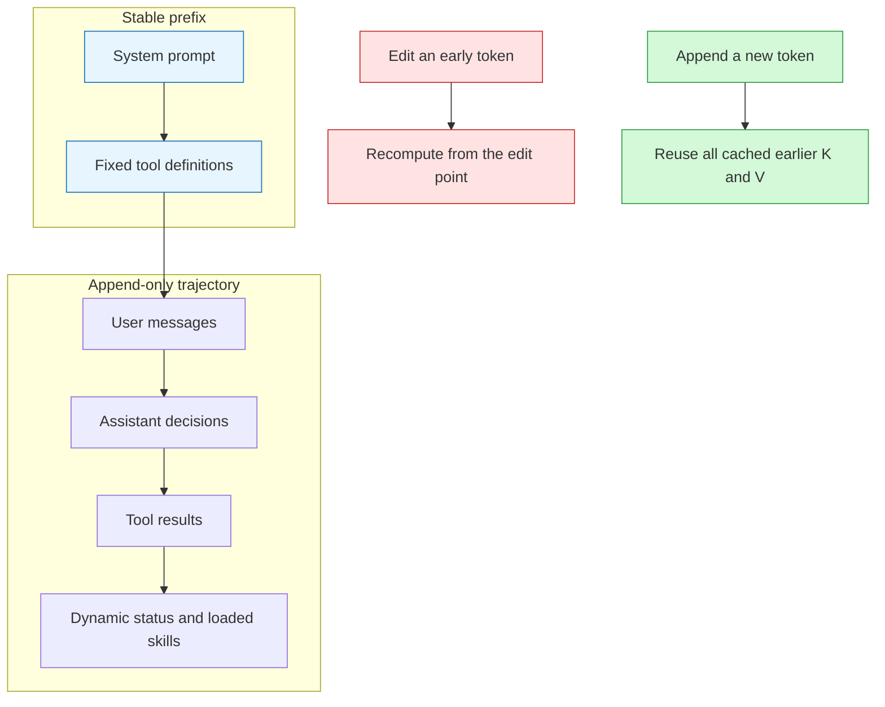
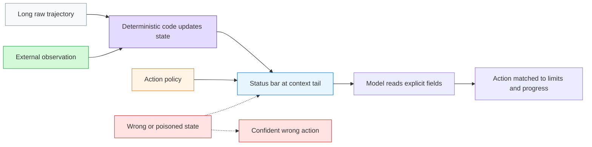
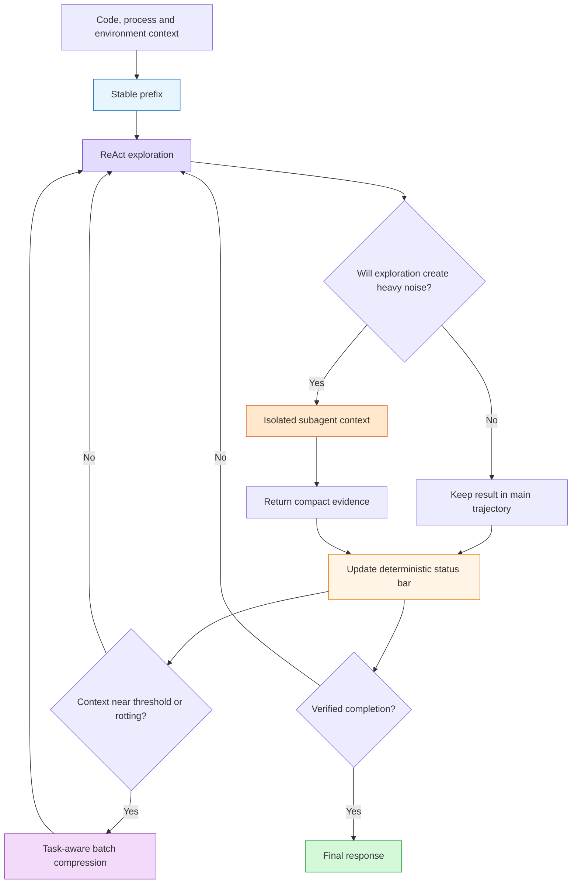
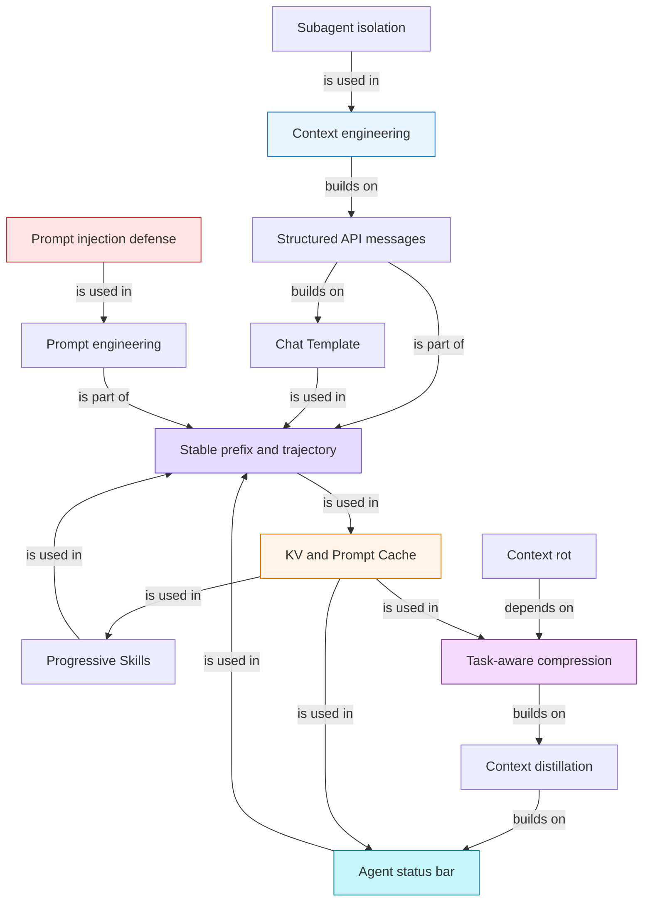

# 第二章：上下文工程

> Source: [`materials/book/chapter2.md`](../../materials/book/chapter2.md)  
> Refreshed: 2026-07-23  
> Scope note: 本笔记逐节覆盖本地文章的正文、实验、关键数字和研究前沿选读。厂商功能、产品实现、模型版本、价格和论文结果均按原文记录，不代表在本次整理中做了独立的实时核验。

### 1. Topic Overview

- **What this is about**：上下文工程不是“把 prompt 写长一点”，而是系统地决定模型在每个决策点能看到什么、按什么结构看到、哪些内容常驻、哪些内容按需加载、何时提炼或隔离。
- **Why it matters**：模型只能基于当前请求里的信息行动。上下文不足会让强模型盲猜；上下文过长、结构混乱或被污染，则会带来缓存失效、注意力稀释、错误工具调用和安全风险。
- **Difficulty**：中高。必修部分是 API 消息结构、静态前缀与动态轨迹、三条缓存原则、Skills、状态栏和压缩策略；注意力内部机制、缓存架构约束及两段 2026 年研究属于深水区。
- **Prerequisites**：第一章的 `LLM + Context + Tools`、ReAct、Trajectory 与 Harness。Transformer 数学不是必需前提。

#### Source-grounded roadmap

1. 先判断 Agent 是否拿到了完成任务的最低信息：代码、流程、环境。
2. 从 API 消息列表追踪一次完整的工具调用循环。
3. 把上下文拆成稳定前缀与动态轨迹，并理解 Chat Template 的角色。
4. 用 KV Cache / Prompt Cache 约束上下文布局。
5. 把系统提示词写成可执行的员工手册，并防御提示注入。
6. 用 Skills 按需加载领域能力，避免一次性塞满。
7. 用 Agent 状态栏把隐式状态提炼为显式读数和策略。
8. 用任务感知压缩与子 Agent 隔离控制上下文腐化和膨胀。

### 2. Core Concepts

#### Schema 1：先审计信息供给，再评价模型能力

- **Trigger**：Agent 输出看似聪明却不符合项目、业务或环境时。
- **Definition**：上下文是本次模型调用实际看到的全部信息；它决定 Agent 可用能力的上限。上下文工程是 Harness 中“上下文与工具”层面的核心实现。
- **Minimum information set for a Coding Agent**：
  - **代码上下文**：目录结构、模块职责、核心数据结构、代码规范。
  - **流程规范**：分支策略、提交规范、代码审查、CI/CD 要求。
  - **环境信息**：开发与测试配置、staging 部署、密钥管理。
- **Intuition**：模型像永远刚入职的聪明员工。它可以通用地推理，但不能凭空知道团队的隐性决策。
- **Organizational boundary**：上下文工程首先是技术问题，更根本是组织问题。知识如果散在老员工记忆、私聊和无文档代码里，就没有稳定的信息可以供给 Agent。
- **Team implication**：公开、可检索、文档驱动的远程协作方式天然对 Agent 友好；建设 AI 原生团队首先是一场文档化运动。
- **Example**：同一句“修复这个 bug”，如果没有仓库结构和 CI 规则，模型可能产出语法正确但破坏架构、绕过测试或无法部署的修复。
- **Common mistakes**：
  - 先换更大模型，完全不检查信息缺口。
  - 把上下文只理解成用户最后一句话。
  - 把文档化当成 Agent 上线后的附属工作。

#### Schema 2：沿消息列表追踪 Agent 的真实控制循环

- **Trigger**：需要解释工具调用如何发生，或诊断“模型已经调用工具但外部系统没变化”。
- **Four message roles**：
  - `system`：开发者提供的身份、规则与约束，通常位于最前面。
  - `user`：终端用户输入；后文的状态栏也会技术性复用这个角色。
  - `assistant`：模型先前的文本或 `tool_calls`。
  - `tool`：框架执行工具后的结果，用 `tool_call_id` 对应具体调用。
- **Independent request field**：工具定义位于 `tools` 字段，而不是一条普通消息；它声明工具名、描述和参数 schema。
- **Statelessness**：每次 API 调用都是无状态的。模型不会自动记住上次调用，框架必须把需要的历史重新放进请求。
- **Control ownership**：
  - 模型决定是否调用、调用哪个工具、传什么参数。
  - Agent 框架解析参数、实际执行 API 或代码，再把真实结果送回模型。
- **Core loop**：
  1. 框架发送 `system + user + tools`。
  2. 模型返回一个或多个 `tool_calls`，互不依赖的调用可并行。
  3. 框架执行工具，把原始 assistant 调用消息和对应 tool 结果追加到 `messages`。
  4. 再次调用模型；有新 `tool_calls` 就继续，没有就输出最终文本。
- **Production boundary**：原文的最简 Python 代码用 `while True` 演示机制，生产系统必须加 `max_iterations`、参数解析、错误处理和真实工具实现。
- **Example**：查询温哥华时间和天气时，模型在一次回复中并行请求两个工具；框架执行后把两个结果按 `tool_call_id` 送回，模型才生成最终答复。
- **Common mistakes**：
  - 把模型生成的 JSON 当作工具已经执行。
  - 第二轮只发送工具结果，漏掉模型先前的 tool-call 决策。
  - 把历史当作服务端记忆，不在下一次请求中显式提供。
- **Experiment 2-1**：
  - 原文用本地 Qwen3-0.6B 说明，小模型在合适的提示和 Harness 下也能完成思考与工具调用；在苹果 M2 示例中生成速度超过每秒 100 token。
  - 本地服务可以直接观察 API 层隐藏的原始 token：`<think>` 内部思考、面向用户的文本、工具调用请求按顺序生成。
  - 流式框架可在一个工具调用的参数完整并通过校验后立即执行，不必等后续调用全部生成；互不依赖的调用可以并行。
  - 工具结果回传后，模型以“是否仍生成 tool_calls”表达继续或终止；实验还让读者对比稳定前缀和修改 system 开头后的 TTFT，为 KV Cache 建立直觉。

#### Visual Model：消息如何在两次 API 调用之间形成 ReAct 循环？

- **How to read**：模型只产生行动意图；Harness 执行并把观察写回完整历史，下一次调用才能基于真实结果继续。
- **Source anchor**：[`chapter2.md`，“带工具调用的多轮交互”与“用代码实现 Agent 的核心循环”](../../materials/book/chapter2.md#带工具调用的多轮交互agent-的核心循环)。
- **Boundary**：图省略了并行调度、超时、重试和最大轮次等生产机制。

#### Schema 3：把上下文保持为“静态前缀 + 只增轨迹”

- **Trigger**：需要决定一条信息应该放在哪里，或解释缓存、Skills、状态栏与压缩为何彼此相关。
- **Static prefix**：系统提示词和完整工具定义，通常在整段会话中保持不变。
- **Dynamic trajectory**：用户消息、assistant 文本或工具调用、tool 结果按时间不断追加。
- **Central insight**：Agent 框架的核心工作就是管理 `messages`；本章其他技术都在优化这个列表的内容、位置和生命周期。
- **Chat Template**：
  - API 的结构化消息会被模板翻译成模型实际读取的线性 token 流。
  - 特殊 token 标记角色与边界；Qwen、Llama、Gemma 等模型家族的模板不同。
  - 标准 API 角色让模型按训练过的格式识别 system、user、assistant 和 tool。
- **Reasoning-history boundary**：
  - 原文举例：Qwen3 会在工具循环中保留历史思考，但新真实用户轮次可能触发清理。
  - DeepSeek 会剥离历史思考；Claude 工具循环要求客户端原样回传带签名的 thinking block，而新用户轮次后服务端忽略历史 thinking。
  - 因此不能把工具结果伪装成 user 消息，否则可能错误地触发“新话题”语义并破坏多步连贯性。
- **Common mistakes**：
  - 自己拼 `"USER: ... ASSISTANT: ..."`，让模型重新猜角色边界。
  - 把工具结果标成 user 消息。
  - 把所有上下文都叫 prompt，忽略工具 schema 与轨迹。

#### Schema 4：把前缀稳定性当作 KV Cache / Prompt Cache 的架构约束

- **Trigger**：首 token 延迟或成本突然升高，或者动态信息、工具集与子 Agent 需要布局。
- **Attention intuition**：
  - 当前 token 生成 Query，前面各 token 提供 Key 用于匹配、Value 用于提取内容。
  - Query 与 Key 点积形成权重，再对 Value 加权求和。
  - softmax 强制所有注意力权重之和为 100%；即使没有真正相关的 token，权重也必须被分配。
  - 因果注意力只能看自己和前文，因此热力图呈三角形。
- **Experiment 2-2, observed attention patterns**：
  - 第一个 token 常吸收大量无法分配的剩余注意力，形成 Attention Sink。
  - 思考阶段与回答阶段各有三角形自注意模式。
  - 模型常偏好上下文开头和结尾，中间信息更容易丢失，即 Position Bias / Lost in the Middle。
- **KV Cache**：在单次推理内部缓存历史 token 在各层的 K、V 投影，避免每生成一个 token 都重算整个前缀。它没有消除新 token 对全部历史 K、V 的扫描，所以长上下文解码仍随长度线性变慢，显存和带宽仍是瓶颈。
- **Prompt Cache**：API 服务层跨请求复用相同前缀对应的 KV Cache。原文记录：Anthropic 需要显式断点、写入约 1.25 倍计费并有最小长度与 TTL；OpenAI 为自动前缀匹配。厂商价格不同，读取折扣也不同。
- **Hardware placement bridge**：
  - Cache 是推理运行时管理的张量数据，不是 CPU 的 L1/L2/L3 这类固定硬件缓存。
  - 自托管 GPU 推理时，活跃 KV Cache 通常位于 GPU 显存或 HBM；CPU 推理时位于主内存 DRAM；Apple Silicon 等统一内存架构中，CPU 与 GPU 共享同一物理内存池。
  - 推理引擎可以把一部分 KV 状态换出到主机内存，甚至借助更慢的存储做分层管理，但数据搬运会增加延迟，具体策略取决于运行时和硬件。
  - 云 API 的 Prompt Cache 位于服务商基础设施，而不是调用者的电脑。服务商在逻辑上匹配相同前缀并复用其 K/V 计算结果；热数据可能在加速器内存，其他层级也可能使用主机内存或分布式存储，精确物理位置通常不会作为 API 契约暴露。
- **Why edits invalidate cache**：任一早期 token 改变，会改变第 1 层输出，并逐层传播；从变化点开始的后续缓存必须重算。
- **Three production rules**：
  1. 系统提示词和工具定义一旦确定就保持字节级稳定。
  2. 时间、用户状态等动态信息追加到末尾，或按需通过工具读取。
  3. 使用模型训练时对应的标准结构化 API 与 Chat Template。
- **Experiment 2-3, bad patterns and actual failure**：
  - 动态时间戳写进 system：整段前缀持续失效。
  - 每轮改用户配置或动态重排工具：生成大量缓存变体。
  - 滑动窗口丢最早消息：既破坏前缀，又可能丢关键工具结果，导致重复调用。
  - 纯文本拼角色：只要字节稳定未必破坏缓存，但会偏离训练格式，削弱工具与多步能力。
- **Cache as architecture**：
  - 缓存边界前放跨用户稳定内容，边界后放会话动态内容；N 个二值动态条件会产生 `2^N` 个缓存键。
  - 子 Agent 若要复用父请求的 Prompt Cache，提示词、工具、模型配置、消息前缀和思考配置需字节级对齐。
  - 大工具结果一旦替换成某个摘要字符串，应冻结并持久化该字符串，保证会话恢复后的字节流一致。
- **Research frontier, not current default**：原文选读把 KV 状态比作 prefill 时写下的“笔记”。带显式 CoT 的缓存编辑可传播局部事实修改；通过 RoPE 重定位可组合预计算缓存块，把部分组装从 `O(L²)` 降到 `O(L)`。这是研究阶段，当前生产系统仍应遵守前缀不变原则。

#### Visual Model：KV/Prompt Cache 的逻辑机制落在哪些硬件层？

- **How to read**：自托管时，运行时把活跃 KV 张量放在实际执行模型的设备内存；云端 Prompt Cache 是服务商跨请求管理和复用这些计算结果的服务能力，具体冷热分层对客户端通常不可见。
- **Source anchor**：[`chapter2.md`，“KV Cache 的原理与约束”及“KV Cache 与 Prompt Cache”](../../materials/book/chapter2.md#kv-cache-的原理与约束)。
- **Boundary**：硬件位置是实现相关的工程补充。图展示常见层级，不表示所有服务商都采用同一种存储拓扑。

#### Visual Model：一条信息放错位置，缓存代价如何扩散？

- **How to read**：越靠前的改写，失效范围越大；把动态信息只追加到轨迹末尾，可保住之前所有缓存。
- **Source anchor**：[`chapter2.md`，“KV Cache 友好的上下文设计”](../../materials/book/chapter2.md#kv-cache-友好的上下文设计)。
- **Boundary**：图表达缓存依赖方向，不展示 Transformer 的多头、多层计算细节。

#### Schema 5：把系统提示词设计成可执行的员工手册

- **Trigger**：模型知道事实却经常漏步骤、错用业务规则或工具。
- **Tone and style**：语气会塑造用户体验；大写 `MUST/NEVER` 可提高关键约束的显著性，但过度使用会稀释效果。
- **Structure**：Markdown 组织人机共读的层级；XML 标签提供更精确的机器语义。标签名本身应表达内容含义。
- **Process over rule pile**：用带阶段、顺序、异常分支和验证步骤的 SOP 组织行为；无序规则集合会让模型难以处理优先级与依赖。
- **Business rules are product design**：
  - 本章账单 Agent 的三种收费方式先按“用户为什么付钱”区分：

    | 收费方式 | 用户为什么付钱 | 典型场景 |
    | --- | --- | --- |
    | 按省钱提成 | Agent 通过谈判降低**现有账单**，从实际节省额中抽取一定比例 | 月费从 `$100` 谈到 `$80`；若提成 20%，收费 `$4` |
    | 固定服务费（原文称 tip） | 用户为完成一次服务付固定金额，费用不随节省额变化 | 预订餐厅、办理退款或取消订阅 |
    | 困难任务预收款 | 任务成功率很低，开始前先收费；即使失败通常也不退 | 特别难办、需要投入大量资源的请求 |

    这里的 `tip` 是本案例中的固定服务费名称，不应理解成用户事后自愿给的小费。
  - 模糊的“选择合适计费方式”会导致同类任务被不一致分类。
  - 规则需明确到可执行边界，如退款和取消不得按省钱比例计费。
  - 成功率阈值、金额粒度、四舍五入和“节省”的定义都应标准化。
  - 产品经理负责基于数据与反馈定义业务逻辑；工程师负责准确编码和组织，不应擅自发明规则。
- **Few-shot decision**：
  - 难以用规则表达的风格、报告格式和语气可用 2–3 个高质量边界示例。
  - 模型本就擅长且规则清楚时，示例只是 token 成本。
  - 示例无论放 system 还是会话前部，都应保持稳定；逐请求动态检索示例会持续改变前缀。
- **Tool definitions**：描述应包含用途、使用边界、参数示例、性能提示和工具间协作关系，而不只是函数签名。
- **Experiment 2-4, ablation evidence**：
  - 风格变化对完成率影响相对小。
  - 内容不变但打乱组织，任务成功率下降超过 30%。
  - 保留签名但删除工具描述，工具调用错误率增加 45%。
  - 方法论：Agent 表现差时逐项消融，比凭感觉全面改写更能定位高影响组件。
- **Common mistakes**：
  - 用数百条无优先级规则代替流程。
  - 把业务自由裁量权交给模型，然后期待结果一致。
  - 用十个相似示例淹没真正的规则。

#### Schema 6：把外部内容视为数据，而不是可执行指令

- **Trigger**：Agent 会读取网页、邮件、文档、图片元数据、知识库或第三方 Skill。
- **Threat**：提示注入把恶意指令伪装在外部内容里，试图覆盖系统目标。Agent 有文件、邮件、支付等工具后，后果可能是不可逆行动，不再只是错误文本。
- **Attack surface**：网页隐藏元素、PDF 元数据、图片 EXIF、邮件正文、被投毒的检索文档、跨会话记忆。
- **Context-layer defenses**：
  - 用 `<external_content source="...">` 标记来源和不可信边界。
  - 严格使用 system/user/assistant/tool 角色，保留来源优先级。
  - 对常见恶意模式做输入清洗，但只作为辅助，因为措辞变体可绕过。
- **New trusted channels are new attack surfaces**：
  - Skill 会把外部内容作为高执行倾向的指令加载，安装前应像审查代码一样审查来源和内容。
  - 状态栏被模型高度信任，绝不能把未经处理的外部片段直接写成“系统状态”。
- **Defense in depth**：上下文标记只能降低成功率，不能提供绝对安全；执行层还需权限、沙盒、高风险确认与独立审查。
- **Experiment 2-5**：比较直接注入、网页间接注入、记忆注入；防御组依次加入系统警告、XML 来源标记和高风险操作确认，并记录各配置的攻击成功率。
- **Common mistake**：以为系统提示词写一句“不要被注入”就能替代执行侧防线。

#### Schema 7：用 Skills 做领域能力的渐进式披露

- **Trigger**：领域规则越来越多，但当前任务只需要其中少量能力。
- **Problem solved**：全部常驻会浪费 token、稀释注意力并扩大静态前缀。
- **Three disclosure layers**：
  1. **Metadata**：`SKILL.md` frontmatter 中的 `name + description`，让模型知道可用能力。
  2. **Core workflow**：模型判断需要后，通过专用 Skill 工具加载完整 `SKILL.md`。
  3. **Detailed references**：按具体任务继续读取子文档、脚本和模板。
- **Routing contract**：`description` 应写成路由条件，包含 “Use when / Don't use when” 与反例；“何时该用”比宽泛的“能做什么”更重要。
- **Capability packaging**：Skill 可同时包含指导文档、可执行脚本和模板，既传知识也赋予能力；其模块化、版本控制和分发方式类似软件包生态。
- **Model alignment**：应优先使用对应模型厂商训练过的交互约定；不同模型对中间位置指令遵循的可靠性不同。
- **Three implementation choices**：
  - 加进 system：执行倾向强，但每次加载都会改前缀。
  - 普通文件读取：不改 system，但模型可能把中间内容只当参考。
  - 生产折中：元数据以 user-role meta 消息首次追加；完整内容由模型主动调用专用工具后作为 tool result 注入。
- **Position tradeoff**：元数据首次注入时位于末尾，注意力位置很好；为了缓存只发一次后，它会随轨迹增长逐渐落到中部。这里是在“每轮置底的可见性”和“只写一次的缓存收益”之间取舍。
- **One-time cost, persistent benefit**：首次注入仍需支付缓存写入成本；收益在于之后只增不改，不反复使整条轨迹失效。
- **Skills and tools**：Skill 更像“如何做”的领域流程，工具是“能执行什么”的动作接口。Skill + 少量通用执行器可替代大量常驻专用工具定义。
- **Native deferred tool discovery**：原文记录 OpenAI `tool_search + defer_loading`、Anthropic Tool Search / `tool_reference`、Codex CLI BM25 tool search。静态前缀只保留工具摘要，完整 schema 被发现后在轨迹原位置追加并在后续轮次保留。
- **Model boundary**：中途出现工具定义的模式需要模型专门训练；自托管开源模型不能默认获得同等可靠性。
- **Experiment 2-6**：Claude Code 先看到 PPTX Skill 元数据，再加载主流程、按需读取细则、调用脚本和模板，生成覆盖论文主干且含至少 3 张图表的 10–15 页演示文稿。

#### Schema 8：用状态栏把隐式状态蒸馏成“读数 + 策略”

- **Trigger**：Agent 数不清调用次数、忘记 TODO、偏离目标、无法感知环境或节奏。
- **Definition**：Agent 状态栏是 Harness 在上下文末尾注入的结构化元信息。它不是对话主体，而是模型每次决策前都能查看的仪表盘。
- **Theory**：
  - 注意力擅长检索已有内容，不会自动把散落记录稳定地统计、索引或总结。
  - 状态栏先把隐式状态算好，模型从 `O(N)` 式的反复扫描变成读取固定字段。
  - 放在末尾还能缓解中部信息的注意力衰减。
- **What it contains**：
  - 任务规划：TODO、当前阶段、剩余目标。
  - 侧信道信息：时间、地理位置、距上次回复间隔。
  - 环境状态：工作目录、OS、Python、异常调用计数、当前限制。
  - 能力清单：已安装 Skills 的元数据。
- **API position**：使用 user 角色的 meta 消息是协议层技术选择，不表示内容来自终端用户；XML 标签应明确这是 Harness 生成的状态。
- **Two update modes**：
  - **每轮替换**：只保留最新状态，但会让旧状态位置之后的缓存失效；适合短轨迹或单条状态很大。
  - **持久追加**：旧状态不删，新状态继续追加；缓存完全友好，但会积累陈旧版本；适合长轨迹和频繁更新。
- **Context Distillation evidence**：
  - 原文记录的约 2.4 万次评测中，弱模型准确率可提升 40–54 个百分点；强模型主要节省八九成以上的思考 token、延迟和花费。
  - 状态应写成可定位的键值对，而非散文。
- **Three production rules**：
  1. 可由代码计算的状态用代码维护；不要让一个 LLM 一次性扫描长历史做批量统计。若必须用模型，应逐条抽取再由代码汇总。
  2. 状态栏是有损投影。删除原始轨迹前，先确认它覆盖所有可能查询维度；原文极端实验中，缺字段时 Claude 准确率从 100% 降至 7.6%。
  3. 监控状态栏准确率。模型会高度信任它，错误读数会原样传入决策；原文实验显示读数误差在约 10% 内时多数收益仍能保留，越过后可能比不用状态栏更糟。状态源必须来自可靠观测，不能被外部内容投毒。
- **Interaction scaling insight**：更长思考和更多采样仍在相同权重与上下文内重排旧信息；工具测试、真实渲染和环境状态等外部观测会向上下文注入模型无法凭空想出的新信息。Loop 的瓶颈因此常在可靠验证器。
- **Experiment 2-7**：无状态栏时，模型需要在三次电话记录和搜索结果间重新统计，注意力分散；末尾显式给出 `phone_call: 3/3` 后，注意力集中于状态字段，小模型能稳定停止继续拨打。
- **Time sense**：
  - **Urgency**：时间预算如何改变投入深度和交付节奏。
  - **Persistence**：区分真障碍、暂时障碍和真正完成。
  - **Vigilance**：把过慢、过快或异常空响应升级成诊断线索。
  - 只有时间戳读数通常不会改变行为；原文基准显示，真正把通过率从一成出头提高到四五成的是“读数 + 如何行动的操作手册”。
  - 这一缺口跨 Claude、Gemini、GPT、Qwen 等厂商家族存在；若要把时间感蒸馏进小模型权重，原文研究中稀疏结果奖励学不会，逐 token 的稠密训练信号才有效。
- **Experiment 2-8 techniques**：时间戳、工具计数、TODO、四层详细错误信息、系统状态。原文报告 TODO 使平均迭代从 21 次降至 15 次；详细错误使替代方案成功率从 60% 提升到 95%。
- **Design philosophy**：状态字段保持人类可读，开发者可以直接审查模型看到了什么；它不要求微调，对不同模型可以逐项叠加启用。

#### Visual Model：状态栏如何把长轨迹变成可执行状态？

- **How to read**：Harness 用代码和真实观测维护少量显式字段，并配上行动策略；模型不必每轮重新扫描整条轨迹。错误或被污染的状态会成为高信任度的错误事实。
- **Source anchor**：[`chapter2.md`，“Agent 状态栏”](../../materials/book/chapter2.md#agent-状态栏通过元信息增强-agent-轨迹管理)。
- **Boundary**：并非所有任务都能被少量结构化字段完整表示，开放式多跳推理仍需保留原始证据。

#### Schema 9：在窗口溢出之前，先识别上下文腐化

- **Trigger**：上下文还没满，但 Agent 开始找不到关键信息、重复旧问题或决策质量下滑。
- **Two compression motives**：
  1. 控制窗口、token 成本和延迟。
  2. 把分散原始记录提炼成更易检索的高密度知识，提高思考质量。
- **Retrieval rather than automatic reasoning**：注意力容易回答“笼子 37 是什么”，不擅长自动统计“100 个笼子各有多少”。思维链可以每次重数，但成本会重复发生；预先写入统计结论后可直接检索。
- **Context overflow vs context rot**：
  - 溢出：窗口装不下。
  - 腐化：窗口装得下，但有效信息被噪声和位置偏好淹没。
- **Compression and state bar are two sides**：
  - 状态栏把算好的结论加进上下文。
  - 压缩用算好的结论替换臃肿原始记录。
- **In-context learning boundary**：few-shot 会让模型表现得像临时定制，但不改变参数，跨会话不会自然累积。
- **Abstraction as a feature**：原文引用 Karpathy 的观点，有限上下文迫使系统舍弃逐字细节、提炼可复用模式；“记不住所有原文”在某些场景是形成抽象的动力，而不只是缺陷。
- **Common mistake**：只在超过最大窗口时才压缩，忽略信息密度和检索精度早已下降。

#### Schema 10：按任务价值分层压缩，并明确支付一次缓存重建

- **Trigger**：大工具结果或长轨迹正在侵占窗口，需要选择删、摘、汇总还是回溯。
- **Cache tradeoff**：
  - system 和固定工具定义不动。
  - 主要压缩轨迹中的 tool results。
  - 替换点之后的缓存会失效；这是为控制长度和提高信息密度主动支付的代价。
  - 接近阈值时批量压缩通常优于每轮小压缩。
- **Experiment 2-9, six strategies**：
  1. **无压缩**：约 367K 字符，约第 5 轮超过人为限制的 128K 窗口，失败。
  2. **个体摘要**：各结果独立摘要，压缩率 10.9%，12 次迭代、276,608 token，碎片和重复较多。
  3. **组合摘要**：压缩率 4.3%，10 次迭代、93,449 token，但超长输入截断可能丢尾部信息。
  4. **上下文感知**：结合当前查询和已有上下文，7 次迭代、40,157 token、约 3.0% 压缩率；某次从 147,877 字符压至 1,963 字符仍保留任务关键事实。
  5. **带引用的上下文感知**：事实附 URL，222,992 token、4.1% 压缩率；有损内容 + 无损回溯索引。
  6. **自适应窗口化**：超过 80% 才触发、批量处理所有未压缩结果、用 `[COMPRESSED]` 防重复；总量 174,601 token，但早期保留最大探索空间。
- **Five production layers**：
  1. 大结果落盘，模型只看摘要预览；替换字符串冻结。
  2. 低价值噪声直接删除，不浪费模型做摘要。
  3. API 层移除指定工具结果，只在值得支付缓存重建时触发。
  4. 归档式逐轮摘要，保留逻辑脉络，类似 git log。
  5. LLM 全量压缩作最后手段；先压会话记忆，仍不够再全压，并用连续失败熔断器防止烧钱循环。
- **Four design principles**：
  - 信息价值不均匀：决策 > 证据 > 噪声。
  - 语义完整：不能把人物、时间、对象等关键限定丢掉。
  - 任务相关：同一原文针对不同任务要产生不同摘要。
  - 压缩即理解：压缩模块本身需要很强的语义能力，且结果应可审查、可复用。
- **Preservation priority**：
  1. 架构决策与关键约束不得摘要。
  2. 已修改文件与关键变更完整保留。
  3. 验证 pass/fail 必须保留。
  4. 未解决 TODO 与回滚笔记必须保留。
  5. 工具原始输出可删除，只留结论。
- **Literal identifiers**：UUID、hash、IP、端口、URL、文件名必须原样保留；一个字符错误就可能使后续工具操作失败。
- **Architecture implication**：高质量压缩形成“模型调用模型”的递归结构，策略要随检索、分析、创作等任务类型变化。原文实验结论是上下文感知压缩可将 token 使用量降低 75% 以上，但收益取决于压缩器的理解能力。
- **Common mistakes**：
  - 摘要所有内容，包括纯噪声。
  - 只追求压缩率，不保留来源和重新取回入口。
  - 让压缩器删掉失败路径与约束理由，导致 Agent 重踩旧坑。

#### Schema 11：优先隔离高噪声探索，再对主上下文做压缩

- **Trigger**：任务会产生大量一次性搜索结果、代码片段或中间推导，而主 Agent 只需要结论。
- **Mechanism**：把自包含的探索任务委托给独立子 Agent；子 Agent 在自己的上下文中读取海量内容，只回传几百 token 的定位、证据和结论。
- **Why it can be better**：压缩是在噪声进入主上下文后的有损补救；隔离让噪声一开始就不污染主轨迹，主 Agent 的 KV Cache 也不受中间探索影响。
- **Example**：搜索支付回调函数时，子 Agent 可以读十几个文件，主 Agent 只接收“函数位置、职责和两处调用点”。
- **Cost and boundary**：子 Agent 看不到主 Agent 的全部上下文，任务描述必须自包含、目标清楚、交付格式明确。上下文质量对子 Agent 同样决定能力上限。
- **Common mistake**：把含糊的“去看看代码”交给子 Agent，却不给搜索范围、判断标准和回传要求。

### 3. Deep Understanding

#### 3.1 全章统一机制：稳定、追加、提炼、隔离

本章所有技术都在管理同一个消息列表，但分别作用于不同生命周期的信息：

| 信息类型 | 默认位置与策略 | 原因 |
| --- | --- | --- |
| 稳定身份、流程、关键规则 | 静态 system 前缀 | 指令优先级高，可跨轮次缓存 |
| 稳定工具 schema | 固定 tools，顺序不变 | 便于工具选择并复用 Prompt Cache |
| 大量领域流程 | Skills 元数据常驻，正文按需加载 | 减少常驻 token 和注意力稀释 |
| 动态时间、进度、计数 | 轨迹末尾状态栏 | 不改早期前缀，并提高可见性 |
| 原始工具结果 | 先保留，接近阈值后按任务批量压缩 | 平衡证据完整、信息密度和缓存代价 |
| 一次性高噪声探索 | 子 Agent 隔离，只回传结论 | 从源头保护主上下文 |

#### 3.2 “缓存友好”不是“永不改变上下文”

缓存服务性能与成本，但 Agent 的首要目标仍是正确完成任务。稳定前缀应尽量不动；当轨迹过长、原始结果妨碍推理时，压缩会故意牺牲变化点之后的缓存，换取可继续执行和更高的信息密度。正确问题不是“是否破坏缓存”，而是“这次重建换来了多少有价值的上下文改善”。

#### 3.3 上下文工程的三种失败方向

1. **看不见**：缺项目、流程、环境或真实工具观测。
2. **看太多却找不到**：无关规则常驻、轨迹腐化、关键事实埋在中部。
3. **看见了错误的高信任信息**：提示注入、Skill 投毒、错误状态栏、压缩篡改标识符。

因此好的上下文工程同时要求：信息充分、结构清晰、来源可信、生命周期匹配、结果可回溯。

#### 3.4 互动为什么比单纯“多想一会”更重要

思维链和多次采样只能重新处理模型已有的信息。执行测试、调用外部 API、渲染页面、读取系统状态会产生新观测；把这些观测经验证后写回上下文，循环才获得真实进展。状态栏是外部仪器读数的紧凑接口，Verify 则决定这把尺子是否可信。

### 4. Minimal Working Example

#### 场景：让 Coding Agent 修复一个跨模块 bug

**上下文布局**：

1. **Stable prefix**
   - system：职责、必须先读后改、测试和提交规范、禁止触碰的目录。
   - tools：固定顺序的搜索、读取、编辑、测试工具 schema。
2. **Initial trajectory**
   - user：bug 症状与验收标准。
   - repository snapshot：目录、相关模块、环境版本。
3. **ReAct**
   - 模型搜索调用点；Harness 执行搜索。
   - 大范围搜索由子 Agent 隔离，只回传目标文件、调用关系和证据行。
   - 模型读取目标文件、提出补丁、执行测试。
4. **Status bar**
   - `todo_remaining`
   - `files_modified`
   - `test_status`
   - `same_error_count`
   - `elapsed_time` 与“慢调用要诊断、重复失败要换策略”的操作规则。
5. **Compression**
   - 大日志落盘，轨迹只保留命令、exit code、关键错误和文件路径。
   - 接近窗口阈值时，把已解决的探索批量压成“结论 + 证据位置 + 失败路径”，不改 hash、路径和未完成 TODO。
6. **Completion gate**
   - 只有真实测试通过、改动范围核对完成、未完成 TODO 为零，才输出最终结论。

#### Execution flow

- **How to read**：先补足最低上下文，再在每轮通过状态栏、隔离和压缩控制信息质量；最终完成依据真实验证，而非模型自述。
- **Source anchor**：[`chapter2.md`，全章机制综合](../../materials/book/chapter2.md)。
- **Boundary**：示例是架构骨架，未展开权限、沙盒和具体压缩提示词。

### 5. Chapter Knowledge Map

### 6. Self-Test Questions

#### Recall

1. Agent API 的四种消息角色分别是什么？模型和 Harness 在工具调用中各负责什么？
2. KV Cache 与 Prompt Cache 的作用层级有什么不同？它们共同依赖什么条件？
3. Agent 状态栏应包含哪些类型的信息？为什么优先由代码维护？

#### Application / transfer

4. 一个客服 Agent 每轮都把当前时间、账户余额和动态排序后的工具列表重写进 system prompt。请重新布局这些信息，并说明每项改动如何影响缓存和正确性。
5. 一个研究 Agent 的上下文尚未达到窗口上限，却开始反复引用过时结论。请在“状态栏、任务感知压缩、带引用摘要、子 Agent 隔离”中选择组合方案，并说明保留哪些原始证据。

#### Explain like I am five

6. 用“员工手册、工作记录、屏幕状态栏、档案摘要和外派调查员”解释静态前缀、轨迹、状态栏、压缩与子 Agent 隔离。

#### Source thought-question index

原文末尾还要求继续推演九个问题：滑动窗口的替代方案；超长 ReAct 的思考历史保留；极端压缩的不可逆损失；状态栏错误；多人维护 prompt 的熵增；“检索而非推理”的突破方向；Skill 路由的元认知缺口；不同模型对中间 Skill 指令的遵循差异；大规模动态工具系统如何最大化缓存命中。

### 7. Weak Point Detection

- **把模型能力问题和上下文缺口混淆**：直接换模型，不检查代码、流程和环境信息。
- **把模型决策当成真实执行**：看到 `tool_calls` 就以为外部系统已变化。
- **忘记 API 无状态**：下一轮没有带回完整必要历史和工具结果。
- **KV Cache 与 Prompt Cache 混淆**：说不清单次推理缓存与跨请求前缀缓存的层级。
- **错误理解纯文本格式**：以为它必然破坏缓存，却没抓住真正风险是偏离角色训练格式。
- **动态信息放在前缀**：时间、余额、TODO、工具顺序每轮改写。
- **把 prompt 写成规则垃圾场**：没有流程、优先级、异常路径和验证步骤。
- **把外部数据当指令**：工具输出、网页和 Skill 没有来源边界与审查。
- **Skill 与工具混淆**：把“如何完成任务的流程知识”和“可执行动作接口”当成一类东西。
- **只给状态读数，不给行为策略**：模型看到了耗时，却不知道应该加速、诊断还是等待。
- **状态栏替代所有原文**：忽视它是有损投影，未覆盖的问题会失去证据。
- **只在窗口溢出时压缩**：没识别 Context Rot 已在更早阶段降低质量。
- **追求最高压缩率**：删掉架构决策、失败路径、验证状态和精确标识符。
- **任何探索都留在主轨迹**：没有用上下文隔离阻止一次性噪声进入。
