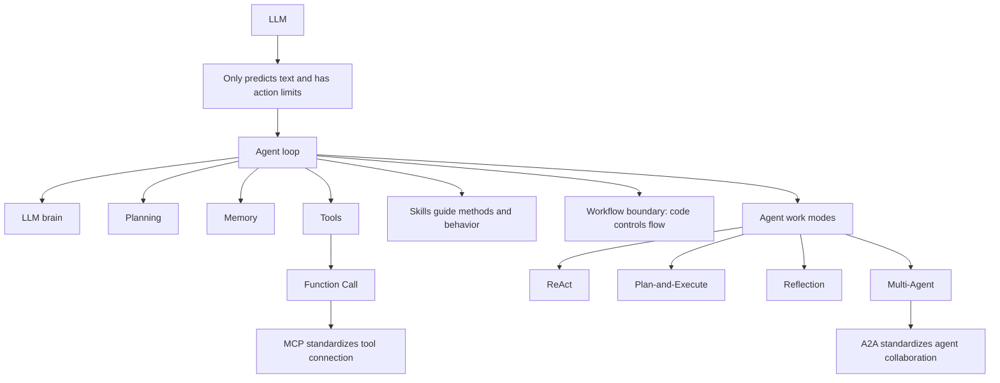

# AI Agent 是什么？Agent 面试题万字图解

Source:
- Local PDF: `materials/AI Agent 是什么？.pdf`
- PDF footer URL: `https://xiaolinnote.com/agent/concept/agent.html`
- Note status: source-grounded chapter note, created before micro-lesson.

### 1. Topic Overview
- What this is about: 这章解释 Agent 生态的核心面试概念：LLM 与 Agent 的区别、Agent 与 Workflow 的区别、Agent 工作模式、Function Call、MCP、Skills、A2A。
- Why it matters: 面试中经常把这些词混在一起问。真正要掌握的不是背定义，而是能判断“谁控制流程”“工具怎么接入”“知识怎么注入”“多个 Agent 怎么协作”。
- Difficulty level: 中等。单个概念不难，难点在边界：Function Call vs MCP vs Skills、Workflow vs Agent、MCP vs A2A。
- Prerequisites: 大语言模型基本概念、API/函数调用概念、简单系统架构中的客户端/服务端关系。

### 2. Core Concepts

#### Schema 1: distinguish LLM from Agent by ability boundary
- Definition: LLM 是文本生成和推理引擎；Agent 是以 LLM 为大脑，在循环中自主使用工具、记忆和规划来完成任务的系统。
- Intuition: LLM 像“顾问”，告诉你怎么做；Agent 像“项目经理”，能拆任务、调工具、观察结果、继续推进。
- Example: 问“下周三上海不下雨就安排户外团建”。LLM 只能建议你查天气和建日历；Agent 可以查天气 API，再调用日历 API 创建事件。
- Common mistakes:
  - 以为“接了一个工具的 LLM”就一定是 Agent。单次工具调用还不够，Agent 的关键是循环、观察和继续决策。
  - 只记“Agent = LLM + 工具”，漏掉规划、记忆和循环。

#### Schema 2: use control ownership to separate Workflow and Agent
- Definition: Workflow 是 LLM 和工具沿预定义代码路径运行的系统；Agent 是由 LLM 动态主导流程和工具调用的系统。
- Intuition: Workflow 是流水线，开发者提前规定每一步；Agent 是目标驱动的执行者，自己决定下一步。
- Example: 退款处理。Workflow 固定为接收申请、抽取信息、查订单、判断政策、退款或拒绝、通知。Agent 则读取申请后自己判断是否需要查订单、查政策、再决定操作。
- Common mistakes:
  - 把所有“用了 LLM 的自动化流程”都叫 Agent。
  - 忽略生产系统常常是混合架构：外层 Workflow 保可靠性，局部复杂步骤交给 Agent。

#### Schema 3: choose Agent work mode by cost, flexibility, and quality
- Definition: Agent 有多种工作模式，常见包括 ReAct、Plan-and-Execute、Reflection、Multi-Agent。
- Intuition: 模式不是互斥标签，而是任务执行策略。
- Example:
  - ReAct: Thought -> Action -> Observation 循环，边想边做，透明灵活但 token 成本高，可能循环。
  - Plan-and-Execute: 先规划再执行，成本低，但环境变化时需要重新规划检查点。
  - Reflection: 生成后自查或由另一个 Agent 评审，适合代码、法律、论文等高质量场景。
  - Multi-Agent: 多个专业 Agent 分工协作，适合复杂并行任务，但不要过早引入。
- Common mistakes:
  - 以为 Multi-Agent 天然更高级。实际应从简单方案开始，只有任务确实需要并行专业分工时才引入。

#### Schema 4: see Function Call as the atomic tool-use operation
- Definition: Function Call 让 LLM 输出结构化的“我要调用哪个函数、参数是什么”的请求；真正执行函数的是应用程序，不是 LLM 自己。
- Intuition: Function Call 是让 LLM 从“只会说”变成“能驱动外部系统”的基础能力。
- Example: 用户问“上海今天天气如何”。模型判断需要 `get_weather`，生成参数 `{"city":"上海"}`；应用程序执行天气 API，把结果再交回模型生成自然语言回答。
- Common mistakes:
  - 以为 LLM 自己调用了 API。实际上模型只产生调用意图和参数，宿主程序负责执行。
  - 混淆单步 Function Call 和 Agent。Function Call 是原子操作，Agent 是反复观察和调用的高级编排。

#### Schema 5: map Function Call, MCP, and Skills to different layers
- Definition:
  - Function Call: 底层 API 调用能力，解决“LLM 怎么和外部函数交互”。
  - MCP: Model Context Protocol，标准化 Agent 与工具/数据源的连接，解决大量工具集成的 N x M 问题。
  - Skills: 自然语言指令和知识文件，告诉 Agent 在特定场景下怎么做，解决方法论和最佳实践复用问题。
- Intuition: Function Call 是会打电话；MCP 是统一通讯录和电话系统；Skills 是岗位培训手册。
- Example: 一个代码审查 Agent 可以通过 MCP 找到 GitHub 工具，通过 Function Call 执行读取 PR 等操作，通过 Code Review Skill 规定审查顺序、关注安全/性能/可读性、输出格式。
- Common mistakes:
  - 把 MCP 当成 Skills。MCP 解决工具连接，Skills 解决行为策略。
  - 把 Skills 当成外部工具。Skills 通常加载进上下文，改变 Agent 的思考和行动规则。

#### Schema 6: distinguish vertical tool connection from horizontal agent collaboration
- Definition: MCP 处理 Agent 到工具的“竖向连接”；A2A 处理 Agent 到 Agent 的“横向协作”。
- Intuition: MCP 让 Agent 会用外部工具；A2A 让多个 Agent 互相发现、通信和委派任务。
- Example: 入职流程中，HR Agent、IT Agent、财务 Agent 需要协作。编排 Agent 可通过 A2A 把任务委派给专业 Agent；每个专业 Agent 内部再通过 MCP 调用自己的工具。
- Common mistakes:
  - 以为 MCP 能解决多 Agent 沟通。MCP 的边界是 Agent 调工具，不是 Agent 与 Agent 互相协作。

### 3. Deep Understanding

这章的主线是“让 LLM 从会回答变成会完成任务”的系统演化链：

```text
LLM
-> Function Call
-> Agent loop
-> MCP
-> Skills
-> A2A
```

- LLM 的四个限制是：只会说不会做、缺少跨会话记忆、不能直接用实时工具、不会自主规划。
- Agent 用四个模块补上这些限制：大脑 LLM、规划模块、记忆模块、工具模块。
- Function Call 是最底层的工具调用原子操作，让模型能输出结构化调用请求。
- Agent 把 Function Call 放进循环：思考 -> 行动 -> 观察 -> 再思考。
- MCP 把工具接入标准化，把 N 个 AI 应用和 M 个服务之间的 N x M 适配，变成 N + M 的协议对接。
- Skills 不是连接工具的协议，而是可复用的专业经验，会影响 Agent 在什么场景下采用什么流程、规范和策略。
- A2A 进一步处理多个 Agent 之间的发现、任务委派、状态跟踪、消息和制品交付。

关键边界：
- Workflow vs Agent: 看流程控制权在代码还是 LLM。
- Function Call vs Agent: 看是一次工具调用，还是多轮循环调用。
- MCP vs Skills: 看解决的是工具连接，还是做事方法。
- MCP vs A2A: 看对象是工具，还是其他 Agent。

### 4. Minimal Working Example

Scenario: “帮我处理这个客户退款申请。”

Workflow reasoning flow:
1. 代码固定流程：接收申请。
2. 调用 LLM 抽取订单号、退款理由。
3. 查数据库。
4. 调用 LLM 判断是否符合政策。
5. 执行退款或生成拒绝邮件。
6. 发送通知。

Agent reasoning flow:
1. LLM 理解目标：处理退款申请。
2. 规划：先看申请内容，再查订单，再核对政策。
3. Function Call: 调用订单查询工具。
4. Observation: 订单状态特殊，需要补充政策依据。
5. Function Call/MCP: 通过文档工具搜索退款政策。
6. Reflection: 检查判断是否有证据支撑。
7. Action: 执行退款或回复客户。

Decision rule:
- 如果步骤固定、可靠性和可审计性优先，用 Workflow。
- 如果任务开放、路径无法提前枚举、需要动态应对，用 Agent。
- 生产中常用混合：Workflow 管主干，Agent 处理局部开放问题。

### 5. Knowledge Graph



### 6. Self-Test Questions

Recall:
1. Agent 的三个关键词是什么？为什么“循环”是关键词之一？
2. Workflow 和 Agent 最核心的区别是什么？
3. MCP 的三个角色分别是什么？

Application or transfer:
1. 一个系统固定执行“分类邮件 -> 调用 LLM 生成回复 -> 人工审核 -> 发送”，这是 Workflow 还是 Agent？为什么？
2. 如果你要做一个能读 GitHub、发 Slack、查数据库的开发助手，Function Call、MCP、Skills 分别解决哪一层问题？

Explain-like-I-am-5:
1. 用“员工、电话、通讯录、培训手册”的比喻解释 Function Call、MCP、Skills 的区别。

### 7. Weak Point Detection
- Failure pattern 1: 把 Agent 定义背成“LLM + 工具”，但解释不出循环、观察和自主决策。
- Failure pattern 2: 看到 LLM 自动化就叫 Agent，忽略流程控制权。
- Failure pattern 3: 混淆 Function Call、MCP、Skills 的层级，把协议、工具、方法论混成一团。
- Failure pattern 4: 觉得 Multi-Agent 越多越强，忽略成本、调试复杂度和不确定性。
- Failure pattern 5: 说 MCP 和 A2A 都是“通信协议”，但说不清 MCP 是 Agent-to-tool，A2A 是 Agent-to-Agent。
