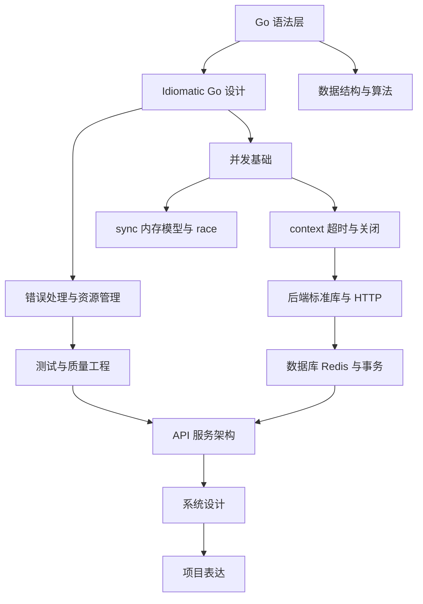

# Chapter 00 Knowledge Graph - Go 后端面试复习总路线

```mermaid
graph TD
    A[Go 语法层] --> B[Idiomatic Go 设计]
    B --> C[错误处理与资源管理]
    A --> D[数据结构与算法]
    B --> E[并发基础]
    E --> F[sync 内存模型与 race]
    E --> G[context 超时与关闭]
    C --> H[测试与质量工程]
    G --> I[后端标准库与 HTTP]
    I --> J[数据库 Redis 与事务]
    H --> K[API 服务架构]
    J --> K
    K --> L[系统设计]
    L --> M[项目表达]
```
