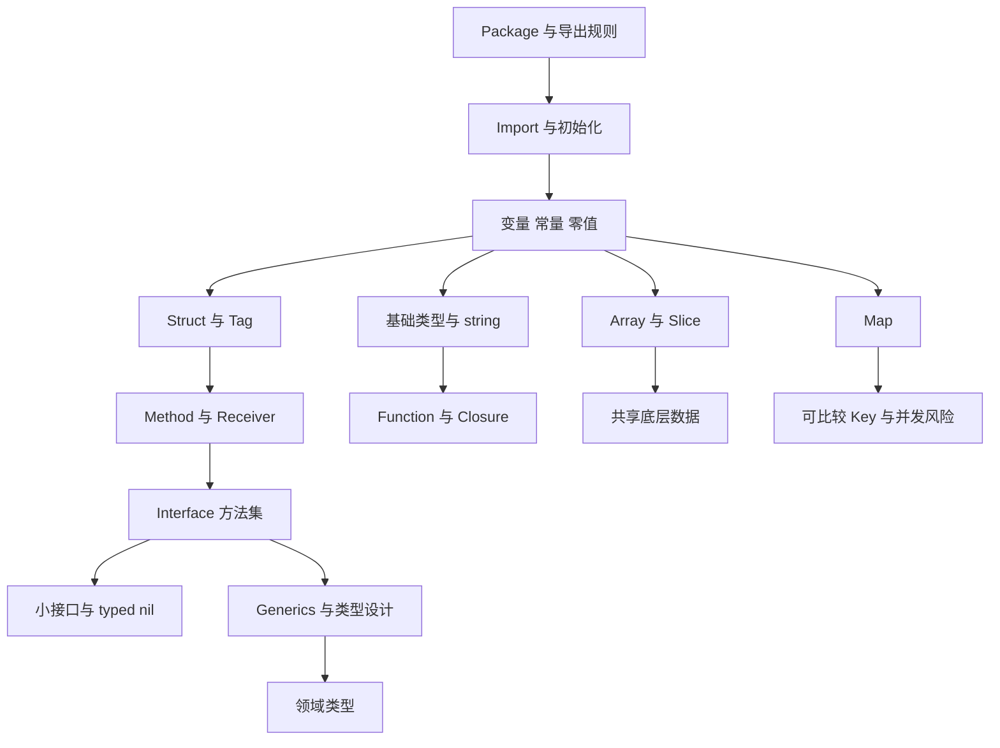

# Chapter 01 Knowledge Graph - Go 语言核心模型

```mermaid
graph TD
    A[Package 与导出规则] --> B[Import 与初始化]
    B --> C[变量 常量 零值]
    C --> D[基础类型与 string]
    C --> E[Array 与 Slice]
    C --> F[Map]
    C --> G[Struct 与 Tag]
    G --> H[Method 与 Receiver]
    H --> I[Interface 方法集]
    D --> J[Function 与 Closure]
    E --> K[共享底层数据]
    F --> L[可比较 Key 与并发风险]
    I --> M[小接口与 typed nil]
    I --> N[Generics 与类型设计]
    N --> O[领域类型]
```
