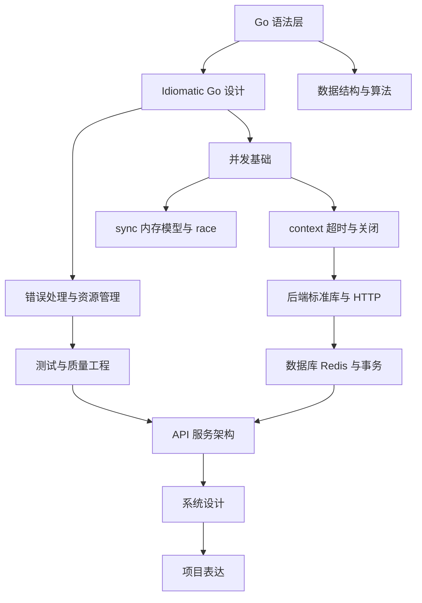

# 00 - Go 后端面试复习总路线完整笔记

## 1. Topic Overview

本章不是具体语法章，而是整个 Go 后端面试复习的路线图。

它回答三个问题：

- Go 后端面试到底考哪些能力？
- 这些能力之间有什么先后依赖？
- 学习时应该按什么顺序推进，避免一开始就陷入并发、GC、系统设计等高负荷内容？

难度级别： beginner。

核心目标：

- 建立一张 Go 后端能力地图。
- 知道每个后续章节属于哪一层能力。
- 学会用“层级”判断自己当前的薄弱点。

先修要求：

- 了解 Go 是一门编程语言。
- 知道后端开发大致涉及接口、数据库、并发、部署、系统设计。
- 不要求已经掌握 Go 语法。

## 2. Core Concepts

### 2.1 语法层

定义：

语法层是写出正确 Go 代码的基础能力，包括变量、类型、函数、结构体、接口、切片、map、指针、方法等。

直觉：

如果语法层不稳，后面所有内容都会变成“我看得懂概念，但写不出来代码”。

例子：

看到一个题目要求统计字符串出现次数，语法层要求你能自然写出：

```go
counts := make(map[string]int)
for _, word := range words {
    counts[word]++
}
```

常见错误：

- 混淆 slice 和 array。
- 不理解 map 默认零值。
- 不清楚值传递和指针传递。
- 看到 interface 只会背定义，不会判断它适合放在哪里。

### 2.2 Idiomatic Go 层

定义：

Idiomatic Go 是符合 Go 风格的代码设计方式。重点包括小接口、组合优先、显式错误处理、简单清晰的控制流。

直觉：

语法层解决“代码能不能跑”，Idiomatic Go 解决“代码像不像 Go、能不能维护”。

例子：

Go 中常见做法是返回错误，而不是默认用异常：

```go
user, err := repo.FindUser(ctx, id)
if err != nil {
    return nil, err
}
```

常见错误：

- 把 Java/Python 的继承思维搬进 Go。
- 设计很大的 interface。
- 过度封装，导致代码不直接。
- 忽略错误或用 panic 代替普通错误返回。

### 2.3 并发层

定义：

并发层关注 goroutine、channel、sync 包、context、race condition 等。

直觉：

Go 的面试经常考并发，因为 Go 的核心卖点之一就是轻量并发。但并发必须建立在语法和代码风格之上。

例子：

用 goroutine 并发执行任务时，需要考虑任务何时结束、结果如何收集、错误如何传播、是否会泄漏 goroutine。

常见错误：

- 只知道 `go func()`，不知道生命周期管理。
- 乱用 channel，把简单同步写复杂。
- 忘记关闭或取消 context。
- 不理解 data race 和 race detector。

### 2.4 后端工程层

定义：

后端工程层把 Go 用在真实服务中，包括 HTTP、数据库、Redis、事务、幂等、日志、测试、超时控制等。

直觉：

这一层解决“一个 Go 程序如何变成可靠的后端服务”。

例子：

一个创建订单接口不仅要写 handler，还要考虑：

- 请求参数校验。
- 数据库事务。
- Redis 缓存一致性。
- 重试和幂等。
- 超时和取消。
- 日志和可观测性。

常见错误：

- 只会写 happy path。
- 不考虑超时、重试、事务失败。
- 分不清业务错误、系统错误、参数错误。
- 测试只测正常输入。

### 2.5 系统设计层

定义：

系统设计层关注如何设计订单、支付、调度、聊天、文件上传等后端系统。

直觉：

这一层不是写某一行 Go 代码，而是把 Go 后端能力组合成可扩展、可靠、可解释的方案。

例子：

设计一个秒杀系统时，需要考虑限流、库存扣减、消息队列、异步处理、缓存、数据库一致性、降级方案。

常见错误：

- 只罗列组件，不说明为什么用。
- 不讲瓶颈和权衡。
- 忽略故障场景。
- 方案和项目经验脱节。

### 2.6 项目表达层

定义：

项目表达层是面试中讲清楚项目的能力，包括问题、方案、权衡、结果、复盘。

直觉：

你不仅要会做，还要能让面试官相信你真的做过、想过、解决过问题。

例子：

讲一个接口优化项目时，一个清晰结构是：

- 原问题：接口 P95 延迟高。
- 原因定位：数据库慢查询和重复请求。
- 方案：索引优化、缓存、幂等控制。
- 权衡：缓存一致性和复杂度。
- 结果：P95 从 800ms 降到 180ms。
- 复盘：监控和压测应该更早加入。

常见错误：

- 只说“我负责后端开发”。
- 只讲技术名词，不讲业务问题。
- 没有数据结果。
- 说不清自己做的权衡。

## 3. Deep Understanding

### 3.1 为什么要按层级学？

Go 后端知识不是平铺的。它有明显依赖关系：

- 没有语法层，就无法稳定写代码。
- 没有 Idiomatic Go，就容易写出能跑但难维护的代码。
- 没有并发层，就难以解释 Go 的核心优势。
- 没有后端工程层，就无法把代码变成可靠服务。
- 没有系统设计层，就难以处理复杂业务场景。
- 没有项目表达层，就算做过项目也可能讲不出来。

所以学习顺序不是随便安排的，而是从低层能力逐渐压缩成高级 schema。

### 3.2 总复习顺序对应的能力层级

| 顺序 | 章节 | 主要能力层 |
| --- | --- | --- |
| 1 | Go language core | 语法层 |
| 2 | Data structures and algorithms in Go | 语法层 + 面试基础 |
| 3 | Idiomatic Go design | Idiomatic Go 层 |
| 4 | Errors and resource management | Idiomatic Go 层 + 后端工程层 |
| 5 | Concurrency foundations | 并发层 |
| 6 | Sync/memory model/race | 并发层 |
| 7 | Context/timeouts/shutdown | 并发层 + 后端工程层 |
| 8 | Testing quality engineering | 后端工程层 |
| 9 | Backend standard library | 后端工程层 |
| 10 | Database/Redis/transactions | 后端工程层 |
| 11 | Runtime/GC/performance | 运行时 + 性能层 |
| 12 | Tooling/build/deploy | 工程交付层 |
| 13 | API service architecture | 后端工程层 + 架构层 |
| 14 | System design | 系统设计层 |
| 15 | Project stories | 项目表达层 |

### 3.3 本路线的学习策略

推荐策略：

- 先建立语法和数据结构基本熟练度。
- 再学习 Go 风格代码设计，避免把其他语言习惯带进 Go。
- 然后进入并发，先理解 goroutine/channel，再理解 sync/race/context。
- 接着进入后端工程，把错误处理、测试、HTTP、DB、Redis、事务放进真实服务场景。
- 最后练系统设计和项目表达，把知识转化成面试回答。

不推荐策略：

- 一开始就背 GC、GMP、内存模型。
- 没有写过基础代码就刷并发题。
- 只背八股结论，不做小例子。
- 只看系统设计图，不会落到接口、数据流、失败处理。

### 3.4 判断自己在哪一层薄弱

可以用下面的问题自测：

- 语法层：能不能不查资料写出 slice、map、struct、interface 的常见用法？
- Idiomatic Go 层：能不能解释为什么 Go 鼓励小接口和显式错误？
- 并发层：能不能判断什么时候用 channel，什么时候用 mutex？
- 后端工程层：能不能设计一个带超时、日志、事务、测试的接口？
- 系统设计层：能不能说明一个系统的瓶颈、故障场景和权衡？
- 项目表达层：能不能用 3 分钟讲清一个项目中的技术难点？

## 4. Minimal Working Example

场景：你要准备一个 Go 后端面试，但只有一个月时间。

错误学习方式：

```text
今天看 GMP，明天看 Redis，后天看系统设计，然后背几个项目回答。
```

问题：

- 知识之间没有依赖关系。
- 容易产生“都见过，但都不会用”的错觉。
- 面试官追问代码、错误处理或并发细节时会断裂。

更好的学习方式：

```text
第 1 步：先确认 Go 语法能写出小程序。
第 2 步：学习 Go 风格设计和错误处理。
第 3 步：学习 goroutine/channel/sync/context。
第 4 步：把这些能力放进 HTTP、DB、Redis、测试、事务。
第 5 步：再做系统设计和项目表达。
```

执行流：

1. 先让底层代码能力稳定。
2. 再让代码设计符合 Go 的习惯。
3. 再处理并发和工程复杂度。
4. 最后把工程经验组织成面试可表达的系统方案。

## 5. Knowledge Graph



## 6. Self-Test Questions

### 6.1 Recall Questions

1. Go 后端复习路线中，最底层的能力是什么？
2. Idiomatic Go 主要解决“能不能跑”还是“是否符合 Go 风格、是否可维护”？
3. 为什么 context 同时属于并发层和后端工程层？

### 6.2 Application Questions

1. 如果你能写 Go 语法，但写接口时经常不知道怎么处理错误，应该优先复习哪一层？
2. 如果你能讲 Redis 和消息队列，但写不出一个可靠的 HTTP handler，说明哪个中间层可能不稳？

### 6.3 Explain Like I Am 5

用“小学生分工完成班级任务”的例子，解释为什么学习 Go 后端要先分层，再逐层学习。

## 7. Weak Point Detection

学习者在本章常见弱点：

- 把路线图当成目录，不理解层级依赖。
- 一开始就想背高级八股，忽略语法和代码风格。
- 把并发只理解成 goroutine，不理解同步、取消、超时和 race。
- 把后端工程理解成写接口，不考虑事务、错误、日志、测试和失败路径。
- 系统设计只会列技术组件，不会讲权衡。
- 项目表达只讲做了什么，不讲为什么这样做和结果如何。

本章最重要的 schema：

- Go 后端能力分层 schema。

触发场景：

- 当你不知道该先学什么时。
- 当你面试某个问题答不上来时。
- 当你需要判断自己是语法弱、设计弱、并发弱、工程弱，还是表达弱时。
