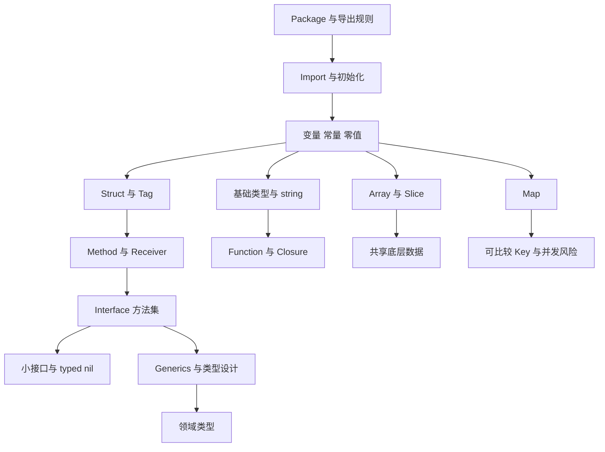

# 01 - Go 语言核心模型完整笔记

## 1. Topic Overview

本章是 Go 语言复习的地基。它不只是语法清单，而是 Go 写代码时反复出现的核心模型：

- 程序如何组织：package、import、init。
- 值如何存在：变量、常量、零值、作用域。
- 数据如何表示：基础类型、string、array、slice、map、struct。
- 行为如何组织：function、closure、method、receiver。
- 抽象如何表达：interface、generics、领域类型。

为什么重要：

- 后面的错误处理、并发、HTTP、DB、系统设计都要落到这些基础模型上。
- Go 面试常追问“底层是什么”“为什么这样写”“这个代码有什么坑”。
- 很多 Go bug 不是高级知识造成的，而是 slice、map、interface、closure、receiver 的基础模型不稳。

难度级别： beginner to intermediate。

先修要求：

- 会基本编程概念：变量、函数、条件、循环。
- 不要求熟悉 Go，但要愿意用小代码理解规则。

## 2. Core Concepts

### 2.1 Package / Import / Init

定义：

Go 代码以 package 为基本组织单位。一个目录下的 Go 文件通常属于同一个 package。`main` package 加上 `main()` 函数可以编译成可执行程序。

核心规则：

- `package main` 表示可执行程序入口包。
- 普通 package 用来被其他包导入和复用。
- 标识符首字母大写表示导出，外部包可访问；小写表示包内私有。
- `import` 引入其他包。
- `init()` 在 package 初始化时自动执行，不能手动调用。
- Go 禁止 import cycle，因为循环依赖会让初始化和编译依赖变复杂。
- `internal` 目录下的包只能被父目录树内部代码导入。

例子：

```go
package user

type User struct {
    ID   int
    name string
}
```

这里 `User` 和 `ID` 是导出的，`name` 不导出。

常见错误：

- 以为 package 名必须和文件夹名完全一致。
- 把很多业务逻辑放进 `init()`。
- 用 dot import 省略包名，导致代码来源不清楚。
- 让两个 package 互相 import，产生 import cycle。

### 2.2 变量 / 常量 / 零值

定义：

变量保存运行时可变数据；常量表示编译期确定的值。Go 的变量如果没有显式初始化，会得到该类型的零值。

常见零值：

- `int`: `0`
- `bool`: `false`
- `string`: `""`
- pointer / slice / map / chan / func / interface: `nil`
- struct: 每个字段都是对应类型零值

`var` 与 `:=`：

```go
var count int
name := "go"
```

- `var` 可以在包级或函数内使用。
- `:=` 只能在函数内使用。
- `:=` 至少要引入一个新变量。

shadowing 陷阱：

```go
err := doA()
if err == nil {
    result, err := doB()
    _ = result
    _ = err
}
```

内层 `err` 可能遮蔽外层 `err`，导致外层错误状态没有被更新。

untyped constant：

Go 的未类型常量可以在需要时适配目标类型。

```go
const timeout = 10
var seconds int64 = timeout
```

`iota`：

```go
type Status int

const (
    Pending Status = iota
    Paid
    Cancelled
)
```

常见错误：

- 过度依赖 `:=`，不小心 shadowing。
- 不理解 nil map 不能写。
- 把零值当成无意义值，其实 Go 很强调“零值可用”。

### 2.3 基础类型

核心类型：

- 整数：`int`, `int8`, `int16`, `int32`, `int64`, `uint` 等。
- 浮点：`float32`, `float64`。
- 布尔：`bool`。
- 字符串：`string`。

`byte` 和 `rune`：

- `byte` 是 `uint8` 的 alias，常用于原始字节。
- `rune` 是 `int32` 的 alias，常用于 Unicode code point。

string 模型：

- Go 的 string 是只读 byte sequence。
- `len(s)` 返回字节数，不一定是字符数。
- `range s` 按 UTF-8 解码出 rune。

例子：

```go
s := "你好"
fmt.Println(len(s)) // 6
for _, r := range s {
    fmt.Println(r)
}
```

string 和 `[]byte` 转换：

```go
b := []byte(s)
s2 := string(b)
```

这种转换通常会产生拷贝，频繁转换要注意成本。

构造字符串：

- 多次拼接字符串时，优先考虑 `strings.Builder`。
- 处理字节流时，常用 `bytes.Buffer`。

常见错误：

- 以为 `len("你好") == 2`。
- 混淆 byte 和 rune。
- 在循环中用 `+` 大量拼接字符串。

### 2.4 Array / Slice

array：

- array 是值类型。
- array 的长度属于类型的一部分。

```go
var a [3]int
var b [4]int
```

`[3]int` 和 `[4]int` 是不同类型。

slice：

slice 是一个 descriptor，通常可以理解为三部分：

- ptr: 指向底层数组。
- len: 当前长度。
- cap: 从起点到底层数组末尾的容量。

```go
s := []int{1, 2, 3}
```

底层数组共享：

```go
a := []int{1, 2, 3, 4}
b := a[:2]
b[0] = 99
fmt.Println(a) // [99 2 3 4]
```

append 扩容：

- 如果容量足够，append 可能复用原底层数组。
- 如果容量不够，append 会分配新数组并复制元素。

nil slice vs empty slice：

```go
var a []int        // nil slice
b := []int{}      // empty non-nil slice
```

两者 `len` 都是 0，很多场景都能正常使用，但 JSON 表现可能不同。

copy：

```go
dst := make([]int, len(src))
copy(dst, src)
```

三索引切片：

```go
x := arr[low:high:max]
```

第三个索引用来限制新 slice 的 capacity，减少后续 append 影响原数组的风险。

删除元素：

```go
s = append(s[:i], s[i+1:]...)
```

过滤元素：

```go
out := s[:0]
for _, v := range s {
    if keep(v) {
        out = append(out, v)
    }
}
```

常见错误：

- 以为 slice 本身就是数组。
- 忽略底层数组共享，修改一个 slice 影响另一个。
- 小 slice 引用大数组，导致大数组无法被 GC。
- 在 `range` 中取循环变量地址。

range 取地址坑：

```go
for _, v := range users {
    ptrs = append(ptrs, &v) // 错误：取的是循环变量地址
}
```

应取索引对应元素地址：

```go
for i := range users {
    ptrs = append(ptrs, &users[i])
}
```

### 2.5 Map

定义：

map 是 key-value 结构，适合做计数器、集合、索引、缓存等。

nil map：

```go
var m map[string]int
fmt.Println(m["a"]) // 可以读，得到零值
m["a"] = 1          // panic
```

写 map 前要初始化：

```go
m := make(map[string]int)
```

key 要 comparable：

可以作为 key 的类型包括 string、number、bool、pointer、array、struct 中字段都可比较的 struct。

不能作为 key 的类型包括 slice、map、function。

comma ok：

```go
v, ok := m["a"]
```

`ok` 用来区分 key 不存在和 value 正好是零值。

delete：

```go
delete(m, "a")
```

删除不存在的 key 也安全。

遍历顺序：

map 遍历顺序不稳定，不能依赖。

并发安全：

普通 map 不是并发安全的。多 goroutine 并发读写需要锁、`sync.Map` 或其他设计。

map as set：

```go
seen := map[string]struct{}{}
seen["go"] = struct{}{}
```

map value 是 struct 的修改坑：

```go
type User struct{ Age int }
m := map[string]User{"a": {Age: 18}}
// m["a"].Age = 20 // 编译错误
u := m["a"]
u.Age = 20
m["a"] = u
```

常见错误：

- nil map 直接写。
- 依赖遍历顺序。
- 并发读写普通 map。
- 不知道 map value 取出来是副本。

### 2.6 Struct / Tag / Embedding

struct：

struct 把多个字段组合成一个值。

```go
type User struct {
    ID   int
    Name string
}
```

值语义：

struct 默认按值复制。

```go
u1 := User{Name: "A"}
u2 := u1
u2.Name = "B"
fmt.Println(u1.Name) // A
```

字段可见性：

- 大写字段可被外部包访问。
- 小写字段只在本包内访问。

json tag：

```go
type User struct {
    ID   int    `json:"id"`
    Name string `json:"name,omitempty"`
}
```

`omitempty` 在字段是零值时省略。

embedding：

```go
type Logger struct{}

func (Logger) Log(msg string) {}

type Service struct {
    Logger
}
```

embedding 是组合，不是继承。它可以提升字段和方法，但不表示子类关系。

struct 比较：

如果 struct 所有字段都可比较，那么 struct 可比较。

内存对齐：

字段顺序会影响 struct 大小。大的字段靠前通常可能减少 padding。

常见错误：

- 把 embedding 当继承。
- 不理解 omitempty 对不同零值的影响。
- 忘记 struct 复制会复制字段。
- 包含 mutex 的 struct 被复制，导致同步语义错误。

### 2.7 Function / Closure

函数是一等公民：

函数可以赋值给变量、作为参数传入、作为返回值返回。

```go
func apply(x int, f func(int) int) int {
    return f(x)
}
```

多返回值：

```go
func find(id int) (User, error) {
    // ...
}
```

命名返回值：

```go
func f() (err error) {
    return nil
}
```

命名返回值适合短函数，但长函数里容易降低清晰度。

variadic：

```go
func sum(nums ...int) int {
    total := 0
    for _, n := range nums {
        total += n
    }
    return total
}
```

closure：

closure 可以捕获外部变量。

```go
func counter() func() int {
    n := 0
    return func() int {
        n++
        return n
    }
}
```

defer 与返回值：

defer 在函数返回前执行。如果使用命名返回值，defer 可以修改返回值。

常见错误：

- closure 捕获循环变量导致结果不符合预期。
- 滥用命名返回值。
- 不理解 defer 执行时机。

### 2.8 Method / Receiver

method vs function：

method 是带 receiver 的函数。

```go
type User struct {
    Name string
}

func (u User) DisplayName() string {
    return u.Name
}
```

value receiver：

- receiver 被复制。
- 适合小 struct、不可变语义、无需修改原值的方法。

pointer receiver：

- receiver 是指针。
- 适合需要修改原值、struct 较大、包含锁或希望避免复制的方法。

```go
func (u *User) Rename(name string) {
    u.Name = name
}
```

method set：

method set 影响一个类型是否实现 interface。

简单记忆：

- 值类型的方法集包含 value receiver 方法。
- 指针类型的方法集包含 value receiver 和 pointer receiver 方法。

nil receiver：

指针 receiver 可能为 nil。是否允许 nil receiver，要看方法内部是否显式处理。

包含 mutex 的 struct 不可复制：

```go
type SafeCounter struct {
    mu sync.Mutex
    n  int
}
```

这类 struct 应避免复制，否则锁状态和保护的数据会分裂。

常见错误：

- 不知道该选 value receiver 还是 pointer receiver。
- 给包含 mutex 的 struct 使用 value receiver。
- 不理解 method set 导致 interface 实现失败。

### 2.9 Interface

定义：

interface 描述行为集合。Go 中类型不需要显式声明实现某个 interface，只要方法集匹配，就隐式实现。

```go
type Reader interface {
    Read(p []byte) (n int, err error)
}
```

动态类型 + 动态值：

interface 值内部可以理解为两部分：

- dynamic type
- dynamic value

nil interface vs typed nil：

```go
var p *User = nil
var x any = p
fmt.Println(x == nil) // false
```

因为 `x` 有动态类型 `*User`，只是动态值为 nil。

small interface：

Go 鼓励小接口，例如：

```go
type Writer interface {
    Write([]byte) (int, error)
}
```

小接口更容易组合、测试、替换。

consumer-side interface：

接口通常由使用方定义，而不是实现方提前定义一个巨大接口。

type assertion：

```go
v, ok := x.(string)
```

type switch：

```go
switch v := x.(type) {
case string:
    fmt.Println(v)
case int:
    fmt.Println(v)
}
```

常见错误：

- 把 interface 当成 Java 的 implements。
- 设计大而全的 interface。
- 不理解 typed nil。
- 到处使用 `any`，丢失类型信息。

### 2.10 Generics / Type Design

type parameter：

泛型允许函数或类型带类型参数。

```go
func First[T any](items []T) (T, bool) {
    if len(items) == 0 {
        var zero T
        return zero, false
    }
    return items[0], true
}
```

constraint：

constraint 限制类型参数能做什么。

```go
func Index[K comparable, V any](items []V, keyFn func(V) K) map[K]V {
    out := make(map[K]V)
    for _, item := range items {
        out[keyFn(item)] = item
    }
    return out
}
```

`comparable`：

如果类型参数要作为 map key，就需要 comparable。

type set：

constraint 可以描述一组允许的底层类型。

何时不用泛型：

- 只有一个具体类型时。
- 泛型让代码更难读时。
- interface 更能表达行为抽象时。
- 复制少量清晰代码比引入复杂泛型更简单时。

type alias vs defined type：

```go
type MyInt = int // alias
type UserID int  // defined type
```

defined type 可以提供领域语义，防止不同 ID 混用。

领域类型：

```go
type OrderID string
type UserID string
type OrderStatus int
```

常见错误：

- 为了“高级”而过度使用泛型。
- 泛型 constraint 设计过宽或过窄。
- 用普通 string/int 表示所有领域 ID，导致参数混用。

## 3. Deep Understanding

### 3.1 Go 的基础心智模型：值、描述符、行为

很多 Go 基础知识可以压缩成三个问题：

1. 这个东西复制时复制什么？
2. 这个东西背后有没有共享底层数据？
3. 这个东西的方法集和接口匹配吗？

例子：

- array 和 struct 偏值语义，赋值通常复制整个值。
- slice 是 descriptor，复制 slice 会复制 descriptor，但底层数组共享。
- map 本身是引用式结构，赋值后多个变量指向同一张表。
- interface 保存动态类型和动态值。
- method receiver 决定方法调用是否修改原对象，以及能否满足 interface。

### 3.2 零值不是缺陷，而是设计原则

Go 很多类型的零值是有意义的：

- `bytes.Buffer{}` 可以直接使用。
- `sync.Mutex{}` 可以直接使用。
- nil slice 可以 append。

但不是所有 nil 都可写：

- nil map 不能写。
- nil channel 收发会永久阻塞。
- nil function 调用会 panic。

所以要区分“零值可用”和“nil 一定可用”。

### 3.3 初始化顺序为什么重要

Go package 初始化大致顺序：

1. 先初始化被 import 的 package。
2. 同一个 package 内先初始化变量。
3. 再执行 `init()`。
4. 最后 `main.main()` 执行。

这个顺序解释了：

- 为什么 import cycle 被禁止。
- 为什么不要让 init 隐藏复杂副作用。
- 为什么 package 级变量初始化要谨慎。

### 3.4 slice 的核心风险是共享底层数组

slice 看起来像动态数组，但它其实是指向底层数组的窗口。

风险：

- 修改一个 slice 可能影响另一个 slice。
- append 可能复用原数组，也可能分配新数组。
- 小 slice 可能让大数组一直活着，造成内存占用。

学习 slice 时，不要只背 `ptr/len/cap`，要能预测修改和 append 后谁受影响。

### 3.5 interface 的核心风险是“看起来 nil，其实不是 nil”

interface nil 判断必须同时满足：

- dynamic type 为 nil。
- dynamic value 为 nil。

typed nil 放进 interface 后，dynamic type 不为 nil，所以 interface 本身不等于 nil。

这在 error 返回中很常见：

```go
func f() error {
    var e *MyError = nil
    return e
}
```

返回值可能不是 nil error。

### 3.6 泛型和 interface 的区别

interface 主要表达行为：

```go
type Reader interface {
    Read([]byte) (int, error)
}
```

泛型主要表达类型参数化的数据结构或算法：

```go
func Contains[T comparable](items []T, target T) bool
```

简单判断：

- 你关心“能做什么行为”时，优先 interface。
- 你关心“同一算法适配多种类型”时，考虑泛型。

## 4. Minimal Working Example

下面这个小例子同时展示 package 思维、领域类型、struct、method、map、slice、error 返回：

```go
package user

import "fmt"

type UserID string

type User struct {
    ID   UserID
    Name string
}

func (u User) DisplayName() string {
    if u.Name == "" {
        return string(u.ID)
    }
    return u.Name
}

type Store struct {
    users map[UserID]User
}

func NewStore() *Store {
    return &Store{
        users: make(map[UserID]User),
    }
}

func (s *Store) Add(u User) error {
    if u.ID == "" {
        return fmt.Errorf("empty user id")
    }
    s.users[u.ID] = u
    return nil
}

func (s *Store) List() []User {
    out := make([]User, 0, len(s.users))
    for _, u := range s.users {
        out = append(out, u)
    }
    return out
}
```

执行流：

1. `UserID` 是 defined type，避免把普通 string 随便传成用户 ID。
2. `User` 是 struct，字段大写表示外部包可访问。
3. `DisplayName` 使用 value receiver，因为它不修改 User。
4. `Store` 内部用 map 保存用户。
5. `NewStore` 初始化 map，避免 nil map 写入 panic。
6. `Add` 用 pointer receiver，因为它修改 Store 内部状态。
7. `List` 把 map 中的用户拷贝到 slice，因为 map 遍历顺序不保证稳定。

## 5. Knowledge Graph



## 6. Self-Test Questions

### 6.1 Recall Questions

1. Go 中标识符首字母大写和小写分别意味着什么？
2. slice descriptor 通常包含哪三个部分？
3. interface 值内部可以理解为哪两部分？

### 6.2 Application Questions

1. 为什么 `var m map[string]int; m["a"] = 1` 会出问题？应该怎么改？
2. 如果一个 struct 包含 `sync.Mutex`，为什么不应该随意复制它或使用 value receiver 修改状态？

### 6.3 Explain Like I Am 5

用“一个班级分组做作业”的例子解释 package、导出名字、import 的关系。

## 7. Weak Point Detection

学习者在本章常见弱点：

- 把 package、目录、文件三者混为一谈。
- 只知道零值表面结果，不知道哪些零值可直接使用。
- 不理解 string 的 `len` 是字节数。
- 把 slice 当成数组，忽略底层数组共享。
- nil map 直接写。
- 依赖 map 遍历顺序。
- 把 embedding 当继承。
- closure 捕获循环变量时不知道捕获的是变量。
- 不知道 value receiver 和 pointer receiver 的选择依据。
- 不理解 interface 的 typed nil。
- 过早使用泛型，反而让代码变复杂。

本章关键 schema：

- Go 程序组织 schema。
- Go 零值 schema。
- Slice descriptor schema。
- Map 使用边界 schema。
- Method receiver schema。
- Interface 动态类型 schema。
- Generics vs interface schema。
