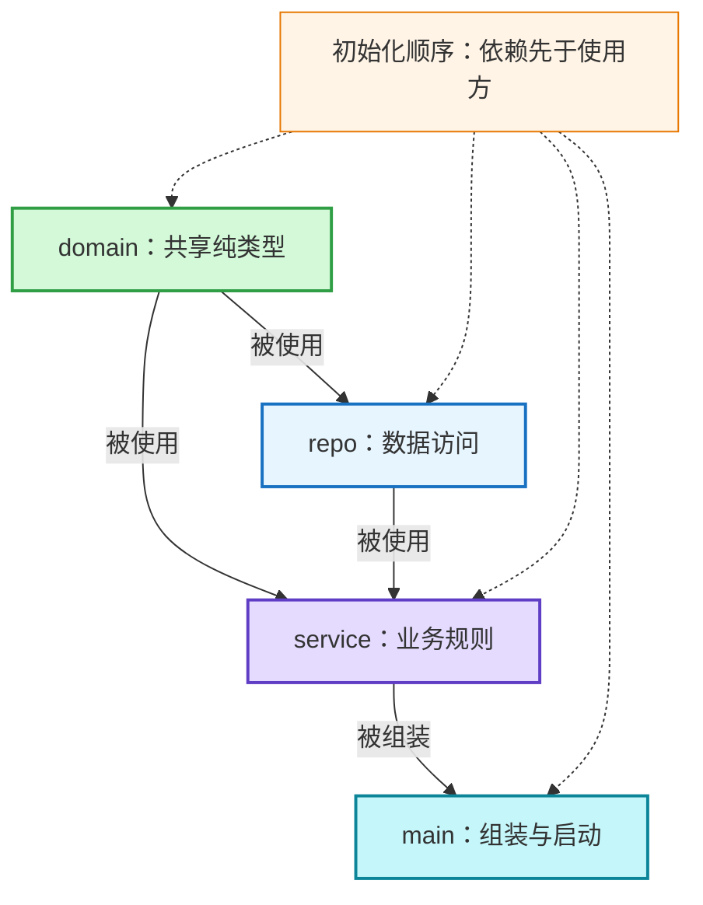
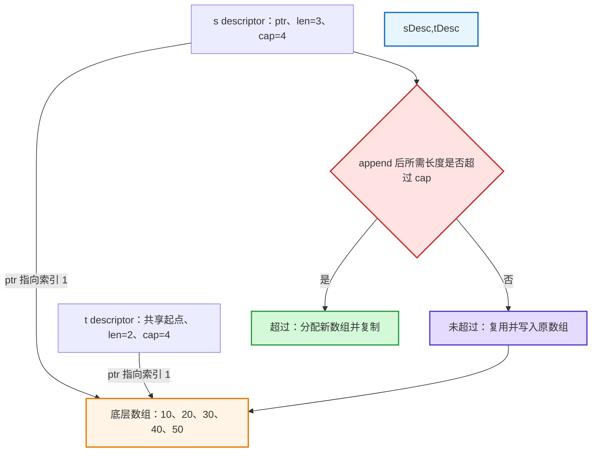
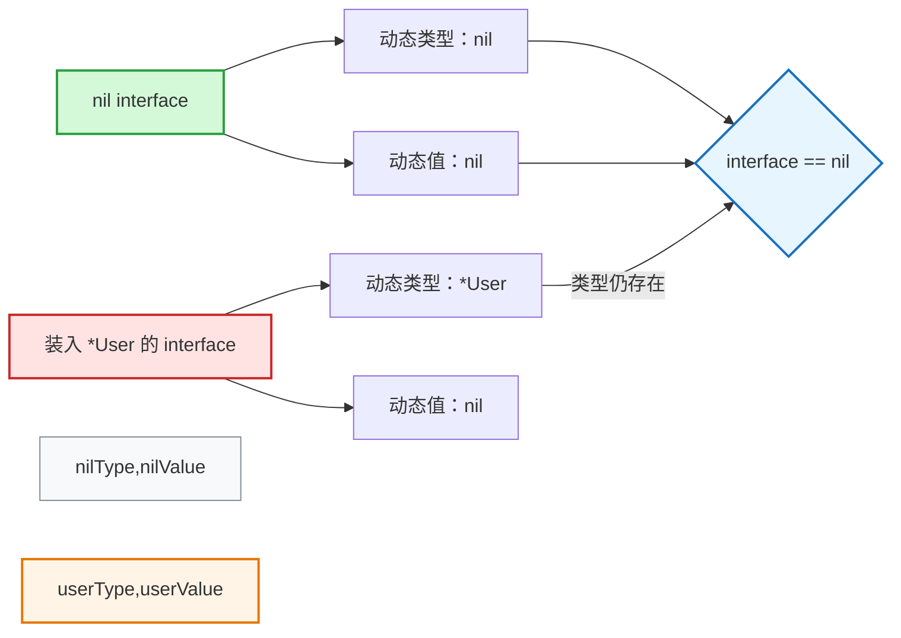
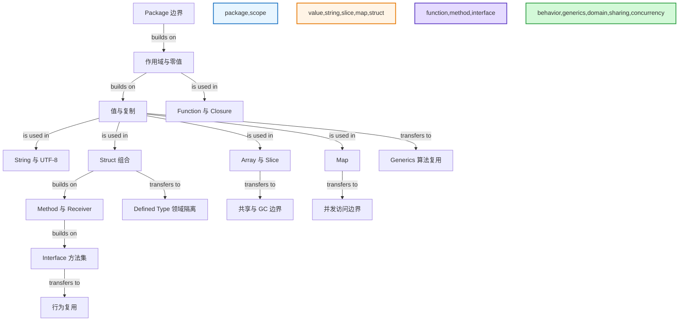

# 01 - Go 语言核心模型

## 1. Topic Overview

### 1.1 本章解决什么问题

本章不是零散语法表，而是建立一套能预测 Go 代码行为的基础模型：

- **组织边界**：package、import、init 决定代码如何组合与启动。
- **值与作用域**：变量、常量、零值、复制和 shadowing 决定当前操作的是哪个值。
- **存储与共享**：string、array、slice、map、struct 决定数据是否可变、是否复制、是否共享。
- **行为与抽象**：function、method、interface、generics 决定行为属于谁、如何复用。

后续的错误处理、并发、HTTP、数据库和系统设计都会复用这些模型。Go 基础题真正要回答的通常不是“语法长什么样”，而是：

1. 复制时复制了什么？
2. 背后是否仍共享数据？
3. 当前作用域实际引用哪个变量？
4. 哪个类型的方法集满足哪个接口？

### 1.2 难度与先修

- 难度：入门到中级。
- 先修：理解变量、条件、循环和函数即可。
- 学习目标：能预测局部代码行为，并能说明规则的工程边界。

### 1.3 来源与扩展边界

- 权威章节顺序：`materials/go_interview_review_md_pack/01_go_language_core.md`。
- 原材料是一份 10 节、75 个要点的复习提纲；本笔记按照该顺序补充定义、机制、例子和常见错误。
- Go 1.22 的 `range` 变量变化、JSON 表现、GC 引用保留等内容属于帮助理解提纲要点的教学扩展。

### 1.4 Schema 路线

| 顺序 | 遇到的问题 | 应调用的 schema |
| --- | --- | --- |
| 1 | 包如何依赖、初始化、避免循环 | 用单向依赖组织 package |
| 2 | 声明后是什么值、`:=` 改了谁 | 用作用域与零值预测状态 |
| 3 | 中文字符串的长度和索引为何反直觉 | 把 string 当作只读 UTF-8 字节序列 |
| 4 | slice 修改或 append 会影响谁 | 用 descriptor 与底层数组预测共享 |
| 5 | map 何时能读写、如何区分不存在 | 用“初始化—可比较—并发”三条边界检查 map |
| 6 | struct 复制、tag、embedding 表达什么 | 把 struct 当作值组合 |
| 7 | closure 和 defer 读写哪个变量 | 按捕获与返回时序分析函数 |
| 8 | receiver 该选值还是指针 | 让修改语义、复制成本与方法集一致 |
| 9 | interface 为什么“看似 nil 却不等于 nil” | 用动态类型与动态值拆解 interface |
| 10 | interface、泛型、领域类型如何选择 | 按行为复用、算法复用和语义隔离选工具 |

## 2. Core Concepts

### 2.1 Schema：用单向依赖组织 package

**定义**

package 是 Go 的编译、命名和复用边界。同一目录中的 Go 源文件通常声明同一个 package；`package main` 配合 `main()` 构成可执行程序入口，普通 package 则供其他包导入。

**直觉**

把 package 看成“职责单一、依赖单向的盒子”。包外只能使用导出的名字；初始化必须沿依赖图从底向上完成，所以依赖图不能成环。

**关键规则**

- 标识符首字母大写表示导出；小写表示仅包内可见。
- 普通 import 保留包名前缀，是最清晰的默认选择。
- alias import 用于消除重名或改善局部可读性。
- blank import `_ "pkg"` 只触发包初始化，常见于驱动注册；需要明确副作用。
- dot import 把对方导出名直接放入当前作用域，来源不清，生产代码通常避免。
- `init()` 自动执行、不能手动调用，也不应承载复杂业务流程。
- `internal` 目录中的包，只能被以该 `internal` 父目录为根的代码树导入。

**初始化机制**

1. 先初始化当前包依赖的包；每个包只初始化一次。
2. 包内先按依赖关系初始化 package-level 变量。
3. 再执行该包的 `init()`。
4. 所有依赖完成后，最终进入 `main.main()`。

跨多个文件依赖“文件名先后”会制造脆弱代码。语言规范不保证你手工想象的文件顺序；应该让变量依赖显式，或把业务启动放到普通函数和 `main` 中。

**例子：拆掉 import cycle**

错误依赖：

```text
service -> repo -> service
```

如果 `repo` 只是为了使用 `service.User` 才反向依赖 `service`，可把共享的纯数据类型下沉到 `domain`：

```text
service -> repo
service -> domain
repo    -> domain
```

#### Visual Model: 为什么依赖图必须无环？



- How to read: 沿实线从底层类型走向数据访问、业务和入口；若再从 `repo` 指回 `service` 就会形成无法初始化的环。
- Source anchor: 原材料“Package / Import / Init”。
- Boundary: 图只表达依赖方向，不代表所有项目都必须使用这四个包名。

**常见错误**

- 把 package、目录和单个文件当成同一个概念。
- 让 `init()` 隐藏网络连接、配置失败或复杂业务副作用。
- 用 dot import 省几次包名前缀。
- 为复用一个业务层类型而制造反向依赖。

### 2.2 Schema：用作用域与零值预测状态

**定义**

变量保存运行时可变数据；常量表示编译期确定的值。变量未显式初始化时，一定得到所属类型的零值，而不是随机内容。

**直觉**

先问“名字属于哪个作用域”，再问“值是什么”。同名不代表同一个变量；有零值也不代表该零值支持所有操作。

**Zero value（零值）表**

| 类型 | 零值 | 关键边界 |
| --- | --- | --- |
| number | `0` | 可参与普通计算 |
| `bool` | `false` | 常用于默认关闭 |
| `string` | `""` | 可直接读、拼接 |
| pointer / slice / map / chan / func / interface | `nil` | 每种 nil 的可用操作不同 |
| struct | 所有字段各自为零值 | 是否“可用”取决于字段与不变量 |

例如 nil slice 可以 `len`、`range` 和 `append`；nil map 可以读和 `delete`，但写入会 panic。结论应是“检查具体类型的零值契约”，而不是“nil 都不能用”或“零值都完全可用”。

**`var`、`:=` 与多返回值**

- `var` 可用于包级和函数内，也能只声明不立即赋值。
- `:=` 只能用于函数体内。
- 同一代码块内使用 `:=` 时，左侧至少要有一个新的非空变量；已有变量会被重新赋值。
- 进入更内层的代码块后，同名 `:=` 可能创建新变量，遮蔽外层变量。

```go
func loadUser() (string, error) {
    var err error

    if ready() {
        result, err := load() // result 与 err 都属于 if 块
        _ = result
        _ = err
    }

    return "", err // 这里看到的是外层 err
}
```

若要让 `load()` 更新外层 `err`，先声明新变量，再使用赋值：

```go
var result string
result, err = load()
```

**常量与 `iota`**

- `const n = 10` 是 untyped constant，可在数值可表示时适配目标类型。
- `const n int = 10` 已固定为 `int`，赋给 `int64` 需要显式转换。
- `iota` 在每个 `const` 块从 0 开始，每条 ConstSpec 递增；`_` 所在行仍计数。

```go
type Status int

const (
    StatusUnknown Status = iota // 0
    StatusPending               // 1
    _                           // 2
    StatusPaid                  // 3
)
```

零值通常留给 `Unknown`。一旦枚举数字被写入数据库、消息或公开 API，就不要在中间插入新行改变旧编号；可使用显式编号或只做兼容追加。

**常见错误**

- 只看名字 `err`，不看它属于哪个词法作用域。
- 认为 `:=` 总是在修改已有变量，或认为它总会创建全部新变量。
- 把 typed constant 和 untyped constant 的赋值规则混为一谈。
- 认为 `_` 不占 `iota` 计数，或随意重排已持久化枚举。

### 2.3 Schema：把 string 当作只读 UTF-8 字节序列

**定义**

Go 的 `string` 是不可变的字节序列；它可以承载 UTF-8 文本，但索引和 `len` 的单位仍是 byte。`byte` 是 `uint8` 的 alias，`rune` 是 `int32` 的 alias，通常表示一个 Unicode code point。

**直觉**

“文本字符”是解释层，“字节”是存储层。`range` 会尝试按 UTF-8 解码 rune，而直接索引只取得某个 byte。

**例子**

```go
s := "A好"

fmt.Println(len(s)) // 4：A 占 1 byte，好占 3 bytes

for i, r := range s {
    fmt.Printf("%d %c\n", i, r)
}
// i 是 rune 起点的 byte offset：0 和 1
```

`s[1]` 是“好”的第一个 UTF-8 byte，不是完整字符。需要按 code point 随机访问时可转换为 `[]rune`，但转换会分配并解码。

**`string` 与 `[]byte`**

```go
s := "go"
b := []byte(s)
b[0] = 'G'

fmt.Println(s)         // go
fmt.Println(string(b)) // Go
```

- `string` 适合只读文本。
- `[]byte` 适合原地修改、二进制数据和 I/O。
- 两者转换通常会复制并产生分配；不要在热循环中无意识地来回转换。

**Builder 与 Buffer 的选择**

| 目标 | 优先工具 | 原因 |
| --- | --- | --- |
| 连续写文本，最后得到 `string` | `strings.Builder` | 接口专注于字符串构造 |
| 处理 bytes，或需要 `io.Reader` / `io.Writer` | `bytes.Buffer` | 同时支持字节读写 |

两者零值都可直接使用，也都支持 `Grow`。不要复制一个已经写入过的非零 `strings.Builder`。

**基础数值类型提醒**

- `int` / `uint` 的宽度与目标平台有关；协议和持久化格式应使用明确宽度。
- 浮点数适合近似计算，不应直接承担精确金额语义。
- `bool` 只有 `true` 和 `false`，不能与整数隐式互换。

**常见错误**

- 认为 `len("你好") == 2`。
- 认为 `s[i]` 返回第 `i` 个“字符”。
- 为修改文本频繁进行 `string` / `[]byte` 转换。
- 只需最终字符串却默认使用功能更重的字节缓冲区。

### 2.4 Schema：用 descriptor 与底层数组预测 slice

**定义**

array 是长度固定、长度属于类型的值；slice 是对底层数组某个区间的描述符，可用 `ptr + len + cap` 建模。

**直觉**

array 赋值复制元素；slice 赋值只复制“窗口说明书”。两个说明书可以指向同一底层数组，所以“slice 变量不同”不等于“元素存储独立”。

**Array 的值语义**

```go
a := [3]int{1, 2, 3}
b := a
b[0] = 9

fmt.Println(a) // [1 2 3]
```

`[3]int` 与 `[4]int` 是不同类型。array 作为参数也会按值复制；需要共享大数组时可传指针，但可变长度序列通常使用 slice。

**Slice descriptor 与共享**

```go
arr := [5]int{10, 20, 30, 40, 50}
s := arr[1:4] // len=3, cap=4
t := s[:2]
t[0] = 99

fmt.Println(arr) // [10 99 30 40 50]
```

#### Visual Model: slice 修改或 append 会影响谁？



- How to read: 先看 descriptor 是否连到同一数组；遇到 `append` 再比较新长度与 cap，不能只背“append 会扩容”。
- Source anchor: 原材料“Array / Slice”中的 descriptor、底层数组共享与 append 扩容。
- Boundary: 图不承诺新容量的具体增长倍数；增长策略是实现细节。

**`append`**

- `append` 总是返回新的 descriptor，必须接住返回值。
- 容量足够时复用原数组，其他共享视图可能观察到覆盖。
- 容量不足时分配新数组并复制，返回的 slice 与旧数组分离。

三索引切片 `s[low:high:max]` 把新容量限制为 `max-low`，常用于阻止被调用方的 `append` 覆盖原 slice 后续元素；它不能阻止对现有索引的直接修改。

**nil slice 与 empty slice**

```go
var a []int
b := []int{}
```

二者 `len==0`，都能 `range` 和 `append`；但 `a == nil`、`b != nil`。在常见 JSON 编码中，它们往往分别表现为 `null` 和 `[]`，所以 API 契约可能需要区分。

**Copy 是浅拷贝**

`dst := src` 仍共享底层数组。要切断顶层元素存储的共享：

```go
dst := make([]int, len(src))
n := copy(dst, src)
```

`copy` 实际复制 `min(len(dst), len(src))` 个元素。若元素自身是 pointer、map 或 slice，复制后其内部数据仍可能共享；深拷贝必须逐层处理。

**删除、插入与过滤**

```go
// 删除索引 i；有序但会搬移后缀
s = append(s[:i], s[i+1:]...)

// 在索引 i 插入 x
s = append(s, zero)
copy(s[i+1:], s[i:])
s[i] = x

// 原地过滤；复用底层数组
out := s[:0]
for _, v := range s {
    if keep(v) {
        out = append(out, v)
    }
}
```

原地过滤安全的不变量是 `writeIndex <= readIndex`：已保留元素数不可能超过已读取元素数，因此写入不会破坏尚未读取的输入。

如果元素含引用，缩短逻辑长度不会清除底层数组尾部的旧引用：

```go
oldLen := len(s)
// ...得到 out...
clear(out[len(out):oldLen]) // Go 1.21+
```

同理，从巨大 byte slice 截取一个很小的子 slice，仍可能让整个底层数组保持可达；需要长期保存小结果时应复制所需部分。

**`range` 取地址：两个独立问题**

先分别判断：

1. 每轮迭代变量是否是独立变量？
2. 该变量是不是原 slice 元素本身？

```go
for _, v := range users {
    ptrs = append(ptrs, &v)
}
```

在 Go 语言版本 1.22+（例如模块声明 `go 1.22` 或更新版本）中，`:=` 声明的迭代变量每轮新建，因此这些地址可彼此不同；但 `v` 仍是 `users[i]` 的副本，通过 `&v` 修改不会修改原 slice。需要原元素地址时：

```go
for i := range users {
    ptrs = append(ptrs, &users[i])
}
```

Go 1.22 之前各轮共享迭代变量。即使在新版本，若变量在循环外预声明并用 `=` 接收，仍会反复复用同一个变量。

**常见错误**

- 把 slice 当成拥有元素的动态数组。
- 认为 `append` 永远复用，或永远换新数组。
- 把 `copy` 当成递归深拷贝。
- 删除或过滤后忘记共享别名、尾部残值和残留引用。
- 无条件背诵“`&v` 都相同”，忽略 Go 版本、`:=` / `=` 和“副本 vs 原元素”。

### 2.5 Schema：用三条边界检查 map

**定义**

map 是 key 到 value 的关联结构，常用作 set、counter、index 和 cache。使用时先检查：是否已初始化、key 是否 comparable、访问是否并发。

**直觉**

map 读取像查询，写入像修改一张共享表。查询缺失项会得到 value 零值，因此仅看 value 无法区分“缺失”和“存在但恰好为零”。

**例子**

```go
var m map[string]int
fmt.Println(m["go"]) // 0：nil map 可读
delete(m, "go")      // 安全
// m["go"] = 1       // panic：nil map 不可写

m = make(map[string]int)
m["go"] = 1

v, ok := m["missing"] // v=0, ok=false
```

**规则**

- key 必须 comparable：number、string、bool、pointer、array，以及字段全部可比较的 struct 可以；slice、map、func 不可以。
- map 遍历顺序不稳定；需要稳定输出时收集 key 后排序。
- 删除不存在的 key 是安全的。
- 普通 map 不支持无同步的并发读写；按访问模式选择锁、单 owner goroutine 或 `sync.Map`。

**常用角色**

```go
set := map[string]struct{}{}
counter := map[string]int{}
index := map[UserID]User{}
```

map 中 struct value 不能直接修改字段，因为索引表达式得到的是不可寻址的副本：

```go
u := index[id]
u.Name = "new"
index[id] = u
```

如果 map 保存 `*User`，可通过指针修改对象，但也引入共享可变状态与 nil 指针边界。

**常见错误**

- 写入 nil map。
- 依赖遍历顺序生成稳定结果。
- 不用 comma-ok，误把缺失项当成真实零值。
- 并发读写普通 map。
- 忘记 map 的 struct value 需要“取出—修改—写回”。

### 2.6 Schema：把 struct 当作值组合

**定义**

struct 把不同字段组合成一个新值。赋值和传参默认复制字段；tag 是供反射工具读取的元数据；embedding 是组合与名字提升，不是继承。

**直觉**

先把 struct 当作“一整个值”理解，再检查字段内部是否含 pointer、slice、map、func、channel 或 mutex。外层复制不保证内部资源完全独立。

**例子**

```go
type User struct {
    ID       UserID `json:"id"`
    Nickname string `json:"nickname,omitempty"`
}

u1 := User{Nickname: "A"}
u2 := u1
u2.Nickname = "B"
fmt.Println(u1.Nickname) // A
```

- 字段名大写才可被包外代码和常见序列化工具访问。
- `json` tag 指定外部字段名；`omitempty` 按编码器规则在值“为空”时省略字段。API 是否允许“缺失”和“零值”等价，必须由契约决定。

**Embedding**

```go
type Logger struct{}
func (Logger) Log(string) {}

type Service struct {
    Logger
}
```

`Service` 通过 embedding 获得提升后的 `Log` 选择器，但它不是 `Logger` 的“子类”。出现同名字段或方法时要按 Go 的选择器规则处理歧义。

**比较与内存**

- struct 只有在所有字段都 comparable 时才可使用 `==`，也才可能作为 map key。
- 字段顺序会影响 alignment 与 padding；优化前先测量，避免为了少量内存牺牲领域可读性。
- 含 `sync.Mutex` 等不可复制状态的 struct 使用后不应复制；通常使用 pointer receiver，并让 `go vet` 帮助发现复制锁的问题。

**常见错误**

- 认为 struct 赋值天然“深拷贝”。
- 把 embedding 当作继承和 subtype 关系。
- 以为 `omitempty` 自动满足所有 API 的缺失语义。
- 复制已经投入使用的 mutex。

### 2.7 Schema：按捕获与返回时序分析函数

**定义**

Go 的函数是一等值：可以赋给变量、作为参数或返回值。closure 会捕获外层变量；`defer` 在包含它的函数即将返回时按后进先出执行。

**直觉**

分析函数相关陷阱时画一条时间线：参数何时求值、捕获的是哪个变量、返回值何时写入、defer 何时修改它。

**函数形式**

```go
func apply(x int, f func(int) int) int {
    return f(x)
}

func find(id UserID) (User, bool) {
    // 多返回值常把结果与状态分开
}

func sum(nums ...int) int {
    total := 0
    for _, n := range nums {
        total += n
    }
    return total
}
```

调用 variadic 函数时，已有 slice 可用 `sum(nums...)` 展开。

**Closure 捕获**

```go
func counter() func() int {
    n := 0
    return func() int {
        n++
        return n
    }
}
```

closure 捕获变量本身，因此变量可能逃逸并活过创建它的调用。循环中的捕获仍应使用 2.4 的判断：Go 版本、`:=` / `=`、副本还是原元素。

**命名返回值与 defer**

```go
func addOne() (n int) {
    n = 1
    defer func() { n++ }()
    return // 先确定返回槽 n，再执行 defer，最终返回 2
}
```

defer 的函数值和显式实参在注册 defer 时求值；defer 函数体在返回阶段执行。命名返回值适合短小、确实需要表达返回槽的函数，长函数中容易让数据流不透明。

**常见错误**

- 把 closure 理解成“创建时复制一个值”，忽略它可能持续读写同一变量。
- 忽略循环变量的版本与声明形式。
- 不区分 defer 注册时的参数求值和真正执行时机。
- 滥用命名返回值，让 `return` 的来源难以追踪。

### 2.8 Schema：让 receiver 与所有权语义一致

**定义**

method 是带 receiver 的函数。value receiver 接收值的副本；pointer receiver 接收地址，可修改原对象。receiver 还决定方法集，进而决定类型是否实现某个 interface。

**直觉**

不要只按“对象大小”机械选择 receiver。依次检查：

1. 方法是否需要修改 receiver？
2. 复制该值是否昂贵或不安全？
3. 该类型的方法集需要满足什么接口？
4. 同一类型的 receiver 风格是否一致？

**例子**

```go
type User struct {
    Name string
}

func (u User) DisplayName() string {
    return u.Name
}

func (u *User) Rename(name string) {
    u.Name = name
}
```

编译器在可寻址值上常允许 `u.Rename(...)` 的便捷写法，但这种调用语法糖不会改变方法集规则。

**方法集压缩规则**

| 类型 | 方法集包含 |
| --- | --- |
| `T` | receiver 为 `T` 的方法 |
| `*T` | receiver 为 `T` 或 `*T` 的方法 |

因此，如果接口要求的方法只定义在 `*T` 上，通常是 `*T` 实现接口，`T` 不实现。

**nil receiver**

`*T` receiver 可能收到 nil。调用是否安全取决于方法体是否先处理 nil；“能调用方法”不等于“解引用一定安全”。不要让 nil receiver 语义变成隐蔽约定。

**包含锁的类型**

```go
type SafeCounter struct {
    mu sync.Mutex
    n  int
}
```

该值投入使用后不可复制。复制会把锁状态与受保护数据分裂；应使用 pointer receiver，并避免按值传递。

**常见错误**

- 需要修改原值却使用 value receiver。
- 只看到调用语法可用，就误判 `T` 的方法集包含 pointer receiver 方法。
- 为同一类型随意混用 receiver，造成接口与复制语义混乱。
- 给含 mutex 的类型使用 value receiver。

### 2.9 Schema：用动态类型与动态值拆解 interface

**定义**

interface 描述一组行为。Go 类型只要方法集匹配就隐式实现接口，不需要写 `implements`。一个 interface 值可建模为“动态类型 + 动态值”。

**直觉**

判断 interface 是否为 nil，不能只看里面的指针值；必须同时检查“装的是什么类型”和“装的值是什么”。

**例子：typed nil**

```go
var p *User = nil
var x any = p

fmt.Println(p == nil) // true
fmt.Println(x == nil) // false
```

#### Visual Model: 为什么 typed nil interface 不等于 nil？



- How to read: 左侧两部分都为 nil，整个 interface 才等于 nil；右侧即使动态值为 nil，动态类型 `*User` 仍使 interface 非 nil。
- Source anchor: 原材料“Interface”中的“动态类型 + 动态值”和“nil interface vs typed nil”。
- Boundary: 这是便于推理的两元模型，不承诺具体 runtime 内存布局。

返回 `error` 时尤其危险：

```go
func load() error {
    var err *MyError
    return err // 返回的 error interface 可能非 nil
}
```

**小接口与使用方接口**

```go
type UserFinder interface {
    Find(UserID) (User, error)
}
```

接口通常由使用行为的一方定义，并保持最小：消费者只依赖自己需要的方法，测试替身和其他实现也更容易提供。

**Type assertion 与 type switch**

```go
v, ok := x.(string) // comma-ok 避免断言失败 panic

switch v := x.(type) {
case string:
    fmt.Println(v)
case int:
    fmt.Println(v)
default:
    fmt.Println("unsupported")
}
```

`any` 是 `interface{}` 的 alias，表示任意值，但会放弃静态类型信息。能用具体类型、类型参数或小接口表达时，不要默认使用 `any`。

**常见错误**

- 把 interface 当作需要显式继承的基类。
- 由实现方预先设计大而全的接口。
- 返回 typed nil，调用方却发现 `err != nil`。
- 滥用 `any` 后到处做 type assertion。

### 2.10 Schema：按复用目标选择 interface、泛型和领域类型

**定义**

- interface 复用“行为契约”。
- generics 复用“对多种类型执行的同一算法或数据结构”。
- defined type 为已有底层表示增加新的领域身份。
- type alias 只是同一类型的另一个名字。

**直觉**

先问你想复用什么：

- 关心“对象能做什么” → 小 interface。
- 关心“算法对哪些类型都成立” → 泛型。
- 关心“两个值虽然底层相同，但业务上不能混用” → defined type。

**泛型函数与约束**

```go
func First[T any](items []T) (T, bool) {
    if len(items) == 0 {
        var zero T
        return zero, false
    }
    return items[0], true
}

func ToSet[T comparable](items []T) map[T]struct{} {
    out := make(map[T]struct{}, len(items))
    for _, item := range items {
        out[item] = struct{}{}
    }
    return out
}
```

type parameter 是 `T`；constraint 规定可用操作。`comparable` 表示支持 `==` / `!=`，因此可作为 map key。constraint 还可用 type set 描述允许的底层类型。

泛型也可用于类型：

```go
type Stack[T any] struct {
    items []T
}
```

**Alias 与 Defined Type**

```go
type MyString = string // alias：仍是 string

type UserID string     // defined type：新身份
type OrderID string
type OrderStatus int
```

`UserID` 与 `OrderID` 底层都是 string，但不能无意互传；这把领域错误提前到编译期。defined type 还能拥有自己的方法。

**何时不用泛型**

- 当前只有一个具体类型，没有真实复用。
- 不同类型需要的是不同行为，而不是同一算法。
- constraint 比算法本身更难理解。
- 少量清晰重复比复杂抽象更便宜。

**常见错误**

- 为了显得高级而泛型化一次性代码。
- 用 `any` 代替应该由 constraint 表达的能力。
- 用巨型 interface 表达其实是数据结构算法的复用。
- 所有 ID 都用裸 `string` / `int`，导致参数可被误传。

## 3. Deep Understanding

### 3.1 一条主线：复制什么，共享什么

| 值 | 赋值时直接复制什么 | 复制后仍可能共享什么 |
| --- | --- | --- |
| array | 全部元素 | 元素内部若含引用式值，仍需继续分析 |
| struct | 全部字段 | pointer、slice、map 等字段指向的数据 |
| slice | descriptor | 底层数组 |
| map | map 句柄 | 同一张映射表及其中的引用式 value |
| interface | 动态类型与动态值的封装 | 动态值所引用的对象 |
| pointer | 地址 | 指向的对象 |

这个表不是“深浅拷贝术语表”，而是一套操作步骤：

1. 找到被复制的最外层值。
2. 展开其中的 pointer、slice、map、interface 等引用式成分。
3. 画出哪些变量仍到达同一底层对象。
4. 再预测修改、append、GC 可达性和并发风险。

### 3.2 零值、构造函数与不变量

Go 倾向让类型零值可用，例如 `bytes.Buffer`、`sync.Mutex` 和 slice。但工程设计不能把这条偏好误读为硬规则：

- map 在写入前需要初始化。
- 某些 struct 需要构造函数建立业务不变量。
- API 的 `nil`、空集合和缺失字段可能有不同语义。

选择标准是：如果零值能表达安全、明确的默认状态，就让它可用；如果必须满足跨字段不变量，就用构造函数或不可导出字段守住边界。

### 3.3 行为抽象的三层选择

```text
具体类型：我需要这个确切数据和行为
小接口：  我只需要它完成这些动作
泛型：    我对一组类型执行同一套静态算法
```

这三层不是“越往下越高级”。最小、最明确的层通常最好：

- 只有 `User` 的业务规则，就直接使用 `User`。
- 服务只需要 `Find` 行为，就由服务侧定义 `UserFinder`。
- `Stack` 或 `ToSet` 的算法与具体元素无关，再使用类型参数。

### 3.4 版本边界也是模型的一部分

`range` 循环变量是典型例子。正确答案不能只背“取地址坑”，而要说明：

- 目标 Go 版本；
- 迭代变量由 `:=` 声明还是由 `=` 复用；
- 取得的是迭代副本地址还是容器元素地址。

遇到语言版本改变时，把“历史规则”和“当前规则”分开记录，避免旧面试口诀覆盖新语义。

## 4. Minimal Working Example

下面的最小用户存储把本章多个 schema 放在同一条执行路径中：

```go
package user

import (
    "fmt"
    "sort"
)

type UserID string

type User struct {
    ID   UserID `json:"id"`
    Name string `json:"name"`
}

type Store struct {
    users map[UserID]User
}

func NewStore() *Store {
    return &Store{users: make(map[UserID]User)}
}

func (s *Store) Add(u User) error {
    if u.ID == "" {
        return fmt.Errorf("empty user id")
    }
    s.users[u.ID] = u
    return nil
}

func (s *Store) Rename(id UserID, name string) bool {
    u, ok := s.users[id]
    if !ok {
        return false
    }
    u.Name = name
    s.users[id] = u
    return true
}

func (s *Store) List() []User {
    out := make([]User, 0, len(s.users))
    for _, u := range s.users {
        out = append(out, u)
    }
    sort.Slice(out, func(i, j int) bool {
        return out[i].ID < out[j].ID
    })
    return out
}
```

**执行流**

1. `UserID` 是 defined type，阻止普通 string 或其他 ID 被无意混用。
2. `NewStore` 建立可写 map；`Store{}` 中的 nil map 不能直接写。
3. `Add` 用 pointer receiver，明确表达 store 是共享的可变对象并保持 receiver 风格一致；即使 map 字段通过 value receiver 也会指向同一张表，也不应靠这个细节混用 receiver。
4. `Rename` 使用 comma-ok 区分“不存在”和零值，并遵循 map struct value 的“取出—修改—写回”。
5. `List` 创建独立 slice；从 map 取出的 `User` 是值副本。
6. map 遍历顺序不稳定，因此返回前显式排序，建立稳定 API 行为。

**局部预测**

如果 `List()` 返回后只修改 `users[0].Name`，不会修改 store 中的 `User.Name`，因为当前 `User` 字段都是值类型；若 `User` 增加 map、slice 或 pointer 字段，则必须重新分析内部共享。

## 5. Chapter Knowledge Map



- How to read: 先从 package 与作用域建立边界，再沿“值与复制”进入数据结构，最后把 receiver、interface、泛型和领域类型用于行为与类型设计。
- Source anchor: 原材料全部十节。
- Boundary: 图只保留 15 个跨 schema 节点；每节的局部规则以正文为准。

## 6. Self-Test Questions

### 6.1 Recall Questions

1. slice descriptor 的 `ptr`、`len`、`cap` 分别控制什么？
2. interface 值为什么要同时看动态类型和动态值？
3. `T` 与 `*T` 的方法集有什么区别？

### 6.2 Application / Transfer Questions

1. 在 Go 1.22+ 中，`for _, v := range users { ptrs = append(ptrs, &v) }` 得到的指针是否彼此相同？通过 `ptrs[0]` 修改字段会不会修改 `users[0]`？请分别解释“每轮变量”和“原元素地址”。
2. 一个 handler 只调用 repository 的 `Find(UserID)`，但 repository 暴露了 15 个方法。你会把接口定义在哪里、保留哪些方法？为什么不直接依赖巨型接口？

### 6.3 Explain Like I Am 5

1. 用“窗户和仓库”的比喻解释：两个 slice 变量为什么可以看到同一个底层数组，以及 append 后为什么有时突然互不影响。

## 7. Weak Point Detection

| 观察到的失败信号 | 暴露的边界 | 最小修复题 |
| --- | --- | --- |
| 看到同名 `err` 就认为是同一个变量 | 词法作用域与 shadowing | 标出每个 `err` 的声明位置和可见区间 |
| 认为 nil slice 与 nil map 都不能用 | 零值操作边界 | 分别预测 read、write、append、range |
| 认为 `len("你好")==2` | byte 与 rune | 同时报出 byte 长度和 range 次数 |
| 认为 `dst := src` 会复制 slice 元素 | descriptor 与底层数组 | 画出两个 descriptor 指向何处 |
| 认为 `append` 一定扩容 | len/cap 判断 | 先算 append 后长度，再和 cap 比较 |
| 认为过滤后尾部对象立刻可回收 | 逻辑长度与 GC 可达性 | 查看容量范围内是否仍保存指针 |
| 依赖 map range 顺序 | 未规定的遍历顺序 | 明确稳定输出所需的排序步骤 |
| 直接写 `m[id].Name = x` | map struct value 不可寻址 | 写出“取出—修改—写回” |
| 把 embedding 当继承 | 组合与 subtype 混淆 | 说明提升的方法不等于子类关系 |
| 只按大小选择 receiver | 修改、复制、方法集未统一 | 依次回答 receiver 四个选择问题 |
| 认为 typed nil interface 等于 nil | 动态类型未清空 | 写出 interface 的二元状态 |
| 一遇到复用就写泛型 | 行为复用与算法复用混淆 | 在 interface、generics、defined type 中三选一并说明触发条件 |

本章完成标准不是“看过全部语法”，而是能对新代码稳定执行四步：

1. 找边界：package、作用域、类型和版本。
2. 找值：当前操作的具体变量或返回槽。
3. 找共享：底层数组、map、pointer 或 interface 动态值。
4. 找行为：receiver 方法集、接口契约或泛型约束。
