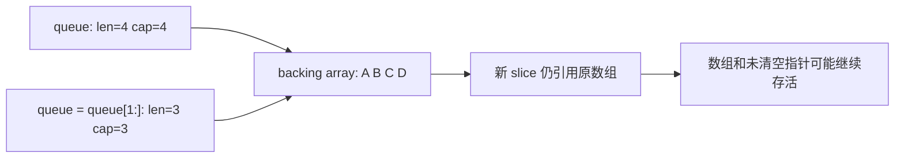
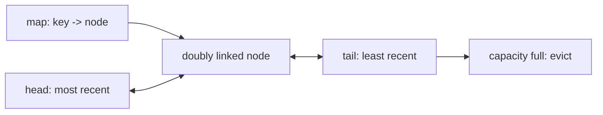
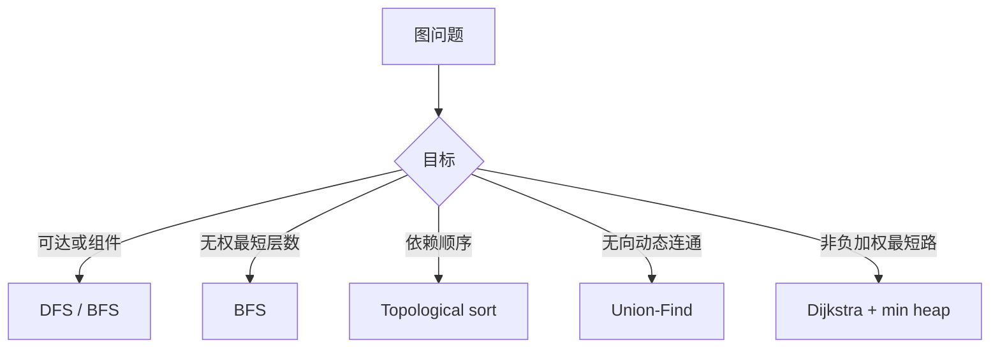
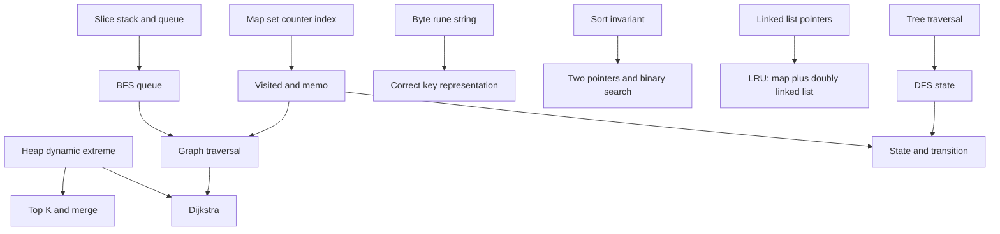

# 02 - 用 Go 写数据结构与算法完整笔记

## 1. Topic Overview

- **主题**：把常见数据结构与算法模式落实为 Go 中可运行、可解释、边界清晰的实现。
- **为什么重要**：面试不只检查是否记得算法，还检查能否选择合适的 Go 表示、维护算法不变量，并处理 slice、map、string 等语言层陷阱。
- **难度**：中等到较高。难点是让“表示方式、算法正确性、时间与空间成本”同时成立。
- **前置知识**：slice 的 `len/cap` 与底层数组、map、string、指针、接口、基本复杂度。
- **本地来源**：`materials/go_interview_review_md_pack/02_data_structures_algorithms_in_go.md`。
- **内容边界**：章节顺序和关键词来自本地提纲；定义、代码、复杂度和边界案例是教学展开，不冒充原文逐字内容。

### 学习路线

1. Slice 栈/队列与底层数组生命周期。
2. Map 集合/计数器/索引。
3. String 的 byte 与 rune 视角。
4. 排序、二分和双指针。
5. Heap 的动态极值。
6. 链表、树和图的结构不变量。
7. DP 的状态、转移、边界与顺序。

## 2. Core Concepts

### 2.1 Slice as Stack / Queue：逻辑删除不等于释放底层存储

#### Schema

- **触发场景**：需要 LIFO 栈、FIFO 队列，或为 DFS/BFS 保存待处理元素。
- **核心结构**：slice 是指向底层数组的描述符；重切片通常只改变可见范围，不搬移数组。
- **可用能力**：能写出正确 push/pop、enqueue/dequeue，并诊断长期队列的内存保留。

#### 栈

```go
stack = append(stack, x)       // push，摊销 O(1)
x = stack[len(stack)-1]       // top，O(1)
stack = stack[:len(stack)-1]  // pop，O(1)
```

若元素含指针且底层数组会长期存活，pop 前应清空槽位：

```go
i := len(stack) - 1
x := stack[i]
stack[i] = nil
stack = stack[:i]
```

#### 队列

最直观的出队是：

```go
x := queue[0]
queue[0] = nil
queue = queue[1:]
```

出队通常是 `O(1)`，但 `queue = queue[1:]` 不会自动缩小原底层数组。只要新 slice 仍指向该数组，数组就可能继续存活；若废弃槽位还存着指针，被消费对象也可能保持可达。

#### Visual Model: 为什么 len 变小，内存仍可能不降？



- **How to read**：slice 的逻辑窗口缩小了，但底层数组的生命周期由可达引用决定。
- **Source anchor**：源文件 `Slice as Stack/Queue` 中的 `q=q[1:] 内存问题`、`预分配`、`环形队列`。
- **Boundary**：省略了 slice 数据指针移到数组中间的地址细节。

#### 队列策略

- **单次 BFS**：slice 加 `head` 下标，简单且不会反复重切片。
- **长期队列**：清空已消费指针，并按阈值把未消费区复制到较小的新 slice。
- **容量稳定**：环形队列以 `head/tail/size` 复用数组；要区分空和满。
- **预分配**：预估容量可减少扩容，但过度预分配也会浪费内存。

```go
q := make([]int, 0, len(graph))
q = append(q, start)
for head := 0; head < len(q); head++ {
    cur := q[head]
    _ = cur
}
```

#### 常见错误

- 每次出队都复制 `queue[1:]`，使总成本退化到 `O(n²)`。
- 认为 `len(queue) == 0` 就保证底层数组已回收。
- 环形队列只用 `head == tail`，却没有额外状态区分空与满。

### 2.2 Map as Set / Counter / Index：把查询改写为键查找

#### Schema

- **触发场景**：去重、成员判断、频率统计、反向索引、visited、memoization。
- **设计问题**：快速查询什么就放进 key；额外结果或位置放进 value。
- **典型成本**：查找、插入、删除平均 `O(1)`；遍历顺序没有稳定保证。

#### Set、Counter、Index

```go
seen := make(map[string]struct{})
seen["go"] = struct{}{}
_, ok := seen["go"]

freq := make(map[rune]int)
for _, r := range text {
    freq[r]++
}

index := make(map[string]int)
for i, id := range ids {
    index[id] = i
}
```

泛型集合可写成 `type Set[T comparable] map[T]struct{}`。slice、map、function 不能作 key；array、struct 只有在所有组成部分可比较时才可作 key。

map 读不存在 key 会返回 value 零值。若零值本身有业务意义，要用 `v, ok := m[k]`。nil map 可读、可 `len`、可 `range`，但写入会 panic。

#### Worked Example: Two Sum 的补数索引

```go
func twoSum(nums []int, target int) []int {
    pos := make(map[int]int, len(nums))
    for i, x := range nums {
        if j, ok := pos[target-x]; ok {
            return []int{j, i}
        }
        pos[x] = i
    }
    return nil
}
```

不变量：处理 `i` 时，`pos` 只保存 `[0, i)`。**先查后写**避免把同一位置使用两次。

#### 常见错误

- 把 map 遍历顺序当成稳定顺序。
- visited 等到出队才标记，导致同一节点重复入队。
- memo 只区分“有答案/没答案”，却没有处理带环递归的“正在计算”。
- 并发读写普通 map。

### 2.3 String Problems：先定义题目里的“字符”

#### Schema

- **触发场景**：长度、回文、窗口、计数、解析、拼接。
- **第一问**：单位是 byte、Unicode code point（rune），还是用户感知字符？
- **Go 模型**：string 是不可变字节序列，通常承载 UTF-8，但类型本身不保证内容合法。

```go
s := "Go语言"
fmt.Println(len(s))       // 字节数
fmt.Println(s[0])         // byte
for byteIndex, r := range s {
    fmt.Println(byteIndex, r) // 字节起始下标、rune
}
```

若题目保证 ASCII，可用 `[26]int` 做字母频率；一般 Unicode code point 可用 `map[rune]int` 或 `[]rune`。一个用户可见字符仍可能由多个 rune 组成。

#### 包与拼接

- `strings`：查找、切分、修剪、替换、Builder。
- `bytes`：可变字节缓冲区和 I/O 边界。
- `strconv`：数字/布尔与字符串的解析、格式化。
- `unicode`：rune 分类和大小写。
- `utf8`：UTF-8 合法性、rune 数与编码。

```go
var b strings.Builder
b.Grow(estimatedBytes)
for _, part := range parts {
    b.WriteString(part)
}
result := b.String()
```

循环中反复 `result += part` 可能重复分配复制，累计到二次成本。`strings.Builder` 用于构造 string；`bytes.Buffer` 还适合需要 Reader/Writer 的字节流。

#### 常见错误

- 把 `len(s)` 当字符数，用 `s[i]` 遍历中文。
- 未确认输入域就把 rune 当完整用户可见字符。
- 为了局部修改反复做 string/`[]rune` 转换，忽略分配。

### 2.4 Sort：排序建立全局顺序，二分和双指针消费该顺序

#### Schema

- **触发场景**：相邻关系、区间、去重、双指针、二分边界、自定义优先级。
- **代价**：排序通常 `O(n log n)`；若它能把后续嵌套搜索降为线性，总体仍可能更优。

```go
sort.Ints(nums)
sort.Strings(words)
sort.Slice(users, func(i, j int) bool {
    if users[i].Score != users[j].Score {
        return users[i].Score > users[j].Score
    }
    return users[i].ID < users[j].ID
})
```

`less` 要形成一致的严格顺序：不能用 `<=`，且必须满足传递性。若相等元素原顺序必须保留，要用稳定排序；普通 `sort.Slice` 不保证稳定。

```go
i := sort.Search(len(nums), func(i int) bool {
    return nums[i] >= target
})
```

`sort.Search` 的谓词必须随下标呈 `false...false,true...true`，返回第一个 true 的下标；若都为 false，返回 `len(nums)`。

排序后做两数和：和太小移动左指针，和太大移动右指针。正确性不是口诀，而是一次移动能排除整批不可能候选。

#### 常见错误

- 比较函数使用 `<=`。
- 二分前没证明谓词单调。
- 忽略排序会改变输入。
- 会背双指针移动方向，却解释不了排除依据。

### 2.5 Heap：只维护当前需要的极值

#### Schema

- **触发场景**：数据动态到达、反复取最小/最大、只关心 Top K。
- **不变量**：堆只保证根是极值，不保证整个底层数组全局有序。
- **成本**：建堆 `O(n)`，peek `O(1)`，push/pop `O(log n)`。

Go 的 `container/heap` 要求 `Len/Less/Swap/Push/Pop`。接口方法 `Push/Pop` 修改 slice 尾部，调用者应使用 `heap.Push/heap.Pop` 维护堆结构。

```go
type IntHeap []int

func (h IntHeap) Len() int           { return len(h) }
func (h IntHeap) Less(i, j int) bool { return h[i] < h[j] }
func (h IntHeap) Swap(i, j int)      { h[i], h[j] = h[j], h[i] }
func (h *IntHeap) Push(x any)        { *h = append(*h, x.(int)) }
func (h *IntHeap) Pop() any {
    old := *h
    n := len(old)
    x := old[n-1]
    *h = old[:n-1]
    return x
}
```

#### 典型组合

- Top K 最大元素：维护大小 K 的最小堆，根是准入门槛。
- K-way merge：堆中只放每个有序序列当前头部。
- Median Finder：最大堆管较小一半，最小堆管较大一半，大小差不超过 1。
- Dijkstra：最小堆取候选距离；没有 decrease-key 时可压入新距离，弹出时跳过过期项。

#### 常见错误

- 认为堆数组除根外也全局有序。
- 最大堆忘记反转 `Less`。
- Top K 仍把全部数据排序，没有利用 K 的边界。

### 2.6 Linked List：用指针不变量消除边界分支

#### Schema

- **触发场景**：已知节点附近插入/删除、反转、环检测、合并、LRU。
- **核心问题**：每一步后，已处理区在哪里？未处理区入口是否仍被保存？

dummy node 让删除头节点和中间节点共用逻辑。反转链表的不变量是：`prev` 指向已反转前缀，`cur` 指向未处理后缀。

```go
var prev *ListNode
for cur := head; cur != nil; {
    next := cur.Next
    cur.Next = prev
    prev = cur
    cur = next
}
return prev
```

快慢指针可做中点和环检测。求环入口时，快慢相遇后让一个指针回到头部，再同步每次一步，相遇点即入口。

#### Visual Model: LRU 为什么需要两个结构？



- **How to read**：map 负责 `O(1)` 定位，双向链表负责 `O(1)` 移动和淘汰。
- **Source anchor**：源文件 `Linked List` 中的 `LRU: map + doubly linked list`。
- **Boundary**：省略 dummy head/tail 和并发控制。

#### 常见错误

- 修改 `cur.Next` 前未保存 `next`，丢失后缀。
- LRU 只用链表导致查询 `O(n)`，或只用 map 无法维护新旧顺序。

### 2.7 Tree：遍历方式由状态与访问时机决定

#### Schema

- **触发场景**：层级结构、路径、BST、公共祖先、序列化、前缀树。
- **选择**：DFS 适合路径、回溯、子树组合；BFS 适合层序和无权最短层数。

递归 DFS 要先定义返回值，如“返回以当前节点为根的高度”。若多个递归分支复用同一 path slice，返回前必须撤销选择。迭代 DFS 用显式栈；模拟后序时通常还要保存“节点是否展开”的状态。

BFS 层序遍历在每层开始时固定本层节点数，新入队节点属于下一层。

BST 不变量是祖先共同限定的值域，不是只比较直接父子。重复值放哪一侧必须明确。

- LCA：递归结果表达目标是否出现在左右子树；左右各找到一个时当前节点是公共祖先。
- Serialization：必须编码空节点，否则不同树可能产生相同序列。
- Trie：根到节点的路径表示前缀；终止标记区分“完整单词”和“仅前缀”。

#### 常见错误

- 深树无条件递归，忽略栈深。
- path 复用但忘记回溯。
- 验证 BST 只检查直接孩子。
- Trie 没有终止标记，无法区分 `go` 与 `goal` 的前缀。

### 2.8 Graph：先定义边，再按目标选算法

#### Schema

- **触发场景**：任意连接、依赖、可达性、连通分量、路径成本、网格移动。
- **第一步**：定义节点、边、方向、权重和规模。

```go
graph := make([][]int, n)
for _, e := range edges {
    u, v := e[0], e[1]
    graph[u] = append(graph[u], v)
    graph[v] = append(graph[v], u) // 仅无向图
}
```

邻接表空间通常 `O(V+E)`，适合稀疏图；矩阵是 `O(V²)`，但判断任意两点直接相连为 `O(1)`。

- BFS：无权图最少边数、逐层扩展。
- DFS：可达性、组件、回溯。
- Topological sort：有向依赖；Kahn 处理节点数小于 V 表示有环。
- Union-Find：动态合并无向连通分量；路径压缩和按秩/大小合并使摊销成本接近常数。
- Cycle detection：有向图区分当前递归路径与已完成节点；无向 DFS 忽略父边。
- Grid graph：格子是节点、移动是隐式边，通常无需显式建图。
- Dijkstra：只适用于非负权边。

#### Visual Model: 图题的算法入口



- **How to read**：先按问题目标和边权选择不变量，不要看到“图”就机械套 DFS。
- **Source anchor**：源文件 `Graph` 的 BFS/DFS、topological sort、union-find、cycle detection、Dijkstra。

#### 常见错误

- 无向边只加一个方向。
- BFS 出队才标 visited，导致重复入队。
- 拓扑输出不完整却仍当合法顺序。
- 对负权边使用 Dijkstra。

### 2.9 Dynamic Programming：先定义状态语义，再写转移

#### Schema

- **触发场景**：暴力递归重复计算同类子问题，且子问题结果可组合成原问题答案。
- **五步法**：状态定义 → 状态转移 → base case → 计算顺序 → 答案位置。

好的状态是一句完整句子：`dp[i]` 表示处理前 `i` 个元素时的最大价值。若说不清下标包含还是不包含 `i`，转移和 base case 很容易整体偏一位。

#### Memoization vs Tabulation

- Memoization：自顶向下，只计算访问到的状态；有递归开销和深度风险。
- Tabulation：自底向上，顺序显式，便于滚动数组；可能计算不需要的状态。

两者遍历的是同一个状态图，只是顺序不同。

滚动数组只有在旧状态不再需要时才能覆盖。0/1 背包容量通常从大到小，避免同一物品一轮内重复使用；完全背包常从小到大，允许重复贡献。

- 背包：物品前缀与容量。
- LIS：以位置结尾的长度，或各长度的最小结尾值。
- LCS：两个字符串前缀。
- Edit Distance：一个前缀变成另一个前缀的最少操作。

#### 常见错误

- 先背公式，后补状态含义。
- 看到“最优”就套 DP，却没有重叠子问题。
- 滚动数组更新方向错误。
- memo 用零值表示“未计算”，但零可能是合法答案。

## 3. Deep Understanding

### 3.1 一道算法题有三层

1. **问题层**：要回答成员、顺序、最值、路径还是组合最优？
2. **算法层**：需要 visited、单调边界、堆顶极值还是 DP 状态？
3. **Go 表示层**：用 slice、map、byte/rune、接口还是指针结构承载不变量？

算法层正确但表示层出错仍会失败：BFS 思路正确，visited 标记太晚会让队列暴涨；队列逻辑正确，长期 slice 仍可能保留大底层数组。

### 3.2 数据结构是操作集合，不是题目标签

- 尾部进出：slice 栈。
- 先进先出：slice + head 或环形队列。
- 成员判断/计数：map。
- 动态极值：heap。
- `O(1)` 定位并调整新旧顺序：map + 双向链表。
- 任意连接：邻接表。

先列主要操作及频率，再选择结构，比“看起来像某题型”更可靠。

### 3.3 复杂度包含隐藏移动和生命周期

`append` 是摊销 `O(1)`，因为偶尔扩容复制；string 循环拼接可能累计 `O(n²)`；slice 头删虽为 `O(1)`，却不等于内存立即下降。至少检查：单次最坏、摊销、空间峰值、引用生命周期。

### 3.4 组合结构靠职责分工

- LRU：map 定位，双向链表维护新旧顺序。
- Dijkstra：邻接表存边，距离数组存当前最优，最小堆选下一候选。
- Median Finder：两个堆分别维护两半数据。
- DP + 滚动数组：状态保证正确性，压缩只优化空间。

## 4. Minimal Working Example

### BFS：slice 队列、visited 与距离不变量

```go
package main

import "fmt"

func shortestEdges(graph [][]int, start int) []int {
	dist := make([]int, len(graph))
	for i := range dist {
		dist[i] = -1
	}

	queue := make([]int, 0, len(graph))
	queue = append(queue, start)
	dist[start] = 0 // 入队时标记，防止重复入队

	for head := 0; head < len(queue); head++ {
		cur := queue[head]
		for _, next := range graph[cur] {
			if dist[next] != -1 {
				continue
			}
			dist[next] = dist[cur] + 1
			queue = append(queue, next)
		}
	}
	return dist
}

func main() {
	graph := [][]int{{1, 2}, {0, 3}, {0, 3}, {1, 2}}
	fmt.Println(shortestEdges(graph, 0)) // [0 1 1 2]
}
```

执行不变量：`queue[:head]` 已处理，`queue[head:]` 已发现但待处理；`dist[v] != -1` 表示已发现。每节点最多入队一次，每边检查常数次，时间 `O(V+E)`、空间 `O(V)`。

这是函数内短寿命队列，返回后数组可回收。若队列是长期服务对象，还需清空引用、周期压缩或使用环形队列。

## 5. Chapter Knowledge Map



## 6. Self-Test Questions

### 6.1 Recall Questions

1. 为什么 `queue = queue[1:]` 是 `O(1)`，却仍可能造成内存保留？
2. 哪些 Go 类型不能直接作为 map key？判定规则是什么？
3. `len(s)`、`s[i]`、`for range s` 分别观察 string 的什么单位？

### 6.2 Application / Transfer Questions

1. 长期任务队列已消费 99 万个 `*Job`，只剩 1 万个，但 RSS 不降。请从 slice 与对象引用两层诊断，并给两种修复策略。
2. 设计 LRU Cache：分别说明 map 和双向链表的职责，以及为何单独使用任一结构不能同时满足目标复杂度。

### 6.3 Explain Like I Am 5

1. 用排队取号解释 BFS 为什么先找到无权图最少边数路径，以及不同边权出现后为何不能直接沿用。

## 7. Weak Point Detection

- **表示层混淆**：知道算法名，但说不清 Go 容器、索引和底层所有权。
- **复杂度表面化**：只报大 O，不分析摊销、复制、峰值空间和引用生命周期。
- **字符串单位错误**：默认一个下标就是一个字符。
- **不变量缺失**：能写循环，却解释不了每轮开始时什么已经成立。
- **组合职责不清**：会背 `map + list`、`graph + heap`，却说不清各自补足哪个操作。
- **边界遗漏**：忽略 nil map 写入、排序稳定性、BST 祖先范围、Dijkstra 非负权。
- **DP 公式先行**：会背转移式，却无法用一句完整话定义状态。
