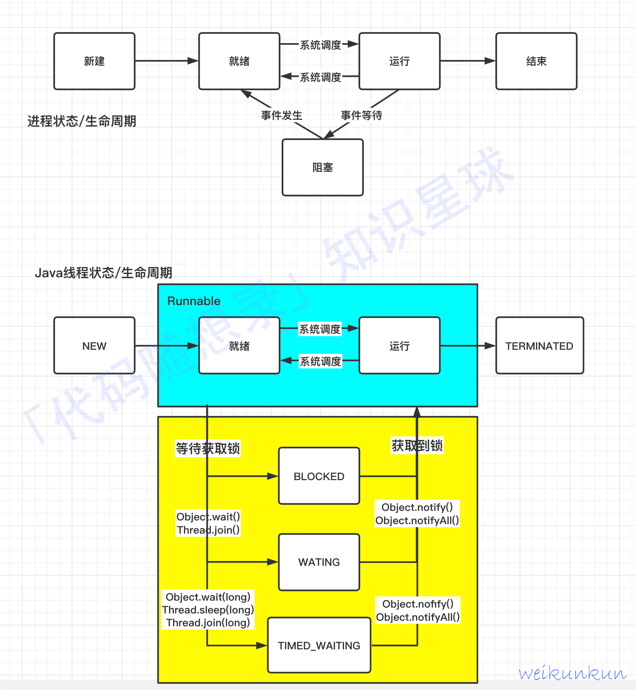
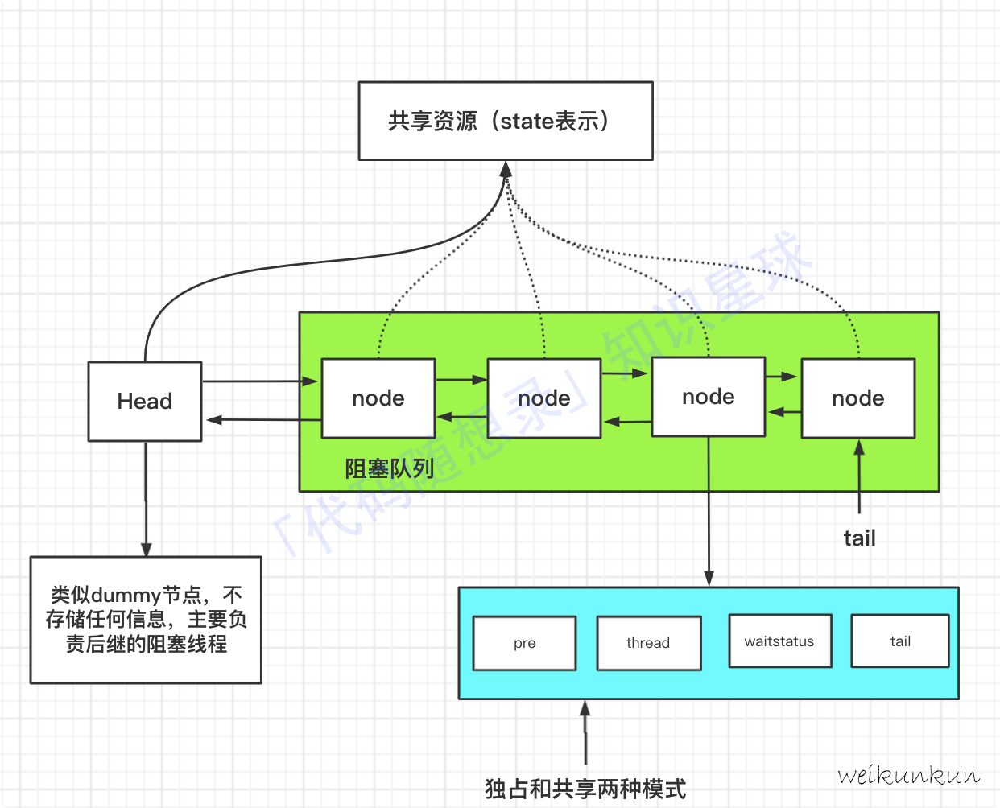

# 🧠 Java 并发与多线程核心八股总结

## 一、Java 创建线程的方式

| 方式                                | 实现方式                                   | 特点                         | 是否有返回值  |
| ----------------------------------- | ------------------------------------------ | ---------------------------- | ------------- |
| **继承 Thread 类**                  | 重写 `run()` 方法，调用 `start()` 启动     | 简单直观，但**不支持多继承** | ❌             |
| **实现 Runnable 接口**              | 将任务逻辑写在 `run()`，交由 `Thread` 执行 | 可与其他类继承共存，更灵活   | ❌             |
| **实现 Callable 接口 + Future**     | 实现 `call()` 方法，可返回结果并抛异常     | 结合 `FutureTask` 使用       | ✅             |
| **使用 Executor 框架**              | 提交 Runnable/Callable 任务至线程池执行    | 线程管理交由线程池           | ✅（Callable） |
| **使用 CompletableFuture**（JDK8+） | 基于异步回调机制的 Future                  | 支持链式异步编程             | ✅             |

------

### ✅ 示例对比

#### 1️⃣ 继承 Thread

```
class MyThread extends Thread {
    public void run() {
        System.out.println("Thread is running...");
    }
}
new MyThread().start();
```

#### 2️⃣ 实现 Runnable

```
class MyRunnable implements Runnable {
    public void run() {
        System.out.println("Runnable is running...");
    }
}
new Thread(new MyRunnable()).start();
```

#### 3️⃣ 实现 Callable + Future

```
class MyCallable implements Callable<String> {
    public String call() { return "Callable result"; }
}
FutureTask<String> task = new FutureTask<>(new MyCallable());
new Thread(task).start();
System.out.println(task.get());
```

#### 4️⃣ 使用线程池（Executor 框架）

```
ExecutorService pool = Executors.newFixedThreadPool(3);
pool.execute(() -> System.out.println("ThreadPool running..."));
pool.shutdown();
```

#### 5️⃣ 使用 CompletableFuture（异步链式执行）

```
CompletableFuture.supplyAsync(() -> "Task")
                 .thenApply(s -> s + " done")
                 .thenAccept(System.out::println);
```


## 二、线程的生命周期（Thread States）

| 状态     | 英文名        | 含义                 | 进入方式                              |
| -------- | ------------- | -------------------- | ------------------------------------- |
| 新建     | NEW           | 线程对象创建但未启动 | new Thread()                          |
| 就绪     | RUNNABLE      | 等待 CPU 调度        | 调用 start()                          |
| 运行     | RUNNING       | 获得 CPU 正在执行    | CPU 调度                              |
| 阻塞     | BLOCKED       | 等待锁资源           | synchronized 锁被占用                 |
| 等待     | WAITING       | 等待其他线程唤醒     | Object.wait(), join(), park()         |
| 超时等待 | TIMED_WAITING | 有时限的等待         | sleep(), wait(timeout), join(timeout) |
| 终止     | TERMINATED    | 线程执行完或异常退出 | run() 执行完毕                        |

📘 在操作系统中：

- “就绪”与“运行”被合并为 Java 的 **Runnable**；
- “阻塞”进一步细分为三种：BLOCKED、WAITING、TIMED_WAITING。




## 三、并发与并行的区别

| 概念     | 并发（Concurrency）            | 并行（Parallelism）      |
| -------- | ------------------------------ | ------------------------ |
| 含义     | 多个任务交替执行（单核多线程） | 多个任务同时执行（多核） |
| CPU核心  | 单核                           | 多核                     |
| 执行方式 | 时间片轮转                     | 物理并行                 |
| 示例     | Java线程调度切换               | 多CPU并行执行计算        |

------

## 四、线程与进程的区别

| 对比项   | 线程（Thread）         | 进程（Process）          |
| -------- | ---------------------- | ------------------------ |
| 概念     | 进程中的执行单元       | 程序的运行实例           |
| 资源     | 共享进程资源           | 拥有独立资源空间         |
| 切换开销 | 小                     | 大                       |
| 通信方式 | 共享内存（快但不安全） | IPC（慢但隔离）          |
| 调度单位 | CPU 调度基本单位       | 操作系统资源分配基本单位 |

## 五、start() vs run() 的区别

| 方法      | 功能                          | 是否新线程       |
| --------- | ----------------------------- | ---------------- |
| `start()` | 启动新线程，由 JVM 调用 run() | ✅ 是新线程       |
| `run()`   | 普通方法调用，不启动新线程    | ❌ 在主线程中执行 |

## 六、线程安全与同步机制

### 1️⃣ 什么是线程安全

> 多线程同时访问共享资源时，不会产生数据错误或状态不一致。

**问题原因：**

- 多线程对共享变量的同时写操作；
- CPU 缓存与主内存不一致；
- 指令重排导致执行顺序不可预测。

**保证线程安全的方式：**

1. synchronized 关键字；
2. volatile；
3. 原子类（AtomicInteger、AtomicLong）；
4. 锁（ReentrantLock、ReadWriteLock）；
5. 并发容器（ConcurrentHashMap、CopyOnWriteArrayList）。

## 七、synchronized 详解（面试必问🔥）

### 1️⃣ 基本原理

> synchronized 是 Java 提供的内置锁（Monitor），用于实现互斥与可见性。

- 当线程进入 synchronized 代码块时，会尝试获取对象监视器锁；
- 获得锁的线程才能执行；
- 退出时自动释放锁。

### 2️⃣ 使用方式

| 用法     | 锁对象                    |
| -------- | ------------------------- |
| 实例方法 | 当前实例 (this)           |
| 静态方法 | 当前类的 Class 对象       |
| 代码块   | 指定锁对象（任意 Object） |

```
public synchronized void method() {}          // 实例锁
public static synchronized void staticM() {}  // 类锁
synchronized (lockObj) { ... }                // 代码块锁
```

### 3️⃣ 特性

- **可重入性**：同一线程可多次获得同一锁；
- **可见性**：释放锁前会将变量刷新至主内存；
- **互斥性**：同一时刻仅一个线程可执行。

------

### 4️⃣ synchronized 优化（JDK1.6+）

| 优化     | 说明                          |
| -------- | ----------------------------- |
| 偏向锁   | 无竞争时锁偏向第一个线程      |
| 轻量级锁 | 低竞争时使用 CAS 自旋代替阻塞 |
| 重量级锁 | 高竞争时阻塞线程              |
| 锁粗化   | 合并多次小范围加锁            |
| 锁消除   | JIT 优化去除不必要锁操作      |

------

## 八、volatile 关键字

### 1️⃣ 作用

- **保证可见性**：线程修改变量，其他线程立即可见；
- **禁止指令重排序**；
- **不保证原子性**。

### 2️⃣ 示例

```
volatile boolean running = true;

void stop() { running = false; }

void run() {
    while (running) { /* ... */ }
}
```

📘 多线程中如果不加 volatile，线程可能一直读旧值。

### 3️⃣ 对比 synchronized

| 特性     | volatile           | synchronized     |
| -------- | ------------------ | ---------------- |
| 可见性   | ✅                  | ✅                |
| 原子性   | ❌                  | ✅                |
| 性能     | 高                 | 相对低           |
| 适用场景 | 状态标志、配置更新 | 复杂共享资源操作 |

## 九、锁类型与性能对比

| 锁类型        | 所属包                     | 特性                               | 适用场景             |
| ------------- | -------------------------- | ---------------------------------- | -------------------- |
| synchronized  | JVM关键字                  | 可重入、自动释放                   | 简单同步场景         |
| ReentrantLock | java.util.concurrent.locks | 可重入、可中断、公平锁、需手动释放 | 高竞争、复杂同步     |
| ReadWriteLock | java.util.concurrent.locks | 读共享、写独占                     | 读多写少             |
| StampedLock   | JDK8+                      | 乐观读（无锁）                     | 写极少的高读性能场景 |

📘 **公平锁 vs 非公平锁**

- 公平：按申请顺序分配；
- 非公平：允许插队，吞吐更高但可能饥饿。

## 🔟 AQS（AbstractQueuedSynchronizer）

### 1️⃣ 定义

> AQS 是一个构建锁和同步器的框架（ReentrantLock、Semaphore、CountDownLatch等均基于它实现）。

### 2️⃣ 核心思想

- 用一个 `volatile int state` 表示锁状态；
- 使用 CAS 操作更新 state；
- 失败则进入 **CLH 双向队列** 排队等待；
- 当锁释放时，唤醒队列中下一个节点。

### 3️⃣ AQS 模型结构

```
state：同步状态（0=未锁定，1=已锁定）
|
|-- tryAcquire() / tryRelease()：子类实现自定义逻辑
|-- acquire() / release()：模板方法，控制线程排队与唤醒
|
CLH队列：
[head(dummy)] <-> [node1(wait)] <-> [node2(wait)] ...
```



### 4️⃣ 常见基于AQS的同步器

| 类                     | 功能             |
| ---------------------- | ---------------- |
| ReentrantLock          | 可重入锁         |
| CountDownLatch         | 等待一组线程完成 |
| Semaphore              | 控制并发访问数量 |
| CyclicBarrier          | 多线程栅栏       |
| ReentrantReadWriteLock | 读写分离锁       |

#### 面试背诵

AQS 是 Java 并发包的核心同步框架，它通过一个 volatile 的 `state` 变量表示同步状态，并用一个 FIFO CLH 队列管理等待的线程。当线程竞争资源失败时，会被加入队列并阻塞，当资源释放时，AQS 唤醒队列中的下一个节点。子类只需实现 `tryAcquire` / `tryRelease` 等方法即可轻松实现各种同步器， 如 ReentrantLock（独占）、Semaphore（共享）、CountDownLatch（共享）。


## 🧩 十一、ReentrantLock 工作机制（独占锁）

1️⃣ 调用 `lock()`：尝试通过 CAS 设置 state=1。
 2️⃣ 若成功 → 获得锁；否则 → 进入 CLH 队列。
 3️⃣ 当前线程释放锁：`unlock()` → state=0 → 唤醒下一个节点。
 4️⃣ 通过 `tryLock()` 可选择性加锁（带超时/可中断）。

------

## 十二、线程安全保证的完整手段汇总

| 手段         | 特性                      | 示例              |
| ------------ | ------------------------- | ----------------- |
| synchronized | 内置锁，互斥 + 可见性     | 修饰方法/代码块   |
| volatile     | 可见性，无原子性          | 状态标志          |
| Lock         | 可重入 + 公平锁 + tryLock | ReentrantLock     |
| 原子类       | 无锁原子操作（CAS）       | AtomicInteger     |
| 并发容器     | 内部封装同步机制          | ConcurrentHashMap |
| 不可变对象   | 天然线程安全              | String、包装类    |

## 十二、线程安全保证的完整手段汇总

| 手段         | 特性                      | 示例              |
| ------------ | ------------------------- | ----------------- |
| synchronized | 内置锁，互斥 + 可见性     | 修饰方法/代码块   |
| volatile     | 可见性，无原子性          | 状态标志          |
| Lock         | 可重入 + 公平锁 + tryLock | ReentrantLock     |
| 原子类       | 无锁原子操作（CAS）       | AtomicInteger     |
| 并发容器     | 内部封装同步机制          | ConcurrentHashMap |
| 不可变对象   | 天然线程安全              | String、包装类    |


**基于ReentrantLock的独占式共享锁的整个流程：**


# ThreadLocal 面试知识点浓缩总结

## 一、核心概念

**ThreadLocal：为每个线程提供变量的独立副本，实现线程隔离。**

- 每个线程维护一个 `ThreadLocalMap`，key 为 `ThreadLocal` 的弱引用，value 为变量值。
- 各线程之间互不影响，常用于保存用户信息、traceId、事务上下文等。

## 二、数据结构

- 每个 `Thread` 都有一个 `ThreadLocalMap threadLocals`。

- `ThreadLocalMap` 内部为一个 `Entry[] table` 数组。

  ```java
  static class Entry extends WeakReference<ThreadLocal<?>> {
      Object value;
  }
  ```

- **Key 是弱引用**（`WeakReference<ThreadLocal<?>>`），**Value 是强引用**。

## 三、弱引用与内存泄漏

- 若 ThreadLocal 无外部强引用，GC 后 **key 会被清除为 null**。
- 但其 **value 仍被强引用保留在 ThreadLocalMap 中**，直到线程结束，可能造成内存泄漏。
- **解决办法：** 调用 `ThreadLocal.remove()` 手动清理。

## 四、Hash 算法与结构设计

- 每个 ThreadLocal 对象创建时分配一个唯一 hash 值：

  ```java
  private final int threadLocalHashCode = nextHashCode();
  private static final int HASH_INCREMENT = 0x61c88647; // 黄金分割数
  ```

- 黄金分割数保证哈希分布均匀，减少冲突。

- `index = hashCode & (len - 1)` 定位桶位。

## 五、冲突解决机制

ThreadLocalMap **不使用链表或红黑树**，采用**线性探测法 (linear probing)**：

- 如果当前位置冲突，则向后查找下一个空槽；
- 若找到 key 相同则更新；
- 若遇到 key=null（过期 Entry），执行清理替换。

## 六、过期 key 的清理机制

ThreadLocalMap 有两种清理方式：

### 1️⃣ 探测式清理（expungeStaleEntry）

- 从过期位置向后扫描，删除 key=null 的 Entry；
- 对未过期的 Entry 重新 rehash，使其更接近理想位置；
- 在 set()、get()、rehash() 时触发。

### 2️⃣ 启发式清理（cleanSomeSlots）

- 局部扫描部分桶，若发现过期数据则调用探测式清理；
- 在 `set()` 操作后自动触发。

## 七、扩容机制

- 扩容阈值：`threshold = len * 2/3`

- 当触发条件满足时：

  ```
  if (!cleanSomeSlots(i, sz) && sz >= threshold)
      rehash();
  ```

- `rehash()` 先清理过期 key，再判断：

  - 若 size >= threshold * 3/4，则 `resize()` → 扩容为 2 倍。

## 八、ThreadLocalMap 方法流程

### `set(T value)`

1. 获取当前线程的 ThreadLocalMap；
2. 通过 hash 定位桶；
3. 若桶空 → 插入；
4. 若 key 相等 → 覆盖；
5. 若 key=null → 替换过期 entry；
6. 若冲突 → 向后探测；
7. 执行启发式清理。

### `get()`

1. hash 定位；
2. 若找到匹配 key → 返回；
3. 若 key=null → 执行探测式清理；
4. 否则向后线性查找。

### `remove()`

- 删除当前 ThreadLocal 对应的 Entry；
- 避免 value 残留导致内存泄漏。

## 九、InheritableThreadLocal

- 用于**子线程继承父线程变量**。
- 实现：在创建 Thread 时，复制父线程的 `inheritableThreadLocals`。
- 缺陷：线程池复用线程 → 数据不会自动更新。
- **解决方案：** 使用阿里开源的 `TransmittableThreadLocal (TTL)`。

## 十一、常见面试问答总结

| 面试问题                                         | 核心回答                                                     |
| ------------------------------------------------ | ------------------------------------------------------------ |
| ThreadLocal的key为何是弱引用？                   | 避免ThreadLocal对象被外部释放后仍被Thread引用导致内存泄漏。  |
| 若key被回收，value会被回收吗？                   | 不会。value仍有强引用，需要调用remove()清理。                |
| ThreadLocalMap如何解决哈希冲突？                 | 采用线性探测法。                                             |
| ThreadLocalMap如何扩容？                         | 达到2/3容量后触发rehash，再判断是否resize。                  |
| 如何防止内存泄漏？                               | 使用 `try-finally` 块并在finally中调用 `remove()`。          |
| ThreadLocal和synchronized区别？                  | ThreadLocal通过线程隔离实现无锁共享数据；synchronized通过锁实现线程互斥访问。 |
| InheritableThreadLocal在异步线程池中有什么问题？ | 子线程复用导致数据污染或丢失，推荐使用TransmittableThreadLocal。 |

# Java 线程池（ThreadPoolExecutor）详解面试总结版

# 🧠 一、线程池的核心思想

线程池属于**池化技术（Pooling）**，即资源复用。
 **目的：**减少线程频繁创建销毁的开销、提升响应速度、统一管理线程资源。

✅ **优点：**

1. **降低资源消耗**（线程可复用）
2. **提升响应速度**（有核心线程常驻）
3. **提高可管理性**（可配置参数、拒绝策略、监控状态）

# 🏗 二、Executor 框架结构

Java 5 引入的统一并发执行框架，核心接口与实现如下：

| 层级                         | 主要作用            | 典型实现类                                          |
| ---------------------------- | ------------------- | --------------------------------------------------- |
| **Executor**                 | 执行任务的基础接口  | `ThreadPoolExecutor`                                |
| **ExecutorService**          | 扩展生命周期管理    | `ThreadPoolExecutor`, `ScheduledThreadPoolExecutor` |
| **ScheduledExecutorService** | 支持延时/周期性任务 | `ScheduledThreadPoolExecutor`                       |

🧩 **三大组成部分：**

1. **任务**：`Runnable` 或 `Callable`
2. **任务执行器**：`Executor` / `ExecutorService` / `ThreadPoolExecutor`
3. **任务结果**：`Future` / `FutureTask`

# ⚙️ 三、ThreadPoolExecutor 核心参数详解

```java
public ThreadPoolExecutor(
    int corePoolSize,        // 核心线程数
    int maximumPoolSize,     // 最大线程数
    long keepAliveTime,      // 非核心线程空闲超时时间
    TimeUnit unit,           // 超时时间单位
    BlockingQueue<Runnable> workQueue,  // 任务队列
    ThreadFactory threadFactory,        // 线程工厂
    RejectedExecutionHandler handler    // 拒绝策略
)
```

| 参数名            | 含义       | 说明                                                  |
| ----------------- | ---------- | ----------------------------------------------------- |
| `corePoolSize`    | 核心线程数 | 核心线程常驻，不会被销毁（默认 keepAliveTime 不影响） |
| `maximumPoolSize` | 最大线程数 | 当队列满后可扩展到此数量                              |
| `keepAliveTime`   | 存活时间   | 仅作用于非核心线程                                    |
| `workQueue`       | 阻塞队列   | 存放等待执行任务                                      |
| `threadFactory`   | 线程工厂   | 用于自定义线程命名/异常处理                           |
| `handler`         | 拒绝策略   | 当任务无法提交时触发                                  |

📊 **线程池工作状态转换图：**

```
RUNNING → SHUTDOWN → STOP → TIDYING → TERMINATED
```

------

# 🚦 四、拒绝策略（RejectedExecutionHandler）

当任务数超过线程池容量 + 队列容量时触发：

| 策略名                | 行为                           | 特点                     |
| --------------------- | ------------------------------ | ------------------------ |
| `AbortPolicy`         | 抛异常（默认）                 | 直接拒绝任务             |
| `CallerRunsPolicy`    | 调用者线程执行任务             | 不抛弃任务但可能降低性能 |
| `DiscardPolicy`       | 直接丢弃任务                   | 无异常，无通知           |
| `DiscardOldestPolicy` | 丢弃最旧任务，再尝试提交新任务 | 保留最新任务优先执行     |

👉 **生产推荐：**`CallerRunsPolicy` 或自定义策略，避免任务丢失。

# 🧱 五、线程池的创建方式

## ✅ 推荐：直接使用 ThreadPoolExecutor 构造函数

```
ThreadPoolExecutor executor = new ThreadPoolExecutor(
    5, 10, 1L, TimeUnit.SECONDS,
    new ArrayBlockingQueue<>(100),
    new ThreadPoolExecutor.CallerRunsPolicy());
```

## ⚠️ 不推荐：Executors 工具类（阿里规约禁止）

| 方法                      | 阻塞队列                         | 问题     |
| ------------------------- | -------------------------------- | -------- |
| `newFixedThreadPool`      | 无界队列（LinkedBlockingQueue）  | 可能 OOM |
| `newSingleThreadExecutor` | 无界队列                         | 可能 OOM |
| `newCachedThreadPool`     | SynchronousQueue，无界线程数     | 可能 OOM |
| `newScheduledThreadPool`  | 无界延时队列（DelayedWorkQueue） | 可能 OOM |

# 🧩 六、线程池常见阻塞队列

| 队列类型                  | 特点                 | 应用场景                       |
| ------------------------- | -------------------- | ------------------------------ |
| **ArrayBlockingQueue**    | 有界 FIFO            | 任务量固定，可控内存           |
| **LinkedBlockingQueue**   | 无界 FIFO            | 可能 OOM（如 FixedThreadPool） |
| **SynchronousQueue**      | 不存储任务，直接交接 | 高并发短任务                   |
| **PriorityBlockingQueue** | 按优先级执行         | 任务有优先级                   |
| **DelayedWorkQueue**      | 延迟执行             | 定时任务线程池                 |

# 🔍 七、线程池任务执行流程（execute 方法）

**核心逻辑：**

```
1️⃣ 若当前线程数 < corePoolSize → 创建核心线程执行任务
2️⃣ 否则 → 任务入队（workQueue）
3️⃣ 若队列满 & 当前线程数 < maximumPoolSize → 创建新线程执行
4️⃣ 若都不满足 → 执行拒绝策略
```

**简化示意：**

```
corePoolSize  < nThreads → 新建线程
corePoolSize <= nThreads < maxPoolSize → 入队
队列满 → 扩容线程
超过 maxPoolSize → 拒绝策略
```

# 🧠 九、内置线程池对比总结

| 类型                     | 核心线程数 | 最大线程数 | 队列                     | 风险         |
| ------------------------ | ---------- | ---------- | ------------------------ | ------------ |
| **FixedThreadPool**      | n          | n          | 无界 LinkedBlockingQueue | OOM          |
| **SingleThreadExecutor** | 1          | 1          | 无界 LinkedBlockingQueue | OOM          |
| **CachedThreadPool**     | 0          | ∞          | SynchronousQueue         | CPU/内存耗尽 |
| **ScheduledThreadPool**  | n          | ∞          | DelayedWorkQueue         | OOM          |

# 🔬 十、常见方法对比

| 方法                        | 功能                            |
| --------------------------- | ------------------------------- |
| `execute(Runnable)`         | 无返回值提交任务                |
| `submit(Runnable/Callable)` | 返回 `Future`，可获取结果或异常 |
| `shutdown()`                | 平滑关闭，执行完已提交任务      |
| `shutdownNow()`             | 强制关闭，停止正在运行任务      |
| `isShutdown()`              | 调用 shutdown 后返回 true       |
| `isTerminated()`            | 关闭且任务全部完成后返回 true   |

# 🧩 十一、Runnable vs Callable

| 接口          | 返回值       | 异常处理         | 代表类     |
| ------------- | ------------ | ---------------- | ---------- |
| `Runnable`    | 无返回值     | 不能抛出受检异常 | Thread     |
| `Callable<V>` | 返回值类型 V | 可抛出异常       | FutureTask |

`Executors.callable(Runnable r, Object result)` 可将 Runnable 转为 Callable。

------

# 🕓 十二、ScheduledThreadPoolExecutor vs Timer

| 对比项     | Timer                | ScheduledThreadPoolExecutor            |
| ---------- | -------------------- | -------------------------------------- |
| 异常处理   | 异常会终止整个 Timer | 异常仅取消当前任务                     |
| 多线程支持 | 单线程               | 多线程                                 |
| 精度       | 受系统时钟影响       | 不受影响                               |
| 推荐       | ❌                    | ✅ 推荐使用 ScheduledThreadPoolExecutor |