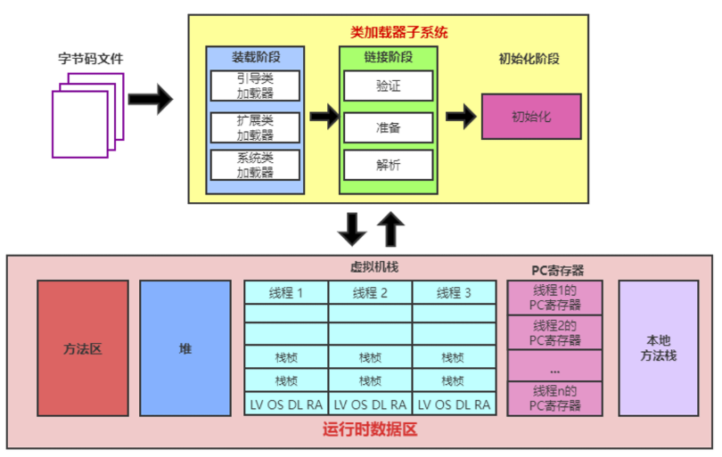

# ☕ JVM 核心八股总结（系统+面试速答版）

## 一、JVM 是什么？它在 Java 中扮演什么角色？

**定义：**
 JVM（Java Virtual Machine）是 Java 平台的核心组件，是一种虚拟计算机，负责执行 Java 字节码。它是 Java “一次编写，到处运行” 的基础。

**作用：**

| 功能                 | 说明                                 |
| -------------------- | ------------------------------------ |
| **字节码解释与执行** | 执行编译器生成的 `.class` 字节码文件 |
| **跨平台支持**       | 不同操作系统安装各自的 JVM 实现      |
| **内存管理**         | 自动内存分配与垃圾回收（GC）         |
| **安全机制**         | 验证字节码合法性，防止恶意代码       |
| **多线程支持**       | JVM 提供原生线程调度与同步机制       |

📘 一句话总结：

> JVM 是 Java 程序的运行环境，负责加载字节码、管理内存、执行代码、并提供跨平台能力。

## 二、Java 代码的执行流程

| 阶段                       | 描述                                                      |
| -------------------------- | --------------------------------------------------------- |
| ① 编写源代码               | `HelloWorld.java`                                         |
| ② 编译字节码               | `javac HelloWorld.java` → 生成 `.class` 文件              |
| ③ 类加载（ClassLoader）    | 加载 `.class` 文件到内存（遵循双亲委派模型）              |
| ④ 验证、准备、解析、初始化 | 校验字节码 → 分配静态内存 → 符号引用解析 → 初始化静态成员 |
| ⑤ 执行字节码               | JVM 解释执行或 JIT 编译执行                               |
| ⑥ 内存分配                 | 在堆/栈/方法区分配运行内存                                |
| ⑦ 垃圾回收                 | GC 自动回收无用对象内存                                   |

**执行核心：**

- 解释器（Interpreter）：逐行解释执行；
- JIT 编译器（Just-In-Time）：热点代码即时编译为机器码；
- 混合模式执行：启动时解释执行，热点代码转为机器码执行（性能更优）。

## 三、JVM 跨平台性是如何实现的？

**核心机制：**

> Java 编译器生成**平台无关的字节码（.class）**，
>  各平台安装对应的 **JVM 实现**，由 JVM 将字节码翻译成本地机器码。

| 层次            | 功能                         |
| --------------- | ---------------------------- |
| 源代码 (.java)  | 人类可读的 Java 代码         |
| 字节码 (.class) | 平台无关中间语言             |
| JVM             | 解释或编译字节码为本地机器码 |
| OS & 硬件       | 实际执行机器指令             |

📘 **跨平台原理：**

- 不同系统安装不同版本 JVM；
- 字节码一致，JVM 翻译为对应平台机器码；
- Java 标准库（API）通过 JNI 屏蔽系统差异。

🗣️ **口诀：**

> 编译一次，到处运行。跨平台靠 JVM，兼容靠字节码。

------

## 四、JVM 内存结构（Java Memory Model）

📊 JVM 运行时内存分为 5 大区域：

| 区域                                 | 是否线程共享 | 存储内容                     | 异常               |
| ------------------------------------ | ------------ | ---------------------------- | ------------------ |
| **程序计数器 (PC)**                  | 否           | 当前线程执行字节码行号       | 无                 |
| **虚拟机栈 (VM Stack)**              | 否           | 方法调用、局部变量、操作数栈 | StackOverflowError |
| **本地方法栈 (Native Stack)**        | 否           | 本地方法（JNI）调用栈        | StackOverflowError |
| **堆 (Heap)**                        | ✅            | 对象实例、数组               | OutOfMemoryError   |
| **方法区 (Method Area / Metaspace)** | ✅            | 类信息、常量池、静态变量     | OutOfMemoryError   |

🧩 **图示：**

```
┌──────────────────────────┐
│ Program Counter（线程私有） │
│ Java VM Stack（线程私有）  │
│ Native Method Stack（线程私有）│
├──────────────────────────┤
│         Heap（共享）         │ ← 对象实例、数组
├──────────────────────────┤
│   Method Area / Metaspace（共享） │ ← 类元信息、静态变量
└──────────────────────────┘
```

------

## 五、堆（Heap）与栈（Stack）的区别

| 对比项       | 堆（Heap）     | 栈（Stack）            |
| ------------ | -------------- | ---------------------- |
| 存储内容     | 对象实例、数组 | 局部变量、方法调用栈帧 |
| 管理方式     | GC 管理        | 方法调用自动管理       |
| 生命周期     | 长（随对象）   | 短（随方法调用）       |
| 是否线程共享 | 是             | 否                     |
| 异常类型     | OOM            | StackOverflowError     |
| 性能         | 慢             | 快                     |

## 六、垃圾回收（GC）机制与垃圾回收器

### （1）核心思想：分代回收理论

| 区域   | 对象特点       | 回收算法              |
| ------ | -------------- | --------------------- |
| 新生代 | 对象存活时间短 | 复制算法              |
| 老年代 | 对象存活时间长 | 标记-清除 / 标记-整理 |
| 元空间 | 类元数据       | 手动回收（非堆内存）  |

### （2）垃圾识别：可达性分析（Reachability Analysis）

以 **GC Roots** 为起点（如栈变量、静态变量、JNI 引用），遍历对象图。
 不可达对象即为垃圾。

### （3）常见算法

| 算法      | 原理                   | 优缺点                 |
| --------- | ---------------------- | ---------------------- |
| 标记-清除 | 标记存活 → 清除垃圾    | 简单，碎片多           |
| 复制      | 复制存活对象到新区域   | 快，无碎片，但浪费内存 |
| 标记-整理 | 标记存活 → 移动压缩    | 无碎片，性能较低       |
| 分代收集  | 按对象生命周期划分区域 | 高效通用，主流方案     |

------

### （4）GC 类型

| 类型     | 触发时机         | 回收区域      | 特点               |
| -------- | ---------------- | ------------- | ------------------ |
| Minor GC | 新生代满         | 新生代        | 频繁、速度快       |
| Major GC | 老年代不足       | 老年代        | 慢，可能引发停顿   |
| Full GC  | 整堆或元空间不足 | 全堆 + 方法区 | 最耗时，应尽量减少 |

------

### （5）常见垃圾回收器

| 代     | 收集器                          | 特点                                |
| ------ | ------------------------------- | ----------------------------------- |
| 新生代 | **Serial**                      | 单线程，Stop-The-World              |
| 新生代 | **ParNew**                      | 多线程版 Serial                     |
| 新生代 | **Parallel Scavenge**           | 吞吐量优先，适合后台计算            |
| 老年代 | **Serial Old**                  | 单线程老年代收集器                  |
| 老年代 | **Parallel Old**                | 吞吐量优先                          |
| 老年代 | **CMS (Concurrent Mark Sweep)** | 并发收集，低延迟，适合响应型应用    |
| 混合   | **G1 (Garbage First)**          | 分区收集，低延迟，高吞吐，JDK9 默认 |

------

### （6）内存问题

| 问题           | 含义             | 原因               |
| -------------- | ---------------- | ------------------ |
| 内存泄漏       | 无用对象仍被引用 | 未及时解除引用     |
| 内存溢出 (OOM) | 无法分配新内存   | 内存不足或泄漏严重 |

## 七、四种引用类型（影响GC行为）

| 类型                          | 回收时机        | 特点                      | 使用场景                 |
| ----------------------------- | --------------- | ------------------------- | ------------------------ |
| **强引用**                    | 永不回收        | 最常见，如 `new Object()` | 普通对象                 |
| **软引用 (SoftReference)**    | 内存不足时回收  | 缓存对象（内存够就保留）  | 缓存系统                 |
| **弱引用 (WeakReference)**    | GC 一触发即回收 | 生命周期短                | ThreadLocal、WeakHashMap |
| **虚引用 (PhantomReference)** | 回收前通知      | 需搭配 ReferenceQueue     | 资源清理、监控           |

## 八、类加载机制（Class Loading Mechanism）

### 1️⃣ 五个阶段

| 阶段                         | 说明                                       |
| ---------------------------- | ------------------------------------------ |
| **加载（Loading）**          | 读取 `.class` 文件并生成 Class 对象        |
| **验证（Verification）**     | 确保字节码合法、防止恶意代码               |
| **准备（Preparation）**      | 为静态变量分配内存并初始化默认值           |
| **解析（Resolution）**       | 将符号引用解析为直接引用（内存地址）       |
| **初始化（Initialization）** | 执行类初始化代码（静态变量赋值、static块） |

------

### 2️⃣ 类加载器与双亲委派模型

**类加载器类型：**

| 加载器                  | 加载内容                  |
| ----------------------- | ------------------------- |
| Bootstrap ClassLoader   | JDK 核心类（java.lang.*） |
| Extension ClassLoader   | JDK 扩展库（javax.*）     |
| Application ClassLoader | 应用类路径下的类          |
| 自定义 ClassLoader      | 用户自定义加载逻辑        |

**双亲委派机制：**

- 子类加载器加载类前，先委托父加载器；
- 若父加载器无法加载，再由子加载器执行；
- 防止类重复加载、保护核心类库。



## 九、面试速答汇总表

| 问题                        | 精简答法                                                |
| --------------------------- | ------------------------------------------------------- |
| JVM 是什么？                | Java 字节码运行环境，负责加载、执行、内存管理与 GC。    |
| Java 如何跨平台？           | 编译成字节码，由不同平台的 JVM 执行。                   |
| JVM 内存结构有哪些？        | PC、VM Stack、本地方法栈、Heap、方法区。                |
| 堆和栈的区别？              | 堆存对象共享，栈存方法私有，堆GC管理，栈自动释放。      |
| GC 如何判断对象是否可回收？ | 可达性分析，从 GC Roots 出发不可达即垃圾。              |
| 常见 GC 算法有哪些？        | 标记-清除、复制、标记-整理、分代收集。                  |
| CMS 与 G1 区别？            | CMS 并发标记清除，低延迟；G1 分区回收，兼顾吞吐与延迟。 |
| 强/软/弱/虚引用区别？       | 回收条件逐渐变宽：强 > 软 > 弱 > 虚。                   |
| 类加载过程包含哪些？        | 加载、验证、准备、解析、初始化。                        |
| 双亲委派模型作用？          | 防止重复加载、保护核心类安全。                          |