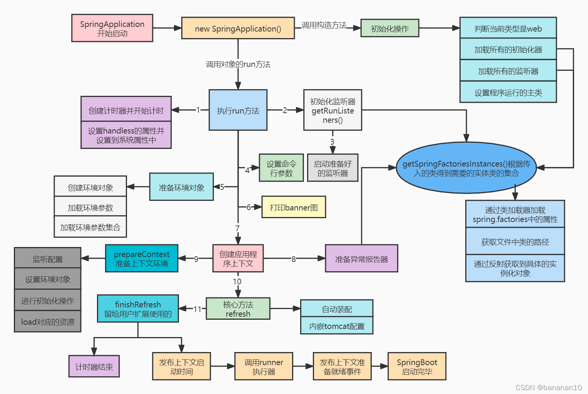
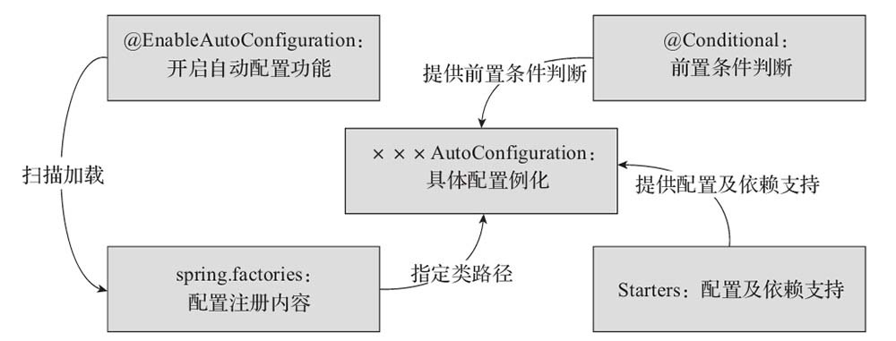

# 🌱 Spring 八股文全景复习笔记（面试版）

# 🚀 一、Spring、Spring MVC、Spring Boot 的深入对比

| 框架            | 核心定位                | 功能核心                                                     | 技术本质                                                 | 是否依赖Spring             |
| --------------- | ----------------------- | ------------------------------------------------------------ | -------------------------------------------------------- | -------------------------- |
| **Spring**      | Java 企业级开发基础框架 | 提供 IOC（控制反转）、DI（依赖注入）、AOP（面向切面）、事务、声明式编程 | 是一个**容器 + 编程模型**                                | ✅ 是底座                   |
| **Spring MVC**  | Web 层框架（表现层）    | 提供请求分发、参数绑定、控制器路由、数据模型和视图解析       | 基于 Servlet API 构建的 MVC 框架，是 Spring 的一个子模块 | ✅ 依赖 Spring Core         |
| **Spring Boot** | 快速构建应用的整合框架  | 自动装配（Auto Configuration）、Starter 模块化、内嵌服务器、统一配置 | 对 Spring 进行二次封装（简化配置 + 启动）                | ✅ 基于 Spring + Spring MVC |

📘 **一句话记忆：**

> Spring 管 Bean → Spring MVC 管请求 → Spring Boot 管项目启动和自动化。二、Spring 框架体系结构

# 🌱 二、从底层结构看三者关系

### 🔹 Spring 是“地基”，MVC 和 Boot 都是它的“建筑层”

```c
Spring Framework
├── spring-core（IOC、DI 容器）
├── spring-beans（Bean 管理）
├── spring-aop（AOP 支持）
├── spring-context（ApplicationContext）
├── spring-tx（事务管理）
│
├── spring-web（Web基础）
└── spring-webmvc（MVC 实现）
       ↑
Spring Boot 整合这些模块
+ 自动配置 + Starter机制 + 内嵌Tomcat
```

> 🌼 MVC 是 Spring 的一个模块，而 Boot 是对整个 Spring 体系的增强和封装。

# 🧩 三、Spring MVC 请求处理流程（非常高频的追问）

**重点理解 DispatcherServlet 工作流程：**

```c
用户请求 → DispatcherServlet（中央调度器）
   ↓
HandlerMapping（请求映射）
   ↓
HandlerAdapter（适配器）
   ↓
Controller（业务逻辑）
   ↓
ViewResolver（视图解析）
   ↓
响应返回（渲染视图/JSON）
```

### 💡 各组件作用简表：

| 组件                | 作用                                             |
| ------------------- | ------------------------------------------------ |
| `DispatcherServlet` | 前端控制器，接收所有请求，统一调度               |
| `HandlerMapping`    | 根据 URL 找到对应的处理器（Controller + 方法）   |
| `HandlerAdapter`    | 执行目标方法，完成参数解析与调用                 |
| `Controller`        | 执行业务逻辑，返回 ModelAndView 或 ResponseBody  |
| `ViewResolver`      | 将逻辑视图名解析为具体视图（JSP/Thymeleaf/JSON） |
| `View`              | 渲染视图（最终输出响应）                         |

📘 **一句话总结 MVC 工作机制：**

> MVC = 前端控制器统一调度 + 映射分发 + 视图解析。

# ⚙️ 四、Spring Boot 的核心原理（重点面试题）

Spring Boot ≠ 新框架，它是 Spring 的“自动化工具集”。

### 🔹 1. 自动装配（Auto Configuration）

- 基于 `@EnableAutoConfiguration` + `spring.factories` 机制；
- 通过类路径扫描（ClassPath）和条件注解（如 `@ConditionalOnClass`）自动加载配置；
- 自动创建需要的 Bean，无需手动配置 XML。

```
@SpringBootApplication
= @SpringBootConfiguration
+ @EnableAutoConfiguration
+ @ComponentScan
```

**流程：**
 1️⃣ 启动 `SpringApplication.run()`
 2️⃣ 加载 `META-INF/spring.factories` → 自动装配类
 3️⃣ 创建 `ApplicationContext` 容器
 4️⃣ 注册 Bean / 启动内嵌 Tomcat
 5️⃣ 调用 `CommandLineRunner` 执行收尾逻辑

# 面试官常问：为什么 Spring Boot 可以零配置？

标准回答：

> Spring Boot 通过 `@EnableAutoConfiguration` 启动自动装配机制，扫描 classpath，读取 `spring.factories` 列表，根据条件注解（如 `@ConditionalOnClass` `@ConditionalOnMissingBean`）决定是否创建特定 Bean。最终将所有满足条件的自动配置类加载进 IoC 容器，实现“约定优于配置”。

### 🔹 2. Starter 模块化机制

**例子：**

- `spring-boot-starter-web`
   → 自动引入 Spring MVC、Tomcat、Jackson；
- `spring-boot-starter-data-jpa`
   → 自动配置 Hibernate + 数据源；
- `spring-boot-starter-security`
   → 自动配置 Spring Security。

📘 **优势：**

> “用哪个引哪个，不用手写配置。”
>
> # 一句话总结给你（面试黄金回答）
>
> > **Spring Boot Starter 是一组“功能依赖 + 自动配置”的预打包模块。
> >  开发者只需引入一个 starter，Spring Boot 会根据 classpath 和条件注解自动创建对应组件，实现开箱即用，不需要手动配置。**

### 🔹 3. 内嵌 Web 容器

Spring Boot 默认使用内嵌的 Tomcat（也支持 Jetty/Undertow）：

- 不需要额外部署 WAR；
- 可直接打包为 JAR；
- 命令行执行 `java -jar app.jar` 即可启动服务。

> 这正是微服务时代 “轻量部署” 的关键。

# 🧠 五、应用场景与演进关系

| 阶段                | 技术                   | 时代背景           | 主要目标                 |
| ------------------- | ---------------------- | ------------------ | ------------------------ |
| Spring（2003）      | IOC + AOP + 声明式事务 | EJB 复杂、臃肿     | 简化企业级开发           |
| Spring MVC（2006）  | Web 层 MVC 模型        | JSP + Servlet 时代 | 解耦控制与展示层         |
| Spring Boot（2014） | 一体化框架             | 云原生 / 微服务    | 自动化、轻部署、开箱即用 |

📘 **演进方向总结：**

> Spring → 解耦
>  Spring MVC → 架构化 Web
>  Spring Boot → 自动化与微服务。

------

# 🌱 Spring 框架体系结构（细化版）

Spring 并不是一个单一框架，而是一个**模块化的框架体系（Modular Architecture）**，
 核心目标是通过松耦合的方式整合企业级开发的各个层面。

整体结构可以分为五层：

```
Core Container（核心容器层）
↓
AOP & Instrumentation（面向切面编程）
↓
Data Access / Integration（数据访问与整合）
↓
Web Layer（Web 层）
↓
Test（测试支持层）
```

## 🧩 1️⃣ 核心容器（Core Container）

| 模块                         | 主要功能                                                     | 面试常问                                                |
| ---------------------------- | ------------------------------------------------------------ | ------------------------------------------------------- |
| **spring-core**              | 提供 IOC 和 DI 的底层实现；定义 BeanFactory、Resource 抽象； | IOC 的底层实现类是什么？（DefaultListableBeanFactory）  |
| **spring-beans**             | 负责 Bean 的定义、加载、依赖注入与生命周期管理；             | Bean 是如何实例化与注入的？                             |
| **spring-context**           | 提供 ApplicationContext 上下文容器，支持国际化、事件机制、资源加载等； | ApplicationContext 和 BeanFactory 的区别？              |
| **spring-expression (SpEL)** | Spring 表达式语言，用于在运行时动态访问 Bean 属性、调用方法、计算表达式； | SpEL 的应用场景有哪些？（配置文件占位符、@Value注入等） |

📘 **模块关系说明：**

- `spring-beans` 建立在 `spring-core` 之上；
- `spring-context` 建立在 `spring-beans` 之上；
- `spring-expression` 通常被 `context` 间接使用；
- 三者共同构成了 **Spring IOC 容器的基础骨架**。

> 🌿 举例：
>
> - `ApplicationContext` 来自 spring-context；
> - 其底层依赖 `DefaultListableBeanFactory`（spring-beans）；
> - BeanFactory 又依赖 Resource 抽象（spring-core）。

## 🎯 2️⃣ AOP 与 Aspects 模块

| 模块                  | 作用                                                         | 面试延展                       |
| --------------------- | ------------------------------------------------------------ | ------------------------------ |
| **spring-aop**        | 提供基于代理的 AOP 实现，支持方法拦截、环绕增强等；底层使用 JDK Proxy 或 CGLIB； | Spring AOP 与 AspectJ 的区别？ |
| **spring-aspects**    | 集成 AspectJ，实现基于注解的切面（@Aspect、@Before、@After、@Around）； | @Aspect 是如何被织入的？       |
| **spring-instrument** | 提供类加载时增强（Instrumentation），支持代理和织入；        | Instrumentation 的底层原理？   |

📘 **模块协作逻辑：**

- `spring-aop` 实现了 AOP 的代理机制；
- `spring-aspects` 提供了声明式切面编程能力；
- `spring-instrument` 支持类加载时的动态增强。

> 🌾 举例：
>  当你写 `@Transactional` 时，其实是 `spring-aop` + `spring-tx` + `spring-aspects` 共同作用的结果。

## 🧱 3️⃣ 数据访问 / 集成（Data Access / Integration）

| 模块            | 功能                                                        | 面试高频问题                    |
| --------------- | ----------------------------------------------------------- | ------------------------------- |
| **spring-jdbc** | 封装原生 JDBC 操作，提供 JdbcTemplate 简化开发；            | JdbcTemplate 如何避免资源泄露？ |
| **spring-orm**  | 整合 ORM 框架（如 Hibernate、JPA、MyBatis），统一事务管理； | Spring 如何整合 Hibernate/JPA？ |
| **spring-tx**   | 提供声明式事务管理，基于 AOP 实现；                         | Spring 事务传播机制？           |
| **spring-oxm**  | 对象与 XML 映射支持（JAXB、XStream 等）；                   | OXM 的用途？                    |
| **spring-jms**  | Java 消息服务封装（支持 ActiveMQ、RabbitMQ 等消息中间件）； | JMS 与 Spring 消息机制的关系？  |

📘 **模块协作关系：**

- `spring-tx` 基于 AOP，对 `jdbc`、`orm` 的数据操作统一管理；
- `spring-orm` 内部通过 `PlatformTransactionManager` 与事务模块协作；
- `spring-jms` 用于异步通信场景；
- 这些模块共同构成了 Spring 的 **数据访问层（DAO 层）生态**。

> 🌿 举例：
>
> ```
> @Transactional
> public void updateAccount() {
>     jdbcTemplate.update("UPDATE account SET balance = balance - 100 WHERE id=1");
> }
> ```
>
> → `spring-tx` 负责事务切面，
>  → `spring-jdbc` 负责数据库操作，
>  → `spring-aop` 负责代理增强。

## 🌐 4️⃣ Web 层模块（Web Layer）

| 模块                 | 功能                                                         | 面试考点                           |
| -------------------- | ------------------------------------------------------------ | ---------------------------------- |
| **spring-web**       | 提供 Web 基础功能：文件上传、多部分解析、Servlet 监听器、IOC 容器初始化 | DispatcherServlet 是如何初始化的？ |
| **spring-webmvc**    | 提供完整的 MVC 框架，实现请求分发、控制器、视图解析、数据绑定 | MVC 流程、HandlerMapping 作用？    |
| **spring-websocket** | 支持 WebSocket 协议，实现实时通信（消息推送）                | SockJS 和 STOMP 的区别？           |

📘 **内部关系：**

- `spring-webmvc` 依赖 `spring-web`；
- `spring-web` 提供基础 Servlet 支持；
- `spring-websocket` 可独立使用或与 MVC 结合实现消息推送。

> 🌾 举例：
>  `spring-webmvc` 中的核心类是 `DispatcherServlet`，
>  它依赖 `HandlerMapping`、`HandlerAdapter`、`ViewResolver` 等组件，负责 MVC 整体流程。


# 🧠 一、IOC 与 DI 的深度理解

## 1️⃣ IOC 是思想，DI 是手段

| 概念    | 全称                 | 核心思想                                   | 比喻                                 |
| ------- | -------------------- | ------------------------------------------ | ------------------------------------ |
| **IOC** | Inversion of Control | “控制权反转”——对象创建与依赖关系由容器负责 | 程序员从“自己做饭”变成“点外卖”       |
| **DI**  | Dependency Injection | “依赖注入”——容器将依赖自动注入到对象中     | 外卖小哥（容器）帮你自动送餐（依赖） |

> 👉 IOC 是 “谁来控制”，DI 是 “如何注入”。

📘 **面试口诀：**

> 以前是我找依赖（主动 new），现在是依赖找我（容器注入）。

## 2️⃣ Spring IOC 的核心机制

Spring IOC 容器实际上是一个 **Bean 工厂 + Bean 生命周期管理器**。

其核心接口是：

- `BeanFactory`：最基础的容器，懒加载，按需创建；
- `ApplicationContext`：增强版容器，启动时预加载所有单例 Bean。

🧩 **常见实现类：**

- `ClassPathXmlApplicationContext`（基于 XML）；
- `AnnotationConfigApplicationContext`（基于注解）；
- `WebApplicationContext`（Web 容器版本）。

# ⚙️ 二、IOC 容器启动与 Bean 创建流程（源码级思维）

完整的 IOC 启动流程可概括为：

```
加载配置 → 注册 BeanDefinition → 实例化 Bean → 属性注入 → 初始化 → 使用 → 销毁
```

下面是更细的分解版本👇：

| 阶段         | 主要类/接口                                                 | 说明                                             |
| ------------ | ----------------------------------------------------------- | ------------------------------------------------ |
| 1️⃣ 加载配置   | `BeanDefinitionReader`                                      | 解析 XML、注解或 JavaConfig，生成 BeanDefinition |
| 2️⃣ 注册定义   | `BeanDefinitionRegistry`                                    | 将 BeanDefinition 注册到容器（Map 结构）         |
| 3️⃣ 实例化     | `InstantiationStrategy`                                     | 反射或 CGLIB 创建对象实例                        |
| 4️⃣ 属性注入   | `populateBean()`                                            | 进行依赖注入（自动装配/显式注入）                |
| 5️⃣ Aware 回调 | `BeanNameAware`、`ApplicationContextAware`                  | 注入容器上下文环境信息                           |
| 6️⃣ 初始化前   | `BeanPostProcessor#beforeInit()`                            | 扩展增强点（如 @Autowired、@Resource）           |
| 7️⃣ 初始化     | `InitializingBean#afterPropertiesSet()` 或 `@PostConstruct` | 业务初始化逻辑                                   |
| 8️⃣ 初始化后   | `BeanPostProcessor#afterInit()`                             | AOP 在此织入代理逻辑                             |
| 9️⃣ 使用中     | Bean 可被容器获取与调用                                     |                                                  |
| 🔟 销毁       | `DisposableBean#destroy()` 或 `@PreDestroy`                 | 容器关闭时清理资源                               |

📘 **一句话记忆：**

> Bean 从定义（Definition）到注册（Register），再到实例化（Instantiate），最后到销毁（Destroy），Spring 全程接管生命周期。

------

# 🧩 三、依赖注入（DI）方式详解

| 注入方式        | 示例                                               | 优点                       | 缺点                   |
| --------------- | -------------------------------------------------- | -------------------------- | ---------------------- |
| **构造器注入**  | `@Autowired public UserService(OrderDao dao)`      | 依赖不可变，线程安全，推荐 | 参数过多时不易维护     |
| **Setter 注入** | `@Autowired public void setOrderDao(OrderDao dao)` | 灵活，可在运行期更改       | 依赖不明确，不利于测试 |
| **字段注入**    | `@Autowired private OrderDao dao;`                 | 简洁                       | 不利于单元测试         |
| **接口注入**    | `implements Aware` 接口                            | 框架内部使用               | 几乎不用在业务层       |

📘 **推荐实践：**

> 👉 日常项目中建议优先使用 **构造器注入**（更利于测试与不可变性）。

------

# 🔍 四、Bean 作用域与生命周期

## 1️⃣ 作用域（Scope）

| Scope           | 含义                           | 特点                 |
| --------------- | ------------------------------ | -------------------- |
| `singleton`     | 默认单例，整个容器只有一个实例 | 线程安全需开发者控制 |
| `prototype`     | 每次注入都创建新实例           | 不受容器销毁管理     |
| `request`       | 每个 HTTP 请求创建一个实例     | Web 环境专用         |
| `session`       | 每个 Session 创建一个实例      | Web 环境专用         |
| `globalSession` | Portlet 全局共享               | 仅 Portlet 环境有效  |

> 🌿 常考点：Spring 单例是容器级单例，不是 JVM 级单例。

------

## 2️⃣ 生命周期流程图（ApplicationContext 环境）

```
BeanDefinition → 实例化 → 依赖注入 → Aware 回调 → BeanPostProcessor → 初始化 → Bean 可用 → 销毁
```

🌟 **与之对应的接口：**

| 阶段     | 回调接口                                | 注解替代         |
| -------- | --------------------------------------- | ---------------- |
| 初始化前 | `BeanPostProcessor#beforeInit()`        | —                |
| 初始化   | `InitializingBean#afterPropertiesSet()` | `@PostConstruct` |
| 初始化后 | `BeanPostProcessor#afterInit()`         | —                |
| 销毁     | `DisposableBean#destroy()`              | `@PreDestroy`    |

> AOP 的代理逻辑在 **初始化后（afterInit）** 织入。

------

# 🔄 五、循环依赖与三级缓存（高频加分题）

**问题：**
 若 A 依赖 B，B 又依赖 A，会不会出问题？

**答案：**

- 构造器循环依赖：❌ 无法解决，抛出 `BeanCurrentlyInCreationException`
- Setter 注入循环依赖：✅ 可以解决

**Spring 解决原理：三级缓存机制**

| 缓存     | 类型                    | 存放内容                                    |
| -------- | ----------------------- | ------------------------------------------- |
| 一级缓存 | `singletonObjects`      | 完全初始化的单例 Bean                       |
| 二级缓存 | `earlySingletonObjects` | 早期曝光的半成品 Bean（无 AOP 代理）        |
| 三级缓存 | `singletonFactories`    | 对象工厂（ObjectFactory），延迟暴露早期引用 |

📘 **核心机制：**

> A 创建时将自己暴露在三级缓存中，B 获取到 A 的早期引用后可完成依赖注入，从而打破死循环。

------

# 🔧 六、高频追问与标准回答

| 问题                                     | 面试官意图       | 高分回答要点                                          |
| ---------------------------------------- | ---------------- | ----------------------------------------------------- |
| 什么是 IOC？                             | 概念清晰         | 控制权反转，由容器负责对象创建与依赖关系维护          |
| IOC 和 DI 有什么关系？                   | 抽象 vs 实现     | IOC 是思想，DI 是 IOC 的实现方式                      |
| Bean 生命周期有哪些阶段？                | 理解容器机制     | 实例化 → 注入 → Aware → 初始化 → 使用 → 销毁          |
| BeanFactory 与 ApplicationContext 区别？ | 源码级理解       | 前者懒加载，后者预加载；后者支持国际化、AOP、事件机制 |
| Spring 如何解决循环依赖？                | 考察源码阅读能力 | 通过三级缓存提前暴露早期 Bean 引用                    |
| 为什么推荐构造器注入？                   | 工程实践意识     | 不可变性强，利于单元测试和线程安全                    |

------

1️⃣ **AOP 的设计动机与价值（为什么要有它）**
 2️⃣ **代理机制与源码层原理（AOP 底层流程）**
 3️⃣ **高频追问与答题策略（实战 + 原理型回答）**

------

# 🌿 一、AOP 设计动机与核心价值

### 🔍 为什么需要 AOP？

在大型系统中，往往存在一类**“横切逻辑”**：

- 日志记录（Logging）
- 权限控制（Security）
- 缓存管理（Caching）
- 事务控制（Transaction）
- 性能监控（Profiling）

这些逻辑不是核心业务的一部分，却**横跨多个模块**，如果写在业务代码里，会导致：

- 重复代码多
- 耦合度高，难以维护
- 改动风险大（改一处可能影响多处）

AOP 的目标就是 **“横向切入 + 纵向解耦”**：

📘 **一句话总结：**

> 把通用逻辑抽取出来，通过切面在运行时动态织入，不破坏原始业务逻辑。

------

# 🧩 二、AOP 核心概念再进阶（高频细问）

| 概念                    | 说明                                             | 面试高频追问                                          |
| ----------------------- | ------------------------------------------------ | ----------------------------------------------------- |
| **JoinPoint（连接点）** | 程序执行中的一个点（方法调用、异常抛出等）       | Spring AOP 支持哪些类型的 JoinPoint？（只支持方法级） |
| **Pointcut（切点）**    | 定义哪些 JoinPoint 需要增强（匹配规则）          | 常用表达式写法？                                      |
| **Advice（通知）**      | 在切点执行前后添加的增强逻辑                     | 五种通知类型？                                        |
| **Aspect（切面）**      | Pointcut + Advice 的组合，定义一个完整的切面逻辑 | 如何定义多个通知在一个切面里？                        |
| **Weaving（织入）**     | 将切面应用到目标对象的过程                       | 编译期 / 加载期 / 运行期织入区别？                    |
| **Proxy（代理对象）**   | AOP 实际运行时生成的对象                         | JDK Proxy 与 CGLIB 区别？                             |
| **Target（目标对象）**  | 被代理的原始对象                                 | 代理模式底层原理？                                    |

------

# ⚙️ 三、AOP 的运行机制与代理原理（高频源码考点）

Spring AOP 是一种 **运行时代理（Runtime Proxy）机制**。
 底层依赖两种动态代理实现：

| 实现方式           | 依赖包                            | 特点                           | 使用条件           |
| ------------------ | --------------------------------- | ------------------------------ | ------------------ |
| **JDK 动态代理**   | `java.lang.reflect.Proxy`         | 基于接口的代理，效率高         | 目标类必须实现接口 |
| **CGLIB 动态代理** | `org.springframework.cglib.proxy` | 基于继承生成子类，覆盖父类方法 | 目标类无接口时使用 |
| **ASM 字节码增强** | CGLIB 底层实现                    | 动态修改字节码生成代理类       | 不直接使用         |

📘 **Spring 默认策略：**

> 若目标类实现接口 → 使用 JDK 动态代理；
>  否则使用 CGLIB；
>  可通过 `spring.aop.proxy-target-class=true` 强制使用 CGLIB。

------

## 🧠 AOP 执行流程（源码层逻辑）

以 `@Transactional` 或 `@Around` 为例👇：

```
1️⃣ 容器启动阶段
   → BeanPostProcessor 检测到 @Aspect
   → 注册切面信息（Pointcut + Advice）

2️⃣ Bean 初始化阶段
   → AbstractAutoProxyCreator 扫描 Bean
   → 若匹配 Pointcut，则创建代理对象 ProxyBean

3️⃣ 方法调用阶段
   → 调用代理对象 method()
   → 代理拦截器链 (InterceptorChain) 触发
   → 依次执行 Before → Proceed → AfterReturning / AfterThrowing
```

📘 **核心类：**

| 类                           | 作用                     |
| ---------------------------- | ------------------------ |
| `AbstractAutoProxyCreator`   | Bean 初始化时创建代理    |
| `ProxyFactory`               | 管理代理创建逻辑         |
| `AdvisedSupport`             | 保存切面、通知等配置     |
| `MethodInterceptor`          | 执行增强逻辑             |
| `ReflectiveMethodInvocation` | 调用目标方法，维护调用链 |

------

# 🔄 四、AOP 通知执行顺序（环绕核心）

假设你定义了所有类型的通知：

```c
@Before("execution(* com.demo..*(..))")
@Around("execution(* com.demo..*(..))")
@AfterReturning("execution(* com.demo..*(..))")
@AfterThrowing("execution(* com.demo..*(..))")
@After("execution(* com.demo..*(..))")
```

执行顺序如下：

```c
Around (前)
  ↓
Before
  ↓
目标方法执行
  ↓
Around (后)
  ↓
AfterReturning 或 AfterThrowing
  ↓
After（无论是否异常都会执行）
```

📘 **注意：**

> `@Around` 通知可通过 `ProceedingJoinPoint.proceed()` 手动控制执行顺序。

------

# 🧩 五、AOP 典型使用场景（项目级答题）

| 场景         | 作用                       | 示例注解            |
| ------------ | -------------------------- | ------------------- |
| **日志记录** | 打印方法入参、耗时、返回值 | 自定义 `@Log`       |
| **事务管理** | 确保业务操作一致性         | `@Transactional`    |
| **权限校验** | 拦截请求判断权限           | 自定义 `@AuthCheck` |
| **性能监控** | 打点统计接口耗时           | AOP + Prometheus    |
| **缓存切面** | 方法级缓存                 | `@Cacheable`        |

📘 **项目中典型应用：**

```java
@Aspect
@Component
public class LogAspect {
    @Pointcut("execution(* com.demo.service.*.*(..))")
    public void serviceMethods(){}

    @Around("serviceMethods()")
    public Object log(ProceedingJoinPoint joinPoint) throws Throwable {
        long start = System.currentTimeMillis();
        Object result = joinPoint.proceed();
        System.out.println("耗时：" + (System.currentTimeMillis() - start) + "ms");
        return result;
    }
}
```

------

# 🧩 六、Spring AOP vs AspectJ（追问陷阱）

| 对比项       | Spring AOP             | AspectJ                     |
| ------------ | ---------------------- | --------------------------- |
| **织入时机** | 运行时（动态代理）     | 编译期 / 类加载期           |
| **实现方式** | 代理模式               | 静态字节码增强              |
| **性能**     | 稍低（运行时创建代理） | 高（编译期增强）            |
| **支持范围** | 仅支持方法级 JoinPoint | 支持构造器、字段、静态块    |
| **配置难度** | 简单（注解即可）       | 较复杂（需使用 ajc 编译器） |

📘 **面试高分点：**

> Spring AOP 属于运行时增强（代理模式），AspectJ 属于编译期增强（字节码修改）。

------

# 🧠 七、面试高频问答总结

| 问题                          | 高分回答要点                                                 |
| ----------------------------- | ------------------------------------------------------------ |
| AOP 的核心思想是什么？        | 横向抽取重复逻辑，实现关注点分离                             |
| Spring AOP 是如何实现的？     | 基于动态代理机制（JDK Proxy / CGLIB）                        |
| @Transactional 是如何实现的？ | 通过 AOP 切面在方法执行前后添加事务控制逻辑                  |
| JDK 动态代理和 CGLIB 区别？   | 前者基于接口，后者基于继承；Spring 默认使用 JDK              |
| AOP 的执行顺序？              | Around → Before → 方法执行 → AfterReturning/Throwing → After |
| Spring AOP 和 AspectJ 区别？  | 前者运行时代理，后者编译期增强                               |

------

# 🏭 五、BeanFactory vs FactoryBean（深度理解版）

## 一、概念区分

| 对比项       | **BeanFactory**                                    | **FactoryBean**                                              |
| ------------ | -------------------------------------------------- | ------------------------------------------------------------ |
| **定义**     | Spring 最核心的 IOC 容器接口                       | 一种特殊的 Bean，用于创建复杂 Bean                           |
| **类型**     | 接口（顶级容器）                                   | 接口（由开发者或框架实现）                                   |
| **角色**     | 负责管理和装配所有 Bean                            | 由 BeanFactory 管理的“Bean 工厂”                             |
| **核心方法** | `getBean(name)` 获取 Bean 实例                     | `getObject()` 返回目标对象                                   |
| **实例来源** | 从 BeanDefinition 创建                             | 自定义 `getObject()` 逻辑创建                                |
| **获取自身** | 无                                                 | 使用 `&beanName` 获取 FactoryBean 本身                       |
| **常见实现** | `DefaultListableBeanFactory`、`ApplicationContext` | `ProxyFactoryBean`、`SqlSessionFactoryBean`、`LocalSessionFactoryBean` |

📘 **一句话理解：**

> `BeanFactory` 是容器，**它管理 Bean 的生命周期**；
>  `FactoryBean` 是 Bean，**它自己能生产出别的 Bean。**

------

## 二、BeanFactory（IOC 容器的核心接口）

**作用：**

- 是 Spring IOC 的根接口；
- 负责**创建、装配、管理、销毁 Bean**；
- 提供**依赖查找、作用域管理、延迟加载**等核心功能。

🧩 **主要方法：**

```
Object getBean(String name);
<T> T getBean(Class<T> requiredType);
boolean containsBean(String name);
boolean isSingleton(String name);
Class<?> getType(String name);
```

📘 **常见实现类：**

| 实现类                       | 特点                                             |
| ---------------------------- | ------------------------------------------------ |
| `DefaultListableBeanFactory` | 最常用的标准实现，支持 BeanDefinition 注册与解析 |
| `XmlBeanFactory`             | 已废弃，早期基于 XML 的实现                      |
| `ApplicationContext`         | 高级封装，支持国际化、事件发布、AOP 集成         |

------

## 三、FactoryBean（“可生产 Bean 的 Bean”）

Spring 中的 Bean 默认是通过反射实例化的：

```
<bean id="userService" class="com.demo.UserService" />
```

但当对象创建非常复杂（如连接池、动态代理、整合框架），就可以使用 **FactoryBean**：

```java
public class MyFactoryBean implements FactoryBean<MyService> {
    @Override
    public MyService getObject() throws Exception {
        return new MyServiceImpl(); // 自定义创建逻辑
    }

    @Override
    public Class<?> getObjectType() {
        return MyService.class;
    }

    @Override
    public boolean isSingleton() {
        return true;
    }
}
```

配置方式：

```
<bean id="myService" class="com.demo.MyFactoryBean"/>
```

- 直接 `getBean("myService")` → 返回的是 **MyServiceImpl**
- 使用 `getBean("&myService")` → 返回的是 **MyFactoryBean 本身**

📘 **核心逻辑：**

> `FactoryBean` 是一种“代理 Bean 定义的中间层”，
>  它隐藏了对象创建的复杂性，让 Spring 通过 `getObject()` 间接获得实例。

------

## 四、常见的 FactoryBean 实现（高频举例）

| 名称                                     | 作用                                       |
| ---------------------------------------- | ------------------------------------------ |
| `ProxyFactoryBean`                       | 用于 AOP 动态代理，生成代理对象            |
| `SqlSessionFactoryBean`                  | MyBatis 集成中用于生成 `SqlSessionFactory` |
| `LocalContainerEntityManagerFactoryBean` | JPA 集成中用于创建 `EntityManagerFactory`  |
| `ServiceLocatorFactoryBean`              | 动态创建服务定位器                         |
| `TransactionProxyFactoryBean`            | 用于声明式事务代理                         |

📘 **总结：**

> 框架整合类 Bean（如 MyBatis、Hibernate、JPA）几乎都依赖 FactoryBean。

------

## 五、源码原理（面试进阶）

当我们从容器获取 Bean 时，Spring 内部会执行：

```
Object bean = getBean("myFactoryBean");
```

底层逻辑如下（简化版）：

```Java
Object sharedInstance = getSingleton(beanName);
if (sharedInstance instanceof FactoryBean) {
    // 重点：调用 getObject() 获取真正的目标对象
    object = ((FactoryBean<?>) sharedInstance).getObject();
} else {
    object = sharedInstance;
}
```

📘 **关键点：**

- Spring 在 `doGetBean()` 方法中判断是否是 `FactoryBean`；
- 若是，则调用 `getObject()` 获取目标实例；
- 若希望获取 FactoryBean 自身，则加上 `&` 前缀。

------

## 六、面试高频追问题与高分答法

| 问题                                           | 考点           | 高分回答                                                     |
| ---------------------------------------------- | -------------- | ------------------------------------------------------------ |
| **1️⃣ BeanFactory 和 ApplicationContext 区别？** | IOC 层次       | 前者是底层接口，懒加载；后者是高级容器，预加载并整合 AOP、国际化、事件等功能。 |
| **2️⃣ BeanFactory 与 FactoryBean 区别？**        | 容器 vs 生产者 | BeanFactory 是工厂；FactoryBean 是被 Spring 管理的特殊 Bean，用来定制复杂对象创建逻辑。 |
| **3️⃣ 为什么需要 FactoryBean？**                 | 场景意识       | 适用于第三方整合（如 MyBatis、AOP），封装复杂对象构建过程，简化配置。 |
| **4️⃣ 怎么获取 FactoryBean 自身？**              | 实践经验       | 使用 `&beanName` 前缀，如 `getBean("&myFactoryBean")`。      |
| **5️⃣ FactoryBean 的 getObject() 何时调用？**    | 生命周期       | 在容器实例化阶段，当该 Bean 被首次 getBean 时触发执行。      |

------

## 七、类比总结（让面试官印象深刻）

| 类比                                    | 含义                       |
| --------------------------------------- | -------------------------- |
| `BeanFactory` 像是“超级工厂”            | 负责所有 Bean 的管理与调度 |
| `FactoryBean` 像是“代工厂”              | 专门生产某一种特殊 Bean    |
| `ApplicationContext` 像是“智能工厂总部” | 统一协调并整合全部功能模块 |

📘 **一句话记忆：**

> `BeanFactory` 管 Bean，`FactoryBean` 造 Bean。


## 六、Spring 循环依赖与三级缓存机制

### 💡 循环依赖定义

多个 Bean 互相持有引用形成闭环，例如：

```
A → B → C → A
```

### 🧩 解决方案（Spring 单例属性注入可解决）

Spring 通过 **三级缓存** 提前暴露 Bean 引用：

| 缓存级别                         | 内容                                  |
| -------------------------------- | ------------------------------------- |
| 一级缓存 `singletonObjects`      | 完全初始化好的单例                    |
| 二级缓存 `earlySingletonObjects` | 提前暴露的早期单例（已创建未初始化）  |
| 三级缓存 `singletonFactories`    | 提供 ObjectFactory 创建早期Bean的工厂 |

**关键点：**

- 构造器循环依赖无法解决；
- 属性注入循环依赖可通过提前暴露引用解决。

## 七、Spring 事务机制

### 🧩 事务传播行为（Propagation）

| 传播属性        | 含义                                 |
| --------------- | ------------------------------------ |
| `REQUIRED`      | 默认，若存在事务则加入，否则新建事务 |
| `REQUIRES_NEW`  | 新建事务，挂起原事务                 |
| `SUPPORTS`      | 有事务则加入，否则非事务执行         |
| `MANDATORY`     | 必须在事务中执行，否则抛异常         |
| `NOT_SUPPORTED` | 挂起当前事务，非事务执行             |
| `NEVER`         | 不允许在事务中执行，否则抛异常       |
| `NESTED`        | 内部嵌套事务，可独立回滚             |

🧠 **三大问题：**

- **脏读（Dirty Read）**：读到未提交数据；
- **不可重复读（Non-Repeatable Read）**：多次读结果不一致；
- **幻读（Phantom Read）**：数据条数变动。

### ⚙️ 事务实现原理

Spring 基于 **AOP 代理 + ThreadLocal + Connection 持有** 实现事务管理。

- 开启事务：创建代理连接 → 设置自动提交 false；
- 执行方法：记录回滚点；
- 正常结束：提交事务；
- 异常抛出：回滚；
- finally：释放连接。

## 八、Spring 常用设计模式总结

| 设计模式       | Spring 应用场景                 |
| -------------- | ------------------------------- |
| **工厂模式**   | BeanFactory、ApplicationContext |
| **单例模式**   | Bean 默认作用域 singleton       |
| **代理模式**   | AOP 动态代理、事务              |
| **模板方法**   | JdbcTemplate、RestTemplate      |
| **观察者模式** | ApplicationEvent 事件机制       |
| **适配器模式** | HandlerAdapter、AdvisorAdapter  |
| **装饰器模式** | BeanWrapper、FactoryBean        |

## 九、Spring 事务面试速答模板（总结）

**面试官：** 讲一下 Spring 的事务传播机制？

**答：**
 Spring 的事务传播定义了事务方法相互调用时事务边界的行为。
 最常用的是 `REQUIRED`（默认，加入或新建事务），`REQUIRES_NEW`（总是新建事务并挂起原事务），`NESTED`（嵌套事务可独立回滚）。
 事务通过 AOP 拦截器和 ThreadLocal 中的连接绑定实现。

## 🔟 终极总结图（Spring 核心知识树）

```
Spring Framework
├── 核心容器（IOC/DI）
│   ├── BeanFactory / ApplicationContext
│   ├── Bean 生命周期 / 作用域
│   ├── 循环依赖与三级缓存
│
├── AOP（横切关注点）
│   ├── JDK 动态代理 / CGLIB
│   ├── 核心概念：JoinPoint、Advice、Aspect
│
├── 数据访问层
│   ├── JdbcTemplate、事务管理
│
├── Web 层
│   ├── SpringMVC
│   ├── DispatcherServlet → HandlerMapping → Controller → ViewResolver
│
├── Spring Boot
│   ├── 自动装配 @EnableAutoConfiguration
│   ├── 启动器机制 starter
│
└── 高级特性
    ├── FactoryBean、BeanPostProcessor
    ├── ApplicationEvent / @EventListener
    ├── 事务传播与隔离
    └── 常用设计模式
```

# SpringBoot

## Spring Boot Starter有什么用？

Spring Boot Starter的作用是简化和加速项目的配置和依赖管理。

- Spring Boot Starter可以理解为一种预配置的模块，它封装了特定功能的依赖项和配置, ，开发者只需引入相关的Starter依赖，无需手动配置大量的参数和依赖项。
- Starter还管理了相关功能的依赖项，包括其他Starter和第三方库，确保它们能够良好地协同工作，避免版本冲突和依赖问题。
- Spring Boot Starter的设计使得应用可以通过引入不同的Starter来实现模块化的开发。每个Starter都关注一个特定的功能领域，如数据库访问、消息队列、Web开发等。
- 开发者可以创建自定义的Starter，以便在项目中共享和重用特定功能的配置和依赖项。

## SpringBoot的常用注解

```
1. @SpringBootApplication：
用于标识主应用程序类，通常位于项目的顶级包中。这个注解包含了@Configuration、@EnableAutoConfiguration和@ComponentScan。

2. @Controller：
用于标识类作为Spring MVC的Controller。

3. @RestController：
类似于@Controller，但它是专门用于RESTful Web服务的。它包含了@Controller和@ResponseBody。

4. @RequestMapping：
用于将HTTP请求映射到Controller的处理方法。可以用在类级别和方法级别。

5. @Autowired：
用于自动注入Spring容器中的Bean，可以用在构造方法、字段、Setter方法上。

6. @Service：
用于标识类作为服务层的Bean。

7. @Repository：
用于标识类作为数据访问层的Bean，通常用于与数据库交互。

8. @Component：
通用的组件注解，用于标识任何Spring托管的Bean。

9. @Configuration：
用于定义配置类，类中可能包含一些@Bean注解用于定义Bean。

10. @EnableAutoConfiguration：
用于启用Spring Boot的自动配置机制，根据项目的依赖和配置自动配置Spring应用程序。

11. @Value：
用于从属性文件或配置中读取值，将值注入到成员变量中。

12.@Qualifier：
与@Autowired一起使用，指定注入时使用的Bean名称。

13. @ConfigurationProperties：
用于将配置文件中的属性映射到Java Bean。

14. @Profile：
用于定义不同环境下的配置，可以标识在类或方法上。

15. @Async：
用于将方法标记为异步执行。
```

## SpringBoot的启动流程



## Spring Boot自动装配的过程

使用Spring Boot时，我们只需引入对应的Starters，Spring Boot启动时便会自动加载相关依赖，配置相应的初始化参数，以最快捷、简单的形式对第三方软件进行集成，这便是Spring Boot的自动配置功能。Spring Boot实现该运作机制锁涉及的核心部分如下图所示：



整个自动装配的过程是：Spring Boot通过@EnableAutoConfiguration注解开启自动配置，加载spring.factories中注册的各种AutoConfiguration类，当某个AutoConfiguration类满足其注解@Conditional指定的生效条件（Starters提供的依赖、配置或Spring容器中是否存在某个Bean等）时，实例化该AutoConfiguration类中定义的Bean（组件等），并注入Spring容器，就可以完成依赖框架的自动配置。

## SpringBoot如何在启动时设置初始化数据

在实际开发中，我们一般都会在配置文件(application.properties或者application.yml)中配置各个

项目中集成的属性值，来进行各个组件的设置，比如配置端口:server.port=8080，但是在开发中我们

需要配置业务得属性值来添加到springboot容器中，那么这个时候我们应该怎么办呢?

解决方案:

- **实现ApplicationRunner 接口**
- **实现 CommandLineRunner接口**

默认情况下ApplicationRunner比CommandLineRunner 先执行

所有CommandLineRunner/ApplicationRunner的执行时点是在SpringBoot应用的 ApplicationContext完全初始化开始工作之后， callRunners() 可以看出是run方法内部最后一 个调用的方法(可以认为是main方法执行完成之前最后一步)

只要存在于当前SpringBoot应用的ApplicationContext中的任何 CommandLineRunner/ApplicationRunner，都会被加载执行(不管你是手动注册还是自动扫描去 Ioc容器) 使用@Order注解可以设置加载的顺序 一般情况我们只需要使用一个接口来加载初始化数据即可