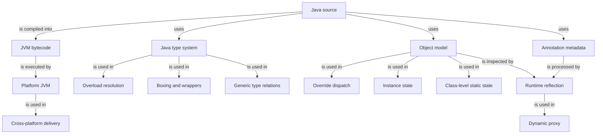

# Knowledge Map

This file is the global cross-topic and cross-chapter knowledge map. Use Mermaid only and keep the network compact and connected. Chapter maps and concept-local diagrams remain canonical inside their notes; do not duplicate them here.

## Rules

- Add a node only when it helps future learning.
- Edges should mean depends on, builds on, is a type of, is part of, is used in, or transfers to.
- Avoid disconnected or decorative nodes.
- Add only relationships that remain useful across topic or chapter boundaries.
