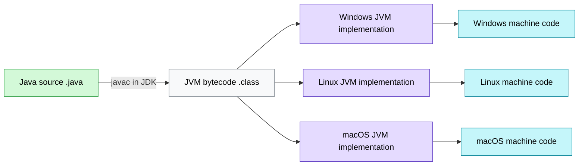
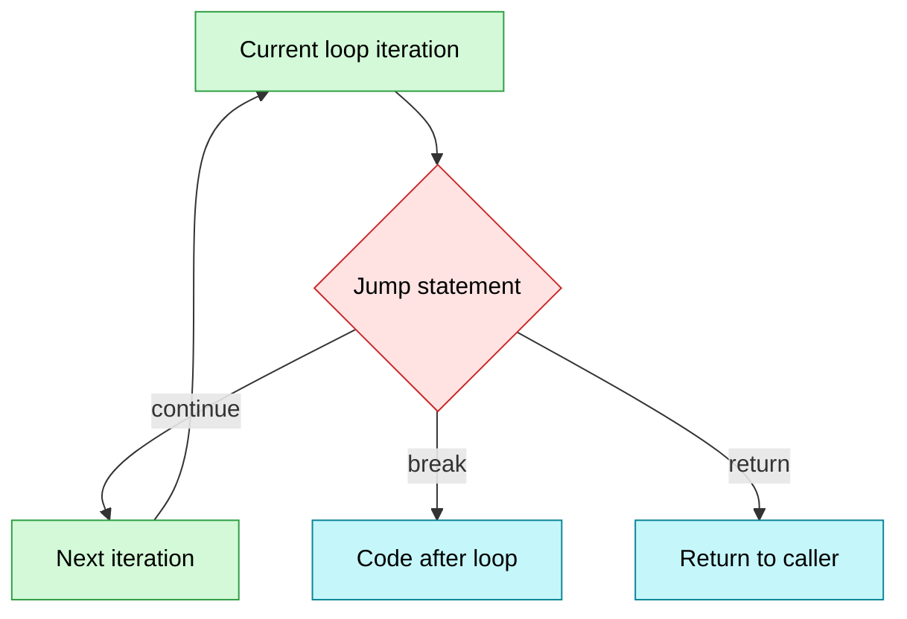
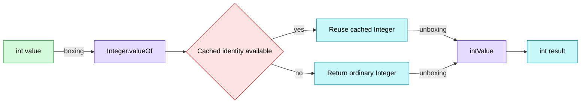
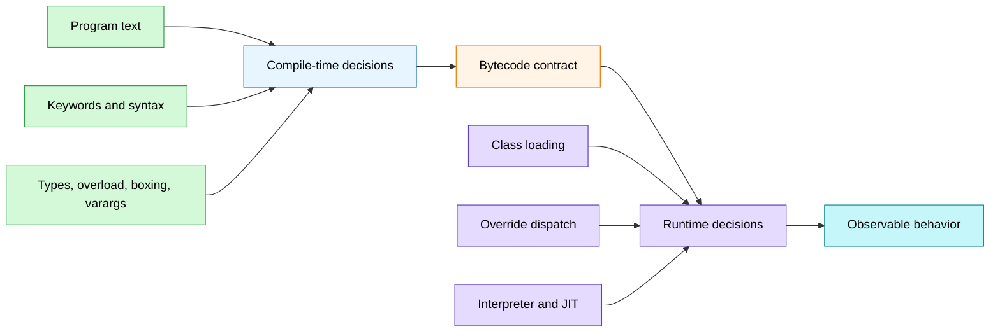
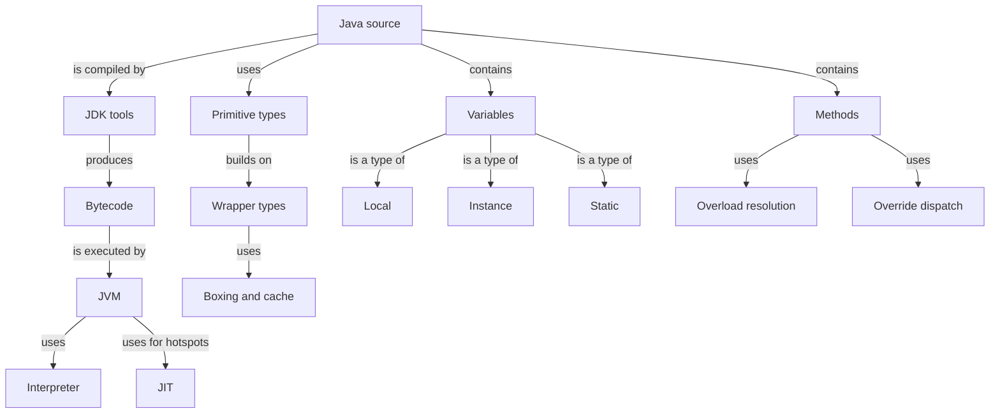

# Java 基础常见面试题（上）Schema 笔记

- Source: `materials/java/basis/java-basic-questions-01.md`
- Source title: `Java基础常见面试题总结(上)`
- Coverage: 基础概念与常识、基本语法、基本数据类型、变量、方法

### 1. Topic Overview

- **What this is about**：把 Java 基础面试题从零散结论整理为可以运行的判断模型：代码如何执行、表达式如何求值、值如何表示、变量归谁所有、方法如何被选择。
- **Why it matters**：面试常把多个边界揉在一起考，例如 `JDK/JRE/JVM`、`==/equals`、静态/实例、重载/重写。只背定义很容易在代码题中失效。
- **Difficulty**：入门到中等。单点术语不难，难点是分清“编译期决定”和“运行期决定”。
- **Prerequisites**：能读简单 Java 类、变量、循环和方法调用即可。
- **Source freshness boundary**：Oracle JDK 的许可、发行和支持策略会变化。本章相关段落适合用来学习“开源、许可、支持、发行版”这几个选择维度，不应把旧版本年份或免费期限当成永久规则。

#### Roadmap

1. 平台与执行：`JDK -> 字节码 -> JVM -> 解释/JIT/AOT`
2. 表达式与控制流：求值顺序、移位、`continue/break/return`
3. 数据表示：基本类型、包装类、装箱缓存、精确数值
4. 变量所有权：局部、实例、静态
5. 方法语义：接收者、重载、重写、可变参数

### 2. Core Concepts

#### Schema 1：从 Java 源码追踪到平台机器码

- **Trigger situation**：解释 Java 为什么跨平台、为什么“编译与解释并存”，或判断 JVM/JRE/JDK/JIT/AOT 分别负责什么。
- **Definition**：Java 先把源码编译成面向 JVM 规范的字节码；不同操作系统上的 JVM 实现再把同一份字节码转换为本机可执行行为。
- **Intuition**：字节码是一份中间交付物。跨平台的不是 JVM 本身，而是字节码；每个平台都要有适配该平台的 JVM。

**核心对象与边界**

| 对象 | 主要职责 | 不要混淆成 |
| --- | --- | --- |
| JVM | 加载、校验并执行 `.class` 字节码 | JDK；HotSpot 也只是 JVM 的一种实现 |
| JRE | 传统语境中的运行环境：JVM + 基础类库 | 开发工具包 |
| JDK | 运行环境 + `javac`、`javadoc`、`jdb`、`javap` 等开发工具 | 单纯的 JVM |
| JIT | 运行时把热点字节码编译成本地机器码 | 源码编译器 `javac` |
| AOT | 程序运行前生成本地机器码 | 一定在所有场景都优于 JIT |

JDK 9 以后，模块系统和 `jlink` 允许按依赖构造自定义运行时；从 JDK 11 起，Oracle 不再单独提供传统 JRE 下载。概念上仍可用“开发工具”和“运行组件”来分层，但不要把早期的套娃图当成所有现代发行版的物理打包方式。

#### Visual Model：同一份字节码为什么能跨操作系统运行？



- **How to read**：左边编译一次得到平台无关字节码；右边换成平台专用 JVM，最终生成或解释为该平台的机器行为。
- **Source anchor**：原文“JVM vs JDK vs JRE”“什么是字节码”“为什么编译与解释并存”。
- **Boundary**：图只画执行交付链，没有展开类加载器、运行时数据区和 GC。

**解释器、JIT 与 AOT**

1. 类加载器加载字节码。
2. 解释器可以立即逐条执行，启动不必等待整段程序编译。
3. JVM 收集运行画像；频繁执行的热点代码可交给 JIT 编译并复用本地机器码。
4. AOT 在运行前编译，通常更重视启动时间和内存；JIT 能利用真实运行画像，通常更有机会获得高峰值性能并自然支持动态行为。

| 维度 | JIT | AOT |
| --- | --- | --- |
| 编译时机 | 运行时 | 运行前 |
| 启动 | 有预热成本 | 通常更快 |
| 优化信息 | 可利用真实运行画像 | 缺少完整运行时画像 |
| 动态特性 | 自然支持 | 反射、动态代理、动态加载等常需声明或适配 |
| 常见取舍 | 长时间运行服务 | 云原生、Serverless、CLI 等启动敏感场景 |

**平台和生态的另外两组分类**

- Java SE 提供语言、核心类库和虚拟机等基础；Java EE（现 Jakarta EE 生态）建立在 Java SE 上，增加企业应用规范。Java ME 面向微型/嵌入式设备，本章只要求知道其定位。
- OpenJDK/Oracle JDK 的选择应看：是否开源、许可条件、支持周期、供应商补丁与工具。原文中的具体商业条款可能过时，实际选型需查对应版本和供应商的当前条款。

**Java 与 C++ 的常见设计差异**

- Java 不向普通代码暴露 C/C++ 式指针运算，通常由 GC 自动管理内存。
- Java 类是单继承，接口可多继承；C++ 类支持多重继承。
- Java 支持方法重载，但不提供用户自定义的通用运算符重载。
- 不要背“C++ 不支持多线程”：C++11 已提供标准线程库。真正的差异应描述为语言/标准库抽象和内存管理模型不同。

**Common mistakes**

- 把字节码说成 CPU 可直接执行的机器码。
- 说“JVM 跨平台”；准确说法是“同一份字节码由不同平台的 JVM 实现执行”。
- 说 Java 是纯编译型或纯解释型；它包含编译到字节码、解释执行和运行时编译。
- 只背 AOT 启动快，却忽略动态特性适配和运行时画像优化。

#### Schema 2：按求值顺序追踪表达式

- **Trigger situation**：遇到 `++/--`、移位、混合表达式，或需要预测变量最终值。
- **Definition**：不要靠口诀猜最终结果；把每个表达式拆成“本次表达式产生的值”和“变量写回后的值”。
- **Intuition**：后缀 `a++` 先产出旧值，再写回新值；前缀 `++a` 先写回新值，再产出新值。

**Example**

```java
int a = 9;
int b = a++;  // b=9, 之后 a=10
int c = ++a;  // a=11, c=11
int d = c--;  // d=11, 之后 c=10
int e = --d;  // d=10, e=10
```

最终：`a=11, b=9, c=10, d=10, e=10`。原文答案中的关键训练点正是区分“表达式结果”和“写回后的变量值”。

**移位模型**

| 运算符 | 空位如何补 | 示例/边界 |
| --- | --- | --- |
| `x << n` | 低位补 0，高位丢弃 | 不溢出时类似乘 `2^n` |
| `x >> n` | 高位补符号位，低位丢弃 | 算术右移，保留正负号 |
| `x >>> n` | 高位补 0，低位丢弃 | 逻辑右移，负数可变成大正数 |

- `byte/short/char` 移位前会进行整型提升，结果按 `int` 运算；移位直接支持的核心结果类型是 `int/long`。
- `int` 的有效移位距离只看低 5 位，相当于对 32 取模；`long` 只看低 6 位，相当于对 64 取模。
- “右移等于除以 `2^n`”只适合作为受限直觉：溢出、丢位，以及负数的舍入方式都会破坏简单等价。
- HashMap 的 `(h = key.hashCode()) ^ (h >>> 16)` 用高位参与低位混合，不是在做普通除法。

**词法层的低成本判断**

- `//`、`/* ... */`、`/** ... */` 分别是单行、多行和文档注释；注释本身不进入执行字节码。好命名优先于解释坏代码的冗长注释。
- 标识符是开发者给类、方法、变量等起的名字；关键字是语法保留词。
- `true`、`false`、`null` 是字面量，不是关键字，但也不能用作标识符。
- `default` 可出现在 `switch` 分支和接口默认方法中；“包级可见”是没有访问修饰符，不是显式写一个 `default` 修饰符。

**Common mistakes**

- 只写出最终变量值，不记录表达式取到的是旧值还是新值。
- 把 `>>` 和 `>>>` 对负数的补位规则混在一起。
- 忽略移位距离被掩码处理，误以为 `int << 32` 一定得到 0。

#### Schema 3：按跳转作用域区分 continue、break、return

- **Trigger situation**：循环中出现提前跳转，需要判断后续哪一段代码还会执行。
- **Definition**：三个关键字的本质差异是“结束的作用域”不同。

| 关键字 | 结束什么 | 下一步 |
| --- | --- | --- |
| `continue` | 当前这一次循环迭代 | 进入下一次条件/更新检查 |
| `break` | 当前循环或 `switch` | 执行该结构之后的语句 |
| `return` | 当前整个方法调用 | 回到调用者，可携带返回值 |

#### Visual Model：三个跳转分别越过哪一道边界？



- **How to read**：从当前循环体出发，`continue` 留在循环内，`break` 越过循环边界，`return` 越过方法边界。
- **Source anchor**：原文“continue、break 和 return 的区别是什么”。
- **Boundary**：未展开带标签的 `break/continue`。

**Common mistakes**

- 把 `continue` 当作终止整个循环。
- 认为循环中的 `return` 只结束循环；它会结束整个方法。

#### Schema 4：按语义选择基本类型、包装类和精确数值类型

- **Trigger situation**：选择字段/泛型/金额类型，判断 `==` 结果，解释装箱性能或浮点误差。
- **Definition**：先判断要的是“直接值、可空对象语义、十进制精确值，还是任意大整数”，再选表示类型。

**8 种基本类型**

| 类别 | 类型 | 固定位宽/说明 |
| --- | --- | --- |
| 整数 | `byte`, `short`, `int`, `long` | 8、16、32、64 位有符号二进制补码 |
| 浮点 | `float`, `double` | 32、64 位 IEEE 754 浮点 |
| 字符 | `char` | 16 位 UTF-16 code unit，不等同于“一个完整 Unicode 字符” |
| 布尔 | `boolean` | 语义值只有 `true/false`；存储位宽不是语言层固定承诺 |

- 字段和数组元素有类型默认值，如整数 `0`、布尔 `false`、引用 `null`；未初始化的局部变量不能读取。
- `long` 字面量常用 `L` 后缀，`float` 字面量需要 `F/f` 后缀。

**基本类型 vs 包装类型**

| 维度 | 基本类型 | 包装类型 |
| --- | --- | --- |
| 泛型 | 不能直接作为类型参数 | 可以，如 `List<Integer>` |
| 空值 | 不能为 `null` | 可以为 `null` |
| 比较 | `==` 比数值 | `==` 比引用身份；值语义通常用 `equals` |
| 成本 | 通常更紧凑 | 有对象/引用及潜在装拆箱成本 |

不要用“基本类型都在栈上、包装对象都在堆上”做判断。变量槽位的位置取决于它是局部变量、字段还是数组元素；对象还可能被 JIT 通过逃逸分析和标量替换优化。语言语义比猜物理地址更稳定。

**装箱、拆箱与缓存**

- `Integer x = 10` 等价于调用 `Integer.valueOf(10)`。
- `int y = x` 等价于调用 `x.intValue()`；若 `x == null`，拆箱会抛出 `NullPointerException`。
- `Byte/Short/Integer/Long` 至少对 `[-128,127]` 的常见装箱值复用对象；`Character` 常见缓存 `[0,127]`，`Boolean` 复用两个实例。`Float/Double` 不使用这种小值缓存。
- `Integer` 的缓存是实现优化，不是值比较协议；整数包装值一律用 `equals` 或拆箱后比较。

```java
Integer a = 40;
Integer b = 40;
System.out.println(a == b);      // 缓存范围内通常为 true
System.out.println(a.equals(b)); // true，表达值语义
```

缓存范围外的 `==` 结果不应成为业务逻辑。`new Integer(40)` 在旧代码中会显式创建不同对象，但该构造方式已经不应在新代码中使用。

#### Visual Model：一次自动装箱隐藏了什么调用？



- **How to read**：装箱不是语法魔法，而是方法调用；缓存只影响对象身份，拆箱最终取回基本值。
- **Source anchor**：原文“包装类型的缓存机制”“自动装箱与拆箱”。
- **Boundary**：图不承诺缓存范围外一定创建新对象。

**精度和范围的选择**

- `float/double` 用有限位二进制近似很多十进制小数，所以 `2.0f - 1.9f` 与 `1.8f - 1.7f` 可能不相等。
- 金额等十进制精确业务通常用 `BigDecimal`，优先从字符串构造；`equals` 同时关心值和 scale，`compareTo(...) == 0` 只比较数值大小。
- 超过 `long` 范围的整数用 `BigInteger`；它以数组等结构保存大整数，代价是运算更慢。

**Common mistakes**

- 用包装类的 `==` 判断数值相等。
- 忘记 `null` 自动拆箱会抛异常。
- 用 `new BigDecimal(0.1)` 期待获得十进制文本 `0.1` 的精确值。
- 认为 `char` 总是完整字符，或认为 `boolean` 在所有 JVM 中固定占 1 位。

#### Schema 5：按所有者、生命周期和初始化规则定位变量

- **Trigger situation**：判断多个对象是否共享某个值、变量何时存在、能否省略初始化、能用什么修饰符。
- **Definition**：先问变量属于“一次方法调用、一个对象，还是整个类”。

| 变量 | 所有者 | 生命周期直觉 | 默认值 | 常见访问方式 |
| --- | --- | --- | --- | --- |
| 局部变量/参数 | 当前方法调用或代码块 | 调用/块结束即不可再访问 | 局部变量必须先明确赋值 | 变量名 |
| 实例成员变量 | 某个对象 | 随对象可达性存在 | 有默认值；`final` 需满足明确赋值规则 | `this.field` / `obj.field` |
| 静态成员变量 | 类 | 由类初始化过程建立，所有实例共享 | 有默认值 | `ClassName.field` |

**Example**

```java
class Counter {
    static int total; // 所有 Counter 对象共享
    int own;          // 每个对象各有一份

    void increment() {
        int step = 1; // 本次调用的局部变量
        own += step;
        total += step;
    }
}
```

建立两个 `Counter`：它们的 `own` 可以不同，但看到的是同一个 `total`。

**字符常量与字符串常量边界**

- `'A'` 是 `char` 字面量，表示一个 16 位 UTF-16 code unit，可参与数值提升。
- `"A"` 是 `String` 字面量，表达式得到对字符串对象的引用；字符串字面量通常进入字符串池。
- 不要把 String 的内存大小简单说成“字符数乘 2”，也不要把 Java `char` 简化成 ASCII。

**Common mistakes**

- 把引用变量所在位置与引用指向对象的位置混成一句“String 在栈上/堆上”。
- 认为 `static` 意味着不可变；共享与不可变是两件事，通常还要结合 `final` 和对象本身的可变性判断。
- 认为成员变量和局部变量都有默认值。

#### Schema 6：先找接收者，再判断静态方法和实例方法

- **Trigger situation**：判断某个方法能否直接访问字段/方法，或解释为什么静态上下文不能直接用实例成员。
- **Definition**：实例方法调用隐含一个接收者 `this`；静态方法属于类调用，不携带隐式 `this`。

**方法数据流的四种外形**

| 参数 | 返回值 | 形状 |
| --- | --- | --- |
| 无 | 无 | `void f()` |
| 有 | 无 | `void f(int x)` |
| 无 | 有 | `int f()` |
| 有 | 有 | `int f(int x)` |

`return;` 可结束 `void` 方法，`return value;` 向调用者交付结果并结束方法。

**Example**

```java
class Person {
    String name;
    static int count;

    void rename(String next) {
        this.name = next; // 有隐式接收者 this
        count++;          // 实例方法也能访问类成员
    }

    static void printName(Person p) {
        System.out.println(p.name); // 通过显式对象可以访问实例成员
    }
}
```

准确边界不是“静态方法不能调用非静态成员”，而是“静态方法不能在没有对象接收者时直接引用实例成员”。`p.name` 合法，因为接收者已经明确。

**Common mistakes**

- 用 `obj.staticMethod()` 误导读者以为静态方法属于该对象；建议写 `ClassName.staticMethod()`。
- 把“没有隐式 `this`”误说成“静态方法永远无法使用任何实例数据”。

#### Schema 7：先判签名匹配，再判运行时分派

- **Trigger situation**：看到同名方法、父子类方法、可变参数，判断最终调用哪个实现。
- **Definition**：重载先在编译期根据可见方法和实参类型选方法签名；重写则在选定实例方法签名后，于运行期根据实际接收者类型选择实现。

| 维度 | 重载 Overloading | 重写 Overriding |
| --- | --- | --- |
| 关系 | 同一作用域可见的同名方法 | 父类与子类的实例方法 |
| 参数列表 | 必须不同 | 必须相同 |
| 决定时机 | 编译期重载解析 | 运行期动态分派实现 |
| 返回类型 | 不能只靠返回类型形成重载 | 可相同；引用类型可协变返回子类型 |
| 访问/异常 | 各自声明 | 子类访问不能更窄，检查型异常不能更宽 |
| 特殊限制 | 构造器也可重载 | 构造器、`private`、`final` 方法不可重写；`static` 是隐藏，不是重写 |

**Example**

```java
class Parent {
    Number value() { return 1; }
}

class Child extends Parent {
    @Override
    Integer value() { return 2; } // 协变返回类型
}

static void show(int x) {}
static void show(Integer x) {}

Integer n = 1;
show(n);                 // 编译期选 show(Integer)
Parent p = new Child();
System.out.println(p.value()); // 运行期执行 Child.value，输出 2
```

**可变参数**

- `void print(String... args)` 可接收 0 个或多个参数，且可变参数必须位于形参列表最后。
- 编译后它按数组处理；调用点会构造或传入 `String[]`。
- 重载解析通常优先采用无需可变参数转换的固定参数匹配；不要把它说成不考虑类型转换的绝对口诀。

**Common mistakes**

- 用不同返回类型声明两个同名同参数方法，以为这叫重载。
- 说“重写发生在运行期”；更准确的是：重写关系在代码中声明并由编译器校验，实例实现的动态选择发生在运行期。
- 把静态方法的同名声明当成动态重写。

### 3. Deep Understanding

#### 一条统一机制：先编译期收窄，再运行期执行



- **How to read**：语法、类型、重载、装箱和可变参数先决定字节码契约；类加载、动态分派和热点优化再决定这次运行的实际路径。
- **Source anchor**：整章从字节码、类型到方法重载/重写的组合关系。
- **Boundary**：GC、线程调度和 JVM 内存区域留给后续 JVM 章节。

#### 四组核心取舍

1. **可移植交付 vs 本机执行**：字节码统一交付，平台 JVM 负责落到机器行为。
2. **语法便利 vs 隐藏成本**：自动装箱、可变参数让源码简洁，却会引入方法调用、对象语义或数组转换。
3. **类级共享 vs 对象状态**：静态成员属于类，实例成员属于接收者；是否共享与是否可变必须分开判断。
4. **二进制性能 vs 十进制精确**：`double` 适合大多数科学/工程近似；金额等精确十进制规则用 `BigDecimal`。

#### 编译期与运行期速查

| 编译期主要决定 | 运行期主要决定 |
| --- | --- |
| 关键字/标识符是否合法 | 类是否被加载和初始化 |
| 局部变量是否明确赋值 | 实际对象的重写实现 |
| 重载签名、装箱/拆箱、可变参数数组 | 解释执行或热点 JIT 优化 |
| 生成平台无关字节码 | 由平台 JVM 转换成本机行为 |

### 4. Minimal Working Example

```java
class Base {
    Number result() { return 1; }
}

class Derived extends Base {
    @Override
    Integer result() { return 2; }
}

public class Demo {
    static void print(int x) {
        System.out.println("primitive " + x);
    }

    static void print(Integer x) {
        System.out.println("wrapper " + x);
    }

    public static void main(String[] args) {
        Integer boxed = 40;
        print(boxed);

        Base ref = new Derived();
        System.out.println(ref.result());
    }
}
```

**Reasoning flow**

1. `javac` 把源码编译成 `.class` 字节码。
2. `boxed = 40` 被编译为类似 `Integer.valueOf(40)` 的装箱调用。
3. `print(boxed)` 的静态类型是 `Integer`，编译器在重载解析时选 `print(Integer)`。
4. `ref.result()` 的签名由 `Base` 可见方法确定，但实际接收者是 `Derived`，运行期执行 `Derived.result()`。
5. 输出是：

```text
wrapper 40
2
```

这段代码把三层边界放在一起：装箱是编译转换，重载是编译期选择，重写实现是运行期选择。

### 5. Chapter Knowledge Map



### 6. Self-Test Questions

**Recall**

1. JDK、传统 JRE 概念和 JVM 各自负责什么？
2. `continue`、`break`、`return` 分别结束哪一层执行范围？
3. 自动装箱和拆箱分别对应哪类方法调用？

**Application / transfer**

4. `Integer x = null; int y = x;` 会在哪一步失败？为什么编译能通过？
5. `Parent p = new Child(); p.f(1);` 中，怎样判断重载签名和重写实现分别由谁决定？

**Explain like I am 5**

6. 用“统一格式的剧本 + 不同国家的演员”解释为什么同一份 `.class` 能在不同操作系统运行。

### 7. Weak Point Detection

- 能背 `JDK > JRE > JVM`，但无法说清 `.class` 到平台机器行为的转换位置。
- 把表达式的产出值和变量写回后的值混在一起。
- 把 `==` 的缓存偶然结果当作包装类的值相等协议。
- 把变量的所有者、引用槽位和对象物理位置混成一句“都在栈/堆”。
- 把“静态方法没有 `this`”误说成“静态方法绝不能通过对象访问实例成员”。
- 能背重载/重写表格，却不能在一段父类引用指向子类对象的代码中分两阶段判断。
