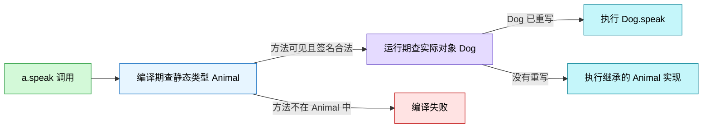
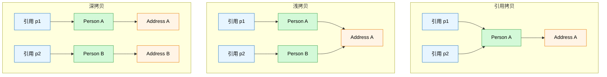
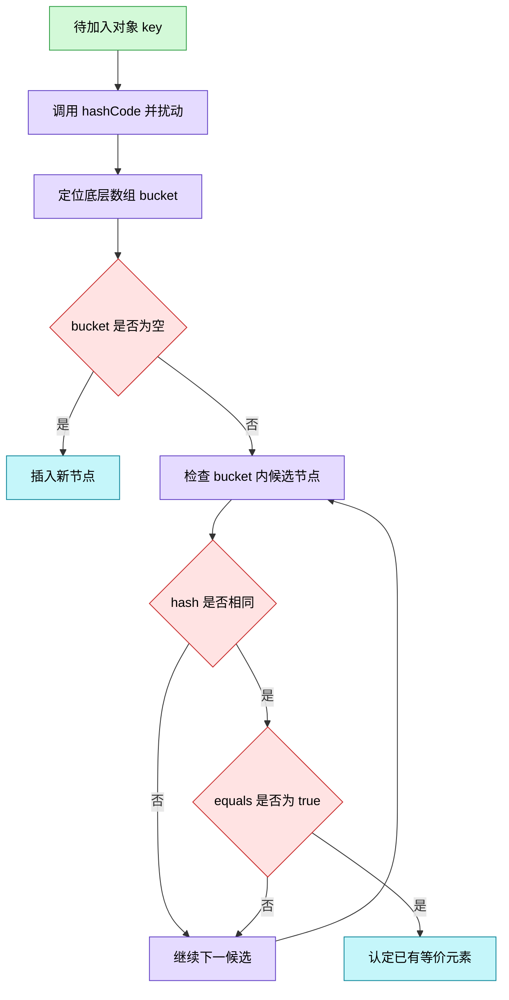
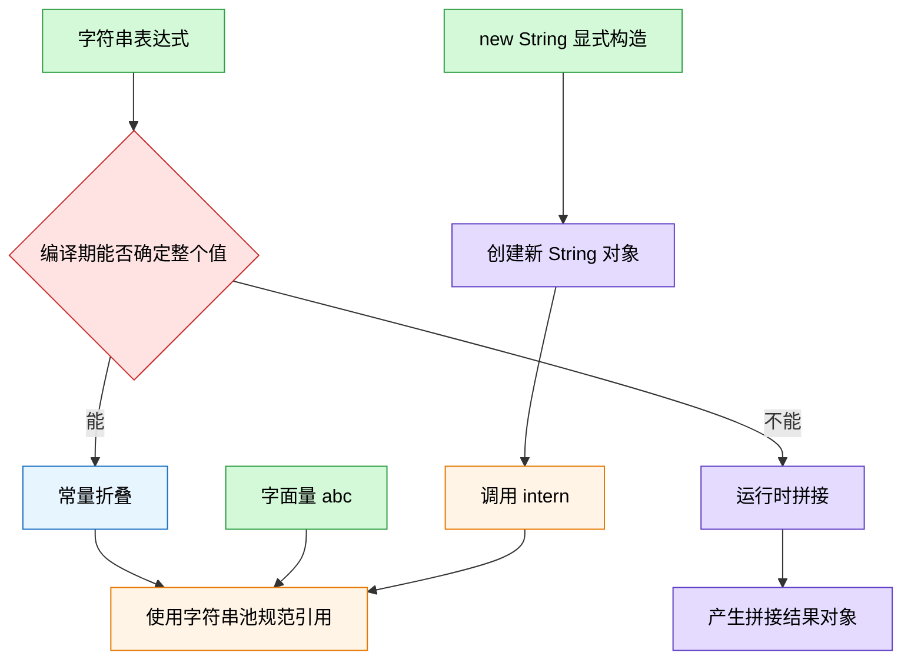
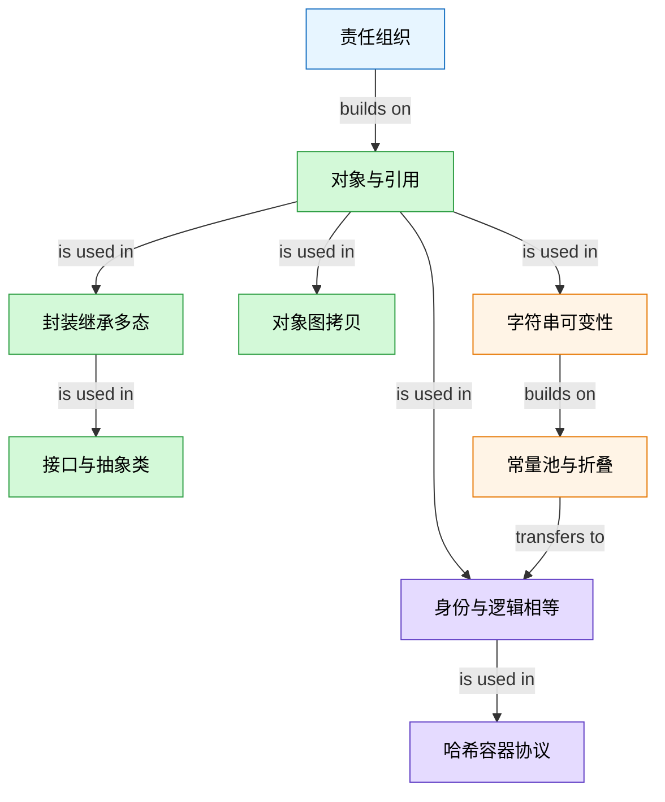

# Java 基础常见面试题（中）Schema 笔记

- Source: `materials/java/basis/java-basic-questions-02.md`
- Source title: `Java基础常见面试题总结(中)`
- Coverage: 面向对象基础、接口与抽象类、对象拷贝、`Object`、`equals/hashCode`、`String`

### 1. Topic Overview

- **What this is about**：这一章的主线不是“背 OOP 术语”，而是建立 Java 对象模型：谁拥有状态、引用指向谁、方法由谁决定、对象何时算相等、字符串对象何时复用或新建。
- **Why it matters**：面试题常把“静态类型 vs 运行时对象”、“同一对象 vs 逻辑相等”、“复制引用 vs 复制对象图”混在一起考。
- **Difficulty**：入门到中等。难点不是定义，而是在代码中跟踪对象图、编译期信息和运行时行为。
- **Prerequisites**：能读类、字段、方法、继承与基本集合代码；知道变量中存的是值，引用变量的值用来定位对象。
- **Version boundary**：原文同时展示 JDK 8 的 `char[]` 实现和 JDK 9+的 Compact Strings。本笔记把“语言保证”与“某一 JDK 的内部实现”分开。

#### Roadmap

1. 解题组织：面向过程 vs 面向对象
2. 对象生成：对象、引用、`new` 与构造方法
3. 对象协作：封装、继承、多态
4. 类型设计：接口 vs 抽象类
5. 对象复制：引用拷贝、浅拷贝、深拷贝
6. 相等性协议：`==` -> `equals()` -> `hashCode()`
7. 字符串选型：`String` vs `StringBuilder` vs `StringBuffer`
8. 字符串身份：常量池、`new`、`intern()` 与常量折叠

### 2. Core Concepts

#### Schema 1：按责任边界选择过程步骤或对象协作

- **Trigger situation**：需要解释 POP/OOP 差异，或决定一段逻辑应围绕步骤还是围绕有状态的角色组织。
- **Definition**：面向过程把问题分解为一组按顺序执行的操作；面向对象先找到拥有状态和行为的对象，再让对象协作。
- **Intuition**：POP 主要问“先做什么，再做什么”；OOP 主要问“这个状态归谁，谁应该对它负责”。

**Example**

计算一个圆的面积和周长时，可以把 `radius` 交给两个独立函数，也可以让 `Circle` 拥有 `radius`，并提供 `area()` 和 `perimeter()`。当需要增加“半径必须非负”、缩放、比较等规则时，把状态和规则放在 `Circle` 边界内更容易守住不变式。

```java
final class Circle {
    private final double radius;

    Circle(double radius) {
        if (radius < 0) throw new IllegalArgumentException();
        this.radius = radius;
    }

    double area() {
        return Math.PI * radius * radius;
    }
}
```

**选择边界**

- 小型、线性、无持久状态的任务，过程式写法可能更直接。
- 状态、规则和行为需要一起演化时，对象边界有利于封装变化。
- “OOP 一定慢”或“POP 一定快”都不成立。性能取决于数据布局、分派、编译器/JIT 优化和具体负载，不由范式名称单独决定。

**Common mistakes**

- 把 OOP 简化成“把函数放进 class”，却没有建立清晰的状态所有权。
- 为了用 OOP 而把一个简单流程拆成大量无状态对象。
- 用范式标签代替真实 benchmark 来判断性能。

#### Schema 2：把引用槽、对象和构造过程拆开

- **Trigger situation**：遇到 `new`、多个变量指向对象、默认构造方法，或需要判断修改是否会影响别名引用。
- **Definition**：引用变量保存引用值；对象是拥有字段状态的实例；`new` 表达式创建对象并调用构造方法完成初始化，最后产生引用值。
- **Intuition**：变量像一个可以写入“对象联系方式”的槽位；槽位不是对象本身。

**Example**

```java
Person a = new Person("Lin");
Person b = a;
b.rename("Ming");
```

- `new Person("Lin")`：产生一个 `Person` 对象，并调用构造方法。
- `a`：保存指向该对象的引用值。
- `b = a`：复制引用值，没有复制 `Person` 对象。
- 因为 `a` 和 `b` 定位到同一对象，通过 `b` 修改状态后，通过 `a` 也能观察到。

**构造方法规则**

- 名称与类名相同，没有返回类型，不能写 `void`。
- 若类中完全没有声明构造方法，编译器才会提供默认无参构造方法。
- 一旦自己声明了任意构造方法，编译器不再补无参版。是否手写无参构造方法要看 API/框架需求，不是永远必须。
- 构造方法可以按参数列表重载，但不会被继承，因此不能被重写。

**Storage boundary**：面试中常用“局部引用在栈，对象在堆”建立直觉，但 Java 语义的稳定边界是“变量保存引用值，引用值定位对象”。JIT 逃逸分析等优化可以改变具体存储实现，不应把物理位置口诀当成语言保证。

**Common mistakes**

- 认为 `Person b = a` 会自动复制一份对象。
- 认为有参构造方法和默认无参构造方法会自动并存。
- 把构造方法说成“没有返回值的 `void` 方法”。

#### Schema 3：先看静态边界，再看运行时分派

- **Trigger situation**：解释封装、继承、多态，或遇到 `Parent p = new Child()` 形式的调用题。
- **Definition**：封装用类边界保护状态和不变式；继承使子类在父类基础上扩展；多态允许用父类/接口引用指向子类对象，并在运行时执行实际对象的重写实例方法。
- **Intuition**：引用的静态类型是“编译器看到的遥控器”，决定按钮是否存在；运行时对象是“真正接收命令的设备”，决定重写方法的实现。

```java
class Animal {
    void speak() { System.out.println("animal"); }
}

class Dog extends Animal {
    @Override void speak() { System.out.println("dog"); }
    void fetch() { System.out.println("fetch"); }
}

Animal a = new Dog();
a.speak(); // dog
// a.fetch(); // 编译错误：Animal 的可见方法集中没有 fetch
```

#### Visual Model：多态调用的两道判断分别由谁决定？



- **How to read**：先用 `Animal` 判断调用是否合法，通过后才用 `Dog` 判断重写的实际执行版本。
- **Source anchor**：原文“面向对象三大特征”中的封装、继承、多态。
- **Boundary**：图针对可重写的实例方法；字段、静态方法和重载不按这条运行时分派链处理。

**三大特征的真正用途**

| 特征 | 要守住的问题 | 常用机制 |
| --- | --- | --- |
| 封装 | 外部不能随意破坏对象状态 | `private` 状态 + 表达业务意图的方法 |
| 继承 | 子类是否真的可替代父类 | `extends`、共享基础实现、重写 |
| 多态 | 调用者如何依赖抽象而不是具体实现 | 父类/接口引用 + 运行时重写分派 |

子类对象包含父类定义的状态和行为，但子类代码不能直接访问父类的 `private` 成员。“对象中有这部分”不等于“子类源码拥有访问权”。

**Common mistakes**

- 把封装等同于机械生成 getter/setter，却允许任意非法状态。
- 认为父类引用可以直接调用仅子类存在的方法。
- 只说“看 new 的类型”，忽略了编译期首先要检查静态类型。

#### Schema 4：按“能力契约 vs 共享基类”选接口或抽象类

- **Trigger situation**：设计多个类的共同 API，或需要回答接口与抽象类的取舍。
- **Definition**：接口主要声明实现者必须提供的能力；抽象类主要表达同一家族的共享状态、骨架和默认实现。
- **Intuition**：接口像“会做什么”的证书；抽象类像“它属于哪一类且共享哪些基础部件”。

| 维度 | 接口 | 抽象类 |
| --- | --- | --- |
| 目的 | 行为契约、解耦、跨类型共享能力 | 代码/状态复用、表达所属关系 |
| 多继承能力 | 类可实现多个接口；接口可继承多个接口 | 类只能直接继承一个类 |
| 实例状态 | 字段隐式为 `public static final` 常量 | 可定义各种可见性的实例/静态字段 |
| 构造方法 | 没有 | 可有，供子类构造链调用 |
| 方法 | 抽象方法；Java 8+ `default/static`；Java 9+ `private` 辅助方法 | 可同时有抽象和具体方法，也可有各种可见性 |
| 实例化 | 不能直接实例化 | 不能直接实例化 |

```java
interface Flyable {
    void fly();

    default void land() { System.out.println("default landing"); }

    static boolean canFly(int fuel) { return fuel > 0; }

    private void log() { System.out.println("interface helper"); }
}

abstract class Vehicle {
    protected final String id;

    protected Vehicle(String id) { this.id = id; }

    abstract void move();
    void stop() { System.out.println("stopped"); }
}
```

`default` 方法为既有实现类提供向后兼容的默认行为；实现类可重写它。接口 `static` 方法通过接口名调用，不被实现类重写。`private` 方法只用于接口内部复用实现。

**Common mistakes**

- 说“接口永远只能有抽象方法”，忽略 Java 8/9 的演进。
- 把 `default` 方法当成一般实例字段和状态的替代品。
- 仅因“将来可能复用”就建立抽象类，却没有真正的所属/可替代关系。

#### Schema 5：沿对象图数新节点和共享边

- **Trigger situation**：判断赋值、`clone()`、复制构造器或序列化复制属于引用拷贝、浅拷贝还是深拷贝。
- **Definition**：不要只问“复制了吗”，而要沿对象图检查外层节点和内部引用指向的节点是新建还是共享。

| 操作 | 新外层对象 | 新内部对象 | 结果 |
| --- | --- | --- | --- |
| 引用拷贝 `b = a` | 否 | 否 | 两个引用指向同一外层对象 |
| 浅拷贝 | 是 | 否 | 外层独立，内部可变对象仍共享 |
| 深拷贝 | 是 | 递归新建需要独立的节点 | 两张对象图在目标边界内独立 |

#### Visual Model：修改拷贝后的 Address 会影响原 Person 吗？



- **How to read**：先数 `Person` 节点，再沿 `address` 边数 `Address` 节点；只要可变内部节点共享，修改就可能串到另一张图。
- **Source anchor**：原文“深拷贝和浅拷贝区别”及 `Person -> Address` 的 `clone()` 例子。
- **Boundary**：“深”是相对于业务需要的独立边界；不可变对象可以安全共享，对象图中的环也需要防止递归重复复制。

`Object.clone()` 提供的是字段级浅拷贝；对于引用字段，它复制的是引用值。要深拷贝 `Person.address`，必须显式复制 `Address` 并把新引用写回副本。实际业务中，拷贝构造器或明确的复制工厂往往比 `Cloneable` 更能表达拷贝边界。

**Common mistakes**

- 看到新外层对象就直接判定为深拷贝。
- 用 `==` 只检查外层对象，没有继续检查内部引用。
- 认为深拷贝必须无条件复制每个不可变值对象。

#### Schema 6：用身份、逻辑相等和散列候选三层判断对象

- **Trigger situation**：遇到 `==`、`equals()`、`hashCode()`、`HashSet/HashMap` 去重或查找题。
- **Definition**：`==` 对引用类型比较引用值，回答是否定位同一对象；`equals()` 由类定义逻辑上何时相等；`hashCode()` 将对象映射为整数，帮哈希容器先缩小候选范围。
- **Intuition**：`hashCode()` 是粗筛，`equals()` 是候选集内的精确确认；`==` 问的则是“是不是同一个实体”。

**三条必会的推理**

1. `a.equals(b) == true` 要求 `a.hashCode() == b.hashCode()`。
2. `a.hashCode() == b.hashCode()` 不能推出 `a.equals(b)`，因为可能哈希碰撞。
3. `a.hashCode() != b.hashCode()` 可以推出两者不应满足正确的 `equals()` 相等。

`Object.equals()` 默认实现是 `this == obj`，所以未重写时仍是身份相等。`String.equals()` 重写了该协议，按字符序列内容比较。对基本类型，`==` 比较基本值，`equals()` 不适用。

#### Visual Model：HashSet 为什么既需要 hashCode 又需要 equals？



- **How to read**：先用 hash 找 bucket，再只对少量同 hash 候选调 `equals()`；这同时解释了效率和碰撞。
- **Source anchor**：原文“`hashCode()` 有什么用”、“为什么要有 `hashCode`”、“为什么重写 `equals()` 必须重写 `hashCode()`”。
- **Boundary**：图压缩了 HashSet/HashMap 的具体实现；真实 JDK 会先扰动 hash，桶内结构也可能由链表转为红黑树。

**为什么重写 `equals()` 必须同时重写 `hashCode()`**

若两个 `User` 都按 `id` 判定为相等，但仍使用不匹配的默认 hash，它们可能被分到不同 bucket。HashSet 不会跨所有 bucket 做全局 `equals()` 扫描，因此可能同时保留两个逻辑上相等的对象，或者查找不到已存在的键。

**Object 的常用能力分组**

| 组别 | 方法 | 边界 |
| --- | --- | --- |
| 类型/表示 | `getClass()`、`toString()` | 运行时类型和文本表示 |
| 相等/散列 | `equals()`、`hashCode()` | 子类常根据值语义成对重写 |
| 复制 | `clone()` | `protected`，默认是浅拷贝机制 |
| 对象监视器 | `wait()`、`notify()`、`notifyAll()` | 必须在持有该对象 monitor 的协调协议中使用；`wait` 会释放该 monitor |
| 旧清理机制 | `finalize()` | 已弃用并标记待移除，不应用于可靠资源管理 |

`hashCode()` 不应被一概说成“对象内存地址”。其合同只规定一次执行中未参与相等性的信息不变时结果应保持一致，且相等对象必须有相同 hash；具体生成算法是 JVM/类实现细节。

**Common mistakes**

- 把“hash 相同”当成“对象相等”。
- 只重写 `equals()`，不重写 `hashCode()`。
- 对已放入 HashMap 作为键的对象，修改参与 `equals/hashCode` 的可变字段，导致键像“丢失”一样无法查找。
- 认为 `Object.equals()` 天生就比较所有字段。

#### Schema 7：按可变性、共享方式和修改强度选字符串类型

- **Trigger situation**：频繁拼接字符串、在循环中使用 `+`，或选择 `String`、`StringBuilder`、`StringBuffer`。
- **Definition**：`String` 是不可变值对象；`StringBuilder` 和 `StringBuffer` 都通过可变内部存储追加内容，后者的主要方法带同步。
- **Intuition**：少量值表达选 `String`；单个执行流里反复组装选 `StringBuilder`；多线程确实共享同一可变缓冲区且单次方法同步语义足够时，才考虑 `StringBuffer`。

| 类型 | 内容可变 | 同步 | 典型用法 |
| --- | --- | --- | --- |
| `String` | 否 | 不需要用可变锁保护内容 | 少量文本、API 边界、值传递 |
| `StringBuilder` | 是 | 无 | 单线程/局部变量中的大量追加 |
| `StringBuffer` | 是 | 主要方法同步 | 需共享可变缓冲区的兼容场景 |

**String 为什么不可变**

- 字符内容保存在私有内部数组中，对外不暴露可改写通道。
- `String` 类是 `final`，子类无法通过重写行为破坏不可变契约。
- 内部数组引用的 `final` 只保证该字段不能改指别的数组，它本身不足以阻止数组元素被修改。真正保证来自“私有存储 + 不暴露修改 API + final 类”的组合。

JDK 8 的代表性实现使用 `char[]`；JDK 9+的 Compact Strings 通常使用 `byte[]` 加编码标记。所有字符都能用 Latin-1 表示时，可以每个代码单元用 1 字节；否则用 UTF-16 形式。这是内存表示优化，不改变 `String` 的 API 不可变契约。

**拼接边界**

```java
StringBuilder out = new StringBuilder();
for (String part : parts) {
    out.append(part);
}
String result = out.toString();
```

- 简单拼接可直接写 `a + b + c`；编译器会选择合适的拼接机制。JDK 8 常见为 `StringBuilder` 链，JDK 9+ 常用 `invokedynamic` 拼接配方。
- 在循环里写 `s += part` 会在多次迭代之间反复构造新的拼接结果；显式复用一个 `StringBuilder` 更稳定。
- `StringBuffer` 的单个方法同步不会自动使“多步检查后修改”成为原子事务；复合操作仍需要更大协调边界。

**Common mistakes**

- 说“因为数组字段是 `final`，所以数组内容不能变”。
- 把所有 `+` 都机械改为 `StringBuilder`，不区分一次性简单表达式和循环累积。
- 认为 `StringBuffer` 的每个方法同步就能保证任意多步业务逻辑的原子性。

#### Schema 8：先判编译期可确定性，再追踪常量池和新对象

- **Trigger situation**：判断字符串 `==` 结果、`new String("abc")` 创建几个字符串对象，或 `intern()` 返回哪个引用。
- **Definition**：编译期能确定值的字符串常量表达式可被常量折叠；字面量通过字符串常量池复用等值字符串的规范引用；`new String(...)` 明确要求创建新的 `String` 对象；`intern()` 返回常量池中对应内容的规范引用。

**先分三条路**

| 表达式 | 决定时机 | 典型结果 |
| --- | --- | --- |
| `"str" + "ing"` | 编译期 | 折叠为 `"string"`，使用池中规范引用 |
| `final String a = "str"; final String b = "ing"; a + b` | 编译期 | `a/b` 是常量变量时可折叠 |
| `String a = getA(); a + "ing"` | 运行时 | 执行拼接配方并产生结果对象 |

#### Visual Model：一个字符串表达式会复用池对象还是生成新对象？



- **How to read**：字面量和可折叠表达式走池复用路径；运行时拼接和显式 `new` 会产生新结果对象；`intern()` 把问题再转回池中的规范引用。
- **Source anchor**：原文“字符串常量池”、`new String("abc")`、`String#intern`、“变量和常量做 `+` 运算”。
- **Boundary**：图描述引用身份和语义结果，不展开 class-file 运行时常量池、字符串池内部表结构和后备数组分配。

**三个代码判断**

```java
String a = "ab";
String b = "ab";
String c = new String("ab");

System.out.println(a == b);       // true：同一池中规范引用
System.out.println(a == c);       // false：c 指向显式 new 的对象
System.out.println(a == c.intern()); // true：intern 返回池中 "ab"
```

```java
String x = "str";
String y = "ing";
String p = "str" + "ing";
String q = x + y;
String r = "string";

System.out.println(p == r); // true：常量折叠
System.out.println(q == r); // false：x/y 不是常量变量
```

`new String("abc")` 常见面试答案是“1 或 2 个 `String` 对象”：若对应池对象尚未存在，字面量解析可使其出现，另外 `new` 创建一个新对象；若池对象已存在，则本次主要新建 `new` 的那一个。这个计数必须先说明“从什么初始状态开始、只数 `String` 对象还是连内部数组也数”，不能脱离语境背固定数字。

**Common mistakes**

- 用 `==` 比较字符串内容，并把常量池导致的偶然 `true` 当成通用结论。
- 认为只要变量有 `final` 就一定可折叠；如果初始值来自运行时方法调用，仍无法在编译期确定。
- 认为 `intern()` 总是创建一个新字符串，而不是获得池中的规范引用。

### 3. Deep Understanding

#### 一条统一主线：先确定边界，再判断共享和分派

本章的问题都可以压缩为三步：

1. **找边界**：状态由哪个对象封装？调用者依赖的是类、抽象类还是接口？相等性由哪些字段定义？
2. **画对象图**：有几个引用槽，有几个外层对象，内部节点是共享还是独立？字符串引用指向池对象还是显式新对象？
3. **分阶段决定**：编译期用静态类型和常量表达式做什么？运行时再由实际类型、对象状态和容器协议做什么？

#### 四组必须分开的对比

| 不要混淆 | 左边回答 | 右边回答 |
| --- | --- | --- |
| 引用 vs 对象 | 变量中保存的联系值 | 实际状态和行为载体 |
| 静态类型 vs 运行时类型 | 方法是否可见、调用是否合法 | 重写实例方法的实际执行版本 |
| 身份相同 vs 逻辑相等 | `==` 对引用的问题 | `equals()` 契约的问题 |
| 不可变 vs 变量不能重赋值 | 对象可观察内容不变 | `final` 引用变量不能改指另一对象 |

#### 相等性是一个跨层协议

`equals/hashCode` 不是两道孤立面试题。类先定义值语义，哈希容器再依赖它维持键的唯一性和可查找性：

```text
业务身份字段
-> equals 定义逻辑相等
-> hashCode 必须使相等对象进入同一候选空间
-> HashSet/HashMap 先粗筛后精比
```

因此参与等价协议的字段最好在对象作为哈希键期间保持不变。`String` 的不可变性也使它适合做值、池中规范对象和哈希键。

### 4. Minimal Working Example

下面的一个小场景串起“封装 -> 多态 -> 相等性 -> 字符串组装”：

```java
import java.util.HashSet;
import java.util.Objects;
import java.util.Set;

interface Describable {
    String describe();
}

final class User implements Describable {
    private final long id;
    private final String name;

    User(long id, String name) {
        this.id = id;
        this.name = Objects.requireNonNull(name);
    }

    @Override
    public String describe() {
        return new StringBuilder()
                .append(id)
                .append(':')
                .append(name)
                .toString();
    }

    @Override
    public boolean equals(Object other) {
        if (this == other) return true;
        if (!(other instanceof User user)) return false;
        return id == user.id;
    }

    @Override
    public int hashCode() {
        return Long.hashCode(id);
    }
}

Describable d = new User(7, "Lin");
System.out.println(d.describe());

Set<User> users = new HashSet<>();
users.add(new User(7, "Lin"));
users.add(new User(7, "Ming"));
System.out.println(users.size()); // 1：此业务契约用 id 定义用户身份
```

**Execution flow**

1. `new User(...)` 创建对象并用构造方法建立不变式：`name` 不为 `null`。
2. `Describable` 引用只暴露契约中的 `describe()`，运行时执行 `User.describe()`。
3. `describe()` 在局部连续追加数据，用 `StringBuilder` 组装，最后交付不可变 `String`。
4. HashSet 先按 `id` 的 hash 定位候选桶，再按 `equals()` 判定两个 `id=7` 的 `User` 逻辑相等。
5. 若 `equals()` 按 `id` 比较而 `hashCode()` 仍使用不匹配的身份 hash，第 4 步的容器协议就会被破坏。

### 5. Chapter Knowledge Map



### 6. Self-Test Questions

**Recall**

1. `Person b = a` 与 `Person b = a.clone()` 在外层对象数量上有什么区别？
2. `Parent p = new Child()` 调用实例方法时，静态类型和运行时类型分别决定什么？
3. 为什么 `final byte[] value` 单独不足以证明 `String` 不可变？

**Application / transfer**

4. `Employee.equals()` 只比较 `employeeId`，但 `hashCode()` 参与了可变的 `name`。对象放入 HashSet 后改名会造成什么风险？
5. `final String suffix = loadSuffix(); String x = "pre" + suffix;` 为什么不一定与字面量 `"presuffix"` 指向同一池对象？

**Explain like I am 5**

6. 用“房间门牌、房间和房间里的柜子”解释引用拷贝、浅拷贝和深拷贝。

### 7. Weak Point Detection

- 能背 POP/OOP 定义，但无法根据状态和变化边界选择组织方式。
- 把引用变量、外层对象和内部对象混成一个“对象”，无法画出别名关系。
- 会说“父类引用指向子类对象”，却无法分开静态可见方法集和运行时重写分派。
- 只背“接口多实现、抽象类单继承”，但不会用“能力契约 vs 共享基类”做设计判断。
- 看到新外层对象就判为深拷贝，没有继续沿引用字段检查共享节点。
- 把 `hashCode` 当成唯一身份，或不能解释 HashSet 先分桶后 `equals` 的机制。
- 把 `final` 引用与对象不可变混淆。
- 能背字符串常量池结论，但不先判断表达式的值是否能在编译期确定。
