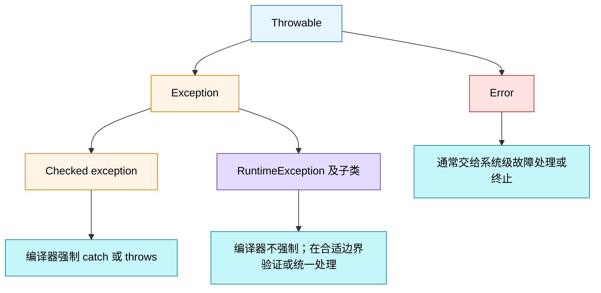
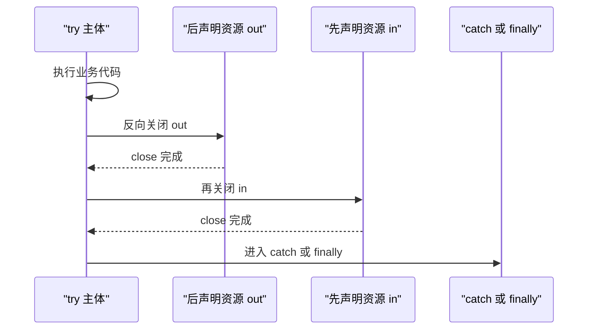
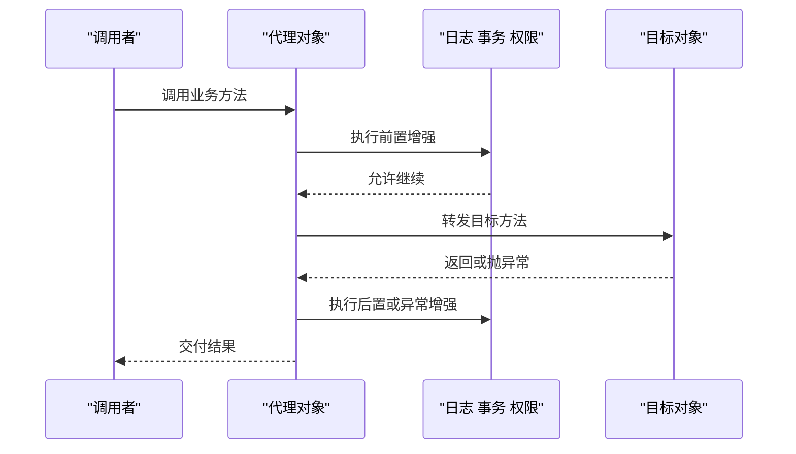
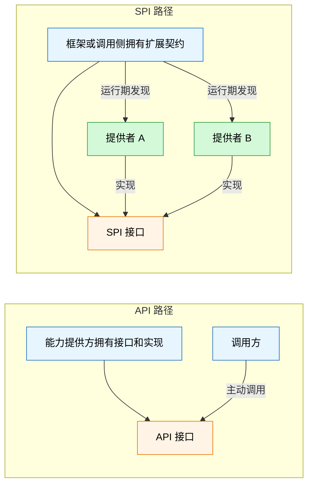
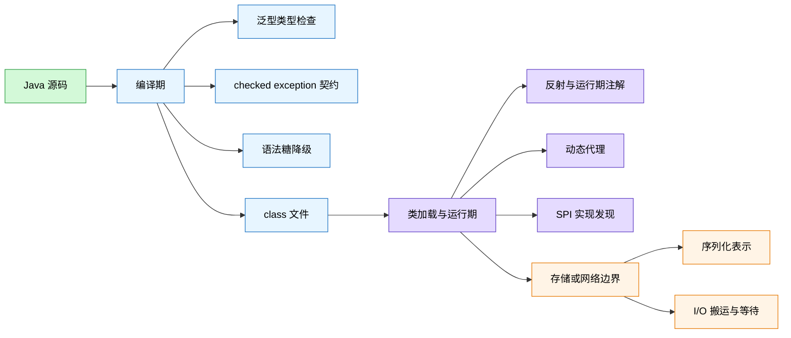
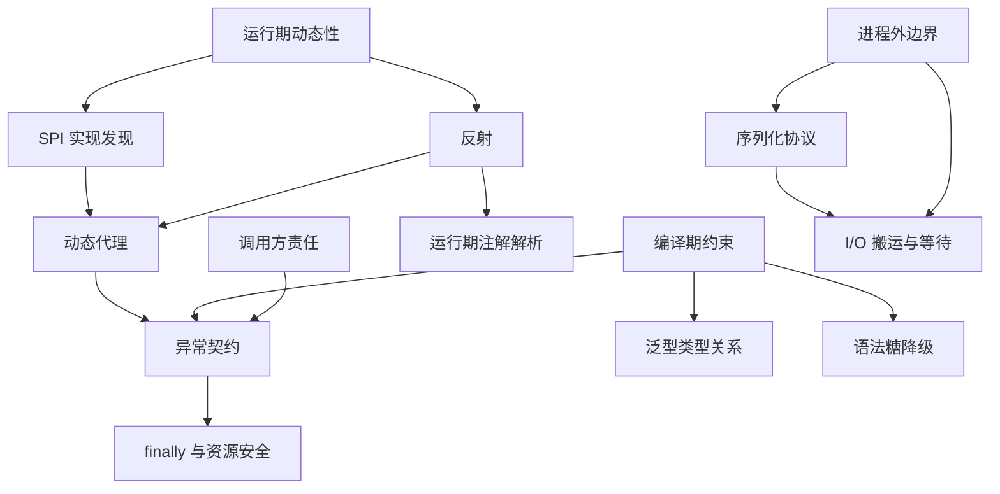

# Java 基础常见面试题（下）Schema 笔记

- Source: `materials/java/basis/java-basic-questions-03.md`
- Source title: `Java基础常见面试题总结(下)`
- Coverage: 异常、泛型、反射、代理、注解、SPI、序列化、Java I/O、语法糖

### 1. Topic Overview

- **What this is about**：这一章讨论 Java 如何把“不确定性”放进可管理的边界：失败由谁处理、编译期未知的类型如何在运行期发现、框架如何接入第三方实现、对象如何跨进程边界，以及源码便利语法如何落到 JVM 能执行的机制上。
- **Why it matters**：这些面试题看似零散，实质都在考一个共同能力——判断一件事发生在编译期、类加载/运行期，还是 I/O 边界，并说明责任归谁。
- **Difficulty**：中等。术语不难，难点是避免把 `checked == 可恢复`、`注解 == 自动执行`、`NIO == 一定非阻塞` 这类口号当成机制。
- **Prerequisites**：知道类、接口、继承、方法调用和基本字节流；能区分编译器、JVM 与应用程序。
- **Source boundary**：原文对 Java I/O 设计模式以及 BIO/NIO/AIO 只给出延伸文章链接。本笔记补出回答本章问题所需的最小选择框架，但不把它冒充为原文中的完整展开。

#### Roadmap

1. 按调用方责任分类异常
2. 沿控制转移追踪 `try/catch/finally` 与资源关闭
3. 用泛型建立编译期类型关系
4. 用反射处理运行期未知类型
5. 把横切增强放进代理调用链
6. 把注解拆成元数据与解析器
7. 用 SPI 反转扩展实现的依赖方向
8. 把对象状态转换成边界表示
9. 按数据解释方式和等待方式选择 I/O
10. 从源码糖追踪到编译器降级结果

### 2. Core Concepts

#### Schema 1：按调用方责任分类异常

- **Trigger situation**：设计方法异常契约，判断应该 `catch`、`throws`、修复代码还是让进程失败。
- **Definition**：所有可抛出对象都在 `Throwable` 层次中；`Exception` 表示应用通常有机会处理的异常，`Error` 表示 JVM、链接或资源层面的严重失败，通常不由局部业务代码恢复。`Exception` 中除 `RuntimeException` 及其子类外属于 checked exception，编译器要求捕获或声明；`RuntimeException` 及其子类属于 unchecked exception，编译器不强制处理。
- **Intuition**：先别背异常类名，先问：“调用方是否被契约要求对这个结果做决定？”checked/unchecked 首先是**编译器是否强制传递处理责任**的区别，不是“能不能恢复”的物理定律。

#### Visual Model：异常发生后，责任应该落在哪一层？



- **How to read**：先按 `Throwable` 层次确定类别，再决定是编译期契约、运行期校验，还是系统级失败；类别本身不替代具体恢复策略。
- **Source anchor**：原文“Exception 和 Error”“Checked Exception 和 Unchecked Exception”“更倾向使用哪种异常”。
- **Boundary**：`Error` 在 Java 类型系统中仍可被 `catch`，只是一般不建议捕获后假装程序可正常继续。

**两个容易混淆的类加载失败**

| 类型 | 所属层次 | 典型触发 | 推理重点 |
| --- | --- | --- | --- |
| `ClassNotFoundException` | checked `Exception` | 程序显式按名字加载类，例如 `Class.forName`，但查找失败 | 这是调用操作声明的可预期失败，调用方必须处理或继续声明 |
| `NoClassDefFoundError` | `Error` | JVM 解析一个本应可用的类时找不到定义，或该类此前初始化失败 | 通常是运行环境、依赖部署或类初始化问题，不是普通业务分支 |

**API 选择边界**

- 原文建议默认使用 unchecked exception，只在调用方必须处理的业务分支上使用 checked exception。这是一种 API 设计取向，不是语言强制规定。
- `NullPointerException` 一类通常暴露程序 bug，盲目捕获会掩盖根因；但“unchecked”也不自动等于 bug，例如参数校验失败可以用 `IllegalArgumentException` 表达。
- 抛出具体、有意义的新异常对象；不要复用静态异常实例，否则堆栈可能指向错误的创建位置。
- 一条异常链通常只在拥有足够上下文的边界记录一次完整日志；“记录后原样重抛”会制造重复噪声。

**Common mistakes**

- 说 checked exception “运行期不会发生”，其实它只是在编译期被强制处理。
- 说 `Error` 绝对不能捕获；准确说法是可捕获，但多数场景不应局部恢复。
- 仅凭“业务异常”四个字就一律选择 checked exception，而不看调用方是否真的需要被强制处理。

#### Schema 2：沿控制转移追踪异常与资源关闭

- **Trigger situation**：判断 `try/catch/finally` 的输出、返回值、异常传播或多个资源的关闭顺序。
- **Definition**：`try` 产生正常完成、`return` 或抛异常等控制结果；匹配的 `catch` 可以把异常结果转换为新的结果；在 JVM 仍正常执行当前控制流时，`finally` 会在离开结构前运行。若 `finally` 自己 `return` 或抛异常，它会覆盖此前待完成的结果。
- **Intuition**：把 `return` 想成“先准备好一个待交付结果”，不是立即瞬移出方法；离开前还要经过 `finally`。因此 `finally` 应负责清理，不应夺走控制权。

```java
static int square(int value) {
    try {
        return value * value; // 先准备返回值 4
    } finally {
        if (value == 2) return 0; // 覆盖待返回结果
    }
}
```

- 通常输出 `0`，这正是“不要在 `finally` 中 `return`”的原因。
- `System.exit`、进程被强制终止、机器断电等情况下，JVM 没机会继续执行 `finally`。因此 `finally` 不是持久化或安全提交的绝对保证。
- `getMessage()` 给出详细消息，`toString()` 通常含异常类型与消息，`printStackTrace()` 输出完整传播路径；生产代码通常通过日志框架记录异常对象，而不是散落调用 `printStackTrace()`。

**用 `try-with-resources` 管理资源所有权**

```java
try (BufferedInputStream in = new BufferedInputStream(new FileInputStream("in.bin"));
     BufferedOutputStream out = new BufferedOutputStream(new FileOutputStream("out.bin"))) {
    in.transferTo(out);
} catch (IOException e) {
    // 在资源关闭之后处理
}
```

#### Visual Model：资源、catch 和 finally 的先后关系是什么？



- **How to read**：资源按声明顺序的逆序关闭；所有资源关闭后，才进入外接的 `catch`/`finally`。
- **Source anchor**：原文“try-catch-finally”“finally 是否一定执行”“try-with-resources”。
- **Boundary**：资源必须实现 `AutoCloseable` 或 `Closeable`；若主体和 `close()` 都抛异常，主体异常通常保留为主异常，关闭异常可通过 `getSuppressed()` 看到。

**Common mistakes**

- 把 `return` 当作完全跳过 `finally`。
- 用 `finally return` 掩盖原异常或原返回值。
- 手写多个嵌套 `finally`，却在前一个 `close()` 失败后漏关其他资源。

#### Schema 3：用泛型建立编译期类型关系

- **Trigger situation**：设计容器、通用返回值、工具方法，或判断静态方法能否使用类的类型参数。
- **Definition**：泛型用类型参数表达“输入、存储与输出必须保持什么类型关系”，让编译器在使用点检查关系并减少手工强转。
- **Intuition**：`List<Person>` 不只是给 `List` 贴标签，而是在编译期把“只能加入 Person、取出时得到 Person”绑定成一个协议。

| 形式 | 声明位置 | 类型参数何时确定 | 例子 |
| --- | --- | --- | --- |
| 泛型类 | 类名后 | 创建/引用该类的具体类型时 | `class Box<T>` |
| 泛型接口 | 接口名后 | 实现或引用接口时 | `interface Generator<T>` |
| 泛型方法 | 返回类型前 | 每次方法调用通过显式参数或推断确定 | `static <E> E first(E[] items)` |

```java
final class Box<T> {
    private final T value;
    Box(T value) { this.value = value; }
    T get() { return value; }

    static <E> E first(E[] items) {
        return items[0];
    }
}
```

静态方法在没有任何 `Box<T>` 实例时就能调用，因此不能直接借用类实例的 `T`；它若要泛型化，必须声明自己的 `<E>`。项目中的 `CommonResult<T>`、`ExcelUtil<T>` 和集合工具方法，本质都在复用同一关系。

**运行期边界**：Java 泛型主要通过擦除实现。大多数类型参数不会成为每个对象上的独立运行期类型；编译器会插入必要的转换，并可能生成桥接方法维持多态。类文件仍可保留泛型签名元数据供工具和反射读取，所以“擦除”也不等于所有泛型信息从 class 文件彻底消失。

**Common mistakes**

- 使用原生 `List` 后到处手工强转，丢掉编译期类型检查。
- 在 `static` 方法中直接引用类级 `T`。
- 认为 `List<String>` 和 `List<Integer>` 在运行期必然是两个不同的 JVM 类。

#### Schema 4：在运行期未知时才启用反射

- **Trigger situation**：框架在编译时不知道将处理哪个类，却需要发现构造器、字段、方法或注解并进行通用操作。
- **Definition**：反射允许程序在运行期获取类的结构信息，并动态创建对象、读取/设置字段或调用方法。
- **Intuition**：普通调用是“编译器已经知道门牌和方法”；反射是“运行时先查目录，再按查到的描述执行”。

```java
Class<?> type = Class.forName(className);
Object target = type.getDeclaredConstructor().newInstance();
Method method = type.getMethod("run");
method.invoke(target);
```

**适合的通用场景**

- Spring 类框架扫描组件、创建 Bean、注入依赖。
- 读取运行期注解并驱动配置、校验或路由。
- ORM 把结果集列映射到对象字段或 setter。
- JDK 动态代理通过 `Method.invoke` 转交目标调用。

**代价与边界**

- 动态查找、访问检查、间接调用以及优化受限会带来开销；框架通常缓存 `Class`、`Method` 等元数据，但是否值得优化应以实际热点为准。
- 错误更容易推迟到运行期，代码也更难静态分析和重构。
- 反射可能突破普通封装；在现代 Java 模块系统下，深反射还可能受模块开放规则限制，不能把“可以访问 private”当作无条件保证。

**Common mistakes**

- 明明类型在编译期已知，仍用字符串和反射替代普通接口调用。
- 把“灵活”理解成没有类型、安全和维护代价。
- 每次调用都重新扫描元数据，却没有先确认这里真是性能瓶颈。

#### Schema 5：把横切增强放进代理调用链

- **Trigger situation**：不修改目标业务代码，却要统一加入日志、事务、鉴权、重试或 RPC 转发。
- **Definition**：代理对象接收原本发给目标对象的调用，在调用目标前后插入增强逻辑。静态代理类在编译前手写；动态代理类在运行期生成并复用统一拦截逻辑。
- **Intuition**：调用者不是直接进业务房间，而是先经过一个门卫；门卫可检查、记录，再放行到真实目标。

#### Visual Model：一次 AOP 调用在哪里被增强？



- **How to read**：调用者依赖代理暴露的同一契约；增强围绕目标调用发生，目标类本身不需要复制日志、事务等代码。
- **Source anchor**：原文“反射应用场景”“动态代理”“Spring AOP”。
- **Boundary**：代理只能拦截真正经过代理对象的调用；绕过代理直接调用目标对象，不会自动经过这条链。

| 方式 | 代理形态 | 核心限制 |
| --- | --- | --- |
| JDK 动态代理 | 运行期生成目标接口的实现类，交给 `InvocationHandler` | 代理能力建立在接口上 |
| CGLIB 动态代理 | 运行期生成目标类子类，交给 `MethodInterceptor` | 依赖继承，不能覆盖 `final` 方法；`private/static` 方法也不走普通重写拦截 |

原文给出 Spring AOP 的常见选择：有合适接口时使用 JDK Proxy，否则用 CGLIB 子类代理。真实项目还可能通过配置强制类代理，不能把它背成不可改变的语言规则。性能也不宜凭旧印象决定，JDK 版本、调用路径和框架缓存都会影响结果。

**Common mistakes**

- 说 CGLIB “什么类、什么方法都能代理”，忽略继承与重写限制。
- 把静态代理等同于装饰器的所有语义；两者结构相近，但意图和使用边界仍需结合场景。
- 在同一个目标对象内部自调用需要增强的方法，却默认它一定重新经过外部代理。

#### Schema 6：把注解拆成元数据与解析器

- **Trigger situation**：解释 `@Override`、`@Component`、`@Value`、自定义注解为什么会或不会生效。
- **Definition**：注解是附着在类、方法、字段等程序元素上的元数据；它只描述信息，本身不执行行为。编译器、注解处理器或运行期框架必须读取它并采取动作。
- **Intuition**：注解像贴在包裹上的标签；标签不会自己分拣包裹，真正工作的，是能看懂标签的分拣系统。

| 解析时机 | 例子 | 行为来源 |
| --- | --- | --- |
| 编译期扫描 | `@Override` | 编译器检查方法是否真的重写 |
| 运行期读取 | `@Component`、`@Value` 等框架注解 | 框架通过反射扫描，再执行实例化、注入或配置逻辑 |

注解类型在语言层面是继承 `java.lang.annotation.Annotation` 的特殊接口。定义时还需用 `@Target` 限定可放位置，用 `@Retention` 决定信息保留到源码、class 文件还是运行期；若运行期不可见，反射自然读不到它。

**Common mistakes**

- 认为写上 `@Transactional` 后，注解对象自己开启事务；真正执行事务的是读取元数据的代理/框架。
- 忽略 retention，排查半天仍想在运行期读取一个只保留在源码中的注解。
- 把注解作为隐藏控制流大量使用，却不说明解析器和生效边界。

#### Schema 7：用 SPI 反转扩展实现的依赖方向

- **Trigger situation**：框架需要允许数据库驱动、日志实现或第三方插件接入，而不想在核心模块硬编码每个实现。
- **Definition**：SPI 由框架/调用侧定义扩展契约，服务提供者实现它，运行时再发现具体提供者；API 通常由能力提供侧暴露接口和实现，调用者主动调用。
- **Intuition**：API 是“别人造好机器并给你按钮”；SPI 是“你先公布插槽标准，别人按标准来造可插拔模块”。

#### Visual Model：API 与 SPI 的依赖方向差在哪？



- **How to read**：API 中调用方依赖提供方给出的能力；SPI 中框架先拥有规则，再由多个提供者反向实现规则。
- **Source anchor**：原文“何谓 SPI”“SPI 和 API 的区别”“SPI 优缺点”。
- **Boundary**：Java `ServiceLoader` 通常借助 provider 配置发现实现。它能延迟实例化，但原生发现/筛选能力有限；若要按名字、条件、优先级精确选择，常需额外扩展机制。不要把“遍历发现”简单误写成任何情况下都一次性实例化全部实现。

**Common mistakes**

- 只说 SPI “也是接口”，却说不出接口由哪一侧拥有。
- 核心框架直接依赖具体厂商实现，失去可插拔边界。
- 在同一 `ServiceLoader` 实例上无协调地并发操作，却假设加载状态天然线程安全。

#### Schema 8：把对象状态转换成边界表示

- **Trigger situation**：对象需要写文件、放缓存、进数据库或跨网络/RPC 传输。
- **Definition**：序列化把对象/数据结构的状态转换为可存储或传输的字节或文本表示；反序列化根据共同协议把该表示恢复成具有相同业务语义的数据结构或对象。
- **Intuition**：网络和磁盘不能直接搬运“Java 对象身份”，只能搬运双方约定的表示。接收方据此重建的是新对象，不是把发送方堆中的原对象搬过来。

```text
Java 对象状态
-> 编码为 JSON XML 或二进制协议
-> 文件 缓存 数据库 网络
-> 按同一协议解码
-> 接收侧新对象或数据结构
```

**字段边界**

- `transient` 只修饰变量；JDK 默认序列化时跳过该实例字段，恢复后得到该类型默认值。
- `static` 字段属于类，不属于某个实例的对象状态，因此无论是否写 `transient`，都不在普通对象序列化范围内。
- 序列化主要保存状态表示，不等于把对象的方法代码和原进程执行上下文一起搬走。

**协议选择**

| 类型 | 例子 | 典型取舍 |
| --- | --- | --- |
| 文本 | JSON、XML | 可读、跨语言友好，通常体积与解析成本更高 |
| 二进制 | Protobuf、Hessian、Kryo、ProtoStuff | 更紧凑高效，但可读性、模式演进和生态约束需单独评估 |
| JDK 原生对象序列化 | `ObjectOutputStream` / `ObjectInputStream` | Java 绑定强、体积与性能不理想；处理不可信输入时有严重安全风险 |

在 TCP/IP 四层模型中，序列化属于应用层表示协议的一部分；TCP 只负责可靠字节传输，不理解这些字节代表 `User` 还是订单。切勿直接反序列化不可信的 JDK 序列化数据。

**Common mistakes**

- 认为序列化把内存地址或对象身份原样发送到另一台机器。
- 认为 `transient` 也能修饰类或方法。
- 把序列化协议和 TCP/HTTP 等传输/应用协议混成同一层责任。

#### Schema 9：按数据解释方式与等待方式选择 I/O

- **Trigger situation**：在 `InputStream/Reader`、字节/字符、BIO/NIO/AIO 之间选择，或解释数据为何乱码。
- **Definition**：输入/输出方向以程序内存为参照；字节流搬运原始字节，字符流在字节与字符之间应用字符集编码/解码。BIO/NIO/AIO 则主要讨论调用线程如何等待 I/O、是否可复用线程管理多个通道，以及完成结果如何通知。
- **Intuition**：先问“数据是什么”，再问“等待时线程怎么办”。二进制图片应保留字节；文本只有在明确字符集后才应解码成字符。

| 轴 | 选择 | 责任 |
| --- | --- | --- |
| 方向 | `InputStream` / `Reader` | 外部数据进入程序 |
| 方向 | `OutputStream` / `Writer` | 程序数据输出到外部 |
| 解释 | 字节流 | 不解释字符编码，适合任意二进制数据 |
| 解释 | 字符流 | 通过 charset 解码/编码文本 |

字符流的价值不是“字节不存在了”，而是把**编码边界**显式交给 `Reader/Writer`。若使用字节流手工把字节转字符串却不指定正确 charset，最容易出现乱码。

**常见结构模式**

- 装饰器：`BufferedInputStream` 包住 `FileInputStream`，在不改底层流接口的情况下叠加缓冲能力。
- 适配器：`InputStreamReader` 把字节输入适配成字符读取，并承担 charset 解码。

**BIO/NIO/AIO 最小选择框架**

| 模型 | 常见 Java 抽象 | 调用方视角 |
| --- | --- | --- |
| BIO | 传统 stream/socket | 线程调用读写后通常阻塞等待；简单，但大量连接常需要大量等待线程 |
| NIO | `Channel`、`Buffer`、`Selector` | 可使用非阻塞通道与多路复用，让少量线程管理多个连接；NIO API 本身不保证每个操作都非阻塞 |
| AIO / NIO.2 | 异步 channel | 提交操作后继续做别的事，通过回调或 future 接收完成结果 |

**Common mistakes**

- 用 `Reader` 读取图片，或在字节转字符串时不说明 charset。
- 把“输入”理解为键盘，把“输出”理解为屏幕；方向其实相对于当前程序。
- 看到 NIO 三个字母就断言所有 NIO 类和所有操作都非阻塞。

#### Schema 10：从源码糖追踪到编译器降级结果

- **Trigger situation**：解释增强 `for`、自动装箱、泛型、`try-with-resources`、lambda 等为何 JVM 能执行。
- **Definition**：语法糖为开发者提供更简洁的源码表达，但不增加 JVM 无法由既有字节码机制表达的新能力；Java 编译器在编译阶段把它降级为对应的基础结构或字节码协议。
- **Intuition**：源码是给人写的高层速记；编译器负责翻译，JVM 最终执行的是翻译后的 class 文件机制。

| 源码糖 | 典型降级机制 |
| --- | --- |
| 增强 `for` | 数组索引循环，或 `Iterator` 遍历 |
| 泛型 | 编译期检查、擦除、必要的转换与桥接方法 |
| 自动装箱/拆箱 | `valueOf`、`xxxValue` 等调用 |
| 变长参数 | 数组参数 |
| `try-with-resources` | 异常安全的关闭逻辑与 suppressed exception 协议 |
| lambda | 常通过 `invokedynamic` 链接函数对象，不应简单等同于匿名内部类 |

“语法糖不增加功能”不等于“可以无视细节”。例如拆箱可能触发 `NullPointerException`，增强 `for` 遍历集合时仍受迭代器并发修改规则约束，`try-with-resources` 也有明确的关闭顺序。

**Common mistakes**

- 说 JVM 直接识别 Java 源码中的所有语法糖。
- 把每一种糖都机械解释成同一种源码替换。
- 只看到代码更短，却不追踪隐藏的对象创建、方法调用或异常路径。

### 3. Deep Understanding

#### 一条统一主线：先判发生阶段，再找责任拥有者

本章可以压缩成三个阶段：

1. **编译期建立约束**：checked exception 强制传递处理责任；泛型检查类型关系；编译期注解由编译器/处理器读取；语法糖被降级。
2. **运行期发现与接管调用**：反射发现类结构；运行期注解给框架元数据；动态代理接管方法调用；SPI 发现第三方实现。
3. **跨边界转换和等待**：序列化把对象状态变成协议表示；I/O 决定字节/字符如何移动以及线程如何等待。

#### Visual Model：这些机制分别在哪个阶段生效？



- **How to read**：从源码向右追踪；同一个特性可能在编译期留下结构，再在运行期被框架读取，但必须明确每一步是谁执行。
- **Source anchor**：原文泛型、反射、代理、注解、SPI、序列化、I/O 与语法糖各节的跨章关系。
- **Boundary**：图按主要生效阶段压缩；例如 class 文件仍可保存注解和泛型签名元数据，运行期并非完全看不到编译期产物。

#### 四组必须分开的对比

| 不要混淆 | 左边回答 | 右边回答 |
| --- | --- | --- |
| checked vs unchecked | 编译器是否强制捕获/声明 | 不直接等价于是否可恢复 |
| 注解 vs 解析器 | 元数据写了什么 | 谁读取并执行行为 |
| JDK Proxy vs CGLIB | 实现接口 | 生成子类并依赖可重写方法 |
| 序列化 vs I/O | 字节代表什么 | 字节如何被搬运、线程如何等待 |

### 4. Minimal Working Example

下面用一个可插拔支付模块串起 SPI、注解、反射、代理、异常和资源管理：

```java
public interface PaymentProvider {                 // SPI 契约
    Receipt pay(Order order) throws PaymentRejectedException;
}

@Retention(RetentionPolicy.RUNTIME)
@Target(ElementType.METHOD)
public @interface Audited {}                       // 只有元数据

public final class CardPaymentProvider implements PaymentProvider {
    @Override
    @Audited
    public Receipt pay(Order order) throws PaymentRejectedException {
        // 调用第三方支付系统
        return new Receipt("ok");
    }
}
```

执行流：

1. 核心模块拥有 `PaymentProvider` 接口，第三方模块实现并注册 provider——这是 SPI 方向。
2. `ServiceLoader` 在运行期发现 `CardPaymentProvider`。
3. 框架通过反射读取 `pay` 上的 `@Audited`；注解本身没有记录日志。
4. 框架创建 JDK 动态代理，调用者实际调用代理；代理在转发前后写审计日志。
5. `PaymentRejectedException` 若被设计为 checked exception，迫使调用者明确选择重试、换渠道或提示用户。
6. 写日志使用 `try-with-resources`，确保文件资源在进入外层异常处理前关闭。
7. `Receipt` 若要跨网络发送，先由 JSON/Protobuf 等序列化为应用层表示，再交给网络 I/O 搬运。

### 5. Chapter Knowledge Map



### 6. Self-Test Questions

#### Recall

1. checked exception 和 unchecked exception 的语言级区别是什么？
2. 泛型类、泛型接口、泛型方法的类型参数分别声明在哪里？
3. 为什么文本 I/O 需要字符流或显式 charset，而图片更适合字节流？

#### Application / Transfer

1. 一个目标类没有接口，且关键方法是 `final`；JDK Proxy 与 CGLIB 哪一个能直接拦截这个方法？为什么？
2. 你设计一个支付框架，支付厂商实现你定义的 `PaymentProvider`；这是 API 还是 SPI？接口规则归谁所有？

#### Explain Like I Am 5

1. 用“标签、读标签的人、门卫”解释注解、反射和动态代理三者如何配合。

### 7. Weak Point Detection

- 能背异常层次，却不能根据调用方责任设计 `catch/throws`，说明异常契约 schema 仍停留在 Level 1。
- 判断 `finally` 输出时忽略“待返回结果会被 finally 覆盖”，说明控制转移追踪不稳定。
- 把泛型当作运行期自动生成多个专用类，说明编译期关系与擦除边界混淆。
- 认为注解自己执行行为，说明“元数据 vs 解析器”边界缺失。
- 只会背 JDK/CGLIB 名称，不能从接口实现或继承限制选择，说明代理 schema 未形成。
- 说不清 SPI 接口由哪一侧拥有，说明依赖反转仍是表面记忆。
- 把序列化当成传输，或把 TCP 当成理解 Java 对象，说明表示协议与 I/O 搬运边界混淆。
- 把 NIO 机械等同于所有操作非阻塞，说明 API 家族与实际通道模式混淆。
