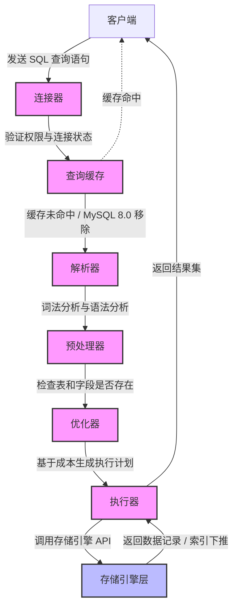

```mermaid
graph TD
    Client[客户端] -->|发送 SQL 查询语句| Connector[连接器]
    Connector -->|验证权限与连接状态| QueryCache[查询缓存]
    QueryCache -.->|缓存命中| Client
    QueryCache -->|缓存未命中 / MySQL 8.0 移除| Parser[解析器]
    Parser -->|词法分析与语法分析| Preprocessor[预处理器]
    Preprocessor -->|检查表和字段是否存在| Optimizer[优化器]
    Optimizer -->|基于成本生成执行计划| Executor[执行器]
    Executor -->|调用存储引擎 API| StorageEngine[存储引擎层]
    StorageEngine -->|返回数据记录 / 索引下推| Executor
    Executor -->|返回结果集| Client

    classDef server fill:#f9f,stroke:#333,stroke-width:2px;
    classDef engine fill:#bbf,stroke:#333,stroke-width:2px;
    class Connector,QueryCache,Parser,Preprocessor,Optimizer,Executor server;
    class StorageEngine engine;
```
