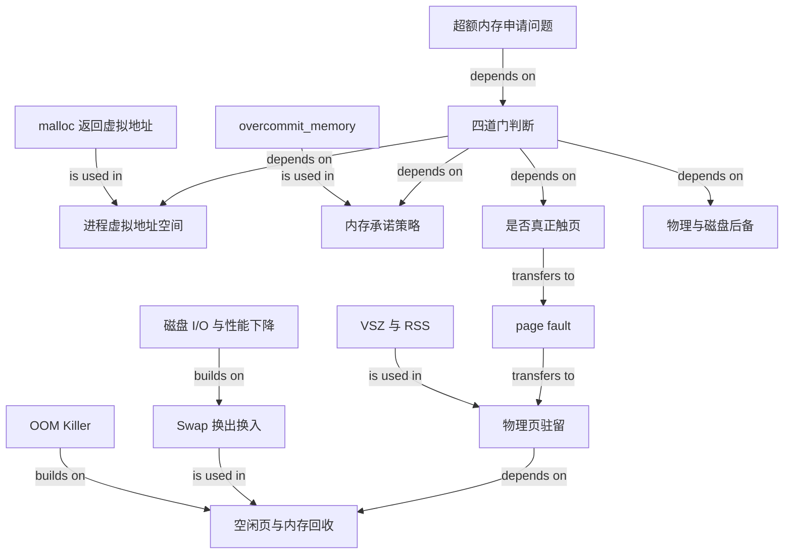

# OS 超额内存申请知识图

## Edge reading

- 超额申请必须依次经过地址空间、承诺策略、是否触页和物理/磁盘后备四层判断。
- `malloc` 返回的是虚拟地址；首次触页通过 page fault 把需要使用的页面落实为物理驻留。
- VSZ 与 RSS 帮助区分地址范围和驻留页面；物理页不足时进入回收。
- Swap 为冷匿名页提供磁盘后备，但引入磁盘 I/O；回收仍失败时才进入 OOM 兜底。
