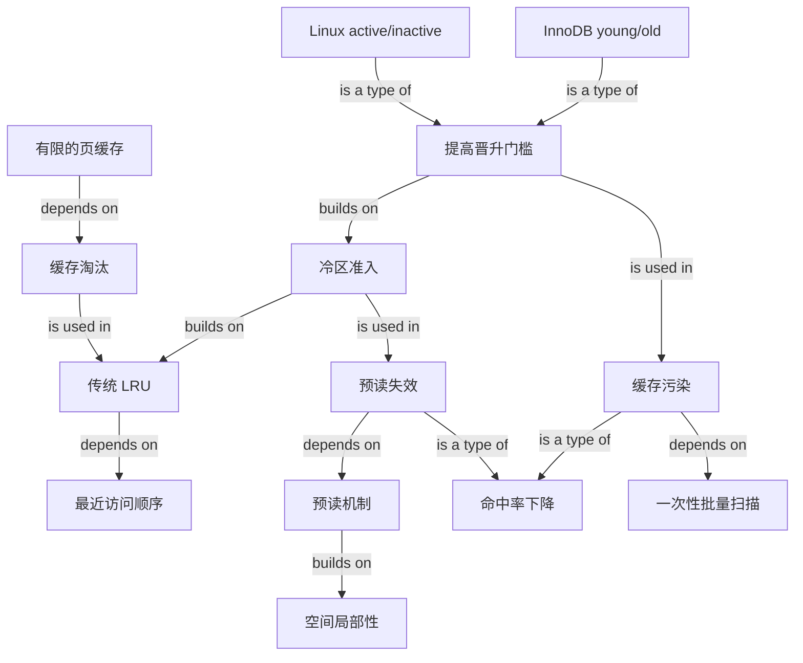

# OS 改进 LRU 知识图

## Edge reading

- 有限容量要求淘汰策略；传统 LRU 用最近访问顺序决定页的头尾位置。
- 预读建立在空间局部性上，但错误预读会让未使用页伤害命中率。
- 冷区准入先隔离没有真实访问证据的预读页；提高晋升门槛再过滤只访问一次的扫描页。
- Linux 用 active/inactive 两条 LRU 表达冷热；InnoDB 用一条 LRU 的 young/old 两个区域表达冷热。
