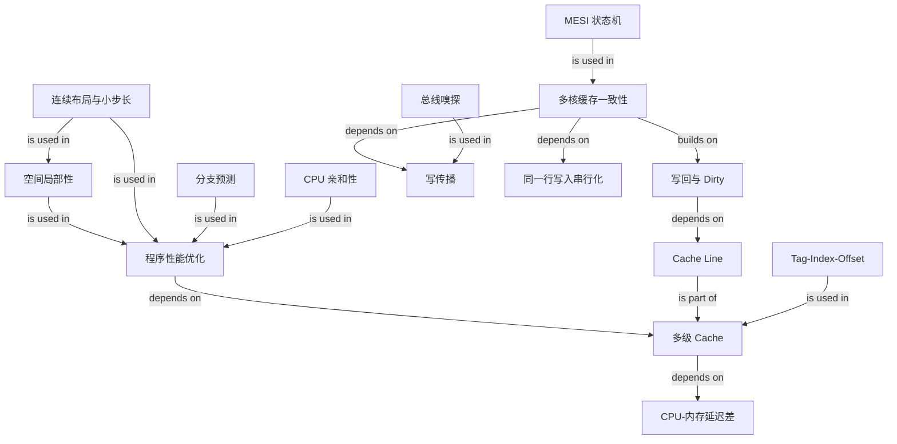

# OS CPU Cache Performance and MESI Graph

## Edge semantics

- `程序性能优化 -> 多级 Cache`, `多级 Cache -> CPU-内存延迟差`: depends on.
- `Cache Line -> 多级 Cache`: is part of.
- `空间局部性 -> 程序性能优化`, `连续布局与小步长 -> 空间局部性`: is used in.
- `Tag-Index-Offset -> 多级 Cache`: is used in.
- `连续布局与小步长 / 分支预测 / CPU 亲和性 -> 程序性能优化`: is used in.
- `写回与 Dirty -> Cache Line`: depends on.
- `多核缓存一致性 -> 写回与 Dirty`: builds on.
- `多核缓存一致性 -> 写传播 / 同一行写入串行化`: depends on.
- `总线嗅探 -> 写传播`, `MESI -> 多核缓存一致性`: is used in.
