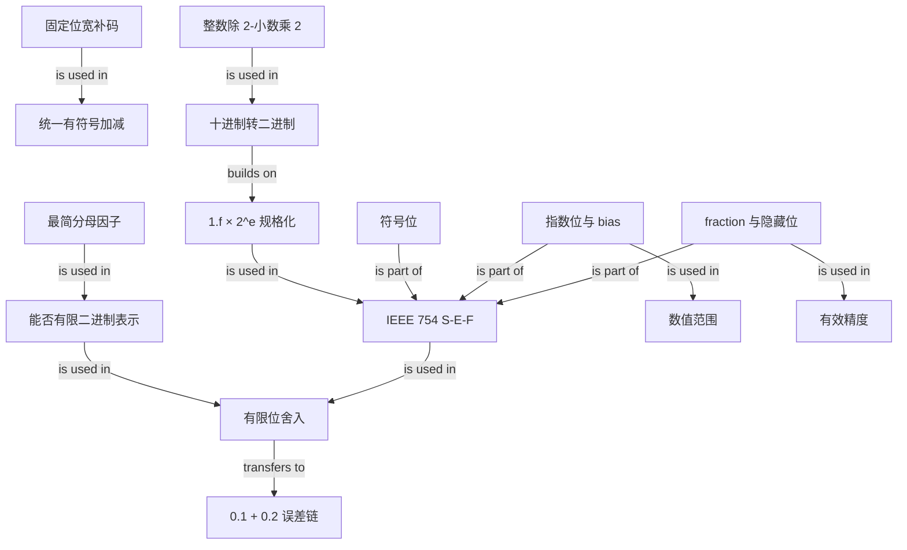

# 二进制浮点数 Graph

```mermaid
graph TD
    Twos[固定位宽补码] -- "is used in" --> Unified[统一有符号加减]
    Method[整数除 2-小数乘 2] -- "is used in" --> Conversion[十进制转二进制]
    Denominator[最简分母因子] -- "is used in" --> Finite[能否有限二进制表示]
    Conversion -- "builds on" --> Normalize[1.f × 2^e 规格化]
    Normalize -- "is used in" --> IEEE[IEEE 754 S-E-F]
    Sign[符号位] -- "is part of" --> IEEE
    Exponent[指数位与 bias] -- "is part of" --> IEEE
    Fraction[fraction 与隐藏位] -- "is part of" --> IEEE
    Exponent -- "is used in" --> Range[数值范围]
    Fraction -- "is used in" --> Precision[有效精度]
    Finite -- "is used in" --> Rounding[有限位舍入]
    IEEE -- "is used in" --> Rounding
    Rounding -- "transfers to" --> Sum[0.1 + 0.2 误差链]
```

## Edge semantics

- 进制转换与规格化构成 IEEE 754 编码前置。
- 符号、指数、fraction 是 IEEE 754 字段；指数主要控制范围，fraction 主要控制精度。
- 分母因子决定展开能否有限；不能有限表示时，目标格式必须舍入，并把误差传递到运算结果。
