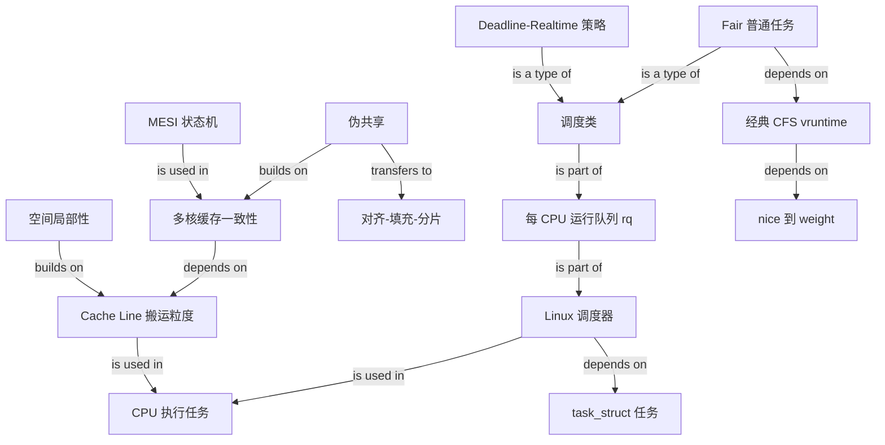

# CPU 如何执行任务 Graph

## Edge semantics

- `Cache Line / Linux 调度器 -> CPU 执行任务`: is used in.
- `空间局部性 -> Cache Line`: builds on.
- `多核缓存一致性 -> Cache Line`: depends on.
- `MESI -> 多核缓存一致性`: is used in.
- `伪共享 -> 多核缓存一致性`: builds on.
- `伪共享 -> 对齐-填充-分片`: transfers to a mitigation decision.
- `Linux 调度器 -> task_struct`: depends on.
- `每 CPU 运行队列 -> Linux 调度器`, `调度类 -> 运行队列`: is part of.
- `Deadline-Realtime / Fair -> 调度类`: is a type of.
- `Fair -> vruntime -> nice/weight`: depends on.
