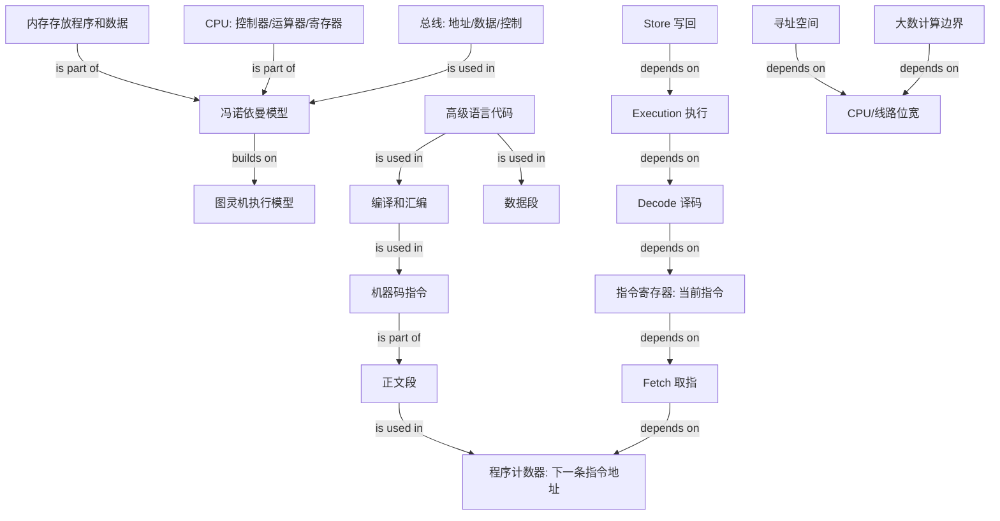

# CPU 如何执行程序 Graph

## Edge Meanings

- `冯诺依曼模型 -> 图灵机执行模型`: builds on
- `内存/CPU -> 冯诺依曼模型`: is part of
- `总线 -> 冯诺依曼模型`: is used in
- `高级语言代码 -> 编译和汇编 -> 机器码指令`: is used in
- `Fetch -> 程序计数器 -> 指令寄存器 -> Decode -> Execution -> Store`: depends on
- `寻址空间/大数计算边界 -> CPU/线路位宽`: depends on
