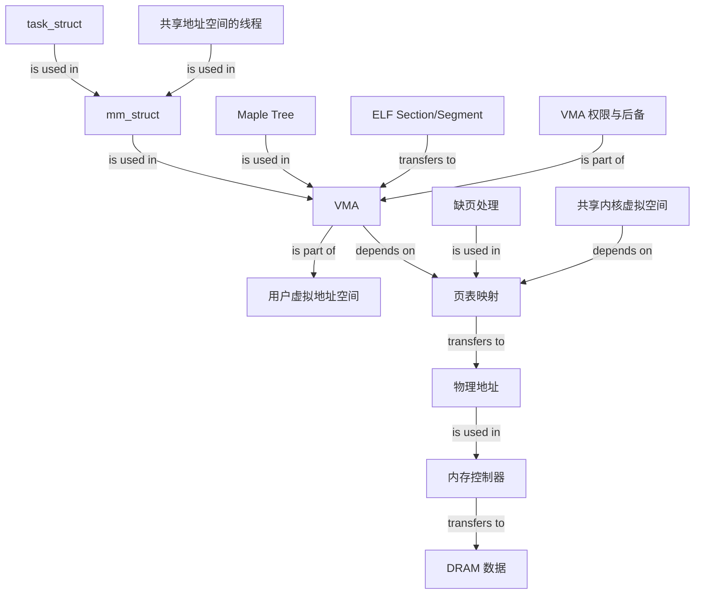

# Linux Virtual Memory Management Graph

## Edge semantics

- `task_struct / 线程 -> mm_struct`: is used in
- `mm_struct / Maple Tree -> VMA`: is used in
- `VMA -> 用户虚拟地址空间`: is part of
- `ELF -> VMA`: transfers to
- `权限与后备 -> VMA`: is part of
- `VMA / 内核虚拟空间 -> 页表`: depends on
- `缺页处理 -> 页表`: is used in
- `页表 -> 物理地址 -> 内存控制器 -> DRAM`: transfers to / is used in
