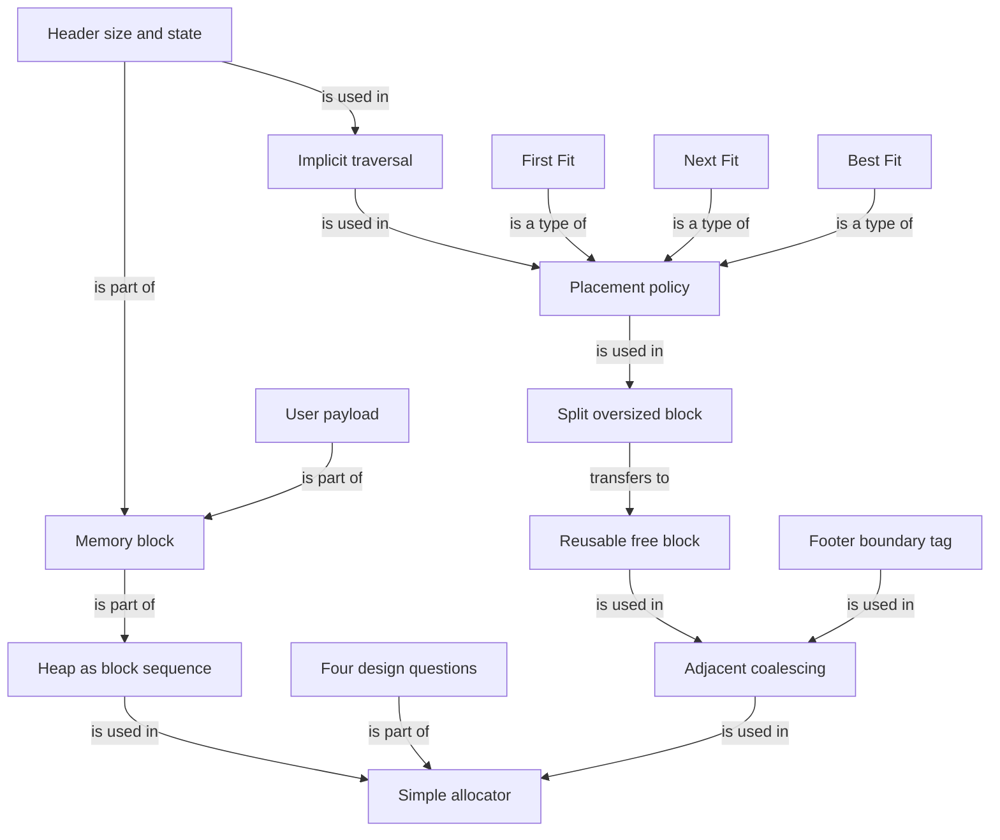

# OS malloc Allocator Implementation Graph

## Edge semantics

- `heap / four design questions / coalescing -> allocator`: is used in / is part of
- `header / payload -> block -> heap`: is part of
- `header -> implicit traversal -> placement -> split`: is used in
- `First Fit / Next Fit / Best Fit -> placement`: is a type of
- `split -> reusable free block`: transfers to
- `free block / footer -> coalescing`: is used in
