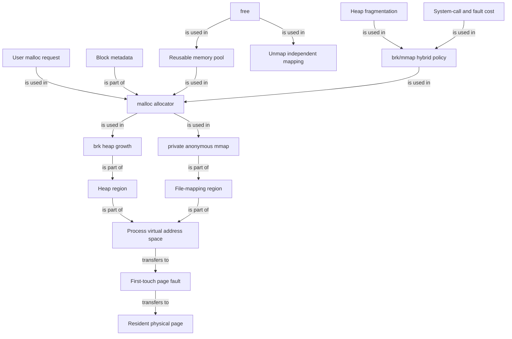

# OS malloc Graph

## Edge semantics

- `malloc request / memory pool / brk / mmap / hybrid policy -> allocator`: is used in
- `block metadata -> allocator`, `brk -> heap`, `mmap -> file-mapping region`, `heap / mapping region -> virtual address space`: is part of
- `virtual address space -> first-touch page fault -> resident physical page`: transfers to
- `free -> pool / unmap`: is used in
- `fragmentation / system-call and fault cost -> hybrid policy`: is used in
