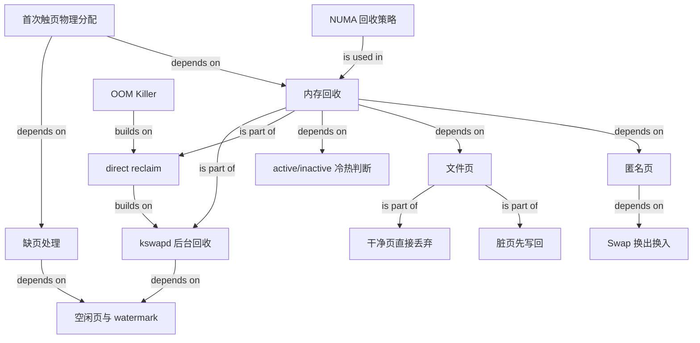

# OS 内存回收知识图

```mermaid
graph TD
    A[首次触页物理分配] -->|depends on| B[缺页处理]
    B -->|depends on| C[空闲页与 watermark]
    A -->|depends on| D[内存回收]
    D -->|is part of| E[kswapd 后台回收]
    D -->|is part of| F[direct reclaim]
    D -->|depends on| G[active/inactive 冷热判断]
    D -->|depends on| H[文件页]
    D -->|depends on| I[匿名页]
    H -->|is part of| J[干净页直接丢弃]
    H -->|is part of| K[脏页先写回]
    I -->|depends on| L[Swap 换出换入]
    E -->|depends on| C
    F -->|builds on| E
    M[NUMA 回收策略] -->|is used in| D
    N[OOM Killer] -->|builds on| F
```

## Edge reading

- 物理页不足时，分配路径依赖回收；回收分为后台回收和直接回收。
- 页的类型与冷热共同约束回收动作：文件页走丢弃或写回，匿名页依赖 Swap。
- watermark 决定后台回收与直接回收的触发边界；直接回收仍失败后才进入 OOM 兜底。
- NUMA 策略决定本地 Node 紧张时优先使用远端空闲内存还是本地回收。
