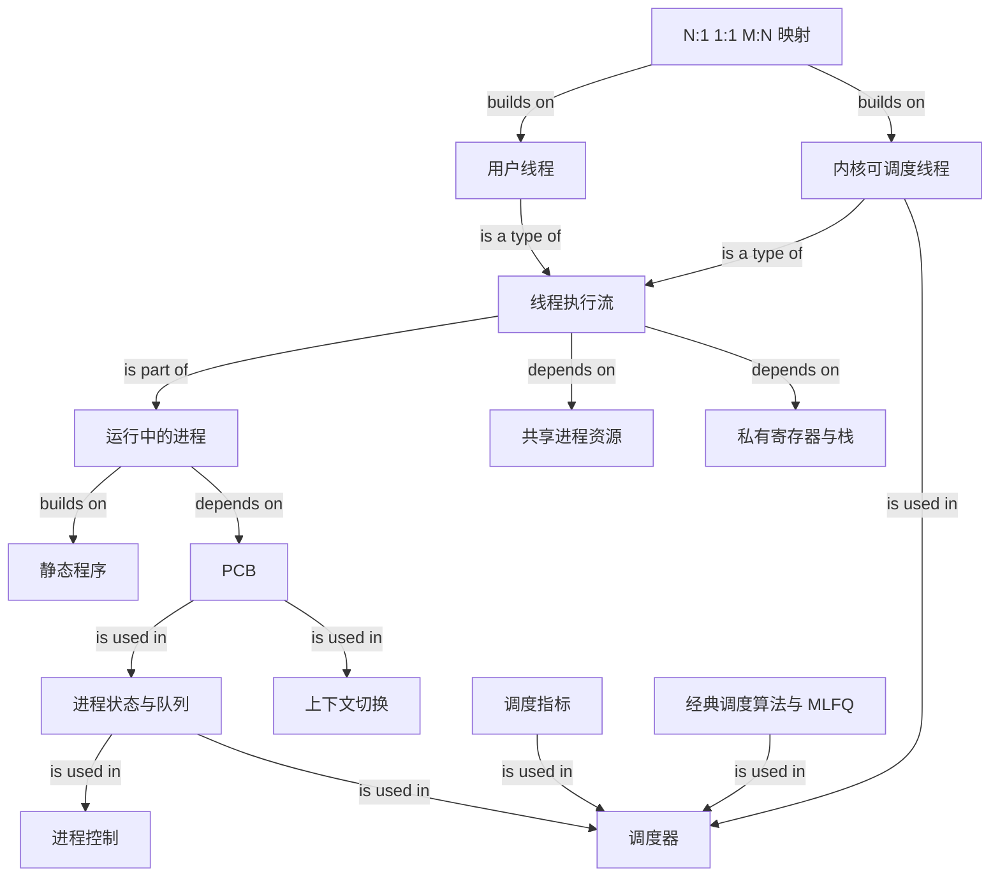

# OS 进程、线程与调度基础知识图

```mermaid
graph TD
    B[运行中的进程] -->|builds on| A[静态程序]
    B -->|depends on| C[PCB]
    C -->|is used in| D[进程状态与队列]
    D -->|is used in| E[进程控制]
    C -->|is used in| F[上下文切换]
    G[线程执行流] -->|is part of| B
    G -->|depends on| H[共享进程资源]
    G -->|depends on| I[私有寄存器与栈]
    J[用户线程] -->|is a type of| G
    K[内核可调度线程] -->|is a type of| G
    L[N:1 1:1 M:N 映射] -->|builds on| J
    L -->|builds on| K
    K -->|is used in| M[调度器]
    D -->|is used in| M
    N[调度指标] -->|is used in| M
    O[经典调度算法与 MLFQ] -->|is used in| M
```

## Edge reading

- 程序被执行后形成进程；PCB 和状态队列让操作系统能够暂停、恢复与控制进程。
- 线程是进程内的执行流：共享资源平台，但保留私有寄存器与栈。
- 用户线程如何映射到内核可调度实体，决定阻塞范围、切换成本与多核并行能力。
- 上下文切换提供“怎么换”的机制，调度指标和算法决定“换给谁”的策略。
