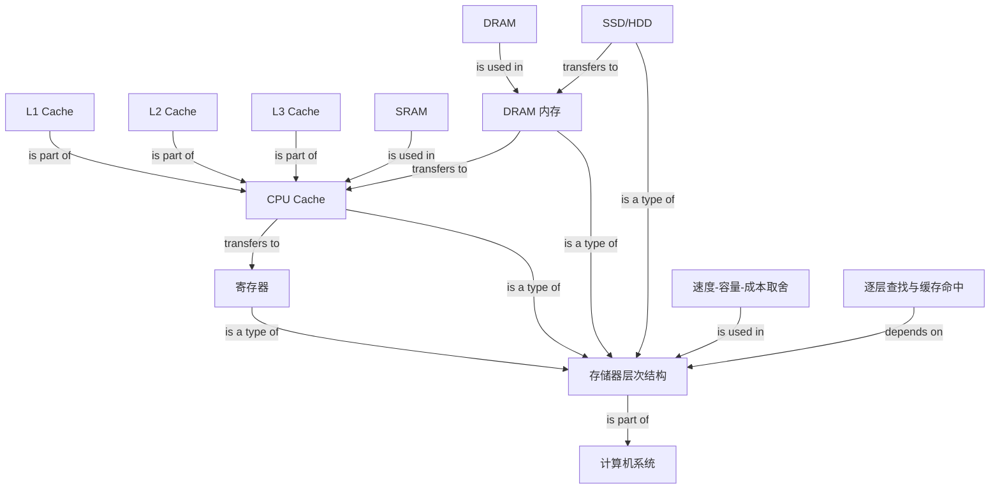

# OS Storage Hierarchy Graph

## Edge semantics

- `寄存器 / CPU Cache / DRAM 内存 / SSD-HDD -> 存储器层次结构`: is a type of
- `L1 / L2 / L3 -> CPU Cache`: is part of
- `SRAM -> CPU Cache`, `DRAM -> 内存`: is used in
- `SSD-HDD -> 内存 -> CPU Cache -> 寄存器`: transfers to
- `逐层查找与缓存命中 -> 存储器层次结构`: depends on
