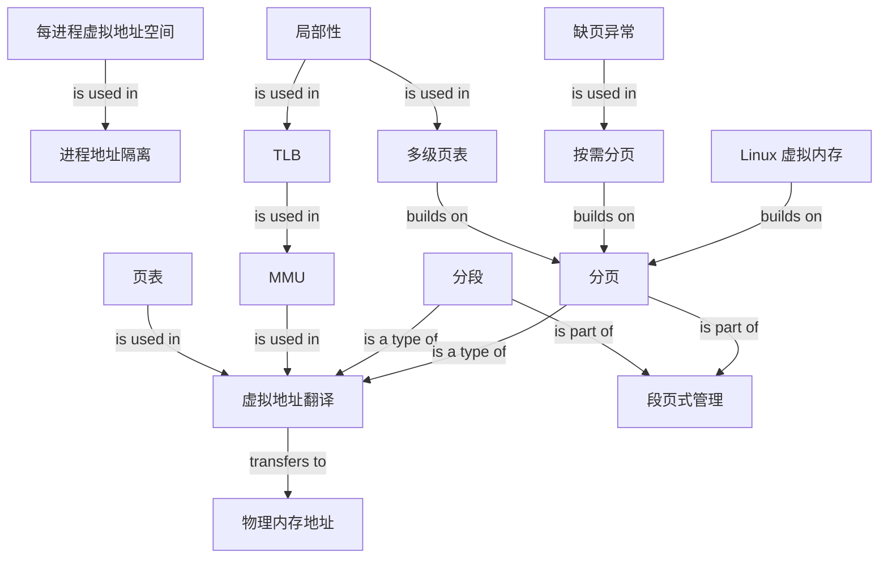

# OS Virtual Memory Graph

## Edge semantics

- `虚拟地址空间 -> 地址隔离`: is used in
- `页表 / MMU -> 虚拟地址翻译`: is used in
- `地址翻译 -> 物理地址`: transfers to
- `分段 / 分页 -> 地址翻译`: is a type of
- `分段 / 分页 -> 段页式`: is part of
- `多级页表 -> 分页`, `按需分页 -> 分页`, `Linux 虚拟内存 -> 分页`: builds on
- `局部性 -> 多级页表 / TLB`, `TLB -> MMU`, `缺页异常 -> 按需分页`: is used in
