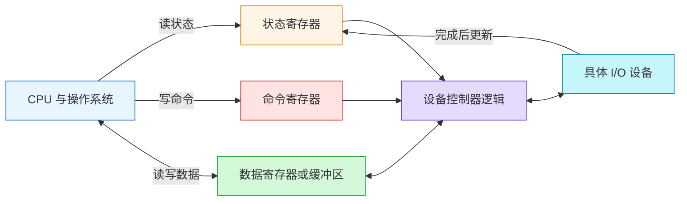
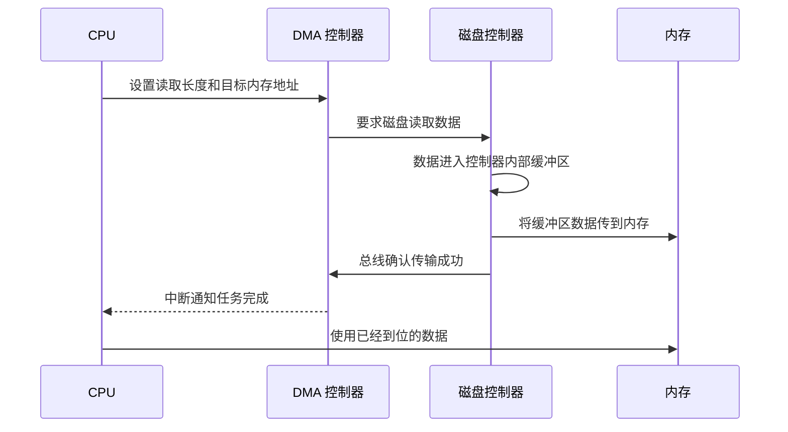
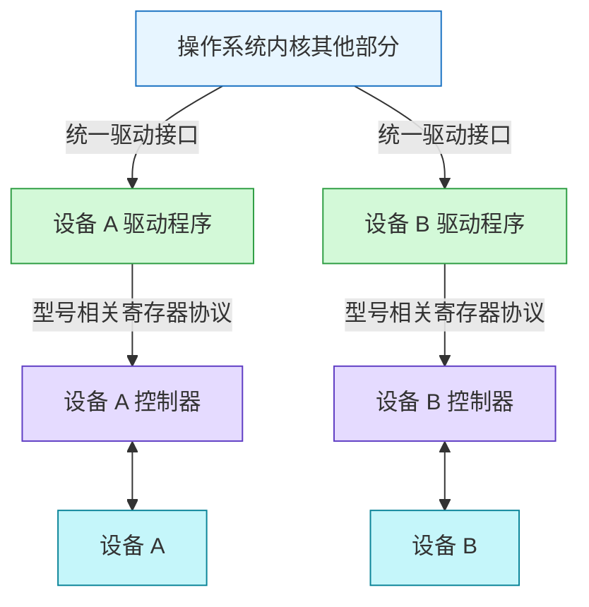
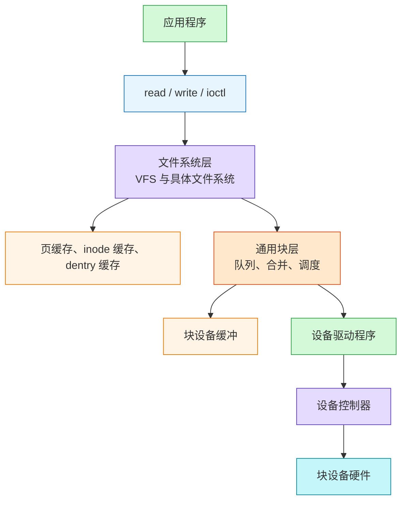
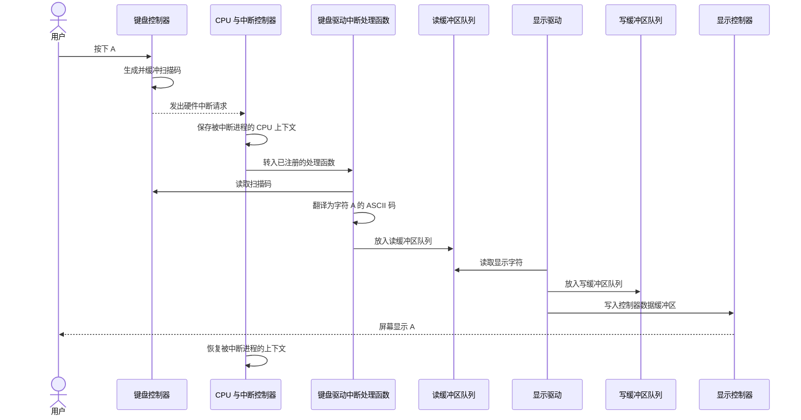
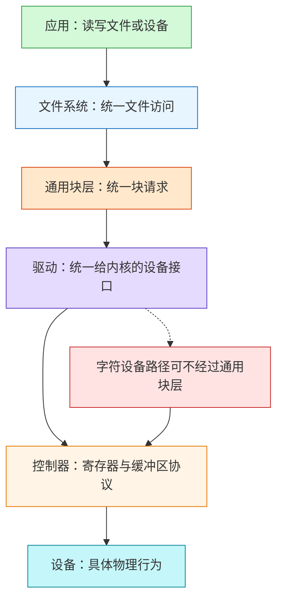
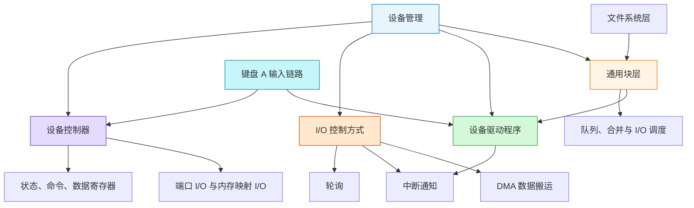

# OS 设备管理：从控制器寄存器到键盘字符显示

> Source: [`materials/os/7_device/device.md`](../../../materials/os/7_device/device.md)（已按原文顺序逐行阅读）  
> Durable goal: 不把“按下 A”背成孤立步骤，而是能沿着 `设备 -> 控制器 -> 驱动 -> 内核 I/O 层 -> 应用或显示设备` 运行完整心智模型。

### 1. Topic Overview

- **What this is about:** 操作系统如何屏蔽 I/O 设备差异，如何用轮询、中断和 DMA 协调 CPU 与设备，以及键盘扫描码怎样最终成为屏幕上的字符。
- **Why it matters:** 设备管理连接了硬件、内核和应用。理解这一章后，才能准确解释“谁搬数据、谁通知 CPU、谁知道设备寄存器、`read/write` 最终走到哪里”。
- **Difficulty level:** 中等。名词不难，难点是不要把硬件控制器、软件驱动、数据搬运和完成通知混成同一件事。
- **Prerequisites:** CPU 与内存、总线、用户态/内核态、系统调用、进程 CPU 上下文、硬件中断的基本概念。
- **Source order:** 设备控制器 -> I/O 控制方式 -> 设备驱动程序 -> 通用块层 -> 存储 I/O 软件分层 -> 键盘输入全链路。
- **Source boundary:** 本笔记忠实整理原文的教学模型。原文列出的 I/O 调度器反映其写作语境，不应当作所有 Linux 版本和所有设备的固定现状；原文所说由 `INT` 指令触发的“软中断”是软件触发中断的宽泛说法，不要直接等同于 Linux 内核的 `softirq` 机制。

#### Roadmap

1. 用“状态、命令、数据”三类寄存器理解 CPU 如何控制设备。
2. 用“CPU 等不等、CPU 搬不搬”区分轮询、中断和 DMA。
3. 区分硬件控制器与软件驱动，并运行一次中断处理。
4. 解释通用块层为什么既做统一抽象，也做请求调度。
5. 串起文件系统层、通用块层、设备层以及缓存边界。
6. 运行“按下 A -> 扫描码 -> ASCII -> 显示”的完整链路。

### 2. Core Concepts

#### Schema 1：用“状态、命令、数据”运行设备控制器协议

- **Definition:** 设备控制器是位于 CPU 与具体设备之间的硬件组件。CPU 不直接操纵键盘、磁盘或显示器内部细节，而是通过控制器暴露的寄存器和缓冲区发命令、传数据、查状态。
- **Intuition:** 控制器像设备的“硬件翻译员”。CPU 使用较规则的寄存器协议；控制器负责把协议转换成该设备真正理解的动作。
- **Example:** 向打印设备发送字符 `H` 时，CPU 先确认状态寄存器表明设备可接收CPU 先确认状态寄存器表明设备可接收，再把 `H` 放入数据寄存器或缓冲区，并通过命令寄存器要求设备执行输出。设备完成后再更新状态。

| 控制器对象 | CPU 对它做什么 | 它回答的问题 |
| --- | --- | --- |
| 状态寄存器 | 读取 | 设备正在忙、已就绪还是已经完成？ |
| 命令寄存器 | 写入命令 | 希望设备执行输入、输出或其他什么动作？ |
| 数据寄存器 | 读入或写出数据 | 这次传输的实际内容是什么？ |
| 数据缓冲区 | 成批暂存数据 | 怎样减少对块设备的频繁小粒度操作？ |

#### Visual Model：CPU 如何通过控制器而不是直接操纵设备？



- **How to read:** 先查状态，再通过命令和数据通道发起动作；控制器执行设备细节，完成结果再反映到状态通道。
- **Source anchor:** [`device.md`“设备控制器”](../../../materials/os/7_device/device.md#设备控制器)。
- **Boundary:** 三类寄存器是职责模型，不表示所有现实设备都只暴露三个物理寄存器；原文要建立的是“状态、命令、数据”三种信息角色。
- **Common mistakes:**
  - 把设备控制器说成操作系统中的软件；它属于硬件。
  - 把命令寄存器当作传输正文数据的地方。
  - CPU 未检查忙碌状态就不断发送下一条命令。
  - 认为 CPU 必须理解每种设备内部的物理工作方式。

块设备与字符设备还体现了两种不同的数据组织方式：

- **块设备:** 数据按固定大小块组织，每块可寻址；原文举硬盘、USB 为例。数据量通常较大，因此控制器缓冲区可聚合传输，减少频繁操作。
- **字符设备:** 以字符流为单位发送或接收，不按数据块寻址，也没有寻道操作；原文举鼠标为例。

CPU 访问控制器寄存器也有两条路径：

- **端口 I/O:** 给控制寄存器分配独立 I/O 端口，用 `in/out` 等专门指令访问。
- **内存映射 I/O:** 把控制寄存器映射进地址空间，CPU 像读写内存地址一样访问它们。

#### Schema 2：用“CPU 等不等、CPU 搬不搬”区分轮询、中断和 DMA

- **Definition:** 三种 I/O 控制方式主要改变两项责任：CPU 是否持续等待完成，以及数据搬运是否由 CPU 逐步参与。
- **Intuition:** “完成后怎样通知”与“传输期间由谁搬数据”是两个问题。中断主要解决前者，DMA 主要减少后者的 CPU 负担，并通常仍在结束时用中断通知。
- **Example:** 磁盘读取大量数据时，如果每一小段都让 CPU 轮询或搬运，CPU 会被 I/O 拴住。DMA 让 CPU 只设置传输长度和内存目标地址，传输完成后再接收一次中断。

| 方式 | 等待方式 | 数据移动中的 CPU 负担 | 典型代价 |
| --- | --- | --- | --- |
| 轮询 | CPU 反复读取状态位 | 高 | 等待期间持续占用 CPU |
| 中断 | CPU 先做别的，设备完成后通知 | 仍需 CPU 参与相应处理 | 频繁完成会产生大量中断开销 |
| DMA | CPU 设置任务后离开，结束时中断 | 批量设备到内存传输无需 CPU 逐字节参与 | 需要 DMA 控制器硬件支持 |

#### Visual Model：磁盘 DMA 读取时各组件如何配合？



- **How to read:** CPU 只负责启动和收尾；中间的大块数据路径是磁盘控制器到内存，结束通知则由 DMA 控制器用中断完成。
- **Source anchor:** [`device.md`“I/O 控制方式”](../../../materials/os/7_device/device.md#io-控制方式)。
- **Boundary:** DMA 不是“CPU 从此完全不知道 I/O”。CPU 仍要配置传输、处理中断并使用结果；减少的是传输过程中的持续干预。
- **Common mistakes:**
  - 把 DMA 和中断当作互斥方案；原文的 DMA 流程结束时仍用中断通知 CPU。
  - 认为中断负责搬运整批数据；中断是控制流通知机制。
  - 认为轮询期间 CPU 可以完全去执行其他任务。
  - 说 DMA 让数据直接进入 CPU 寄存器；目标是内存。

#### Schema 3：用“硬件控制器 vs 软件驱动”定位设备差异的两道边界

- **Definition:** 控制器属于硬件，直接懂得设备；驱动属于操作系统，懂得如何读写某型号控制器的寄存器和缓冲区，并向内核提供较统一的接口。
- **Intuition:** 控制器屏蔽设备内部物理细节，驱动再屏蔽不同控制器的编程差异。内核其他部分无需到处硬编码每个控制器的寄存器协议。
- **Example:** 键盘驱动初始化时注册中断处理函数。键盘控制器产生中断后，CPU 进入该处理函数，由它读取控制器缓冲区中的扫描码并继续处理。

#### Visual Model：差异在哪一层被吸收？



- **How to read:** 上半部分是统一的软件调用面，下半部分是设备相关的硬件协议；驱动正好跨在这条边界上。
- **Source anchor:** [`device.md`“设备驱动程序”](../../../materials/os/7_device/device.md#设备驱动程序)。
- **Common mistakes:**
  - 把驱动说成控制器芯片中的固件，或把控制器说成内核代码。
  - 认为统一驱动接口意味着所有控制器寄存器布局相同。
  - 只说“设备发中断”，说不出驱动要预先注册相应处理函数。

原文给出的中断处理主线是：

1. 设备控制器准备好数据，经中断控制器向 CPU 发出请求。
2. 保存被中断进程的 CPU 上下文。
3. 转入对应设备的中断处理函数。
4. 执行设备相关的中断处理。
5. 恢复被中断进程的 CPU 上下文。

#### Schema 4：用“统一接口 + 请求调度”理解通用块层

- **Definition:** 通用块层位于文件系统与磁盘驱动之间，是 Linux 对块设备的统一抽象和 I/O 请求组织层。
- **Intuition:** 驱动统一的是“内核如何操纵某个控制器”，通用块层进一步统一的是“上层如何提交块请求”，并在多个请求之间安排执行顺序。
- **Example:** 文件系统提交多个读写请求后，通用块层可排队、合并或重排请求，再把选中的 I/O 交给下方设备驱动。
- **Two responsibilities:**
  - 向上提供标准块设备访问接口，向下把不同磁盘抽象为统一块设备并提供驱动管理框架。
  - 组织 I/O 请求队列，通过排序、合并和调度改善磁盘读写效率。

原文列出五类 I/O 调度方式：

| 原文类别 | 核心规则 | 原文给出的适用考虑 |
| --- | --- | --- |
| 无调度 | 不在本层重新安排请求 | 虚拟机中可把调度交给物理机 |
| 先入先出 | 先进入队列的请求先执行 | 简单直接 |
| 完全公平 | 为进程维护队列，按时间片分配请求 | 在进程间均匀分布 I/O |
| 优先级 | 高优先级请求先执行 | 多进程、桌面或多媒体负载 |
| 最终期限 | 区分读写队列，临近期限者优先 | I/O 压力大、数据库等场景 |

- **Source anchor:** [`device.md`“通用块层”](../../../materials/os/7_device/device.md#通用块层)。
- **Boundary:** “通用块层”只针对块设备。键盘这样的字符输入链路不会因为存在通用块层就被强行变成磁盘块请求。
- **Common mistakes:**
  - 把通用块层和设备驱动当成同一层。
  - 只记请求排序，忘记它还提供统一块设备抽象。
  - 认为所有设备都必须经过通用块层。
  - 把原文的调度器清单当成当前所有内核的固定配置。

#### Schema 5：用“三层软件栈”追踪存储 I/O

- **Definition:** 原文把 Linux 存储 I/O 从上到下压成文件系统层、通用块层和设备层。
- **Intuition:** 上层回答“读哪个文件的哪些字节”，中层回答“块请求怎样排队并选下一项”，下层回答“怎样让具体硬件真的完成 I/O”。
- **Example:** 应用调用 `read` 读取普通文件时，文件系统解析文件语义并形成块 I/O；通用块层组织请求；设备驱动操纵控制器；硬件最终读取数据。

#### Visual Model：一次存储请求如何从文件接口下沉到硬件？



- **How to read:** 文件系统负责文件抽象，通用块层负责块请求组织，设备层负责真实硬件动作；缓存和缓冲减少慢设备访问或合并传输。
- **Source anchor:** [`device.md`“存储系统 I/O 软件分层”](../../../materials/os/7_device/device.md#存储系统-io-软件分层)。
- **Boundary:** `read/write` 是常规数据访问接口；设备特有的配置和属性需要 `ioctl`。Linux 的“设备也是特殊文件”表示可接入统一文件接口，不表示所有设备都有普通磁盘文件相同的存储语义。
- **Common mistakes:**
  - 认为 `read` 直接从应用跳到控制器。
  - 把页缓存、inode 缓存、dentry 缓存都说成控制器内部缓冲区。
  - 认为 `ioctl` 只是另一种普通文件内容读写。
  - 把设备层遗漏驱动，只留下硬件与控制器。

#### Schema 6：运行“按下 A -> 扫描码 -> ASCII -> 显示”的完整链路

- **Definition:** 键盘输入链路把物理按键事件转换为扫描码，经硬件中断进入键盘驱动，再翻译成字符编码并通过缓冲队列交给显示路径。
- **Intuition:** 按键本身不会直接把字符 `A` 写进应用或屏幕。硬件先报告“哪个键发生了什么”，软件再解释该扫描码并把字符送往后续消费者。
- **Example:** 用户按下 `A` 后，键盘控制器生成并缓冲扫描码，发中断；CPU 保存当前进程上下文并执行键盘中断处理函数；处理函数读取扫描码并翻译成 `A` 的 ASCII 码，放入读缓冲区队列；显示驱动再经写缓冲区和显示控制器显示字符，最后恢复上下文。

#### Visual Model：按下 A 后，控制流和数据流怎样前进？



- **How to read:** 上半段是输入设备产生数据并用中断交给驱动，下半段是字符编码经过队列和显示驱动走到输出设备。
- **Source anchor:** [`device.md`“键盘敲入字母时，期间发生了什么？”](../../../materials/os/7_device/device.md#键盘敲入字母时期间发生了什么)。
- **Boundary:** 扫描码不是 ASCII 码；扫描码描述键盘事件，驱动处理后才得到显示字符编码。原文聚焦操作系统与设备管理主线，没有展开终端子系统、输入法、窗口系统或应用读取输入等更具体实现。
- **Common mistakes:**
  - 说键盘控制器直接生成 ASCII 码。
  - 忘记中断前后要保存和恢复 CPU 上下文。
  - 把键盘驱动与显示驱动说成同一个组件。
  - 把中断请求本身当作字符数据。

### 3. Deep Understanding

#### 3.1 本章的主轴：逐层吸收差异

本章所有组件可以用一个重复出现的设计模式连接起来：

```text
设备内部差异
-> 设备控制器暴露寄存器协议
-> 设备驱动封装控制器编程差异
-> 通用块层统一块请求并调度
-> 文件系统向应用暴露 read/write 文件接口
```

每向上一层，接口更统一、硬件细节更少；每向下一层，操作更具体、更接近真实设备。这个“统一接口在上、设备细节在下”的结构，比单独背每个名词更可迁移。

#### Visual Model：设备管理的抽象边界在哪里？



- **How to read:** 存储块请求沿主干向下；字符设备可从驱动进入设备层，不需要经过块层。
- **Source anchor:** 原文“设备驱动程序”“通用块层”“存储系统 I/O 软件分层”的组合关系。
- **Boundary:** 这张图压缩的是原文抽象关系，不表示每种设备的现实内核路径都完全相同。

#### 3.2 必须分开的四种责任

| 问题 | 主要负责者 | 本章线索 |
| --- | --- | --- |
| 设备现在忙不忙、命令是什么、数据是什么？ | 设备控制器寄存器与缓冲区 | 状态、命令、数据 |
| 控制器寄存器该怎样编程？ | 设备驱动程序 | 型号相关控制器协议 |
| 完成后怎样让 CPU 知道？ | 状态轮询或硬件中断 | 控制流通知 |
| 大块数据怎样少占 CPU 地搬到内存？ | DMA 控制器与设备控制器 | 数据搬运 |

最重要的边界是：**中断解决“通知”，DMA 解决“搬运负担”**。DMA 完成后仍可用中断通知，因此二者不是互斥替代关系。

#### 3.3 硬件与软件所有权

| 组件 | 硬件或软件 | 主要职责 |
| --- | --- | --- |
| 具体设备 | 硬件 | 完成输入、输出或存储动作 |
| 设备控制器 | 硬件 | 执行设备逻辑，暴露寄存器与缓冲区 |
| 中断控制器 | 硬件 | 汇集并通知 CPU 有硬件中断 |
| DMA 控制器 | 硬件 | 按 CPU 配置组织设备到内存的批量传输 |
| 设备驱动程序 | 内核软件 | 操纵特定控制器，向内核提供统一接口 |
| 中断处理函数 | 内核软件，通常由驱动注册 | 响应特定设备中断并处理数据或状态 |
| 通用块层 | 内核软件 | 统一块请求、队列、合并和调度 |
| 文件系统层 | 内核软件 | 提供文件访问抽象并形成下层存储请求 |

### 4. Minimal Working Example

#### 场景：应用读取一个不在缓存中的磁盘块

以下是把本章各局部机制连成一条合理主线的教学化执行流：

1. 应用调用 `read`，进入内核文件系统接口。
2. 文件系统确定所需文件数据对应的块请求，并交给通用块层。
3. 通用块层把请求排入队列，必要时合并或调度，再交给磁盘驱动。
4. 驱动按磁盘控制器的寄存器协议设置命令，并为 DMA 传输准备长度与内存目标位置。
5. CPU 返回做其他工作；磁盘控制器读取设备数据并将其送到内存。
6. DMA 完成后用中断通知 CPU。
7. CPU 保存当前上下文，进入驱动注册的中断处理函数，确认完成并处理结果。
8. 内核让原来等待数据的执行流后续能够继续，最终把数据交给应用；中断返回时恢复被打断现场。

#### Reasoning flow


- **How to read:** 请求路径向下到设备，数据完成信号再向上唤醒软件处理。
- **Source anchor:** 这是原文 DMA、驱动中断、通用块层和存储软件分层四部分的组合示例。
- **Boundary:** 原文没有展开阻塞进程唤醒、页缓存命中与具体块层 API；这里仅用已有章节知识把源文组件拼成最小工作路径，不把额外实现细节当成本章原文结论。

### 5. Chapter Knowledge Map



### 6. Self-Test Questions

#### Recall

1. 状态寄存器、命令寄存器、数据寄存器分别回答什么问题？
2. 设备控制器与设备驱动程序哪个是硬件、哪个属于操作系统？
3. 通用块层的两个核心功能是什么？

#### Application / Transfer

4. 一个高速设备每完成 1KB 就中断一次，CPU 中断负担很重。你会优先考虑哪种机制减少传输期间的 CPU 干预？为什么结束时仍可能需要中断？
5. 某人说“键盘是设备，所以键盘输入也必须先经过通用块层调度”。请指出错误边界。

#### Explain like I am 5

6. 用“前台、翻译员、仓库搬运工、门铃”四个角色解释驱动、控制器、DMA 和中断各自做什么。

### 7. Weak Point Detection

- **硬件/软件边界混淆:** 把设备控制器和驱动程序当成同一个组件。
- **通知/搬运边界混淆:** 认为中断搬运批量数据，或认为 DMA 完成后不需要任何通知。
- **编码层次混淆:** 把键盘扫描码直接当 ASCII 码。
- **抽象层次混淆:** 把文件系统、通用块层和设备驱动压成一个“内核 I/O 层”。
- **设备类型混淆:** 认为字符设备也必须经过通用块层或能按块地址寻道。
- **缓存位置混淆:** 把页缓存、inode/dentry 缓存、块设备缓冲和控制器缓冲区说成同一份缓存。
- **时序缺口:** 能背组件名，但无法按“请求向下、完成通知与数据向上”串成因果链。
- **版本边界缺失:** 把原文教学性 I/O 调度器清单说成所有现代 Linux 机器的固定事实。
