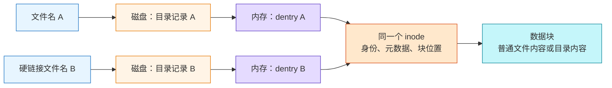
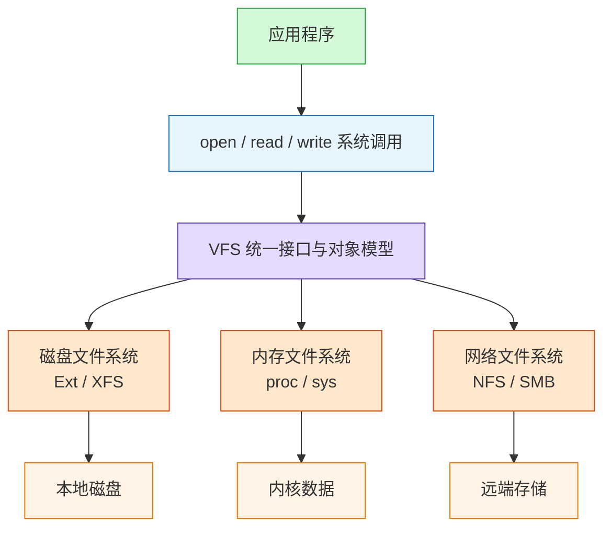
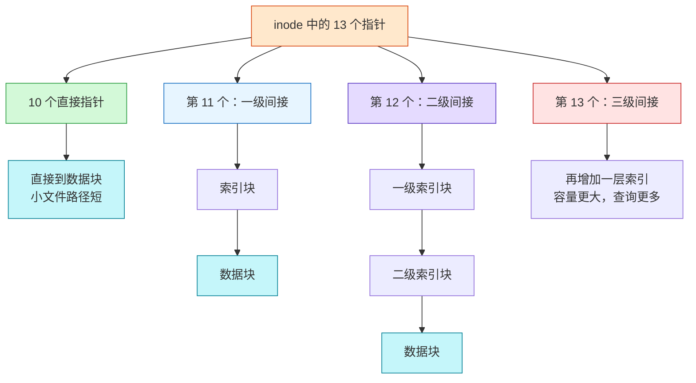
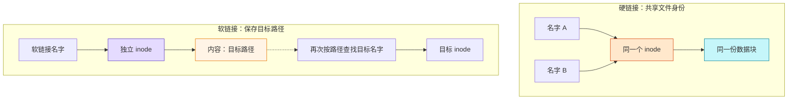
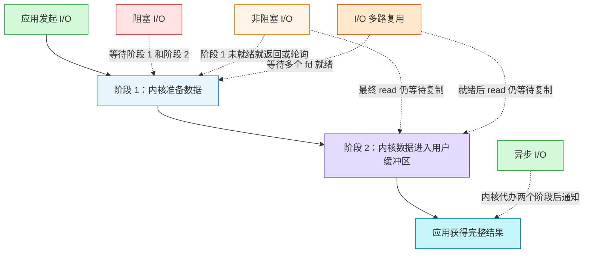
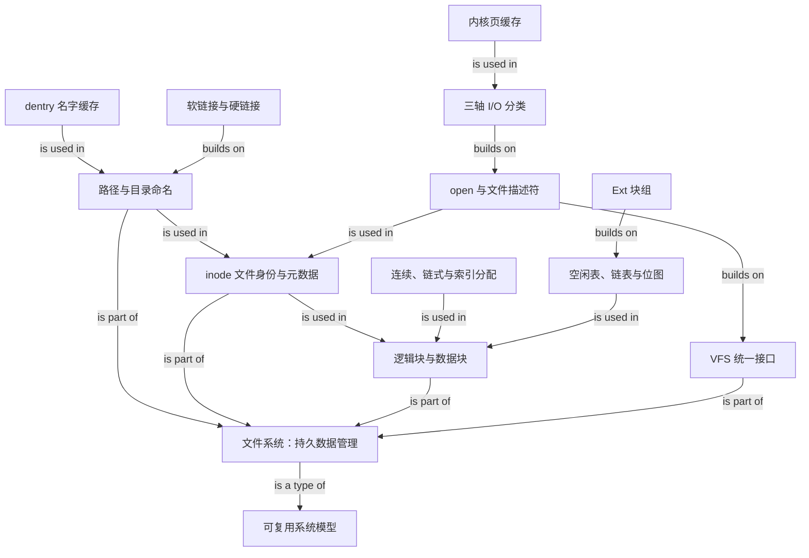

# OS 文件系统全家桶：从文件名到磁盘块

> Source: [`materials/os/6_file_system/file_system.md`](../../../materials/os/6_file_system/file_system.md)（已按原文顺序完整阅读）  
> Durable goal: 不只记住术语，而是能沿着“名字如何定位对象、对象如何定位数据、I/O 在哪一层等待”运行文件系统心智模型。

### 1. Topic Overview

- **What this is about:** Linux 如何用目录、dentry、inode、数据块和 VFS 把“按文件名读写字节”的用户需求，转换成对磁盘块或其他后端的管理。
- **Why it matters:** `open/read/write`、硬链接、目录查找、文件分配和 I/O 模型看似是分散知识点，实际上都围绕“命名、身份、存储、访问”四层展开。
- **Difficulty:** 中等偏高。概念本身不难，难点是同名概念所在层不同，以及多个分类轴容易混在一起。
- **Prerequisites:** 系统调用与用户态/内核态、磁盘扇区与内存页的基本概念、进程文件描述符。
- **Source order:** 基本组成 → VFS → 文件使用 → 文件存储 → 空闲空间 → Ext 块组 → 目录 → 软/硬链接 → 文件 I/O。

### 2. Core Concepts

#### Schema 1：用“名字—身份—内容”三层定位文件

- **Definition:** 文件名属于命名层，inode 表示文件身份并保存元数据与数据块位置，数据块保存真正的文件内容或目录内容。
- **Intuition:** 找人时，“名字”不是“身份证”，身份证也不是“这个人携带的物品”。文件系统同样把可变的名字、稳定的对象身份和实际内容分开。
- **Example:** 路径中的每个名字都有自己的目录记录，并可形成各自的 dentry；多个名字可以在下一层共同指向同一个 inode，inode 再定位同一份数据块。
- **Key objects:**
  - `inode`：文件系统内的文件标识与元数据，包含权限、大小、时间和数据块位置等；持久化在 inode 区，需要访问时再载入内存。
  - `dentry`：内核维护的内存数据结构，缓存名字、inode 关联和目录层次。
  - `目录文件`：本身也有 inode；其磁盘数据块保存“名字 → inode”等目录记录，而普通文件的数据块保存业务数据。
  - `超级块`：描述整个文件系统的块数、块大小、空闲块等；文件系统挂载时载入内存。
  - `逻辑块`：文件系统基本读写单位。原文以 `4KB` 逻辑块、每块含 8 个 `512B` 扇区为例。

#### Visual Model：输入文件名后，系统最终怎样找到文件内容？



- **How to read:** 两条独立命名路径各自拥有目录记录和 dentry，只在 inode 层汇合，然后共享数据块。
- **Source anchor:** [`file_system.md:10`](../../../materials/os/6_file_system/file_system.md#文件系统的基本组成)。
- **Boundary:** 原文强调 dentry 是内存结构；不要因此误以为目录在磁盘中不保存名字与 inode 关联，目录文件的数据块正负责持久化这些目录记录。
- **Common mistakes:**
  - 把目录文件和 dentry 当成同一对象。
  - 认为 inode 保存文件名。
  - 认为同一个文件只能有一个名字。
  - 把扇区、逻辑块和内存页当成同一个概念。

#### Schema 2：用 VFS 把“统一接口”和“不同后端”分层

- **Definition:** VFS 是系统调用与具体文件系统之间的统一抽象层，规定共同数据结构和操作接口。
- **Intuition:** 应用只需要会 `open/read/write`，不需要为 Ext4、`/proc`、NFS 分别写一套调用方式。
- **Example:** 同一个 `read` 接口可由磁盘文件系统读取磁盘、由内存文件系统读取内核数据，或由网络文件系统访问远端主机。
- **Three source categories:**
  - 磁盘文件系统：Ext2/3/4、XFS。
  - 内存文件系统：`/proc`、`/sys`，读写的是内核相关数据。
  - 网络文件系统：NFS、SMB。
- **Mount boundary:** 文件系统需要挂载到目录后，才能接入统一目录树被正常访问。

#### Visual Model：为什么应用不必理解每一种文件系统？



- **How to read:** 接口在 VFS 处统一，真正的数据来源在 VFS 之下分流。
- **Source anchor:** [`file_system.md:60`](../../../materials/os/6_file_system/file_system.md#虚拟文件系统)。
- **Common mistakes:**
  - 把 VFS 当成一种具体的磁盘格式。
  - 认为 `/proc` 中的内容一定持久化在磁盘。
  - 忘记“挂载”是让一个文件系统接入目录树的动作。

#### Schema 3：用 `open` 把路径名转换成后续 I/O 所需的 `fd`

- **Definition:** `open(name, flags)` 完成路径查找并建立打开状态，返回进程打开文件表中的文件描述符；后续 `read/write/close` 使用 `fd`，不再每次使用文件名。
- **Intuition:** 文件名用于“找到并打开对象”，`fd` 用于“操作这次打开实例”。
- **Example:** `fd = open("a.txt", O_WRONLY)` 后，`write(fd, ...)` 通过打开文件状态追踪当前偏移、访问模式、磁盘位置与引用计数。
- **Open-state information in the source:**
  - 当前文件位置指针。
  - 打开计数，用于判断何时删除打开文件表项。
  - 文件磁盘位置的内存信息。
  - 访问权限或打开模式。
- **Byte/block bridge:** 用户可请求 1 字节，但文件系统需找到包含该字节的逻辑块；写 1 字节时通常要修改对应块中的局部内容并在适当时机写回。
- **Common mistakes:**
  - 把 `fd` 当成 inode 编号。
  - 认为每次 `write` 都重新按文件名查找。
  - 因为用户请求 1 字节，就认为磁盘也只操作 1 字节。

#### Schema 4：按“随机访问、扩展、元数据成本”比较文件块分配

- **Definition:** 文件块组织方法不是单纯的快慢排名，而是连续性、扩展能力、随机访问、可靠性与索引开销之间的取舍。
- **Continuous allocation:** 文件头记录起始块与长度；顺序读性能好，但会产生外部碎片，文件扩展困难，并通常需要提前知道大小。
- **Implicit linked allocation:** 文件头记录首尾块，每个数据块保存下一块指针；可离散扩展，但随机访问差、块内指针占空间，链中指针损坏会截断后续数据。
- **FAT explicit linking:** 把全盘块链指针集中到内存表中，减少沿链读取磁盘的次数；大磁盘会让整张表占用大量内存。它仍保留“沿链定位”的结构，不等价于索引表的常数次随机定位。
- **Indexed allocation:** 每个文件有索引块，索引项指向数据块；支持顺序和随机读写，也便于扩缩，但小文件也可能承担额外索引块开销。
- **Large files:** 单一索引块不够时，可用链式索引块或多级索引块；前者继承链断裂风险，后者通过增加层数扩大寻址能力。
- **External-fragmentation boundary:** 非连续分配解决的是连续大空洞要求造成的外部碎片问题，不代表块内空间永远没有浪费。

#### Visual Model：早期 Unix inode 为什么同时照顾小文件和大文件？



- **How to read:** 文件越小，越靠左走短路径；文件越大，越依赖右侧更深的间接索引。
- **Source anchor:** [`file_system.md:126`](../../../materials/os/6_file_system/file_system.md#文件的存储) 与 [`file_system.md:223`](../../../materials/os/6_file_system/file_system.md#unix-文件的实现方式)。
- **Boundary:** 原文描述的是早期 Unix 以及 Ext2/3 的经典 10+1+1+1 教学模型，并未展开 Ext4 的 extent 改进。
- **Common mistakes:**
  - 只记“连续最快”，不考虑扩展和碎片。
  - 把 FAT 当作每个文件一张表；原文模型是全盘一张表。
  - 认为索引分配没有任何空间成本。
  - 把“直接指针”误解为数据本身存放在 inode 中。

#### Schema 5：用“位图 + 块组”把空闲空间管理扩展到大磁盘

- **Definition:** 已占用块的组织方式解决“文件的块在哪里”，空闲空间管理解决“下一块从哪里分配”。
- **Free table:** 每项记录连续空闲区的起始块号与块数；适合空闲区较少、连续分配较多的情况，碎片多时表会膨胀且扫描慢。
- **Free list:** 每个空闲块指向下一个空闲块；实现简单、内存只需保存链头，但随机访问差，增删会产生额外磁盘 I/O，指针也占空间。
- **Bitmap:** 每个磁盘块用 1 bit 表示空闲/已分配；Linux 还分别维护数据块位图与 inode 位图。
- **Why block groups:** 一个 `4KB` 位图只有 `32768` bit，若每 bit 管一个 `4KB` 数据块，只覆盖 `128MB`。因此 Ext2 把文件系统拆成许多块组，每组局部管理位图、inode 与数据块。
- **Block-group contents:** 超级块副本、块组描述符、数据位图、inode 位图、inode 列表、数据块。
- **Two design goals:** 重要元数据冗余便于崩溃恢复；让文件数据与管理数据靠近，减少机械磁盘寻道与旋转成本。
- **Sparse copies:** 后续 Ext2 只在部分块组保存超级块与组描述符副本，减少冗余开销。
- **Common mistakes:**
  - 把文件分配表 FAT 和空闲表混为一谈。
  - 认为位图只管理数据块，不管理 inode。
  - 算 `128MB` 时忘记“位图中的 1 bit 对应一个 4KB 数据块”。
  - 把块组看作多个独立文件系统；它们共同构成一个文件系统。

#### Schema 6：把目录运行成“文件名 → inode”的索引

- **Definition:** 目录也是文件，其数据块存放目录项记录，如文件名、inode 和文件类型。
- **Intuition:** 普通文件的内容是用户数据，目录文件的内容是“这个目录里有哪些名字，它们指向谁”。
- **Example:** `.` 指当前目录，`..` 指上级目录；查找普通名字时，先从目录数据中得到 inode，再访问目标文件。
- **List vs hash:** 小目录可按列表顺序查找；大量文件时，哈希目录可加速查找、插入和删除，但要处理哈希冲突。
- **Cache link:** 目录查询需要磁盘 I/O，因此内核会缓存近期目录查找结果；这正是 dentry 的价值。
- **Common mistakes:**
  - 认为目录数据块直接保存所有子文件内容。
  - 看到 dentry 在内存，就认为目录信息从不落盘。
  - 把文件名哈希值误认为 inode。

#### Schema 7：用“共享 inode”与“保存路径”区分硬链接和软链接

- **Hard link:** 新增一个目录名字，但多个目录项指向同一个 inode；不能跨文件系统，因为 inode 身份属于具体文件系统。所有指向该 inode 的目录项都被删除后，文件内容才具备回收条件。
- **Symbolic link:** 创建一个拥有独立 inode 的新文件，其内容是目标路径；可以跨文件系统。目标删除后，软链接文件仍存在，但路径解析失败，成为悬空链接。
- **Decision schema:** 问“两个名字是不是同一 inode”判断硬链接；问“链接文件中是否保存了另一条路径”判断软链接。

#### Visual Model：删除原始名字后，两种链接为什么结果不同？



- **How to read:** 硬链接从两个名字直接汇合到一个 inode；软链接先读出路径，再发起一次路径查找。
- **Source anchor:** [`file_system.md:366`](../../../materials/os/6_file_system/file_system.md#软链接和硬链接)。
- **Boundary:** “源文件”只是最初的那个目录名字，不是高于硬链接的特殊对象；从 inode 角度看，它们都是链接。
- **Common mistakes:**
  - 认为硬链接复制了文件内容。
  - 认为删除最初的文件名一定会删除 inode 和数据。
  - 认为软链接和目标共享 inode。
  - 认为硬链接可以跨文件系统。

#### Schema 8：先问“分类轴在哪一层”，再判断 I/O 模型

- **Axis A — 标准库缓冲:**
  - 缓冲 I/O：`stdio` 等标准库先在用户空间缓冲，目的是减少系统调用次数。
  - 非缓冲 I/O：直接调用系统调用，不经过标准库缓冲。
  - **边界:** 这里的“非缓冲”不等于绕过内核页缓存。
- **Axis B — 操作系统页缓存:**
  - 非直接 I/O：默认经内核页缓存；读时从页缓存复制给用户，写时先复制到页缓存，再由内核按条件回写。
  - 直接 I/O：如 `O_DIRECT`，绕过页缓存的数据路径，经过文件系统直接访问存储。
  - 非直接写回触发：缓存脏数据过多、主动 `sync`、内存紧张、脏数据超过缓存时间。
- **Axis C — 调用等待与完成责任:**
  - 阻塞 I/O：`read` 等待数据准备和内核到用户的复制。
  - 非阻塞 I/O：数据未准备好就立即返回；应用可轮询，但最终成功的 `read` 仍同步完成复制。
  - I/O 多路复用：`select/poll` 等等待多个 fd 的就绪事件；就绪后仍由应用调用 `read` 完成同步复制。优势是一个线程可管理多个 socket，而不是让单个 `read` 变成异步。
  - 异步 I/O：提交后立即返回，数据准备和复制都由内核完成，完成后再通知应用。

#### Visual Model：阻塞/非阻塞与同步/异步到底在哪一步分开？



- **How to read:** 先固定两个阶段，再看应用在哪个阶段等待、由谁触发数据复制。
- **Source anchor:** [`file_system.md:381`](../../../materials/os/6_file_system/file_system.md#文件-io)，尤其是阻塞/非阻塞与同步/异步部分。
- **Common mistakes:**
  - 把标准库缓冲、页缓存和阻塞等待混成同一个“buffer”。
  - 认为 `O_NONBLOCK` 自动等于异步 I/O。
  - 认为 `select/poll` 帮应用把数据复制到了用户缓冲区。
  - 认为 `write` 返回就能只凭本章内容断言数据已经持久化到磁盘。

### 3. Deep Understanding

#### 3.1 四层总模型

文件系统可以压缩成四个问题：

1. **命名层:** 路径和目录如何找到一个文件名？
2. **身份层:** 该名字指向哪个 inode？权限、大小和数据块地址是什么？
3. **存储层:** 数据块如何分配，空闲块如何追踪，块组如何扩大管理范围？
4. **访问层:** `fd` 如何承载一次打开状态，数据经过哪些缓存，调用在哪里等待？

这四层还能解释看似独立的知识点：硬链接改变命名层但共享身份层；软链接在存储层保存另一个路径；VFS 统一访问层接口；不同分配方式改变身份层到数据块的映射成本。

#### 3.2 一次路径读写的因果链

```text
路径名
-> 逐级查询目录文件，命中或建立 dentry
-> 找到目标 inode
-> open 建立打开状态并返回 fd
-> 根据当前偏移定位文件逻辑块
-> 由分配映射找到实际数据块
-> 经页缓存或直接 I/O 路径取得数据
-> 把用户请求的字节范围交给进程
```

#### 3.3 三个不要混淆的“两套结构”

- **磁盘目录记录 vs 内存 dentry:** 前者保证持久命名，后者加速路径查找。
- **inode 位图 vs 数据块位图:** 前者找空闲文件元数据槽，后者找空闲内容块。
- **用户标准库缓冲 vs 内核页缓存:** 前者减少系统调用，后者减少真实存储 I/O；它们可以同时存在。

#### 3.4 取舍不是绝对结论

- 连续分配用扩展困难换取简单和连续访问。
- 链式分配用随机访问与链可靠性换取灵活扩展。
- 索引分配用元数据开销换取随机访问与扩缩能力。
- 多级索引让小文件路径短、大文件可扩展，但大文件定位层数更多。
- 位图压缩状态，块组再把有限位图的管理范围水平扩展。

### 4. Minimal Working Example

场景：进程执行 `fd = open("/home/wei/a.txt", O_RDONLY)`，随后 `read(fd, buf, 1)`。

1. VFS 接收统一的 `open` 系统调用。
2. 路径解析逐级查找 `/`、`home`、`wei`、`a.txt`；目录信息可能从目录数据块读取，并形成或命中 dentry 缓存。
3. `a.txt` 的目录记录给出目标 inode；inode 提供权限、文件大小和数据块映射。
4. 内核建立这次打开的状态，进程得到一个小整数 `fd`。
5. `read(fd, buf, 1)` 根据当前文件偏移判断所需字节属于哪个文件逻辑块。
6. 文件系统通过直接指针或间接索引等映射定位对应数据块。
7. 默认非直接 I/O 情况下，数据先进入或已经位于页缓存，再把所需 1 字节复制给用户缓冲区。
8. 文件偏移前移；下一次 `read` 使用同一个 `fd` 和更新后的打开状态。

**Reasoning test:** 即使应用只要 1 字节，路径查找、inode、逻辑块、页缓存和用户复制仍处在不同层；“请求大小为 1 字节”不能把这些层压成一次 1 字节磁盘操作。

### 5. Chapter Knowledge Map



### 6. Self-Test Questions

#### Recall

1. 文件名、dentry、inode、数据块分别属于什么角色？
2. 连续、隐式链式、FAT、索引分配各自最主要的优点和代价是什么？
3. 一个 Ext 块组中有哪些主要区域，为什么还要有很多块组？

#### Application / Transfer

1. 删除最初的文件名后，为什么硬链接仍能读到内容，而软链接可能失效？请沿 inode/路径说明。
2. 某程序使用 `stdio`、未设置 `O_DIRECT`，并给 fd 设置 `O_NONBLOCK`。分别判断它是否使用标准库缓冲、页缓存，以及它是不是异步 I/O。

#### Explain Like I Am 5

1. 用“通讯录名字、身份证、储物柜”向小朋友解释 dentry、inode 和数据块的关系。

### 7. Weak Point Detection

- **名词表面相似:** 把目录、目录记录、dentry 当成一个东西。
- **身份与句柄混淆:** 把 inode、文件名、fd 都叫作“文件标识”，却说不出各自生命周期和用途。
- **只背优缺点:** 无法根据随机访问、扩展、碎片和元数据成本选择分配方式。
- **规模推导断裂:** 会背 `128MB`，但算不出 `4KB × 8 bit/byte × 4KB/block`。
- **链接边界错误:** 认为软链接共享 inode，或认为硬链接能跨文件系统。
- **I/O 分类串轴:** 把“无 stdio 缓冲”“绕过页缓存”“非阻塞”“异步”当成同一个性质。
- **多路复用误解:** 认为就绪通知已经替应用执行了 `read` 和用户态复制。
