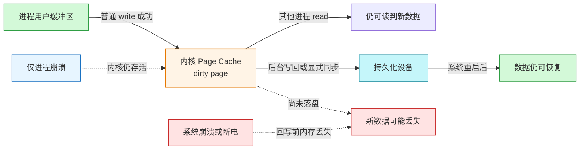
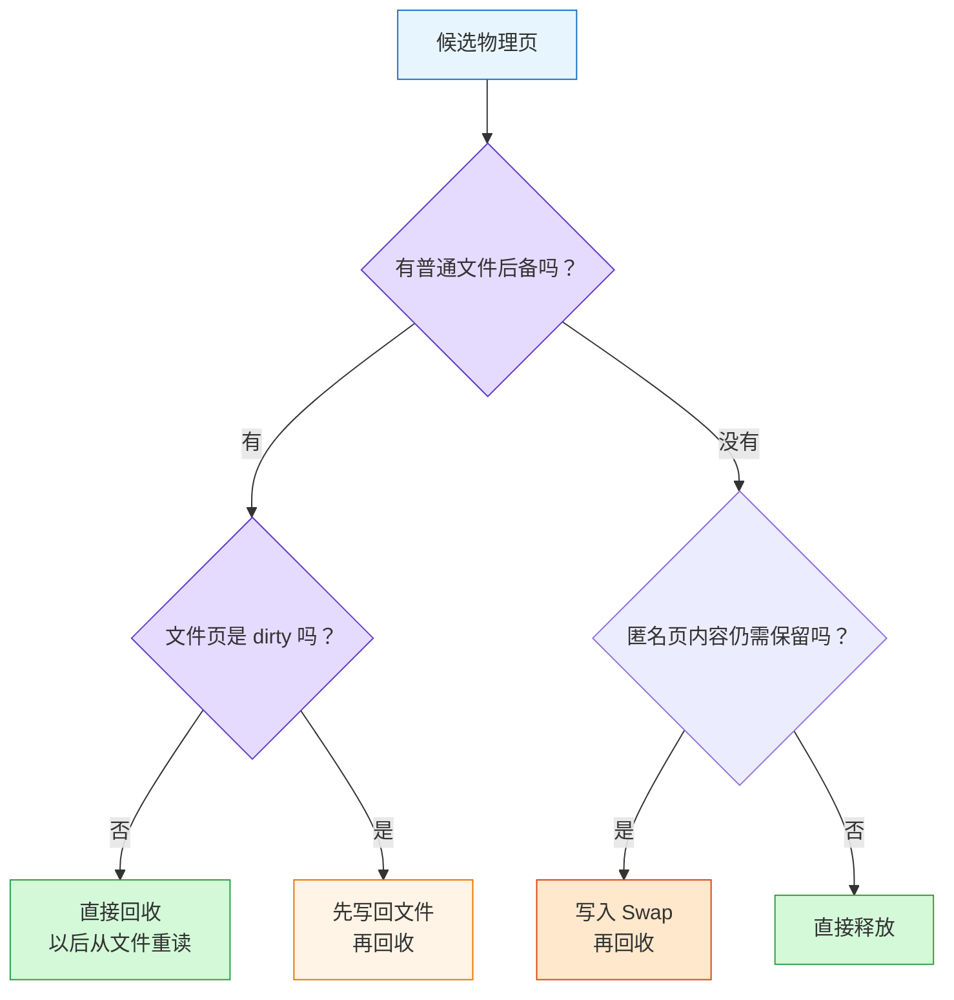
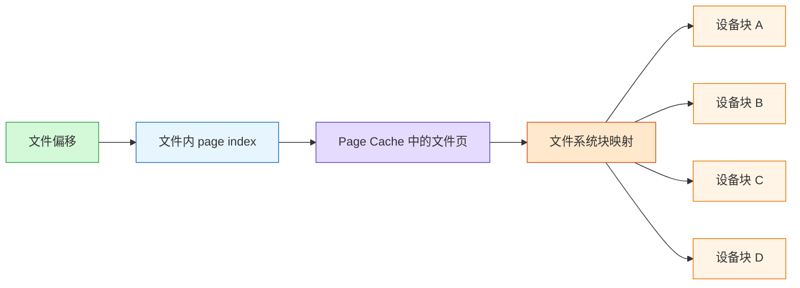
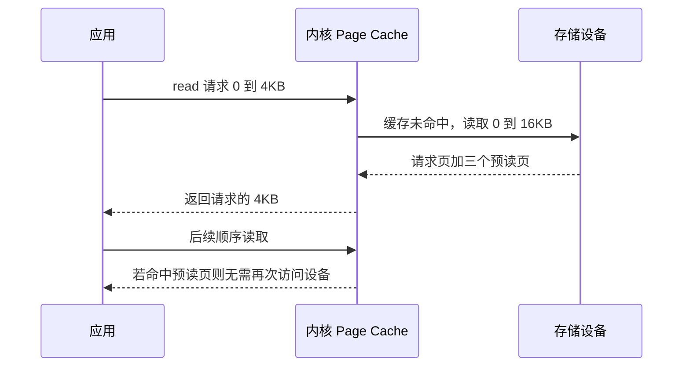
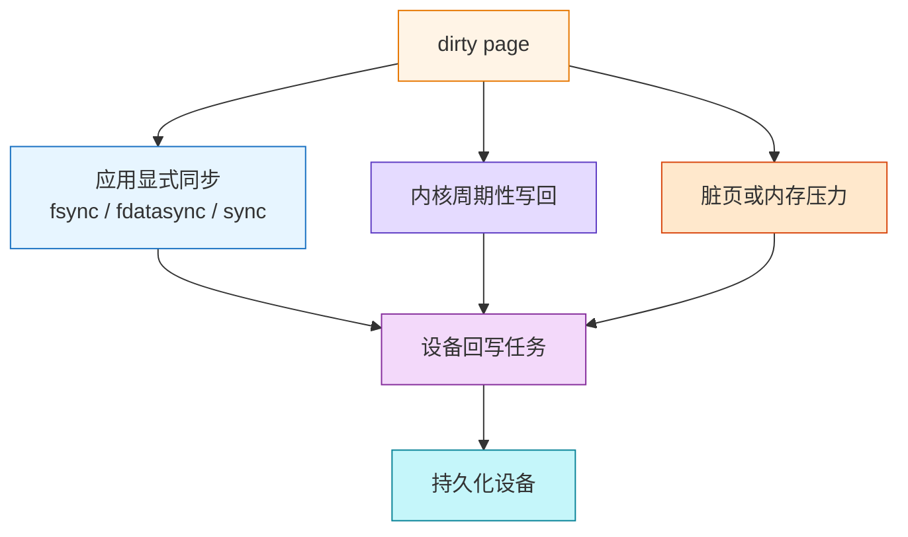
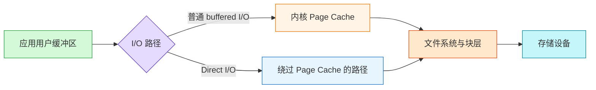
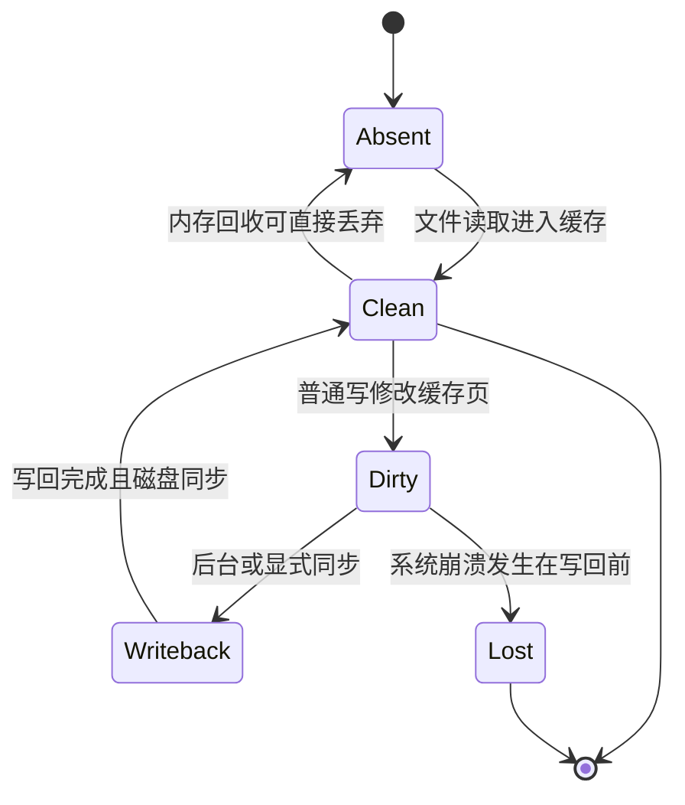
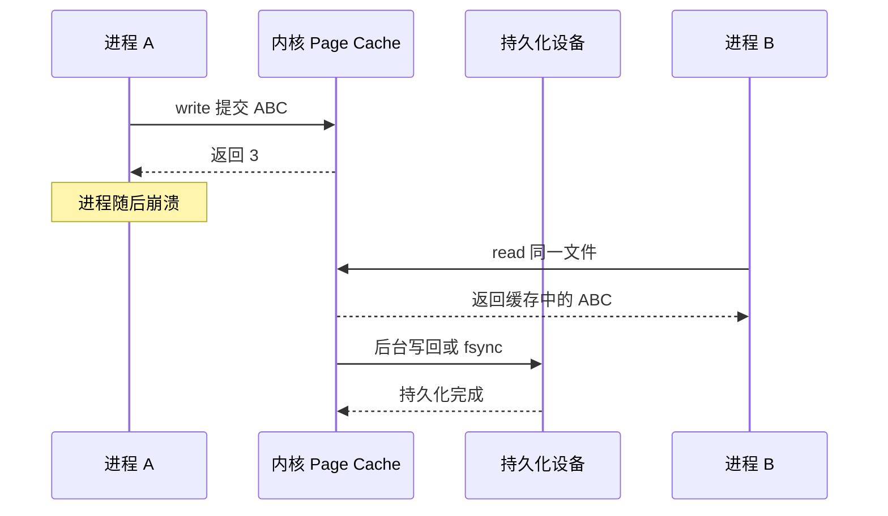
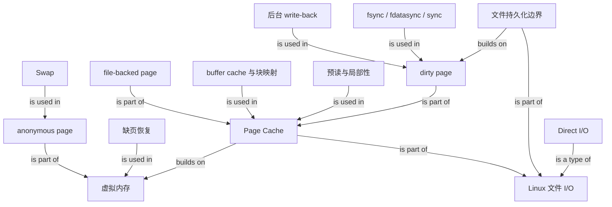

# Linux Page Cache：从 `write` 返回到数据真正落盘

> Source: [`materials/os/6_file_system/pagecache.md`](../../../materials/os/6_file_system/pagecache.md)（已逐段完整阅读）  
> Durable goal: 不把“写成功”“进程崩溃后还能读到”和“系统断电后仍不丢失”混成一件事；能够沿用户缓冲区、Page Cache、脏页和持久化设备追踪数据位置。

### 1. Topic Overview

- **What this is about:** Linux 如何用 Page Cache 缓存文件数据，如何回收文件页与匿名页，如何通过预读和写回提高吞吐量，以及为什么缓存会引入崩溃一致性与可靠性问题。
- **Why it matters:** `write()` 返回并不等于数据已经落盘。排查“进程崩溃、系统宕机、断电后数据是否丢失”时，必须先判断数据当前在哪一层。
- **Difficulty:** 中等偏高。最难的不是记 API，而是区分进程生命周期、内核生命周期和持久化生命周期，并把 `fsync`、后台写回、Swap、Direct I/O 放到正确边界。
- **Prerequisites:** 用户态/内核态、系统调用、虚拟内存与缺页、文件与 inode、内存页和磁盘块。
- **Source order:** 进程崩溃问题 → Page Cache 定义与观测 → file-backed/anonymous page → Swap 与缺页 → Page Cache/buffer cache → 预读 → 脏页一致性与写回 → 优缺点与 Direct I/O。
- **Coverage boundary:** 覆盖原文 269 行中的全部实质内容；末尾宣传内容不纳入学习路线。文章中的历史实现和简化说法会标为“原文模型”或“边界”，避免把它们误当成所有现代 Linux 的绝对规则。

### 2. Core Concepts

#### Schema 1：用“数据当前在哪一层”判断崩溃后是否丢失

- **Definition:** 普通 buffered I/O 的 `write()` 把已接受的数据从用户空间复制到内核 Page Cache，并将对应页标为 dirty；数据之后才由后台写回或显式同步进入持久化设备。
- **Intuition:** `write()` 成功更像“把包裹交给仍在工作的内核仓库”，不是“已经送进不会断电的保险柜”。
- **Example:** 进程 A 的 `write(fd, buf, 4096)` 返回 4096 后被 `kill -9`：A 的用户空间消失，但内核仍运行，dirty page 仍可被进程 B 读取，也可继续后台回写。若整机在回写前掉电，内核内存消失，这 4KB 仍可能丢失。
- **Three distinct events:**
  1. `write()` 返回：说明这些字节已被系统调用接受；普通写通常只到 Page Cache。
  2. 进程崩溃：只销毁该进程资源，不会顺带清空仍存活内核的 Page Cache。
  3. 系统崩溃或断电：内核内存也丢失；尚未持久化的 dirty data 不再可靠。

#### Visual Model：同样叫“崩溃”，为什么结果不同？

- **How to read:** 先沿实线找数据位置，再根据崩溃是否带走内核内存选择分支。
- **Source anchor:** [`pagecache.md:1`](../../../materials/os/6_file_system/pagecache.md) 至 Page Cache 引言。
- **Boundary:** “写一半时进程崩溃也不会丢”只适用于已经被 `write()` 成功接受的字节；尚留在用户缓冲区、尚未提交或发生短写的部分不能自动算作已写入。
- **Common mistakes:**
  - 认为 `write()` 返回就是落盘。
  - 认为进程被 `kill -9` 会清空内核页缓存。
  - 看到进程 B 能读到新数据，就推断断电后也一定存在。
  - 忽略短写，只按原请求长度判断已接受字节数。

#### Schema 2：按“是否有可重建后备”区分文件页与匿名页回收

- **Page:** Linux 内存管理的基本单位；原文采用常见的 `4KB` 页作为教学模型。Page Cache 由多个 page 组成，但并非所有 page 都属于 Page Cache。
- **File-backed page:** 由文件内容支撑，可关联持久化设备上的文件块。干净文件页可直接丢弃，需要时重读；脏文件页回收前必须写回。
- **Anonymous page:** 堆、栈等运行时内存没有普通文件作为可重建后备。若要保留内容，换出时必须把数据写入 Swap。
- **Decision schema:** 回收某页前先问两个问题：它能否从已有文件重建？它是否被修改过？

| 页类型 | 当前状态 | 回收动作 | 主要代价 |
| --- | --- | --- | --- |
| 文件页 | clean | 可直接丢弃，以后从文件重读 | 未来可能发生一次文件读 |
| 文件页 | dirty | 先写回对应文件，再回收 | 脏页回盘 |
| 匿名页 | 仍需保留 | 写入 Swap，再回收 | Swap I/O，通常缺少文件页的天然顺序布局 |

- **Swap and page-fault chain:** 进程的虚拟地址空间总和可以大于物理内存。访问合法但当前不驻留的页时，硬件触发缺页异常；内核必要时选择牺牲页、完成文件写回或 swap out、腾出页框，再把目标页调入并恢复指令。页面替换是“选谁离开”，Swap 是匿名页内容的一种磁盘后备路径，二者不能直接画等号。
- **`swappiness`:** 原文用 `0-100` 描述内核对 Swap 的倾向：数值高，更积极把不活跃匿名页换出；数值低，更倾向保留匿名页以避免交互延迟。它调节策略倾向，不是“虚拟内存开关”。
- **Safety-valve boundary:** Swap 可给短期内存压力或泄漏争取缓冲时间，但持续泄漏会造成频繁换入换出和严重 I/O 抖动，不能把 Swap 当成泄漏修复。

#### Visual Model：内存紧张时，一页能否直接丢弃？

- **How to read:** 文件后备决定“能不能重读”，dirty 状态决定“丢之前要不要写回”。
- **Source anchor:** [`pagecache.md:74`](../../../materials/os/6_file_system/pagecache.md#page-与-page-cache) 与 Swap 小节。
- **Boundary:** 原文把回收调度归给 “MMU” 是简化甚至容易误导的说法；MMU 硬件参与地址翻译并触发缺页异常，选择牺牲页、写回和 Swap 由内核内存管理完成。
- **Common mistakes:**
  - 把所有匿名页都直接称为 Page Cache。
  - 认为 clean file-backed page 回收前也必须再次写盘。
  - 认为缺页异常本身等于 Swap；缺页也可能来自首次分配、文件映射或尚未驻留的文件页。

#### Schema 3：用“文件页索引 + 块映射”理解 Page Cache 与 buffer cache

- **Page Cache essence:** 由 Linux 内核管理、用于缓存文件数据的内存区域；普通 buffered I/O 与文件 `mmap` 都可能使用它。
- **Logical level:** Page Cache 以文件和文件内 page index/offset 组织缓存，回答“这个文件这一页是否在内存”。
- **Block level:** buffer cache 面向块设备块，回答“设备上的这个块是否有缓存或块映射信息”。
- **Historical integration:** 原文说明 Linux 2.4 之前两者分离，容易重复缓存；之后二者近似融合，文件数据主要由 Page Cache 保存，块层维护与其关联的块信息。没有文件表示或绕过文件系统的块仍可能体现 buffer cache 角色。
- **Lookup model:** 原文用“每个文件一棵 radix tree，根据文件偏移定位页”解释查找。应记住的稳定 schema 是 `(文件身份, 页索引) -> cached page`；具体内核数据结构属于实现细节，不能把“radix tree”当作永恒接口。
- **Page/block size example:** 原文示意一个 `4KB` page 可对应四个 `1KB` block；页与块是不同层的单位，不要求大小恒等。

#### Visual Model：文件偏移如何同时连接内存页和设备块？

- **How to read:** 文件偏移先定位缓存页；文件系统再负责把这一页涉及的范围映射到设备块。
- **Source anchor:** [`pagecache.md:124`](../../../materials/os/6_file_system/pagecache.md#page-cache-与-buffer-cache)。
- **Observability:** 原文通过 `/proc/meminfo` 中 `Buffers`、`Cached`、`SwapCached`、`Active(file)`、`Inactive(file)`、`Shmem` 等字段建立近似关系。它适合帮助理解构成，不宜把 `Page Cache = Buffers + Cached + SwapCached` 当作跨内核版本、跨工具口径的精确恒等式。
- **Why SwapCached appears:** 匿名页 swap out 后又 swap in，而 Swap 中的副本仍保留时，内存页暂时有了可用的 Swap 后备，原文因此把它纳入广义 Page Cache 统计解释。
- **Common mistakes:**
  - 把 `page`、文件系统逻辑块和磁盘扇区当成同一单位。
  - 认为现代内核一定保存两份相同文件数据：一份 Page Cache、一份 buffer cache。
  - 把文章中的 `/proc/meminfo` 算式当作严格 API 契约。

#### Schema 4：用“请求范围 + 额外加载 + 后续访问”评价预读

- **Definition:** Page Cache 读未命中时，内核不仅加载应用请求的块/页，还可能基于空间局部性预读相邻范围。
- **Source example:** 应用请求文件 A 的 `[0, 3KB]`；设备基本读取单位使内核至少取 `[0, 4KB]`，随后又预读 `[4KB, 8KB)`、`[8KB, 12KB)`、`[12KB, 16KB)`，最终一次形成 `16KB` 缓存窗口。
- **Benefit:** 若应用继续顺序访问，相邻页已在 Page Cache 中，减少后续磁盘 I/O 次数并提高吞吐量。
- **Cost:** 若应用只访问第一个页，额外页占用内存和 I/O 带宽，还可能挤压真正热点页，形成预读失效与缓存污染。

#### Visual Model：应用只读 4KB，为什么内核可能读 16KB？

- **How to read:** 对应用返回范围和设备实际读取范围是两个不同尺度；收益取决于后续是否访问预读页。
- **Source anchor:** [`pagecache.md:162`](../../../materials/os/6_file_system/pagecache.md#page-cache-与预读)。
- **Common mistakes:**
  - 把“读入 Page Cache”误认为“应用已经使用”。
  - 认为所有多读的数据都必然浪费，忽略顺序访问收益。
  - 只说预读浪费内存，却说不出它可能淘汰热点页。

#### Schema 5：把文件持久化拆成“数据、元数据、触发方式”

- **File = data + metadata:** 文件内容是数据；文件大小、时间、属主属组等是元数据。可靠持久化时要问清需要保证哪一部分。
- **Dirty page:** Page Cache 中的文件页领先于磁盘副本时，该页为 dirty。
- **Write-back:** Linux 默认策略。写调用先更新 Page Cache，内核在之后按周期、内存压力或脏页压力等条件写回，以吞吐量换取崩溃窗口。
- **Write Through in the source:** 原文把应用主动调用同步接口的路径称为 Write Through；更稳妥的记法是“普通写仍可先进入 Page Cache，应用随后在可靠性边界显式等待同步完成”。
- **Explicit synchronization:** 应用在可靠性边界主动要求同步，以更多等待和设备 I/O 换取更强保证。

| 接口 | 原文中的同步范围 | 判断重点 |
| --- | --- | --- |
| `fsync(fd)` | 该文件脏数据与脏元数据 | 文件内容和相关文件元数据都要求刷新 |
| `fdatasync(fd)` | 脏数据及后续访问所必需的元数据 | 文件大小等必要元数据需要刷新，修改时间等非必要元数据可不强求 |
| `sync()` | 系统范围内的脏文件数据与元数据 | 不是只针对一个 fd |

- **Writeback organization in the source:** 管理线程监控脏页；各持久化设备有对应刷新工作；脏 inode/文件形成待回写集合；显式同步、周期唤醒和内存回收都可提交回写任务。

#### Visual Model：dirty page 会被哪些事件推进到持久化设备？

- **How to read:** 三种触发最终汇入统一的设备写回路径；差异在“谁决定现在要等到持久化”。
- **Source anchor:** [`pagecache.md:175`](../../../materials/os/6_file_system/pagecache.md#page-cache-与文件持久化的一致性可靠性)。
- **Boundary:** 新建文件、重命名或目录项持久化还可能涉及目录本身的同步；原文主要讨论文件数据与文件元数据，没有展开完整的应用级崩溃一致性协议。
- **Common mistakes:**
  - 只同步数据，却忽略使数据可定位所需的元数据。
  - 认为 write-back 意味着永不落盘；它是延迟和合并写回，不是取消写回。
  - 认为 `sync()` 只同步当前进程或当前文件。

#### Schema 6：用“是否绕过 Page Cache”比较 buffered I/O 与 Direct I/O

- **Buffered file I/O:** 用户空间与磁盘之间夹着 Page Cache。读命中可避免设备 I/O；写可聚合、延迟和顺序化回写。
- **Direct I/O:** 数据路径绕过 Page Cache，通常直接在用户缓冲区与存储设备之间传输；这与 DMA、对齐和设备约束有关。
- **Performance decision:** Page Cache 适合希望由内核统一缓存、利用局部性与预读的工作负载；自带页管理或 Buffer Pool 的系统可能选择 Direct I/O，避免双重缓存并自行控制淘汰和写回。
- **Source example:** MySQL InnoDB 在用户空间按 `16KB` 页管理缓存，是“不完全依赖内核 Page Cache”的典型动机。

#### Visual Model：两条 I/O 数据路径在哪里分叉？

- **How to read:** “直接”只描述是否绕过 Page Cache；两条路径仍都要经过内核和文件系统/块层完成 I/O。
- **Source anchor:** [`pagecache.md:217`](../../../materials/os/6_file_system/pagecache.md#page-cache-的优劣势)。
- **Page Cache advantages:** 内存命中加快访问；预读和写合并减少设备 I/O 次数、提高吞吐量；空闲内存可以积极转化为缓存价值。
- **Page Cache costs:** 占用物理内存；内存紧张时可能推动回收与 Swap；应用难以精细控制透明策略；对已有用户态缓存管理器可能产生额外复制或双重缓存。
- **Extra-path cost in the source:** 某些应用已经在用户空间维护自己的页缓存时，再经过内核 Page Cache 可能增加一次缓存层、额外复制或额外读写路径，这正是它们考虑 Direct I/O 的原因之一。
- **Important boundary:** `O_DIRECT` 的核心语义是绕过 Page Cache，不应单凭它断言“`write` 返回就获得与 `fsync/O_SYNC` 等价的断电持久性”。缓存路径、I/O 完成、写入顺序和持久化保证是不同问题。
- **Common mistakes:**
  - 认为 Direct I/O 完全绕过内核。
  - 认为绕过 Page Cache 必然更快。
  - 把 Direct I/O 当成持久化协议，而不是缓存路径选择。

### 3. Deep Understanding

#### 3.1 Page Cache 是“性能层”，dirty 状态把它变成“可靠性责任”

读缓存命中时，Page Cache 只是磁盘数据的可丢弃副本；写入发生后，它变成领先于磁盘的 dirty version。此时它不仅占内存，还承担“必须在内核消失前推进到持久化设备”的责任。

- **How to read:** `clean` 可重建，`dirty` 有唯一新版本；系统崩溃窗口只在新版本尚未完成持久化时存在。
- **Source anchor:** Page Cache 定义、回收以及一致性&可靠性三部分共同组成的机制。

#### 3.2 三个生命周期必须分开

1. **进程生命周期:** 进程死后，用户地址空间和未提交的用户缓冲区内容消失。
2. **内核生命周期:** 只要系统仍运行，已进入 Page Cache 的数据可脱离原进程继续存在和回写。
3. **持久化生命周期:** 只有经过所需同步边界的数据，才应被当作能够跨系统崩溃保存。

因此，“进程崩溃后另一个进程还能读到”只能证明数据还在内核可见路径上，不能证明它已经获得断电持久性。

#### 3.3 吞吐量与可靠性是一条连续取舍

- 更积极的延迟写回可以聚合小写、改善顺序性并减少 I/O 次数，但扩大系统崩溃时可能丢失的数据窗口。
- 更频繁的 `fsync/fdatasync` 缩短窗口，但让应用更常等待设备完成，降低吞吐量并增加尾延迟。
- Direct I/O 改变缓存与复制路径；它并不自动替应用决定事务边界、元数据顺序或崩溃恢复协议。

#### 3.4 Source-accuracy boundaries

- **MMU vs kernel:** MMU 负责硬件地址翻译与异常入口；页面替换、回收和 Swap 策略由内核实现。
- **Page Cache accounting:** `/proc/meminfo` 公式是文章用来建立直觉的近似口径，不是所有版本上的精确恒等式。
- **Radix tree:** 原文的基数树是实现模型；稳定知识是按文件和 page index 查找缓存页。
- **Direct I/O durability:** 绕过 Page Cache 与获得持久化保证是两条轴。

### 4. Minimal Working Example

场景：进程 A 普通打开已有文件，执行 `write(fd, "ABC", 3)`，返回值为 `3`。

1. `ABC` 从 A 的用户缓冲区复制到内核对应文件的 Page Cache。
2. 对应缓存页成为 dirty，磁盘此刻可能仍是旧内容。
3. 若 A 随后被 `kill -9`，A 的地址空间消失，但内核和 dirty page 仍存在。
4. 进程 B 普通读取该文件时，可能直接从 Page Cache 看到 `ABC`。
5. 内核后台写回完成后，磁盘副本追上 Page Cache。
6. 若步骤 5 前整机断电，`ABC` 可能丢失；若应用在写后完成了所需的 `fsync`，才跨过本章讨论的文件持久化边界。

**Reasoning test:** 判断丢失不能只看“哪个调用返回”或“哪个进程还活着”，必须在时间线上标出用户缓冲区、dirty Page Cache、设备三处的数据版本。

### 5. Chapter Knowledge Map

### 6. Self-Test Questions

#### Recall

1. 为什么普通 `write()` 返回后，数据可能仍只在 dirty Page Cache，而不是磁盘？
2. clean file-backed page、dirty file-backed page 和仍需保留的 anonymous page 被回收时分别怎么处理？
3. `fsync`、`fdatasync`、`sync` 的作用范围有什么不同？

#### Application / Transfer

1. 进程 A 写完后被 `kill -9`，与机器在写回前断电，为什么结果可能不同？请只沿“数据在哪一层”解释。
2. 一个数据库已经自带用户态 Buffer Pool。它为什么可能选择 Direct I/O？为什么这仍不能替代它自己的 WAL、同步与崩溃恢复协议？

#### Explain Like I Am 5

1. 用“书桌上的草稿、办公室收件箱、永久档案柜”解释用户缓冲区、Page Cache 与持久化设备。

### 7. Weak Point Detection

- **可见性与持久性混淆:** 另一个进程能读到新值，就断言断电后也存在。
- **崩溃范围混淆:** 把单进程退出和整机内核内存消失当成同一事件。
- **页类型混淆:** 把 file-backed、anonymous、SwapCached 全部当成同一种普通文件缓存。
- **硬件/内核职责混淆:** 把 MMU 说成执行 LRU、Swap 和脏页回写的调度器。
- **单位层次混淆:** 把 memory page、file-system block、disk sector 当成同一个对象。
- **一致性接口混淆:** 把 `write`、`fsync`、`fdatasync`、`sync` 当成强度相同的操作。
- **路径与保证串轴:** 认为 `O_DIRECT` 绕过 Page Cache，所以天然等同于断电安全。
- **预读表面化:** 只会说“多读更快”，不能根据后续访问判断收益、浪费与缓存污染。
