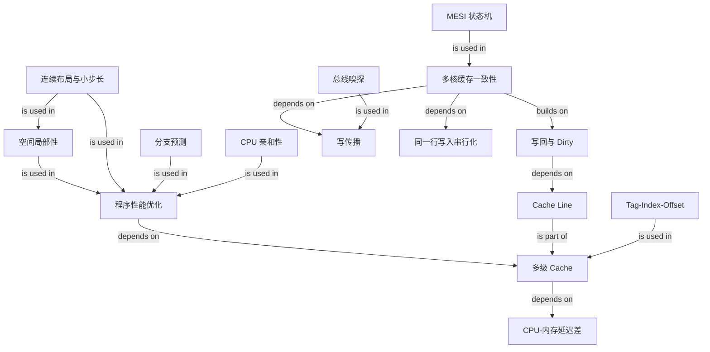

# CPU Cache 性能优化与 MESI 缓存一致性

### 1. Topic Overview

- What this is about: 两篇文章共同回答一条连续问题链：CPU 为什么需要 Cache，程序如何利用 Cache Line 提高命中率，写回为什么更快，以及多核私有缓存如何通过总线嗅探与 MESI 保持同一缓存行的一致性。
- Why it matters: 只知道“Cache 很快”不足以分析程序性能。真正可复用的能力是根据访问步长、分支规律、线程迁移、写策略和 MESI 状态，预测一次访问会命中、缺失、写回还是引发其他核心失效。
- Difficulty level: 中等。前半部分的难点是从内存布局推出命中率；后半部分的难点是区分写回、缓存一致性、原子性和内存一致性模型。
- Prerequisites: 已理解 `寄存器 -> L1/L2/L3 -> 内存` 的存储层次、L1/L2 通常每核私有而 L3 通常共享，以及 CPU 通过地址访问数据。
- Source files:
  - `materials/os/1_hardware/how_to_make_cpu_run_faster.md`
  - `materials/os/1_hardware/cpu_mesi.md`
- Source coverage: 第一篇依次覆盖 Cache 延迟与层级（15-47）、Cache Line 和直接映射读取（50-109）、数据/控制流/多核优化（113-202）；第二篇依次覆盖写直达与写回（9-74）、一致性条件与总线嗅探（76-131）、MESI 状态机（135-196）。原文中的二维数组代码、分支代码、写入流程、MESI 状态图与转换表也已核对。
- Value boundary: 文中的容量、价格和延迟是作者机器或典型示意值，不是所有现代 CPU 的固定规格；`64 B` 是常见 Cache Line 大小，但应以具体硬件为准。

### 2. Core Concepts

#### Schema 1: 用 Cache Line 与访问步长预测数据缓存命中率

- Definition: CPU 与内存之间存在很大的延迟差，因而 CPU 优先访问 Cache。Cache 与内存交换的基本粒度不是一个数组元素，而是一整条 Cache Line；常见大小是 `64 B`。程序若很快访问同一行中已经带入的相邻数据，就形成空间局部性并提高命中率。
- Intuition: 取一本书时，系统不是只给你一个字，而是把一整页放到手边。接下来顺着读能重复利用这一页；每次跳到远处则不断换页。
- Example: 若 `int` 为 `4 B`、Cache Line 为 `64 B`，访问 `array[0]` 时，一条行可容纳 `64 / 4 = 16` 个整数，因此 `array[0]` 到 `array[15]` 可能一起进入 Cache。C/C++ 二维数组按行连续存放，所以 `array[i][j]` 的内层 `j` 递增通常是连续访问；`array[j][i]` 的内层 `j` 递增则按整行跨度跳跃，矩阵足够大时命中率更低。
- Common mistakes: 认为 CPU 每次只读取当前变量；只看循环次数而不看内存布局；认为顺序访问必然零缺失；把 `64 B` 当作所有 CPU 永远固定的数值。

#### Schema 2: 用 `Tag / Index / Offset / Valid` 跑通直接映射 Cache

- Definition: 在直接映射 Cache 中，一个内存块只能映射到一个 Cache Line。对字节地址而言，高位 `Tag` 区分竞争同一位置的不同内存块，`Index` 选择 Cache Line，低位 `Offset` 选择行内字节；`Valid` 是 Cache Line 自身的元数据，不属于内存地址。
- Intuition: `Index` 像指定储物柜，`Tag` 像核对柜中物品的姓名，`Offset` 像从盒子里取第几个位置，`Valid` 则说明柜中内容当前是否可信。
- Example: 若内存分成 32 个块，Cache 有 8 行，则块 15 映射到 `15 mod 8 = 7` 号行。块 7、15、23、31 都竞争同一行，所以只看索引不够，还必须比较 Tag。
- Read flow:
  1. 用 `Index` 定位行。
  2. 检查该行 `Valid`。
  3. 比较地址中的 `Tag` 与行内 Tag。
  4. 命中后用 `Offset` 取出所需字节或字；任一步失败则发生缺失并从更低层取数。
- Common mistakes: 把 Valid 当作地址的一部分；只比较 Tag 不先定位 Index；认为取模冲突说明两个内存块内容相同；把“Cache Line”和 CPU 的指令行混淆。

#### Schema 3: 分清三类性能入口——数据布局、控制流、核心亲和性

- Definition: 原文把优化入口分成数据缓存、指令执行路径和多核缓存复用三类。它们分别针对“访问哪些地址”“下一步执行哪条路径”和“线程在哪个核心继续运行”。
- Intuition: 数据布局决定要搬哪些页；分支规律决定 CPU 前端沿哪条路提前工作；核心亲和性决定之前放在某个核心 L1/L2 的热点是否还能复用。
- Example:
  - 数据布局：行优先遍历二维数组，利用同一 Cache Line 中的相邻元素。
  - 控制流：随机的 `if (array[i] < 50)` 难预测；排序后条件结果会呈现一段 true、一段 false，方向更容易预测。
  - 核心亲和性：计算密集线程若频繁迁移到别的核心，新核心的私有 L1/L2 可能是冷的；Linux 可用 `sched_setaffinity` 限制可运行核心。
- Common mistakes: 把分支预测说成“预测器把 if 指令放进指令 Cache”。更准确地说，预测器选择推测执行方向，让前端提前取指/译码，预测错会冲刷流水线；这与 I-Cache 命中是相关但不同的问题。`likely/unlikely` 是给编译器的期望提示，不保证实际分支，也不应在没有测量时滥用。CPU 亲和性也不是普遍加速器，它会牺牲调度与负载均衡灵活性。

#### Schema 4: 用命中、脏位与替换区分写直达和写回

- Definition:
  - 写直达（Write Through）：一次写同时更新 Cache 与更低层；原文的具体流程在写缺失时只更新内存。
  - 写回（Write Back）：写命中时只改 Cache Line 并标记 Dirty；只有脏行被替换或协议要求交出最新数据时，才把它写到更低层。
- Intuition: 写直达像每次改草稿都立即同步总账，简单但频繁等待；写回像先在草稿集中修改，换掉这页前才同步总账，减少慢速写入。
- Write-back example:
  1. 写命中：更新行，标记 Dirty，不立即写内存。
  2. 写缺失：选择将被占用的目标位置；若旧行是脏的，先写回。
  3. 原文假定 Write Allocate：把目标内存块读入 Cache，修改目标字节，再标记 Dirty。
- Common mistakes: 认为写回永远不写内存；认为 Dirty 表示数据损坏；忽略写缺失策略。Write Back 常与 Write Allocate 搭配，但也存在其他组合；原文描述的是一种具体组合，不是唯一硬件设计。

#### Schema 5: 从“最新值在哪里”识别多核缓存一致性问题

- Definition: 单核写回处理的是“Cache 与内存何时同步”；多核一致性处理的是“多个核心各自持有同一 Cache Line 时，谁拥有最新的可读版本”。若 A 核心私有 Cache 已修改 `i` 而内存仍旧，B 不能无视 A 的最新副本直接使用旧值。
- Intuition: 总账暂时没更新并不可怕，关键是所有读者必须知道哪份草稿才是最新版本，并对同一对象的写入顺序达成一致。
- Two requirements from the article:
  - 写传播（Write Propagation）：一个核心的写入最终必须被其他相关核心观察到。
  - 写入串行化（Write Serialization）：对同一缓存行/地址的写入，所有核心必须观察到同一个顺序。
- Common mistakes: 把这里的“事务串行化”理解为数据库事务隔离；更准确的范围是同一一致性单元上的写入顺序。它并不要求所有不同地址的操作在所有核心看来都是一个全局顺序。

#### Schema 6: 用总线嗅探理解 MESI 的通信基础

- Definition: 在经典的共享总线模型中，每个 Cache 监听总线上的读、写或所有权请求。核心访问本地 Cache 的同时，也根据其他核心的广播更新本地 Cache Line 状态。
- Intuition: 每个核心既处理自己的请求，也“听广播”。有人要读或独占某一行时，已经持有该行的核心必须响应或使自己的副本失效。
- Example: A 要修改一条共享行时广播所有权/失效请求；其他持有该行的核心把对应副本标为 Invalid，A 才能成为唯一可写者。
- Common mistakes: 认为总线嗅探只是把新值复制给所有核心；实际协议常使用失效式（invalidate）策略。广播简单但会消耗互连带宽，现代多核还可能使用目录协议等可扩展实现；MESI 是状态逻辑，不等同于某一条物理总线。

#### Schema 7: 用“有效副本数 × 是否脏”压缩 MESI 四态

| State | 可读？ | 其他 Cache 有有效副本？ | 与内存一致？ | 本地写入 |
| --- | --- | --- | --- | --- |
| M — Modified | 是 | 否 | 否，内存可能旧 | 直接写，保持 M |
| E — Exclusive | 是 | 否 | 是 | 无需广播失效，静默转 M |
| S — Shared | 是 | 可能有 | 是（经典 MESI） | 先使其他副本失效，再转 M |
| I — Invalid | 否 | 不关心 | 不可作为数据来源 | 先取得数据/所有权 |

- Definition: MESI 的状态挂在 Cache Line 上，而不是变量或整个 Cache 上。`M/E` 都表示本核心拥有唯一有效副本，区别是是否脏；`E/S` 都是干净副本，区别是是否可能共享。
- Intuition: 先问这份副本能不能用，再问是不是只有我有，最后问是否已偏离内存，就能定位四态。
- Common mistakes: 把 E 当作“加锁中”；把 S 当作所有核心必定都有；认为 M 状态的数据已经同步到内存；忘记 I 行中的比特即使还在，也不能再读。

#### Schema 8: 用事件驱动 MESI 状态转换

- Local read miss from I:
  - 没有其他有效副本：取数后进入 E。
  - 有其他干净副本：相关副本进入/保持 S，本地进入 S。
  - 其他核心持有 M：持有者提供或写回最新数据并降级，本地通常得到 S。
- Local write:
  - E 本地写：`E -> M`，无需先使其他副本失效。
  - S 本地写：发升级/失效请求，使其他副本 `S -> I`，本地 `S -> M`。
  - M 本地再写：保持 M，不需再次广播。
  - I 本地写：先通过 Read For Ownership 等动作取得数据和独占权，再进入 M。
- Remote request:
  - 其他核心读 E：本地 `E -> S`，对方得到 S。
  - 其他核心读 M：本地提供最新数据并 `M -> S`；具体是否立即写主存取决于实现。
  - 其他核心要写：本地有效副本通常转 I；若本地是 M，还必须交出最新数据。
- Eviction: E/S 可直接丢弃；M 必须先把最新数据交给更低层或新所有者，再失效。
- Common mistakes: 死背所有箭头却说不出“其他副本是否存在、内存是否最新”；认为每次本地写都广播；把某张教学状态图当作所有处理器的精确消息名与时序。

#### Schema 9: 区分 coherence、atomicity 与 memory consistency

- Cache coherence: 对同一个缓存行/地址，核心不会永久使用过期副本，并对该位置的写入形成一致顺序；MESI 主要解决这一层。
- Atomicity: 一个复合操作能否不可分割地完成。`i++` 通常是读、加、写三个步骤；即使有 MESI，两个核心仍可能发生丢失更新。需要原子指令、锁或语言原子类型。
- Memory consistency / ordering: 不同地址上的读写能否被重排、其他核心以什么顺序观察。它由体系结构内存模型、编译器规则、屏障和原子操作共同约束；MESI 本身不等于顺序一致性。
- Cache-line granularity: MESI 以整条 Cache Line 为单位。两个线程修改同一行中的不同变量也会让该行反复失效，这叫 false sharing；逻辑上没有共享变量冲突，硬件上仍在争夺同一一致性单元。
- Common mistakes: 说“有 MESI 所以多线程 `i++` 正确”；说“Cache 一致就不会发生内存重排序”；把两个不同变量放在同一行造成的乒乓误判为容量不足。

### 3. Deep Understanding

两篇文章的完整因果链是：

`CPU 比内存快很多 -> 用小而快的 Cache 缓冲 -> 以 Cache Line 批量搬运 -> 程序的空间/时间局部性决定命中率 -> 连续访问、可预测控制流和复用每核私有缓存可减少等待 -> 写回通过延迟同步内存减少写流量 -> 最新值可能只在某个核心的私有脏行里 -> 多核必须协调同一行的所有者和副本 -> 嗅探/互连传播请求 -> MESI 用 M/E/S/I 状态决定谁能读、谁能写、谁必须失效或交出数据。`

三个关键取舍：

- 容量与冲突：更大的行能利用更多空间局部性，却可能搬入无用数据并增加 false sharing；直接映射查找快，但不同内存块更容易争用同一行。
- 写延迟与复杂性：写直达容易理解但增加低层写流量；写回更快，却必须跟踪 Dirty、处理替换，并在多核间确定最新副本。
- 局部复用与系统调度：固定核心可能保留热 L1/L2，却可能让负载不均或限制调度器迁移任务。

需要修正的原文简化：

- 数据在层级中的查找/填充可用 `L1 -> L2 -> L3 -> 内存` 建立主模型，但真实 CPU 的包含关系、填充路径和缓存到缓存传输因微架构而异。
- 排序示例主要说明分支方向更有规律，而不是“预测器把目标指令放入 I-Cache”。预测器、取指流水线和 I-Cache 是相互作用但不同的组件；真实性能还取决于排序成本、编译器是否生成无分支代码和具体 CPU。
- MESI 的“写入串行化”只约束同一一致性位置；它既不提供复合操作原子性，也不定义所有地址之间的完整内存顺序。

### 4. Minimal Working Example

#### Example A: 从访问步长预测二维数组性能

假设：

- `int a[1024][1024]` 按 C/C++ 行优先布局。
- `int = 4 B`，Cache Line = `64 B`。

推理：

1. 一条 Cache Line 可容纳 `64 / 4 = 16` 个相邻整数。
2. `a[i][j]` 中内层 `j++` 的地址步长是 `4 B`。一次缺失带入的 16 个整数会被连续使用，空间局部性好。
3. `a[j][i]` 中内层 `j++` 的地址步长是 `1024 * 4 = 4096 B`。相邻两次访问通常不在同一 Cache Line，且工作集大时会产生更多缺失。
4. 两段代码做的赋值次数相同，但内存访问代价不同，所以性能可能相差很大。

#### Example B: 跑一次 MESI，并检验它没有提供原子性

假设 `x = 0`，A、B 两核心最初都没有缓存 x 所在行：

1. A 读 x：无人持有，本地 `I -> E`。
2. B 读 x：A 的 E 副本变 S，B 也得到 S。
3. A 写 `x = 1`：A 发失效请求；B `S -> I`，A `S -> M`。此时最新值可能只在 A，内存仍是 0。
4. B 再读 x：A 必须提供/交出最新值；A 从 M 降级，B 得到可读副本，二者通常进入 S。B 不会合法地继续把旧缓存值 0 当作最新值。

但若 A、B 都执行普通 `x++`，MESI 只协调每次读写的行所有权，不能把“读 x、加 1、写 x”三步合成一个不可分割操作。两个核心可能都基于旧值 0 计算出 1，最终结果仍可能是 1 而不是 2；必须使用原子增量或锁。

### 5. Knowledge Graph

### 6. Self-Test Questions

Recall:

1. 直接映射 Cache 中，Tag、Index、Offset 和 Valid 各自负责什么？
2. 写直达与写回在“何时写入内存”上有什么根本区别？Dirty 表示什么？
3. 请用“是否有效、是否唯一、是否与内存一致”区分 M/E/S/I。

Application / transfer:

4. `int` 为 `4 B`、Cache Line 为 `64 B` 时，为什么按行遍历一个行优先二维数组通常比按列遍历命中率高？
5. A、B 都处于 S，A 想写；随后 B 又读。请写出 A、B 的主要 MESI 状态变化与必要通信。

Explain like I am 5:

6. 用“两个人各拿一份草稿、桌上有一本总账”解释为什么写回需要 MESI，但 MESI 仍不能让两个人同时执行 `i++` 自动正确。

### 7. Weak Point Detection

- Likely failure pattern 1: 会背 L1/L2/L3，却不能从 Cache Line 大小与地址步长推出命中率。
- Likely failure pattern 2: 混淆地址里的 Tag/Index/Offset 与 Cache Line 元数据 Valid/Dirty/MESI 状态。
- Likely failure pattern 3: 把分支预测等同于指令缓存，或不经测量就认为排序、likely、绑核必然更快。
- Likely failure pattern 4: 认为写回只在“程序结束”时同步，忽略替换、远端读写和所有权转移。
- Likely failure pattern 5: 只背 M/E/S/I 中文名，无法根据本地读写、远端读写推导状态变化。
- Likely failure pattern 6: 把 Cache coherence 当作原子性或完整内存一致性，错误断言普通 `i++` 在多核下安全。
- Likely failure pattern 7: 忽略一致性的 Cache Line 粒度，无法识别 false sharing。
