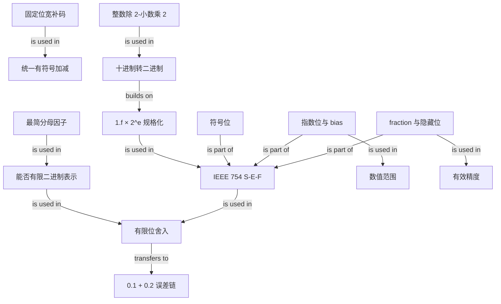

# 二进制浮点数：从补码与进制转换到 `0.1 + 0.2`

### 1. Topic Overview

- What this is about: 本文先用补码建立整数表示的前置，再讲十进制小数如何转换为二进制、IEEE 754 浮点数如何用符号/指数/尾数字段保存数值，以及为什么有限精度的二进制浮点运算会让 `0.1 + 0.2` 偏离 `0.3`。
- Why it matters: 这套模型能解释浮点比较、金额计算、序列化和数值算法中的误差来源。重点不是背某个小数的误差串，而是能从“可表示性 → 编码 → 舍入 → 运算 → 再舍入”预测结果。
- Difficulty level: 中等。主要难点是同时区分数学上的值、无限二进制展开、有限位编码和运算后的舍入结果。
- Prerequisites: 二进制位权；整数十进制转二进制的除 2 取余法；指数与科学记数法。
- Source of truth: `materials/os/1_hardware/float.md`。已逐段核对正文以及补码、`0.1` 循环展开、binary32/binary64 布局、`10.625` 编码、解码公式和 `0.1/0.2` 配图。
- Source order: 补码为什么统一加减法（15-58）→ 小数进制转换与有限表示（62-90）→ 规格化与 IEEE 754（95-181）→ `0.1 + 0.2` 的近似误差（185-241）→ 总结（245-273）。
- Scope boundary: 本文主要讲 IEEE 754 规格化有限数，没有展开零、非规格化数、无穷和 NaN；笔记会标出这些边界，以免把“隐藏的前导 1”误用到全部位模式。

### 2. Core Concepts

#### Schema 1: 用补码把有符号加减统一为同一套位加法

- Definition: 对固定 `n` 位整数，负数 `-x` 的补码可由 `x` 的位模式逐位取反再加 1 得到；算术在模 `2^n` 下进行，超出最高位的进位丢弃。
- Intuition: 补码把负数安排在一个“绕回去的数字圆环”上，使加法器不必先判断正负，再切换成另一套减法路径。
- Example: 以 4 位为例，`-2 = 1110`，`1 = 0001`：`1110 + 0001 = 1111`，而 `1111` 正是 `-1` 的 4 位补码。
- Common mistakes: 只说“最高位是符号位”却继续按符号-数值表示做运算；取反后忘记加 1；忘记位宽固定和最高进位丢弃；把整数补码规则套到 IEEE 754 的符号位上。

#### Schema 2: 用“整数除 2、小数乘 2”完成十进制到二进制转换

- Definition: 整数部分用除 2 取余法；小数部分反复乘 2，每次取结果的整数部分作为下一位，再继续处理剩余小数。
- Intuition: 二进制小数位依次代表 `2^-1, 2^-2, 2^-3...`。反复乘 2 相当于把下一位移到整数位置供我们取出。
- Example: `8.625`：整数 `8 = 1000₂`；小数 `0.625 × 2 = 1.25` 取 1，`0.25 × 2 = 0.5` 取 0，`0.5 × 2 = 1.0` 取 1，因此 `8.625 = 1000.101₂`。
- Common mistakes: 小数部分也用除 2；取完整乘积而不是只取整数位；忘记二进制小数点后的位权是负指数；以为所有十进制有限小数在二进制中也有限。
- Reusable rule: 一个最简分数能否有限地写成二进制，取决于分母是否只含因子 2。`0.625 = 5/8` 的分母是 `2^3`，可终止；`0.1 = 1/10` 的分母含因子 5，因此无限循环。

#### Schema 3: 把二进制小数规格化为“符号 × 有效数 × 2 的指数”

- Definition: 非零二进制数可移动小数点，使小数点左侧只有一个 `1`，得到 `1.f × 2^e`。这里 `f` 决定有效数字，`e` 决定小数点位置。
- Intuition: 浮点数不直接固定小数点，而是分别保存“刻度尺上写了哪些有效数字”和“这把尺整体移了多少格”。
- Example: `1000.101₂ = 1.000101₂ × 2^3`；`10.625₁₀ = 1010.101₂ = 1.010101₂ × 2^3`。
- Common mistakes: 移动方向与指数正负对应反了；把规格化后的全部 `1.f` 都存入尾数字段；认为“浮点”表示计算时可以随意移动而不改变指数。

#### Schema 4: 用 `S | E | F` 编码和解码 IEEE 754 规格化数

- Definition: binary32（常见 `float`）使用 1 位符号 `S`、8 位指数 `E`、23 位 fraction `F`；binary64（常见 `double`）使用 1/11/52 位。对 binary32 的规格化有限数：

  `value = (-1)^S × (1.F)_2 × 2^(E-127)`

  指数用 bias 127 存储；规格化数的前导 `1` 隐含不存，因此 23 位 fraction 提供 24 位二进制有效精度。
- Intuition: `S` 决定方向，`E` 决定数量级/范围，`F` 决定刻度细度/精度。
- Example: `10.625` 的规格化形式是 `1.010101 × 2^3`：`S=0`，`E=3+127=130=10000010₂`，`F=010101` 后补 0。完整 binary32 位模式为 `0 | 10000010 | 01010100000000000000000`。
- Common mistakes: 把真实指数 3 直接写进指数位；把 bias 当成尾数的一部分；忘记解码时减 127；把尾数位数等同于“小数点后十进制位数”。
- Precision boundary: 隐藏前导 `1` 只适用于规格化数。binary32 的 `E=0` 用于零与非规格化数，此时不是 `1.F`；`E=255` 用于无穷与 NaN。不能用上式不加区分地解码所有 32 位模式。

#### Schema 5: 用“指数管范围、有效数管精度”比较 float 与 double

- Definition: 指数位更多，能覆盖更大的数量级范围；fraction 位更多，相邻可表示数通常更密，舍入误差更小。float 有 24 个二进制有效位，double 有 53 个。
- Intuition: 指数像地图能缩放多远，有效数像放大后网格有多细。地图覆盖得远不等于局部刻度也细，这两个能力要分开看。
- Example: 原文把二进制有效位粗略换算为十进制有效数字：float 约 7 位量级，double 约 15–16 位。这里说的是整体有效数字，不是固定有多少位小数。
- Common mistakes: 认为 double 只是范围更大但精度不变；认为 float 永远精确到小数点后 7 位；认为多一个指数位会直接提高局部精度。

#### Schema 6: 用“不可有限表示 → 舍入 → 运算 → 再舍入”解释 `0.1 + 0.2`

- Definition: `0.1` 与 `0.2` 的最简分母分别含因子 5，因此二进制展开无限循环。有限的 fraction 位只能把它们各自舍入到邻近可表示值；浮点加法使用这些近似操作数，并将运算结果再次舍入到目标格式。
- Intuition: 先把两个无限长小数分别抄到有限格子的纸上，再相加，最后还要把和写回有限格子；误差来自表示和舍入，不是加法器“不懂加法”。
- Example:

  - binary32 存储的 `0.1` 约为 `0.10000000149011612`。
  - binary32 存储的 `0.2` 约为 `0.20000000298023224`。
  - 两个已存近似值在更高精度中相加为 `0.30000000447034836`，这对应原文配图的数字。
  - 若和再存回 binary32，会再次舍入为约 `0.30000001192092896`。
  - JavaScript 使用 binary64 Number，典型显示结果为 `0.30000000000000004`。
- Common mistakes: 说“计算机把 0.1 存成完全准确的 0.1，只是加法出错”；只提操作数舍入，忘记运算结果也要舍入；认为任何两个近似数相加都必然不精确；把 binary32 的数值串与 JavaScript binary64 的结果混用。
- Transfer: 对数值算法，常用容差比较而不是直接依赖 `==`；对金额等十进制语义，可考虑最小货币单位整数或十进制定点/decimal 类型。具体方案取决于允许误差和溢出边界。

### 3. Deep Understanding

#### Causal chain A: 一个有限十进制小数为什么可能成为无限二进制小数

`0.1 = 1/10 -> 最简分母 10 = 2 × 5 -> 二进制有限小数只能组合 1/2、1/4、1/8...，其分母只能含因子 2 -> 因子 5 无法被有限个位权消掉 -> 展开为 0.000110011... 循环 -> 有限 fraction 必须舍入。`

这与十进制中的 `1/3 = 0.333...` 同构：某个数是否能有限表示，取决于数值与进制是否匹配，而不是这个数“本身有问题”。

#### Causal chain B: 从数学实数到机器结果

`十进制字面量 -> 转成无限/有限二进制展开 -> 选择目标格式的最近可表示值 -> 保存 S/E/F -> 运算时对齐指数并处理有效数 -> 精确中间结果再舍入到目标格式 -> 显示层把二进制值转换为十进制字符串。`

因此要分清四个对象：

1. 数学上的精确 `0.1`。
2. `0.1` 的无限二进制展开。
3. binary32 或 binary64 实际存储的有限位近似值。
4. 该近似值经过格式化后打印出来的十进制字符串。

#### Boundary: 补码与浮点符号位不是同一编码方案

文章先讲补码，是为了说明“位模式设计会改变运算电路与语义”。但 IEEE 754 负浮点数不是把正浮点数的整段位模式取反加 1；它有独立的符号位，指数和 fraction 仍按浮点规则解释。

### 4. Minimal Working Example

#### Example A: 编码 `10.625` 为 binary32

1. 转二进制：`10.625 = 1010.101₂`。
2. 规格化：`1010.101₂ = 1.010101₂ × 2^3`。
3. 符号：正数，所以 `S=0`。
4. 指数：`E = 3 + 127 = 130 = 10000010₂`。
5. fraction：去掉隐含前导 1，保存 `010101` 并补到 23 位。
6. 结果：`0 | 10000010 | 01010100000000000000000`。

#### Example B: 解码一个 binary32 位模式

给定：`0 | 01111110 | 10000000000000000000000`

- `S=0`：正数。
- `E=01111110₂=126`：真实指数 `126-127=-1`。
- `F=1000...`：规格化有效数是 `1.1₂=1.5₁₀`。
- 值：`(+1) × 1.5 × 2^-1 = 0.75`。

#### Example C: 为什么 0.1 能触发循环

`0.1×2=0.2` 取 0 → `0.2×2=0.4` 取 0 → `0.4×2=0.8` 取 0 → `0.8×2=1.6` 取 1 → 剩余 0.6；随后产生 `1,0,0,1,1...`，状态回到已出现的小数，形成 `0011` 循环。有限 fraction 只能截断并按舍入规则选择邻近表示。

### 5. Knowledge Graph

### 6. Self-Test Questions

#### Recall

1. 为什么补码能让正数和负数共用同一套加法器逻辑？
2. 十进制整数和小数转二进制分别使用什么方法？
3. binary32 的 `S/E/F` 各有多少位，指数 bias 是多少？

#### Application / Transfer

4. 不做完整展开，只看最简分母，判断 `0.125` 与 `0.2` 哪个能有限地表示为二进制，并说明理由。
5. 给定 binary32：`0 | 10000000 | 01000000000000000000000`，请用规格化数公式解码。

#### Explain Like I Am 5

6. 用“无限长数字抄进有限格子”解释为什么 `0.1 + 0.2` 会出现微小偏差。

### 7. Weak Point Detection

- Likely failure pattern 1: 把符号-数值表示、整数补码和 IEEE 754 符号位混在一起。
- Likely failure pattern 2: 会做乘 2 取整，却不知道为什么 `0.1` 永不终止。
- Likely failure pattern 3: 编码时忘记指数 bias，或把真实指数直接写入 8 位指数。
- Likely failure pattern 4: 忘记规格化数的隐含前导 `1`，或把这个规则错误应用于 `E=0/255`。
- Likely failure pattern 5: 把“有效数字约 7 位”误解为“永远精确到小数点后 7 位”。
- Likely failure pattern 6: 只背 `0.30000000000000004`，无法从不可表示、有限舍入和目标格式解释误差链。
- Likely failure pattern 7: 混用 binary32 与 binary64 的存储近似值和打印结果。
