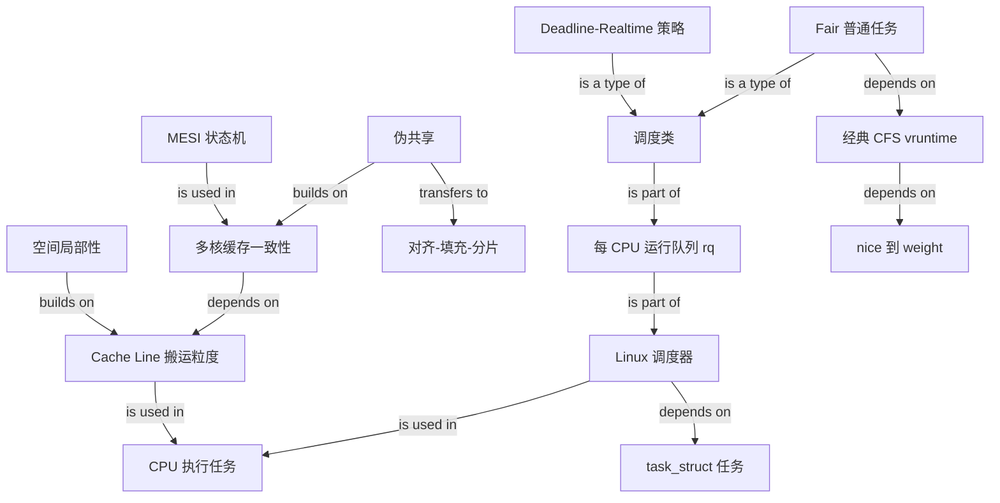

# CPU 是如何执行任务的？——Cache Line、伪共享与 Linux 调度

### 1. Topic Overview

- What this is about: 本章沿着两条因果链回答“CPU 如何执行任务”：第一条是 `存储层次 -> Cache Line -> 空间局部性 -> MESI -> 伪共享 -> 对齐/填充`；第二条是 `task_struct -> 调度类/策略 -> CFS vruntime -> 每 CPU 运行队列 -> nice/renice/chrt`。
- Why it matters: 第一条链帮助判断多核程序为什么会“变量互不相干却越跑越慢”；第二条链帮助判断 Linux 为什么选择某个任务，以及“多拿一点普通任务 CPU 份额”和“获得实时调度”为什么是两种不同需求。
- Difficulty level: 中等。主要难点不是记名词，而是始终抓住两个粒度：缓存一致性按 **Cache Line** 协调，Linux 调度器按 **task_struct 表示的任务**选择执行对象。
- Prerequisites: L1/L2/L3 的常见组织、Cache Line、MESI 四态、进程与线程的基本区别。已有笔记中的 Cache/MESI schema 可作为本章前置。
- Source of truth: `materials/os/1_hardware/how_cpu_deal_task.md`。已逐段核对正文以及公式、内核宏、结构体、Disruptor、运行队列和 `nice/renice/chrt` 图片。
- Source order: CPU Cache 层次与 Cache Line（18-49）→ MESI 下的伪共享过程（51-90）→ 对齐和填充规避（92-151）→ `task_struct` 与任务类别（155-175）→ 调度类/策略（176-194）→ CFS 与 vruntime（196-213）→ 每 CPU 运行队列（215-226）→ 优先级调整（228-257）。
- Version boundary: 本文用经典 CFS 的“红黑树中选择最小 vruntime”模型教学，这对理解公平调度仍然重要；Linux 官方文档说明内核从 6.6 开始向 EEVDF 过渡。学习时先掌握本文模型，回答具体内核版本问题时再区分 CFS 与 EEVDF：[CFS](https://docs.kernel.org/scheduler/sched-design-CFS.html)、[EEVDF](https://docs.kernel.org/scheduler/sched-eevdf.html)。

### 2. Core Concepts

#### Schema 1: 把 Cache Line 当成 CPU 搬运和一致性协调的基本粒度

- Definition: 现代 CPU 常见地让每个核心拥有私有 L1/L2，多个核心共享更大的 L3；L1 又通常分成数据缓存 dCache 和指令缓存 iCache。CPU 内部 Cache、外部内存与磁盘共同形成存储金字塔：越往下通常容量越大、访问越慢。Cache 位于 CPU 与内存之间，用更小的容量换更低的访问延迟。CPU 从内存向 Cache 搬运数据时，不按“程序变量”逐个搬，而按一整条 Cache Line 搬运；本文示例为常见的 `64 B`。
- Intuition: 你向仓库要一支笔，运输车却按一整箱送货。下一次要同箱物品就很快；但多个核心争抢同一箱中的不同物品时，协调也按整箱发生。
- Example: 一个 `long` 为 `8 B`，`64 B` 的 Cache Line 最多容纳 8 个连续 `long`。顺序访问数组可复用已带入的相邻元素。Linux 可通过 `cat /sys/devices/system/cpu/cpu0/cache/index0/coherency_line_size` 查看示例机器的 L1 数据 Cache Line 大小。原文用“L1 访问约比内存快 100 倍”强调延迟差；这是示意数量级，不是所有处理器的固定比例。
- Common mistakes: 认为访问 `a[0]` 时只把 `a[0]` 搬进 Cache；把 `64 B` 当成所有 CPU 的固定规格；混淆“Cache Line 搬运粒度”和程序语言变量大小。

#### Schema 2: 用“同一行的所有权乒乓”诊断伪共享

- Definition: 两个线程修改不同变量，不代表硬件上互不影响。只要两个热点写变量落在同一 Cache Line，多核一致性协议就可能让整行在核心间反复失效和转移所有权。这种逻辑变量不同、硬件一致性粒度相同而导致的性能问题叫 **伪共享（False Sharing）**。
- Intuition: 两个人各改一张大表格中的不同格子，但规定同一时刻整张表只能由一个人持有；他们只要交替落笔，就必须反复移交整张表。
- Example: `A`、`B` 是同一 `64 B` 行中的两个 `long`。核心 1 读 A 后可持有 E；核心 2 读 B 后两边变为 S。核心 1 写 A 时让核心 2 的整行失效并取得 M；核心 2 随后写 B，又必须取得同一行的最新数据和写权限。若持续交替写，行就在两核间“乒乓”。
- Common mistakes: 把伪共享等同于两个线程写同一个变量的数据竞争；认为 MESI 失效只影响被写的那个字段；看到 Cache miss 就只怀疑容量不足。
- Precision boundary: 原文用“脏行先写回内存，再由另一核从内存读取”说明最新数据交接。真实硬件也可能通过 cache-to-cache transfer 等方式完成；稳定不变的机制是 **整行失效、最新数据交接和写所有权转移**，不应死记为每次都必须访问 DRAM。

#### Schema 3: 用布局隔离热点写变量，拿空间换时间

- Definition: 规避伪共享的目标不是关闭 MESI，而是让会被不同核心频繁写入的数据不要落在同一 Cache Line。常见手段是 Cache Line 对齐、字段填充或按核分片。
- Intuition: 既然争用按整张表发生，就把两个人频繁修改的格子放到不同表上。
- Example 1: 在 SMP 配置下，Linux 的 `__cacheline_aligned_in_smp` 展开为 Cache Line 对齐；单核配置下为空。给结构体成员 `b` 加这个对齐，使 `a` 和 `b` 起始于不同 Cache Line。
- Example 2: 文章展示 Disruptor 通过继承关系在目标字段前后放置 7 个 `long` 作为填充。若 `long = 8 B`、Cache Line = `64 B`，7 个填充字段加上目标字段可将其与相邻热点写隔离。
- Common mistakes: 对所有字段无差别填充；只对齐结构体起点，却没有隔开内部热点字段；忽略对象布局、编译器/JVM 实现和实际 Cache Line 大小；忘记填充会增加内存与 Cache 占用。

#### Schema 4: 把进程和线程统一映射为调度器眼中的“任务”

- Definition: Linux 内核用 `task_struct` 表示可被调度的执行实体。进程和线程都对应 task_struct；线程只是与同一进程中的其他线程共享地址空间、代码、文件描述符等部分资源，因此常被称为轻量级进程。
- Intuition: 用户视角会区分“进程”和“线程”，调度器首先关心的是“当前有哪些可运行执行流可以占用 CPU”。
- Example: 一个进程只有主线程时有一个主要执行流；再创建两个线程后，调度器面对的是多个 task_struct，而不是把整个进程永远当成一个不可拆分单位。
- Common mistakes: 说调度器只调进程、不调线程；认为一个多线程进程只能整体被放到同一个 CPU；把 task_struct 与进程独享的全部资源画等号。

#### Schema 5: 先选调度类，再用该类自己的规则选任务

- Definition: 本文把任务按响应需求分为实时任务和普通任务，并展示三类主要调度路径：Deadline、Realtime、Fair。按文章采用的内核内部优先级口径，`0..99` 是实时范围、`100..139` 是普通范围，数值越小越优先；这不能直接套到 `chrt` 接受的用户可见实时优先级数字上。调度策略决定类内如何选：
  - `SCHED_DEADLINE`: 优先选择调度 deadline 更早的合格任务。
  - `SCHED_FIFO`: 同优先级按 FIFO 队列；当前任务通常运行到阻塞、主动让出或被更高实时优先级任务抢占。
  - `SCHED_RR`: 同优先级轮转时间片；更高实时优先级仍可抢占。
  - `SCHED_NORMAL`: 普通交互/通用任务的默认策略。
  - `SCHED_BATCH`: 更偏后台吞吐，牺牲一部分交互性以减少抢占。
- Intuition: “哪个班先入场”和“班内谁先上场”是两层问题。类之间有先后，类内部再按 deadline、实时优先级或公平性选择。
- Example: 两个同优先级 `SCHED_RR` 任务轮流运行；若一个更高实时优先级任务就绪，它可抢占二者。普通任务即使 nice 很低，也仍在 Fair 类中，不会仅靠 nice 变成实时任务。
- Common mistakes: 把“数值越小越优先”的内核内部优先级与 `chrt` 使用的用户可见实时优先级直接混为一套数字；认为 `SCHED_FIFO` 的任务自动拥有时间片；认为提高普通任务 nice 权重等于获得 deadline 保证。

#### Schema 6: 用 vruntime 把“实际运行多久”换算成“公平账本欠了多少”

- Definition: 经典 CFS 为普通任务维护虚拟运行时间。本文公式是：

  `vruntime += delta_exec * NICE_0_LOAD / weight`

  `delta_exec` 是本次实际运行时间，`NICE_0_LOAD` 可视为基准常量，`weight` 由 nice 映射而来。经典 CFS 倾向选择 vruntime 较小的可运行任务。
- Intuition: vruntime 是经过权重校正的 CPU 使用账本。账上“得到得少”的任务先运行；高权重任务的账增长更慢，因此长期可获得更多实际 CPU 时间。
- Example: 假设基准权重是 1024。两个任务都实际运行 `4 ms`：权重 1024 的任务增加 `4 ms` vruntime；权重 2048 的任务只增加 `2 ms`。后者的虚拟账增长更慢，所以更容易再次成为较小者。
- Common mistakes: 把 vruntime 当作任务还剩的时间片；认为“完全公平”意味着无视 nice、每个任务实际时间绝对相同；把 nice 值直接代入分母，而不是先映射为 weight。
- Version boundary: 经典 CFS 的最小 vruntime/红黑树模型是本文内容。现代 EEVDF 仍使用虚拟时间与公平份额思想，但会结合 lag、eligibility 和 virtual deadline 选任务，不能把新内核实现简化成“永远取红黑树最左节点”。

#### Schema 7: 用“每 CPU 一个 rq、每类一套队列”理解下一任务选择

- Definition: 每个 CPU 有自己的运行队列 `rq`，其中包含对应调度类的数据结构：本文展示 `dl_rq`、`rt_rq`、`cfs_rq`。经典 CFS 用按 vruntime 排序的红黑树组织 cfs_rq，最左侧是候选任务。本文给出的类间检查顺序是 `Deadline > Realtime > Fair`。
- Intuition: 不是全系统所有线程挤在唯一一条队伍里；每个 CPU 有自己的候选集合，先看高等级窗口有没有人，再看该窗口内部谁最该运行。
- Example: CPU 0 的 `dl_rq` 有可运行任务时，文章模型先从这里选；为空才检查 `rt_rq`，再为空才从 `cfs_rq` 选经典 CFS 候选。文章图片把 `cfs_rq` 误写成 `csf_rq`，正文已经指出该拼写错误。
- Common mistakes: 认为每个系统只有一个全局 rq；把 cfs_rq 当成 FIFO；只记类间顺序，不会说明各类内部选择规则；忽略多 CPU 之间还需要负载均衡。

#### Schema 8: 区分“调整普通任务份额”和“切换到实时策略”

- Definition: `nice`/`renice` 调整普通 Fair 类任务的 nice 值与权重；范围通常是 `-20..19`，默认值为 0，越小越受调度器优待。它影响相对 CPU 份额，但不承诺截止时间。文章用 `priority(new) = priority(old) + nice` 帮助理解修正方向；分析实际 Fair 调度时，更重要且更准确的链条是 `nice -> 非线性 weight 映射 -> vruntime 增长速度`。要切换实时策略，需要使用 `chrt` 等接口明确改变调度策略和实时优先级。
- Intuition: nice 像调整普通队伍里的积分倍率；chrt 则可能把任务转入使用另一套规则的队伍。
- Example:

  ```bash
  nice -n -3 /usr/sbin/mysqld
  renice -10 -p <pid>
  chrt -f 1 -p 1996
  ```

  第一条以指定 nice 启动；第二条修改已有任务的 nice；第三条把 PID 1996 设置为 `SCHED_FIFO`、实时优先级 1。降低 nice 或设置实时策略通常需要相应权限，实时策略使用不当还可能饿死普通任务。
- Common mistakes: 认为 `nice -20` 会把任务变成实时任务；把文章中的 `priority(new) = priority(old) + nice` 当作内核权重的完整线性算法；只追求低延迟却不评估实时任务阻塞其他任务的风险。

### 3. Deep Understanding

#### Causal chain A: 数据访问为什么既能加速，也能互相拖慢

`CPU 与内存延迟差大 -> 引入多级 Cache -> 按 Cache Line 批量搬运 -> 连续访问复用同一行而加速 -> 多核一致性也按同一行协调 -> 不同热点写变量若落在同一行，仍会触发失效与所有权转移 -> 行在核心间乒乓 -> 对齐、填充或分片把热点写隔开。`

关键边界：

- 真共享：多个线程确实访问同一个逻辑共享状态；可能同时涉及同步正确性和性能。
- 伪共享：线程写不同变量，但变量处于同一 Cache Line；核心问题是性能，不等于必然存在数据竞争。
- MESI 没“坏掉”：正是因为它正确地维护整行一致性，错误的数据布局才暴露为高通信成本。

#### Causal chain B: Linux 为什么选择这个任务

`进程/线程 -> task_struct 表示的可运行任务 -> 任务进入某 CPU 的 rq -> 先按调度类优先级检查队列 -> 再按类内策略选择 -> 普通任务在经典 CFS 模型中比较 vruntime -> nice 映射到 weight，改变 vruntime 增长速度和长期 CPU 份额。`

关键边界：

- 类间优先级不等于类内排序：`Deadline > Realtime > Fair` 回答先查哪类；deadline、实时优先级或 vruntime 回答类内选谁。
- nice 调的是普通任务相对份额，不提供硬实时保证，也不能单独改变调度类。
- 公平面向“可运行任务的加权 CPU 份额”，不是保证每个线程相同的墙钟时间；睡眠、阻塞、cgroup、CPU 亲和性和负载均衡都会影响观察结果。
- 本文是经典教学模型。面试若问“CFS 原理”，可讲最小 vruntime；若问“当前某版 Linux 实现”，先确认内核版本并考虑 EEVDF。

### 4. Minimal Working Example

#### Example A: 两个变量没有数据竞争，为什么仍会慢

前提：`A` 和 `B` 各 `8 B`，落在同一条 `64 B` Cache Line；核心 0 只写 A，核心 1 只写 B。

| 步骤 | 核心 0 的行状态 | 核心 1 的行状态 | 关键动作 |
| --- | --- | --- | --- |
| 1. 核心 0 读 A | E | I/无 | 整行进入核心 0 |
| 2. 核心 1 读 B | S | S | 两核共享同一整行 |
| 3. 核心 0 写 A | M | I | 先让核心 1 的整行失效 |
| 4. 核心 1 写 B | I | M | 取得最新整行和写所有权 |
| 5. 两边继续交替写 | M/I 反复切换 | I/M 反复切换 | 发生所有权乒乓 |

修复方向：把 A、B 对齐/填充到不同 Cache Line，或改成每核分片、最后汇总。锁或原子操作可以解决某些正确性问题，但若两个独立热点仍落在同一行，不一定消除伪共享通信。

#### Example B: nice 为什么通过 weight 改变普通任务份额

假设 A、B 当前 vruntime 都是 `10 ms`，各运行 `4 ms`；`NICE_0_LOAD = 1024`：

- A 的 weight = 1024：新 vruntime = `10 + 4 * 1024 / 1024 = 14 ms`。
- B 的 weight = 2048：新 vruntime = `10 + 4 * 1024 / 2048 = 12 ms`。

在经典 CFS 模型中，B 的 vruntime 更小，因此更可能先再次被选中。结论不是“B 每次都永久插队”，而是其虚拟账增长较慢，长期获得更高加权份额。

### 5. Knowledge Graph



### 6. Self-Test Questions

#### Recall

1. CPU 从内存向 Cache 搬运数据的基本单位是什么？本文示例大小是多少？
2. 两个线程写不同变量时，满足哪两个条件会触发伪共享？
3. 在经典 CFS 模型中，vruntime 与 weight 的关系是什么，调度器倾向选择哪类 vruntime？

#### Application / Transfer

4. 两个无锁计数器分别只由核心 0 和核心 1 更新，逻辑上互不共享，但吞吐量很低。你会如何用 Cache Line 诊断，并给出两个布局层面的修复方向？
5. 一个批处理任务只想获得更多普通 CPU 份额，另一个控制任务必须满足低延迟约束。为什么前者可考虑 nice，而后者不能只靠 nice？

#### Explain Like I Am 5

6. 用“两个人轮流拿整张画纸”和“给奶茶少的杯子多倒一点”分别解释伪共享与经典 CFS。

### 7. Weak Point Detection

- Likely failure pattern 1: 知道 Cache 很快，却仍按“变量”而不是 Cache Line 推理搬运和一致性。
- Likely failure pattern 2: 把伪共享误判为数据竞争，或者认为不同变量绝不可能互相影响。
- Likely failure pattern 3: 会背 M/E/S/I，却解释不出写 A 为什么会让包含 B 的整行在另一核失效。
- Likely failure pattern 4: 知道对齐/填充能加速，却说不清它在隔离什么、付出什么空间代价。
- Likely failure pattern 5: 混淆“调度类先后”“类内策略”和“用户可见 priority/nice”三层概念。
- Likely failure pattern 6: 把 vruntime 当剩余时间片，或误以为 high weight 会让 vruntime 增长更快。
- Likely failure pattern 7: 认为 nice 可以把普通任务变成实时任务，或认为实时任务天然安全、不会饿死其他任务。
- Likely failure pattern 8: 把文章的经典 CFS 红黑树模型无条件当成所有现代 Linux 版本的当前实现。
