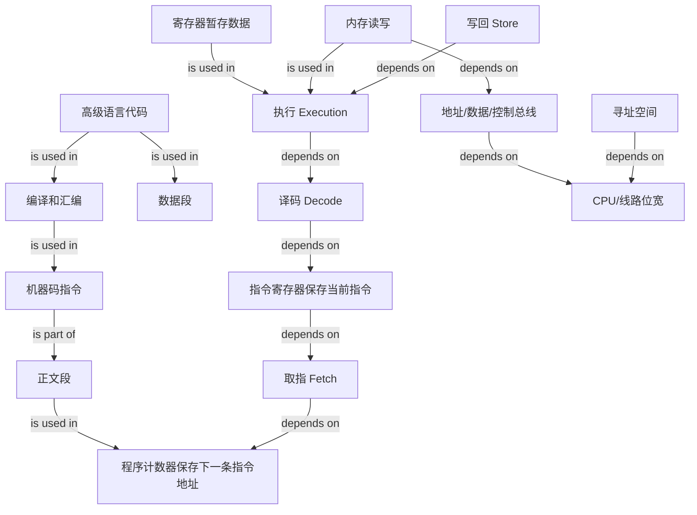

# CPU 是如何执行程序的？

### 1. Topic Overview
- What this is about: 这一章解释一段源代码如何变成 CPU 能执行的指令，以及 CPU 如何通过程序计数器、寄存器、总线、指令周期一步步运行程序。
- Why it matters: 面试里经常问 32 位/64 位、程序执行流程、寄存器、机器码、CPU 性能公式。真正难点不是背名词，而是把“代码、内存、指令、寄存器、CPU 周期”连成一个可运行的 mental model。
- Difficulty level: 基础系统八股中的底层执行模型，难度中等。需要把抽象源代码拆到硬件执行步骤。
- Prerequisites: 二进制和位宽、内存地址、寄存器的基本概念、程序由指令组成。

### 2. Core Concepts

#### Schema 1: 把程序执行看成“取出、识别、执行、写回”的循环
- Definition: 无论是图灵机还是现代 CPU，核心执行模式都是从存储位置取内容，判断它是数据还是指令，执行对应动作，再把结果写回某个存储位置。
- Intuition: 图灵机的纸带像内存，读写头像 CPU 访问内存的动作，控制单元负责判断，运算单元负责计算，状态/寄存器负责暂存中间数据。
- Example: 图灵机执行 `1 + 2` 时，先把 `1` 和 `2` 读入状态，遇到 `+` 后控制单元识别为运算指令，通知运算单元加和，最后把 `3` 写回纸带。
- Common mistakes: 只记住“CPU 执行指令”，但说不出指令从哪里来、谁负责识别、结果写到哪里。

#### Schema 2: 用冯诺依曼模型定位每个部件的责任
- Definition: 冯诺依曼模型把计算机分成运算器、控制器、存储器、输入设备、输出设备。现代 CPU 内部主要包含控制单元、逻辑运算单元和寄存器，内存通过总线与 CPU 交互。
- Intuition: 存储器负责放程序和数据；控制器负责安排取指、译码、控制流程；运算器负责算术和逻辑计算；输入输出设备负责外部交互。
- Example: 程序和数据在内存中线性存放，每个字节有地址。CPU 要读内存时，地址总线指定地址，控制总线发读/写命令，数据总线传输内容。
- Common mistakes: 把内存当作 CPU 内部组件；把寄存器和内存混为一谈；不知道总线分地址、数据、控制三类。

#### Schema 3: 区分 CPU 位宽、线路位宽和寻址能力
- Definition: CPU 位宽通常表示 CPU 一次能处理多少位数据；线路位宽表示总线一次能表达或传输多少位；地址总线宽度决定理论可寻址地址数量。
- Intuition: 32 位 CPU 一次适合处理 32 位，即 4 字节；64 位 CPU 一次适合处理 64 位，即 8 字节。地址总线有 n 条线，就能表达 `2^n` 个地址。
- Example: 32 条地址总线可表达 `2^32` 个地址。如果按字节寻址，理论寻址空间是 4GB；如果地址总线为 64 位，则理论可表示 `2^64` 个地址。
- Common mistakes: 以为 64 位 CPU 在所有场景都比 32 位快很多；以为 32 位地址总线能“同时操作 2^32 个地址”；混淆硬件位宽和软件指令位宽。

#### Schema 4: 用程序计数器解释 CPU 指令周期
- Definition: 程序计数器保存下一条指令所在的内存地址。CPU 根据这个地址取出指令放入指令寄存器，程序计数器自增，然后译码并执行当前指令。
- Intuition: 程序不是一次性被 CPU 全部理解，而是一条指令接一条指令地被取出和执行。程序计数器像“下一步去哪取指令”的书签。
- Example: 32 位 CPU 中，如果每条指令占 4 字节，程序计数器从 `0x100` 取完当前指令后通常自增到 `0x104`。
- Common mistakes: 说程序计数器保存“下一条指令本身”。更准确地说，它保存下一条指令的内存地址，指令本身取出后放在指令寄存器中。

#### Schema 5: 把 `a = 1 + 2` 拆成数据段、正文段和寄存器流动
- Definition: CPU 不认识高级语言字符串。源代码要先经编译、汇编，变成机器码指令；数据和指令分别放在内存中的数据段和正文段。
- Intuition: `a = 1 + 2` 在 CPU 看来不是一个表达式，而是一串 load、load、add、store 指令。
- Example: 数据 `1` 在 `0x200`，数据 `2` 在 `0x204`；正文段从 `0x100` 开始依次放四条指令：把 `1` load 到 `R0`，把 `2` load 到 `R1`，add 到 `R2`，再 store 到变量 `a` 的地址 `0x208`。
- Common mistakes: 以为变量名 `a` 会被 CPU 直接识别；忽略数据段和正文段的分离；不知道寄存器是计算的直接操作对象。

#### Schema 6: 用机器码格式理解“编码”和“解码”
- Definition: 指令最终是一串二进制机器码。编译/汇编阶段把操作、寄存器、地址等信息编码进机器码；CPU 执行时再解码机器码。
- Intuition: 汇编代码是给人看的近似形式，机器码才是 CPU 真正识别的形式。
- Example: MIPS 中一条 32 位指令高 6 位是操作码。`add R0, R1 -> R2` 属于 R 型指令，由操作码、源寄存器、目标寄存器、位移量、功能码拼成，示例机器码可写成 `0x00011020`。
- Common mistakes: 把“汇编指令”和“机器码”当成完全相同；不知道不同 CPU 指令集对应不同机器码。

#### Schema 7: 用 CPU 执行时间公式定位性能优化入口
- Definition: 程序 CPU 执行时间可以拆成 `CPU 时钟周期数 x 时钟周期时间`，进一步拆成 `指令数 x CPI x 时钟周期时间`。
- Intuition: 程序快不快，不只看主频。软件和编译器影响指令数，CPU 流水线影响 CPI，硬件主频影响时钟周期时间。
- Example: 提高主频会缩短时钟周期时间，但受散热和硬件限制；现代 CPU 用流水线降低平均每条指令所需周期；编译器优化可减少指令数。
- Common mistakes: 只用 GHz 判断程序性能；以为一个时钟周期一定执行完一条指令；忽略不同指令的 CPI 不同。

#### Schema 8: 用 ISA 执行模式和 ABI 理解 32/64 位软件兼容性
- Definition: 软件的 32/64 位通常表示它面向的 ISA 执行模式和 ABI，包括寄存器、地址/指针宽度、调用约定和系统库等；不能简化为“每条指令恰好占 32 或 64 位”。
- Intuition: 64 位 CPU 可以额外提供 32 位兼容执行模式，但还需要操作系统与 32 位库支持；32 位 CPU 本身没有 64 位执行模式和相应寄存器/地址语义，因此不能原生执行 64 位程序。
- Example: 32 位程序在支持兼容模式和所需系统库的 64 位系统上可以运行；64 位操作系统不能原生安装在只支持 32 位执行模式的 CPU 上。
- Common mistakes: 认为 64 位 CPU 必然能运行任何 32 位软件；把软件位数等同于单条指令长度；认为 32/64 位兼容是对称的。

### 3. Deep Understanding
- Key causal chain: 源代码先被翻译成指令，指令和数据放入内存；程序计数器给出下一条指令地址；控制单元通过总线取指令到指令寄存器；CPU 解码指令，调度运算器或控制器执行；结果写回寄存器或内存；程序计数器继续指向下一条指令。
- Concept interaction:
  - 图灵机提供最小执行模型：纸带、读写头、控制、运算、状态。
  - 冯诺依曼模型把这个模型工程化：内存、CPU、总线、I/O。
  - 程序计数器和指令寄存器让“顺序执行指令”可操作。
  - 位宽决定一次处理数据的规模和理论寻址能力边界。
  - 指令集和机器码决定 CPU 能理解什么形式的命令。
- Tradeoffs and boundaries:
  - 64 位 CPU 的优势主要在大整数计算和更大寻址空间，不代表所有普通计算都显著更快。
  - 32 位软件能否在 64 位机器上运行取决于 CPU 兼容执行模式、操作系统和 32 位系统库；64 位软件不能原生运行在仅支持 32 位模式的 CPU 上。
  - 主频高不等于程序一定快，执行时间还取决于指令数和 CPI。

### 4. Minimal Working Example

场景：在 32 位 CPU 上执行 `a = 1 + 2`。

1. 编译器把高级语言表达式转成指令序列。
2. 数据段放数据：
   - `0x200`: `1`
   - `0x204`: `2`
   - `0x208`: 变量 `a` 的存放位置
3. 正文段放指令：
   - `0x100`: `load 0x200 -> R0`
   - `0x104`: `load 0x204 -> R1`
   - `0x108`: `add R0, R1 -> R2`
   - `0x10c`: `store R2 -> 0x208`
4. 程序计数器初始为 `0x100`。
5. CPU 循环执行：
   - Fetch: 根据程序计数器从内存取指令。
   - Decode: 控制器解析指令类型和参数。
   - Execution: 运算器执行加法，或控制器执行数据传输/跳转控制。
   - Store: 把结果写回寄存器或内存。
6. 因为每条指令占 4 字节，程序计数器通常按 `0x100 -> 0x104 -> 0x108 -> 0x10c` 前进。

### 5. Knowledge Graph

### 6. Self-Test Questions
- Recall 1: 程序计数器保存的是下一条指令本身，还是下一条指令所在的内存地址？
- Recall 2: 地址总线、数据总线、控制总线分别负责什么？
- Recall 3: CPU 指令周期的四个阶段是什么？
- Application 1: 如果 32 位 CPU 每条指令占 4 字节，当前程序计数器是 `0x108`，顺序执行后下一条通常是多少？
- Application 2: 为什么 `a = 1 + 2` 需要先变成 load/add/store 这类指令，而不是 CPU 直接识别字符串？
- ELI5: 用“书签、取书页、读懂句子、做动作、写结果”的比喻解释 CPU 怎么执行程序。

### 7. Weak Point Detection
- Likely failure pattern 1: 把程序计数器说成“保存下一条指令”，没有指出它保存的是地址。
- Likely failure pattern 2: 能背 32 位/64 位，但不能解释 32 位 CPU 为什么最多常说寻址 4GB。
- Likely failure pattern 3: 把寄存器、内存、缓存、数据段、正文段混成一类“存东西的地方”。
- Likely failure pattern 4: 只会说“CPU 执行指令”，不能按 Fetch、Decode、Execution、Store 讲清数据流。
- Likely failure pattern 5: 只用主频判断速度，不知道 `指令数 x CPI x 时钟周期时间` 三个因素。
