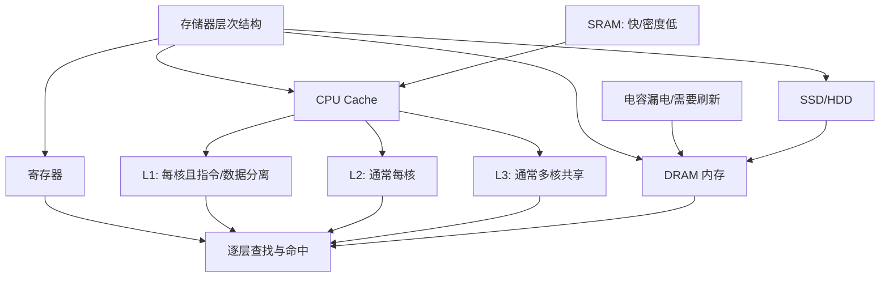

# 存储器层次结构：为什么磁盘比内存慢很多

### 1. Topic Overview

- What this is about: 这篇文章从寄存器、CPU Cache、内存到 SSD/HDD，解释计算机为什么需要多层存储器，以及各层在速度、容量、成本和持久性上的差异。
- Why it matters: CPU 的计算速度远快于内存和硬盘。如果只使用一种存储设备，要么容量太小且极贵，要么容量够大但 CPU 会长期等待。理解层次结构，才能理解缓存、局部性和程序性能。
- Difficulty level: 入门到中等。难点不在记设备名，而在建立“越靠近 CPU 越快、越小、越贵”和“数据逐层流动”的因果模型。
- Prerequisites: CPU 执行指令时需要读取指令和数据；时钟周期、ns/μs/ms 的基本换算；断电后数据可能丢失。
- Source: `materials/os/1_hardware/storage.md`。文中的容量、周期和延迟是文章给出的典型示意值，具体硬件会变化。

### 2. Core Concepts

#### Schema 1: 用三项取舍定位存储层级

- Definition: 存储器从上到下依次是 `寄存器 -> L1 -> L2 -> L3 -> 内存 -> SSD/HDD`。越靠近 CPU，通常访问越快、单位容量成本越高、容量越小；越远离 CPU，则通常更慢、更便宜、容量更大。
- Intuition: 像在图书馆学习：正在思考的内容是寄存器，脑中的记忆是 Cache，桌上的书是内存，书架上的书是硬盘。离你越近，拿取越快，但能同时放下的东西越少。
- Example: CPU 正在相加的两个数先放在寄存器；近期反复使用的数据可能在 L1/L2/L3；程序运行时的大量指令和数据在内存；长期文件放在 SSD/HDD。文章还给出寄存器通常只有几十到几百个，32 位 CPU 的多数寄存器可放 4 字节，64 位 CPU 的多数寄存器可放 8 字节；其读写一般要求在半个时钟周期内完成。以 2 GHz 为例，一个周期是 `1 / 2 GHz = 0.5 ns`。
- Common mistakes: 只背“越快越小”，却漏掉单位容量成本；认为容量小只是因为离 CPU 近，而忽略高速材料和芯片面积的代价；把内存和硬盘当成 CPU 内部组件。

#### Schema 2: 用实现材料解释 SRAM 与 DRAM 的取舍

- Definition: CPU Cache 通常使用 SRAM；文章用“1 bit 通常约需 6 个晶体管”说明其电路快但密度低。内存通常使用 DRAM；1 bit 可由一个晶体管和一个电容保存，密度更高、成本更低，但电容会漏电，需要定时刷新，访问电路也更复杂。
- Intuition: SRAM 用更多硬件换速度；DRAM 用更紧凑的结构换容量与成本，但要付出刷新和更高访问延迟。
- Example: 文章给出的典型范围是 L1 约 `2~4` 个时钟周期，L2 约 `10~20` 个周期，L3 约 `20~60` 个周期，内存约 `200~300` 个周期。
- Common mistakes: 把 SRAM 的“静态”理解成断电不丢数据。SRAM 和 DRAM 都是易失性的；“静态”只表示通电期间无需像 DRAM 那样周期刷新。

#### Schema 3: 区分各级 Cache 的角色

- Definition: L1、L2、L3 都是 CPU Cache。文章描述的常见组织是：L1 每核私有，并拆成指令缓存和数据缓存；L2 通常每核私有；L3 通常由多个核心共享。
- Intuition: L1 优先追求最低延迟，所以最小；向 L2、L3 走时，延迟增加但容量也增加，能拦住更多原本要访问内存的请求。
- Example: 文章中的 Linux 示例用 `/sys/devices/system/cpu/cpu0/cache/index0..3/size` 查看各级 Cache 容量，示例值分别出现 32K、32K、256K、3072K。
- Common mistakes: 认为所有 CPU 都严格采用相同的共享方式、容量和索引编号；把 L1 指令缓存和数据缓存混成一块；认为 L3 比内存更慢。

#### Schema 4: 用易失性区分内存与持久化存储

- Definition: 寄存器、CPU Cache 和 DRAM 内存断电后数据会丢失；SSD/HDD 是持久化存储，断电后仍能保存数据。硬盘同时属于 I/O 设备。
- Intuition: “是否断电保留”与“是否快”是两个不同维度。SSD 虽也是电子存储，但它的目标是持久保存；DRAM 的目标是给运行中的程序提供较快工作空间。
- Example: 打开一个文件时，文件长期存在 SSD/HDD；程序运行前，相关内容先被读到内存，随后热点内容再进入 Cache 和寄存器供 CPU 使用。SSD 没有 HDD 的机械寻道动作，随机访问通常快得多；HDD 依赖机械结构进行物理读写，所以随机访问延迟尤其高。
- Common mistakes: 因为 SSD 没有机械部件就把它当内存；因为 SRAM 名字中有“静态”就认为它能持久保存。

#### Schema 5: 用相邻层与缓存命中解释数据流

- Definition: 文章用简化模型说明每层主要和相邻层交换数据。硬盘数据先进入内存，再进入 CPU Cache，最后进入寄存器；写回也逐层进行，而不是 L1 直接访问硬盘。
- Intuition: 上层保存下层的一小部分常用数据。CPU 查找数据时，从最快的小层开始：寄存器没有，再查 L1、L2、L3，仍没有才访问内存。越早命中，平均等待时间越短。
- Example: 第一次读取一个大文件的数据时，可能需要 SSD -> 内存 -> Cache -> 寄存器；紧接着再次使用同一数据，若仍在 Cache 中，就不必再次等待 SSD。
- Common mistakes: 把“相邻层交互”理解成所有具体硬件写策略都只有一种；认为 Cache 装的是全部内存；只知道有 Cache，却说不出 Cache 命中为什么能缩短平均访问时间。

#### Schema 6: 统一时间单位再比较延迟

- Definition: 比较速度倍数时，应比较访问延迟，并先统一单位。`1 μs = 1000 ns`，`1 ms = 1000 μs = 1,000,000 ns`；在相同工作量下，延迟倍数就是较慢延迟除以较快延迟。
- Intuition: 不要看到数值 150 和 100 就直接比较，因为 `150 μs` 和 `100 ns` 的单位不同。
- Example: 按文章示例，L1 为 `1 ns`、内存为 `100 ns`、SSD 为 `150 μs = 150,000 ns`、HDD 为 `10 ms = 10,000,000 ns`。所以相对 L1，内存约慢 100 倍、SSD 约慢 150,000 倍、HDD 约慢 10,000,000 倍。
- Common mistakes: 不换单位就相除；把“延迟低 100 倍”说成“耗时多 100 倍”的反方向；把文章中的典型值当作所有设备的固定规格。

文章还用单位容量价格突出同一取舍：其示例中每 MB 的 L1 Cache 约比内存贵 466 倍、比 HDD 贵 175,000 倍。这些价格数字会快速过时，应该用来理解“高速小容量层很贵”，而不是当作当前采购报价。

### 3. Deep Understanding

存储器层次结构的核心因果链是：

`CPU 很快，但高速存储昂贵且难以做大 -> 不能只用寄存器/SRAM -> 用更大更慢的 DRAM 和持久化硬盘补容量 -> 把常用数据逐级复制到更快的小层 -> 大多数访问若能在上层命中，就能获得接近快层的平均性能，同时保留下层的大容量和低成本。`

这个结构同时处理四个维度：

- 延迟：寄存器和 Cache 最低，内存次之，SSD/HDD 更高。
- 容量：方向通常与速度相反，越往下越大。
- 单位容量成本：越往下通常越便宜。
- 持久性：寄存器、Cache、DRAM 易失；SSD/HDD 非易失。

关键边界：

- “离 CPU 近”是帮助理解层级的直觉，不是唯一物理原因；材料、电路复杂度、芯片面积和组织方式共同决定成本与延迟。
- “每层只与相邻层交互”是文章用于建立主模型的抽象。真实系统还有 DMA、写回/直写 Cache 等实现细节，但不改变分层缓存的核心思想。
- Cache 的价值不只是“它很快”，而是程序访问通常存在时间局部性和空间局部性，使一个小 Cache 也能覆盖大量访问。本文尚未展开局部性，但它是缓存体系有效的前提。

### 4. Minimal Working Example

场景：程序第一次读取 SSD 文件中的整数 `42`，随后连续使用它做三次运算。

1. 文件长期保存在 SSD，断电后仍存在。
2. 操作系统把相关数据从 SSD 读入 DRAM 内存。
3. CPU 访问该内存位置时，相关数据被带入 CPU Cache。
4. 执行算术指令前，`42` 进入寄存器，ALU 直接操作寄存器中的值。
5. 随后的重复使用如果命中寄存器或 Cache，就无需再次访问 SSD，也可能无需再次访问内存。

用文章的时间尺度类比：如果 L1 的 `1 ns` 被放大成 1 秒，那么内存约是 100 秒（接近 2 分钟），SSD 约 150,000 秒（约 1.7 天），HDD 约 10,000,000 秒（约 116 天，接近 4 个月）。这说明一次下层未命中的代价可能非常大。

### 5. Knowledge Graph

### 6. Self-Test Questions

Recall:

1. 请按离 CPU 从近到远写出寄存器、L1/L2/L3、内存、SSD/HDD 的顺序。
2. 为什么 SRAM 通常比 DRAM 快，但难以做成同等成本的大容量？
3. 哪些层断电会丢数据，哪些层用于持久化？

Application / transfer:

4. 某数据不在 L1，但在 L2，CPU 是否需要访问内存？请说明查找路径。
5. 若某设备随机访问延迟为 `200 μs`，L1 延迟为 `2 ns`，前者约是后者的多少倍？

Explain like I am 5:

6. 请用“手里、桌上、书架上”向小朋友解释为什么电脑不把所有数据都放在最快的存储器里。

### 7. Weak Point Detection

- Likely failure pattern 1: 会背层级，却无法同时判断速度、容量和单位容量成本的变化方向。
- Likely failure pattern 2: 混淆 SRAM 的“静态”、DRAM 的“动态”和断电持久性。
- Likely failure pattern 3: 说 CPU 直接从硬盘取指令，忽略硬盘 -> 内存 -> Cache -> 寄存器的数据路径。
- Likely failure pattern 4: 在 ns、μs、ms 之间比较时漏掉 1000 倍换算。
- Likely failure pattern 5: 把文中延迟与倍数当作所有现代硬件永远不变的精确值。
