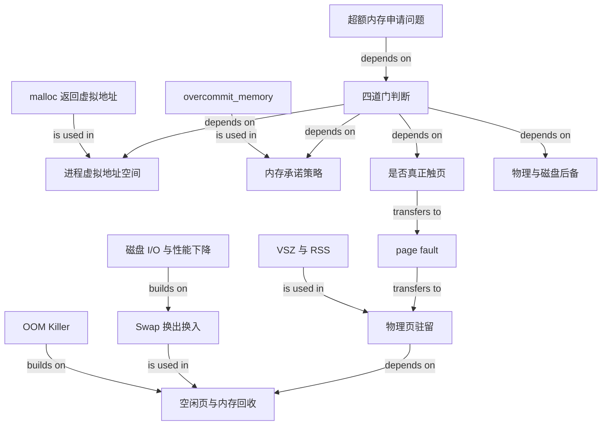

# 超额内存申请：从虚拟地址承诺到 Swap 与 OOM

### 1. Topic Overview

- What this is about: 本章回答“4GB 物理内存的机器申请 8GB 内存会怎样”。答案不能只比较 `8GB > 4GB`，而要依次判断进程地址空间、Linux 内存承诺策略、申请后是否真正访问，以及物理内存与 Swap 能否承载实际工作集。
- Why it matters: 这是把 `malloc`、虚拟内存、缺页、VSZ/RSS、overcommit、内存回收、Swap 和 OOM 串成一条运行时决策链的典型面试题。
- Difficulty level: 中高。难点不是记住“成功”或“失败”，而是区分申请阶段与使用阶段，并说明失败发生在哪一层、以什么现象出现。
- Prerequisites: 进程虚拟地址空间、分页与可恢复缺页异常、`malloc` 返回虚拟地址、匿名页、内存回收与 OOM。
- Source: `materials/os/3_memory/alloc_mem.md`，按原文顺序整理：前置条件 → 32/64 位地址空间 → overcommit → 接近地址上限的实验 → Swap → 无/有 Swap 实验 → 总结。
- Source boundary: 原文的 `32 位用户空间 3GB`、`64 位用户空间 128TB`、overcommit 行为和实验结果来自特定 Linux/macOS 环境，是章节中的教学模型，不是所有架构、内核配置和进程都恒定不变的保证。

### 2. Core Concepts

#### Schema 1: 用“四道门”判断超额内存申请结果

- Definition: 面对“物理内存只有 N，却申请 M”时，依次检查四道门：地址空间是否容得下、内核承诺策略是否接受、申请后是否真正触页、物理内存/回收/Swap 是否能承载驻留工作集。
- Intuition: `malloc` 像预订房间。先要有足够的门牌号，再看酒店是否接受超额预订；只有客人真正入住才需要实体房间；房间不足时还能整理或安排临时住处，最后仍放不下才赶走住客。
- Example: 在原文模型中，32 位 Linux 进程只有约 `3GB` 用户虚拟空间，申请 `8GB` 会在地址空间阶段失败。64 位进程有约 `128TB` 用户虚拟空间，`8GB malloc` 可能成功；若完全不访问，主体数据不会立刻占用等量物理页；若全部触页，则结果取决于物理内存、回收、Swap 和 OOM。
- Common mistakes: 只比较申请量与物理内存；把 64 位等同于一定成功；忽略 overcommit；忽略“申请但未触页”和“全部触页”的差别；把 Swap 当成无限内存。

四道门的可复用顺序：

1. **地址门**：进程可用虚拟地址空间是否足够，并且能否找到合适的地址范围？
2. **承诺门**：`vm.overcommit_memory` 等策略是否允许这次内存承诺？
3. **触页门**：程序是否读写了申请区域，使页面需要真正驻留？
4. **后备门**：空闲物理页、可回收页和 Swap 是否足以支撑被触及的工作集？

原文开头明确列出“32/64 位、是否使用、是否有 Swap”三个前置条件；overcommit 是文章随后实验中补出的第四个必要判断层。

#### Schema 2: 用 `VSZ/RSS + 首次触页` 区分虚拟申请与物理驻留

- Definition: `malloc()` 成功首先表示分配器给进程返回了一段可用虚拟地址；尚未访问的新虚拟页通常不需要立刻配齐等量驻留物理页。首次读写未映射但合法的页时，CPU 产生 page fault，内核分配物理页并建立映射，随后恢复原指令。
- Intuition: `VSZ` 更接近“登记了多少地址范围”，`RSS` 更接近“当前有多少页面实际住在物理内存”。地址登记量可以远大于机器 RAM。
- Example: 原文在 `2GB` 物理内存的 64 位服务器上连续 `malloc` 四次 `1GB`，但不访问这些区域。进程显示约 `4GB VSZ`，而 RSS 很小，说明地址范围已经取得，主体页面尚未全部驻留。
- Common mistakes: 把 `malloc(8GB)` 等同于立刻获得 `8GB` 物理内存；把 VSZ 当成 RSS；把合法的首次触页 page fault 当成段错误；认为完全不触页就绝不消耗任何物理内存。

需要保留两个边界：

- 分配虚拟空间本身仍需分配器和内核保存元数据，这些数据会占物理内存；所以“未触碰 8GB 负载”不等于“整个申请过程零物理成本”。
- `malloc` 是用户态分配器接口，可能先复用已有 arena；本章抽象的是“虚拟承诺与物理驻留分离”，并不意味着每次 `malloc` 都新建一段内核映射。

#### Schema 3: 用“拒绝申请 vs 事后杀进程”定位失败阶段

- Definition: `Cannot allocate memory`/`malloc == NULL` 表示申请在返回给程序前已被拒绝；`Killed` 且日志显示 OOM Killer，表示前面的申请或运行已经推进，但后续系统资源压力使内核选择终止进程。
- Intuition: 前者是“预订没通过”，后者是“先让你进来，后来发现全场兜不住，只能清退”。
- Example: 原文读者在 64 位系统申请 `4GB` 时，`overcommit_memory=0` 的启发式检查可能直接拒绝并返回 `Cannot allocate memory`；设置为 `1` 后申请通过。另一组接近 `128TB` 的实验则出现 `Killed`，文章将其归因于虚拟内存管理元数据等物理成本最终触发 OOM。
- Common mistakes: 把 `ENOMEM` 与 OOM Kill 当成同一个时刻；认为 `overcommit_memory=1` 后不会 OOM；看到 `Killed` 就说 `malloc` 返回失败；把文章中 mode 0 的一次实验结果推广到所有内核。

文章给出的三个 overcommit 模式：

| `vm.overcommit_memory` | 文章中的主旨 | 正确使用边界 |
| --- | --- | --- |
| `0` | 启发式判断，允许合理 overcommit，也可能拒绝过大的申请 | 启发式会受内核版本、当前可用资源和申请形态影响，因此相似机器可能得到不同结果 |
| `1` | 总是允许 overcommit | 只是显著放宽承诺检查；地址空间、映射元数据、资源限制和后续真实驻留仍可能失败 |
| `2` | 不允许 overcommit | 更精确地说是按严格 commit accounting/CommitLimit 接受或拒绝，不是“任何虚拟申请都禁止” |

原文把 mode `0` 的启发式容量近似描述为 `free memory + free swap + page cache + SLAB 中可回收部分`，并明确记录：作者的 mode `0` 环境能在 `2GB` RAM 上申请 `4GB`，另一位读者的 mode `0` 环境却失败。因此这条式子只应用来理解“内核会估计能否兑现”，不能当成跨内核版本的精确判定公式。可用 `cat /proc/sys/vm/overcommit_memory` 查看当前模式；把模式改为 `1` 只适合隔离承诺检查对实验的影响，不是消除实际内存风险。

接近地址上限的原文实验还说明：在 `2GB` RAM 上反复扩大虚拟空间时，即使不触及主体数据，内核保存映射等元数据也会增长，进程可能先被 OOM Kill；启用 `1GB` Swap 后，实验累计到约 `127.998TB` 才出现 `Cannot allocate memory`，而申请 `127TB` 成功。这个结果是文章环境中的观察，不能推导出所有 64 位进程都有相同上限。

#### Schema 4: 用“匿名页后备 + 换出/换入”理解 Swap

- Definition: Swap 把磁盘分区或文件用作匿名页的后备空间。内存紧张时，不常访问的匿名页可 Swap Out 到磁盘并释放物理页；再次访问时再 Swap In 回内存。
- Intuition: Swap 不是把磁盘变成同速 RAM，而是让暂时不用的数据先去慢速仓库，腾出昂贵的物理页给当前活跃工作集。
- Example: 进程堆、栈等匿名页没有对应文件，不能像干净文件页一样直接丢弃；有 Swap 时可先写到 Swap。原文的 macOS 实验中，`8GB` RAM 的机器申请并反复触及 `32GB` 区域后仍运行，但 Swap 使用量和磁盘 I/O 明显升高。
- Common mistakes: 说所有页面都通过 Swap 回收；把脏文件页写回原文件称为 Swap；认为有 Swap 就一定不会 OOM；只看到“能运行”而忽略磁盘 I/O 和性能下降。

与回收的关系：

- 干净文件页有原文件后备，可直接丢弃，需要时重读。
- 脏文件页要先写回原文件，再释放物理页。
- 匿名页没有原文件后备，有 Swap 时可换出；没有 Swap 时可回收选择更少。
- 内存不足时，申请路径可能进入同步 direct reclaim；内存低于水位时，`kswapd` 可异步回收冷页。
- Linux 可用独立 Swap 分区或文件系统中的 Swapfile 作为载体；载体形式不同，不改变换出/换入这一核心 schema。

Swap 扩大了可承载工作集，但受 Swap 容量、回收效率、磁盘速度和其他资源约束，不能把内存变成无上限。

#### Schema 5: 用“实际触及的工作集”预测实验结果

- Definition: 决定物理压力的核心不是 `malloc` 参数本身，而是有多少页面被真正触及、仍需保留，以及这些页能否被回收或换出。
- Intuition: 预订 `32GB` 与让 `32GB` 数据持续轮流活跃是两种完全不同的负载；后者迫使系统在 RAM 和 Swap 之间不断搬页。
- Example:
  - 原文实验一：`2GB` RAM、无 Swap，先申请 `4GB` 再用 `memset` 逐块触页；访问到第 2 个 `1GB` 区域时进程被 OOM Killer 杀死。
  - 原文实验二：`8GB` RAM、macOS 动态 Swap，反复访问 `32GB` 区域时程序继续运行，但出现显著磁盘 I/O；申请 `64GB` 并触及约 `56GB` 后仍被杀死。
- Common mistakes: 只根据申请总量预测结果；认为触碰一个字节就会立刻驻留整个 `malloc` 区域；把原文某次“在第 2GB 被杀”当成其他机器的固定阈值；认为运行成功就意味着性能可接受。

当回收仍不能满足分配时，OOM Killer 会给可杀进程评分，分数越高越容易被选中。它是在资源已经兜不住时释放内存的最后手段，不是 `malloc` 的普通返回路径。

### 3. Deep Understanding

全章可以压缩成一棵决策树：

```text
malloc(M)
├─ 可用虚拟地址空间不足
│  └─ 申请阶段失败：malloc 返回 NULL / ENOMEM
└─ 地址空间足够
   ├─ 承诺策略拒绝
   │  └─ 申请阶段失败：malloc 返回 NULL / ENOMEM
   └─ 承诺策略接受
      ├─ 没有触及主体页面
      │  └─ VSZ 可很大、RSS 通常较小，但分配器/内核元数据仍有物理成本
      └─ 页面被触及
         ├─ 空闲页足够：分配物理页并建立映射
         └─ 空闲页不足：回收
            ├─ 文件页：丢弃干净页或写回脏页
            ├─ 匿名页且有 Swap：换出，未来再换入
            └─ 回收仍无法满足：OOM Killer 可能终止进程
```

所以，“4GB 物理内存能否申请 8GB”至少存在三类不同答案：

1. **地址或承诺阶段就失败**：`malloc` 返回 `NULL/ENOMEM`。
2. **申请成功且暂时看起来很轻**：只扩大虚拟地址范围，VSZ 上升，主体页尚未驻留。
3. **申请成功但使用时失败或变慢**：首次触页持续增加 RSS；内核回收、Swap 和磁盘 I/O 加重，最终仍可能 OOM Kill。

原文中的 `3GB` 与 `128TB` 还不能理解成“单次 `malloc` 可用的精确上限”。程序代码、动态库、堆、栈和其他映射已经占用一部分地址空间，连续范围、内核配置与其他资源限制也会缩小实际可申请量。原文申请到约 `127.998TB` 才失败，正是“理论用户空间不等于全部都能留给这一笔申请”的例子。

### 4. Minimal Working Example

```c
#include <stdlib.h>
#include <stdint.h>

size_t n = 8ULL * 1024 * 1024 * 1024;
char *p = malloc(n);
if (p == NULL) {
    /* 地址门或承诺门没有通过 */
    return 1;
}

/* 若停在这里，不能据此说 8GB 主体页面已全部驻留。 */

for (size_t i = 0; i < n; i += 4096) {
    p[i] = 0;  /* 逐页触及，才持续制造物理驻留压力 */
}
```

Reasoning flow:

1. `malloc` 返回 `NULL`：先检查进程地址空间、overcommit/commit 限制和其他资源约束，不要直接归因于 RAM 小于 `8GB`。
2. `malloc` 成功但循环尚未运行：只证明得到可用虚拟地址；VSZ 可明显增加，RSS 不必同步增加 `8GB`。
3. 循环每隔一页写一次：每个新页首次访问时可能发生可恢复 page fault，内核分配物理页并建立映射。
4. RAM 变紧：内核先寻找空闲页并回收；有 Swap 时冷匿名页可以换出，无 Swap 时匿名页缺少磁盘后备。
5. 工作集远大于 RAM：即使有 Swap，也可能出现频繁换入换出和高磁盘 I/O；回收仍不能满足时进入 OOM。

边界：示例用 `4096` 只是为了对应常见 `4KB` 页；真实页大小应从运行环境获取，不能把它当作所有系统固定值。

### 5. Knowledge Graph



### 6. Self-Test Questions

Recall:

1. 判断“4GB 物理内存申请 8GB”时，四道门分别是什么？
2. `VSZ` 很大而 `RSS` 很小，通常说明虚拟地址范围与物理驻留之间是什么关系？
3. `malloc` 返回 `NULL/ENOMEM` 与进程后来显示 `Killed`，分别说明失败更可能发生在哪个阶段？

Application / transfer:

4. 一台 64 位 Linux 机器只有 `4GB` RAM，`malloc(8GB)` 成功后程序从未访问该区域。你能得出哪些结论，又不能得出哪些结论？
5. 同一程序开始逐页写满这 `8GB`，机器没有 Swap。请从 page fault 开始预测内核会经历的主要阶段；如果改为有 Swap，结果与性能风险会怎样改变？

Explain like I am 5:

6. 用“门牌号、超额预订、真正入住、临时仓库”解释为什么申请量大于物理内存不一定立刻失败，但以后仍可能被系统杀死。

### 7. Weak Point Detection

- 一看到 `8GB > 4GB` 就回答失败，说明混淆虚拟申请量和物理驻留量。
- 一看到 64 位就回答一定成功，说明遗漏承诺策略、地址占用和资源限制。
- 说“malloc 成功后 8GB 都已经在 RAM”，说明首次触页 schema 不稳。
- 说“完全没访问就零物理成本”，说明遗漏分配器/内核元数据。
- 分不清 `ENOMEM` 与 `Killed/OOM`，说明申请阶段和使用阶段边界不稳。
- 把 `overcommit_memory=1` 当成不会 OOM，说明混淆“允许承诺”和“兑现驻留”。
- 说有 Swap 就一定正常且性能不变，说明缺少容量边界和磁盘 I/O 成本。
- 把实验中的 `3GB/128TB`、第 `2GB` 被杀或 `32GB` 可运行当成通用硬阈值，说明忽略系统与负载条件。
