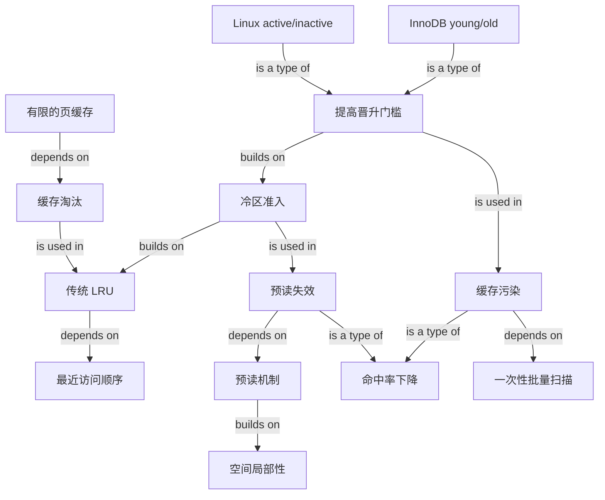

# 改进 LRU：避免预读失效与缓存污染

### 1. Topic Overview

- What this is about: 本章比较 Linux Page Cache 与 MySQL InnoDB Buffer Pool 如何改进传统 LRU。重点不是背两个链表名，而是先区分两类缓存伤害，再理解为什么“冷热分区”和“提高晋升门槛”必须配合。
- Why it matters: 预读和批量扫描本来都是合理操作，却可能把真正热点页挤出有限缓存。只有区分“从未真正使用”与“只使用一次”，才能解释系统为何既保留预读，又不让一次性页污染热区。
- Difficulty level: 中等。难点是区分预读失效与缓存污染，以及理解文章前后对“页被访问后晋升”的描述是一层层加严，而不是两套互相矛盾的规则。
- Prerequisites: 页、Page Cache、Buffer Pool、缓存命中/未命中、空间局部性、链表头尾。
- Source: `materials/os/3_memory/cache_lru.md`，按原文顺序整理：Linux/MySQL 缓存 → 传统 LRU → 预读机制与预读失效 → 冷热分区 → 缓存污染 → 提高热区晋升门槛 → 总结。
- Source boundary: 本笔记忠实保留文章的教学模型。文中的 InnoDB `young:old = 7:3` 与 `1 秒` 都写作默认值；真实配置、具体内核或数据库版本可能不同，不能把它们当作跨环境不变常数。

### 2. Core Concepts

#### Schema 1: 用“命中搬头、未命中入头淘尾”运行传统 LRU

- Definition: LRU（Least Recently Used）用最近使用次序近似未来价值。链表头保存最近使用的页，链表尾保存最久没有使用的页；命中时把页移到头部，未命中时把新页放到头部，空间已满则淘汰尾页。
- Intuition: 像把最近翻过的书放到桌面最前面；桌面满时，先收走最久没翻的那本。
- Example: 链表从头到尾为 `[1, 2, 3, 4, 5]`。访问已在缓存中的 `3` 后变为 `[3, 1, 2, 4, 5]`；随后访问不在缓存中的 `8`，淘汰尾部 `5`，得到 `[8, 3, 1, 2, 4]`。
- Common mistakes: 把头尾冷热方向说反；命中后仍淘汰一页；未命中时先把新页插入却忘记容量上限；把 LRU 理解成“访问次数最少”，后者更接近 LFU。

这两个系统虽然用途不同，但本章统一把缓存对象抽象为“页”：

| 系统 | 内存缓存 | 读路径 | 写路径或本章边界 |
| --- | --- | --- | --- |
| Linux | Page Cache | 命中就从内存返回；未命中才需要磁盘 I/O | 本章重点讨论文件数据的读缓存与页淘汰 |
| MySQL InnoDB | Buffer Pool | 命中就读取缓冲池中的页；未命中才从磁盘加载 | 先修改缓冲池页并标记脏页，后台线程之后写回磁盘 |

两者容量都有限，所以既要腾出空间，又希望热点页尽量留下。传统 LRU 的根本局限是：它把“最近进入或刚被碰过”直接当成“值得长期保留”，证据门槛太低。

#### Schema 2: 用“预读了却没真正使用”诊断预读失效

- Definition: 预读根据空间局部性，在应用明确请求的数据之外，顺序加载后续相邻页；若这些额外页后来没有被真正访问，就是预读失效。
- Intuition: 你要一本书，管理员顺手把旁边三本也拿来。猜对了能省下三次取书；猜错了，那三本只是占桌面。
- Example: 应用请求文件 A 的 `0–3KB`。文章以 `4KB` block/page 为例，内核不仅读取 `0–4KB`，还把 `[4KB,8KB)`、`[8KB,12KB)`、`[12KB,16KB)` 一并加载。因此一次顺序磁盘读把 `16KB` 放入 Page Cache，可能减少后续 I/O；若后三页始终没被访问，便发生预读失效。
- Common mistakes: 只要发生预读就称为失效；认为解决办法是完全关闭预读；把预读页“进入内存”误说成应用已真正访问它；忽略 InnoDB 也有相邻页预读的类似动机。

传统 LRU 会把预读页直接放到链表头部。即使它们永远不会被访问，也会占据前排位置，并可能把链表尾部真正有价值的热点页淘汰，最终降低命中率。

#### Schema 3: 用“冷区准入”隔离尚未验证的预读页

- Definition: 新预读页先进入冷区，而不是直接获得热区位置；只有后续访问证明确有价值，才获得晋升资格。未被使用的预读页会在冷区更早被淘汰。
- Intuition: 预读页先进入“候选席”，不能因为刚到场就坐进热点 VIP 区。
- Example: Linux 文章模型中，页 `20` 被预读后进入 `inactive list` 头部，先挤掉该链表尾部的冷页，不占 `active list` 的位置。MySQL 中，页 `20` 进入 `old` 区头部，不占 `young` 区；若始终未被访问，它会比 young 中热点更早淘汰。
- Common mistakes: 把 `inactive/old` 理解成已经释放；认为 Linux 与 MySQL 使用完全相同的数据结构；认为冷区不会执行 LRU；忽略热区被挤出时通常先降到冷区而不是立刻淘汰。

文章中的实现对照：

| 系统 | 冷热组织 | 预读页初始位置 | 晋升导致的边界变化 |
| --- | --- | --- | --- |
| Linux | 两条 LRU：`active list` 与 `inactive list` | `inactive list` 头部 | 晋升到 active 头部；active 尾页可降到 inactive 头部 |
| MySQL InnoDB | 一条 LRU 划为 `young` 与 `old` 两区 | `old` 头部 | 晋升到 young 头部；young 尾页被挤到 old 头部 |

文章给出的 InnoDB 默认比例是 `young:old = 7:3`。这个比例保护较大的热点区，同时给新页/冷页保留观察区。

#### Schema 4: 用“确实访问一次，但未必再用”诊断缓存污染

- Definition: 批量扫描会真正访问大量页；若一次访问就足以晋升热区，这些未来很久不再使用的页会占满 `active/young`，挤掉原热点页，这就是缓存污染。
- Intuition: 预读失效是“候选人根本没来上班”；缓存污染是“临时工确实来过一次，却立刻占了长期员工的位置”。
- Example: `select * from t_user where name like "%xiaolin%";` 可能因为前导 `%` 无法利用普通 B+Tree 索引而扫描大量页。即使最终结果只有几行，扫描过程仍会访问许多页。若每页一被扫描就进入 young，原有热点页会被替换；热点再次访问时缓存未命中，产生大量磁盘 I/O。
- Common mistakes: 用“结果集很小”推断“扫描页很少”；把缓存污染与预读失效混成同一个问题；认为只有查询返回大量数据才会污染；忽略 Linux 批量文件读取也有相同模式。

两类问题的精确边界：

| 问题 | 页为何进入缓存 | 是否被应用真正访问 | 错误证据 |
| --- | --- | --- | --- |
| 预读失效 | 空间局部性猜测，提前加载 | 没有 | “刚被加载”被误当成热点 |
| 缓存污染 | 批量读取/全表扫描 | 有，通常只有一次或集中在很短时间 | “访问过一次”被误当成会长期复用 |

#### Schema 5: 用“访问次数 + 时间间隔”提高热区晋升门槛

- Definition: 冷热分区只解决“预读页不能直接进热区”；要抵抗批量扫描，还要提高从冷区晋升热区的证据门槛。
- Intuition: 不是“见过一次”就是熟客；要么再次回来，要么隔一段时间仍回来，才更像稳定热点。
- Example: 文章写道，Linux 页在第二次访问时才从 `inactive list` 晋升 `active list`。InnoDB 即使发生第二次访问也不一定晋升：若第二次与第一次相隔在默认 `1 秒` 内，不晋升；超过 `1 秒` 才从 old 晋升 young。一次快速扫描通常在短时间内触碰页面，因此难以获得热区资格。
- Common mistakes: 认为 MySQL 只要第二次访问就一定晋升；把“停留 old 的时间”误解成页静止不动、系统自动晋升；认为提高门槛能保证永远不淘汰热点；把文章默认 `1 秒` 当成不可配置常数。

这里要把文章前后两段合起来读：

1. “避免预读失效”一节先建立第一层结构：预读页进冷区，真正使用才有资格进入热区。
2. “避免缓存污染”一节继续收紧“真正使用”的定义：一次访问仍可能只是扫描，因此 Linux 要第二次访问；MySQL 还用时间间隔过滤短时间连续扫描。

因此最终模型不是“访问一次立即晋升”，而是：`冷区准入 → 收集复用证据 → 达到门槛后晋升热区`。

#### Schema 6: 用“先保留吞吐收益，再隔离错误猜测”理解设计取舍

- Definition: 系统没有因预读偶尔失效就取消预读，而是在保留顺序 I/O 吞吐收益的同时，限制错误预读和一次性扫描对热点缓存的伤害。
- Intuition: 优化不是把有风险的机制全关掉，而是让猜错的成本局部化。
- Example: 预读命中空间局部性时，一次顺序读可带回多个后续会使用的页，减少磁盘 I/O 次数并提高吞吐；猜错时，这些页只在 inactive/old 中短暂停留。批量扫描时，一次访问也不足以轻易进入 active/young。
- Common mistakes: 只看到预读浪费，不看其命中时的 I/O 收益；只会说“两条链表/两个区域”，说不出它们保护热点的因果链；把 LFU 当成本章 Linux/MySQL 的实现。文章只把 Redis LFU 作为对照，并说明 Redis 没有本章这种预读机制。

### 3. Deep Understanding

全章可以压缩成一条“热点证据逐级增强”的路径：

```text
磁盘读取或预读
→ 新页先进入 inactive/old 冷区
→ 若从未真正使用：沿冷区 LRU 较早淘汰
→ 若只在批量扫描中快速访问：晋升证据仍不足
→ 若出现重复且符合时间条件的访问：晋升 active/young 热区
→ 热区保存更可信的稳定热点
```

传统 LRU 只有一个维度：**最近什么时候被碰过**。改进后的设计增加了第二个维度：**这次“最近”是否足以证明未来还会复用**。冷区承担试用期，热区存放证据更强的页。

| 设计层 | 解决的问题 | 核心动作 | 仍未解决的边界 |
| --- | --- | --- | --- |
| 传统单 LRU | 有限容量下按最近使用淘汰 | 命中搬头，未命中入头淘尾 | 新页、预读页和热点页待遇相同 |
| 冷热分区 | 预读失效 | 预读页只进冷区 | 一次真实访问仍可能来自大扫描 |
| 提高晋升门槛 | 缓存污染 | 第二次访问；InnoDB 再加时间判断 | 门槛是启发式，不能完美预测未来 |

与上一章内存回收的关系：`active/inactive` 在回收视角中用于判断冷热候选；本章进一步解释这些冷热状态如何保护缓存命中率。活跃度决定“谁更值得留下”，页的 file/anon、clean/dirty 属性则决定选中后怎样回收，两个维度不能混为一谈。

### 4. Minimal Working Example

假设热区已有稳定热点页，系统随后经历两种输入：

1. **预读页 `20` 到来**：它进入 inactive/old 头部。若应用始终不读它，它只在冷区移动并较早淘汰，不会直接挤掉热区热点。
2. **顺序扫描页 `21–25`**：这些页都被真正读取一次，但它们可能只是一次性扫描。若“一次访问就晋升”，它们会占满热区并淘汰热点；提高门槛后，它们留在冷区。
3. **页 `22` 以后再次被稳定复用**：Linux 模型中第二次访问可使其晋升；InnoDB 还检查第二次访问与第一次是否超过默认 `1 秒`。满足条件后，`22` 才获得 young 位置。

Reasoning flow:

- 先问：页是预读进来的，还是应用真正访问进来的？
- 再问：应用访问了几次，时间上是否只是一次快速扫描？
- 最后决定：留在冷区、晋升热区，还是从冷区尾部淘汰。

### 5. Knowledge Graph



### 6. Self-Test Questions

Recall:

1. 传统 LRU 在命中和未命中时分别怎样更新链表？
2. 预读失效与缓存污染的关键区别是什么？
3. Linux 与 InnoDB 分别怎样组织冷区和热区？

Application / transfer:

4. 一个查询只返回 3 行，却扫描了 100 万个数据页。为什么结果集小仍可能污染 Buffer Pool？改进后的晋升门槛如何保护原热点？
5. 某页由预读进入缓存，随后在 200ms 内被连续访问两次。按文章模型分别判断 Linux 与 InnoDB 是否应晋升，并说明所用证据。

Explain like I am 5:

6. 用“候选席、熟客区和一次性访客”向小朋友解释为什么新页不能直接占据热区。

### 7. Weak Point Detection

- 把“预读进内存”说成“已被应用访问”，说明加载与使用边界不稳。
- 看到缓存命中率下降就只会说“LRU 不好”，却分不清预读失效和缓存污染，说明失效模式 schema 尚未形成。
- 用结果集大小判断扫描规模，说明遗漏“返回几行”和“访问多少页”是不同指标。
- 认为解决预读失效就是关闭预读，说明没有理解“保留吞吐收益、隔离猜错成本”的取舍。
- 把 Linux 两条链表说成 MySQL 一条链表的两个区域，或反过来，说明实现映射混淆。
- 认为页进入 inactive/old 就已经被淘汰，说明冷热位置与物理释放边界不稳。
- 只答“第二次访问就晋升”而不区分 Linux 与 InnoDB 的时间条件，说明晋升门槛边界不稳。
- 把文章前半“真正访问后晋升”与后半“提高门槛”当成矛盾，说明没有识别“先分区、再收紧资格”的递进结构。
