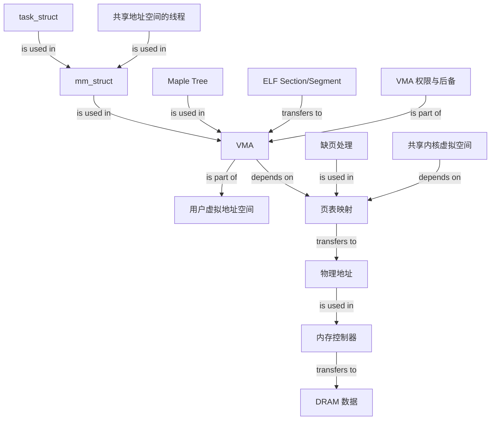

# Linux 虚拟内存管理：从进程地址空间到物理内存访问

### 1. Topic Overview

- What this is about: 本文沿着“进程看到虚拟地址，内核管理地址区域，硬件最终访问物理内存”这条主线，解释 Linux 用户态/内核态虚拟地址空间、`mm_struct`、VMA、ELF 映射、32/64 位内核空间布局，以及物理内存读写。
- Why it matters: 面试里常把虚拟内存简化成“页表做地址转换”，但工程上还必须知道一个进程有哪些地址区域、内核用什么结构表示它们、`exec/mmap/brk` 如何改变它们，以及这些虚拟区域怎样落到真实物理页。
- Difficulty level: 高。文章跨越进程、内核数据结构、ELF、内核地址布局和 DRAM/总线五个层次，最容易发生的是把不同层的概念压成一句话。
- Prerequisites: 进程与线程、用户态与内核态、分页与页表、虚拟页/物理页、ELF 基础、`malloc/brk/mmap` 基础。
- Primary source: [《3.5 万字 + 60 张图｜一步一图带你深入理解 Linux 虚拟内存管理》](https://mp.weixin.qq.com/s?__biz=MzUxODAzNDg4NQ==&mid=2247522087&idx=2&sn=fe8f4cd34d68e0a10658dee88bd337df&chksm=f98dd38dcefa5a9ba43a9d1ac96852532f53278915a6f6b9f5187b8c1c885c1e5848ebabbc86#rd)，正文署名“bin 的技术小屋”，由“小林 coding”发布。
- Version note: 原文使用的是特定时期的 x86/Linux 内核结构与简化硬件模型。本笔记保留文章主线，同时用当前 Linux 官方资料标出已经变化或不能绝对化的部分。

#### Source map and roadmap

1. 虚拟地址是什么，以及为什么不能让多进程直接使用物理地址。
2. 用户态虚拟地址空间的区域与 32/64 位布局。
3. `task_struct -> mm_struct -> vm_area_struct` 的内核管理层级。
4. VMA 的区间、权限、后备对象、操作与组织方式。
5. ELF 的 Section 如何通过 `exec` 映射成内存中的 Segment/VMA。
6. 32 位与 64 位内核虚拟地址空间的映射策略。
7. 虚拟地址翻译后，物理地址怎样经总线、内存控制器到达 DRAM。

文章的重点不是完整讲解 TLB、page walk 和多级页表，而是回答两个更具体的问题：

- Linux 如何组织并管理一个进程“可以访问哪些虚拟区间”。
- 地址完成翻译之后，物理内存访问在硬件侧大致怎样发生。

### 2. Core Concepts

#### Schema 1: 把虚拟内存看成“每进程地址命名空间 + 映射”

- Definition: 每个进程看到一套独立的虚拟地址命名空间。内核维护虚拟页到物理页的映射，CPU 的地址转换硬件在执行访存时使用这些映射。
- Intuition: 虚拟地址像每个小区内部自己的门牌号。两个小区都可以有“1 号楼 101”，但城市地图把它们定位到不同地块。
- Example: 进程 A 和 B 都访问虚拟地址 `0x400000`，A 的页表可映射到物理页 10，B 的页表可映射到物理页 93，所以不会因虚拟地址相同而冲突。
- Common mistakes: 把虚拟内存当作一块额外硬件；认为每个进程独占一份物理内存；认为建立虚拟映射就等于物理页已经驻留。

虚拟内存带来的三个核心能力是：

1. 隔离：不同进程可重复使用相同虚拟地址。
2. 抽象：程序无需手工规划真实物理位置，内核可按需建立、撤销或改变映射。
3. 保护与共享：VMA/PTE 权限限制读写执行；需要时也可让不同进程显式映射同一物理页。

#### Schema 2: 用“对象用途 + 增长方向”定位用户态地址区域

- Definition: 一个进程的用户虚拟地址空间被划成若干用途和权限相近的连续区域：代码、数据、BSS、堆、文件/匿名映射、栈等。
- Intuition: 这不是把物理内存切成几块，而是给虚拟地址空间规划功能区；每个区之后可映射到离散物理页。
- Example: 机器指令进入代码映射；已初始化的全局/静态变量进入数据映射；零初始化或未初始化的全局/静态变量对应 BSS；动态分配常见于堆或匿名映射；局部变量与调用帧常见于栈。
- Common mistakes: 把 `.bss` 说成在 ELF 中存满零字节；认为所有 `malloc` 都只来自 heap；把示意图中的固定地址当成所有进程的真实地址，忽略 ASLR、架构、链接方式和内核配置。

典型用户空间关系：

```text
低地址
  保留区
  text / rodata
  data / bss
  heap                 常见向高地址增长
  ... 可用空洞 ...
  mmap/共享库/匿名映射  布局由体系和 ASLR 决定
  stack                常见向低地址增长
高地址
```

32 位文章模型常用 `3GB user + 1GB kernel`。64 位文章模型按四级页表、48 位 canonical address 说明低半区用户空间与高半区内核空间，中间地址不满足 canonical form。

边界：现代 x86-64 Linux 也支持五级页表；启用后可使用 57 位线性地址。因此“64 位系统只使用 48 位、用户/内核各 128TB”是文章对应配置的模型，不是所有现代机器的固定事实。参见 [Linux x86 五级页表文档](https://docs.kernel.org/arch/x86/x86_64/5level-paging.html)。

#### Schema 3: 用 `task_struct -> mm_struct -> VMA` 定位内核管理层级

- Definition: `task_struct` 描述一个 task；其中的 `mm` 指向 `mm_struct`，表示一整个用户虚拟地址空间；每个 `vm_area_struct`（VMA）描述其中一段属性一致的连续虚拟地址区间。
- Intuition: `task_struct` 是“谁在运行”，`mm_struct` 是“它拥有哪整张地址地图”，VMA 是“地图上一块有统一规则的地块”。
- Example: 一个进程的代码段、heap、某个 `.so` 映射、匿名 `mmap`、stack 通常分别由一个或多个 VMA 描述；它们共同属于同一个 `mm_struct`。
- Common mistakes: 把 `mm_struct` 当成一个页面；把一个 VMA 当成一份物理内存；认为每一种逻辑区域永远只对应一个 VMA；忽略多个线程通常共享同一 `mm_struct`。

三个层次的责任边界：

| 层次 | 主要回答 |
| --- | --- |
| `task_struct` | 当前是谁、属于哪个调度实体、持有哪些进程资源引用？ |
| `mm_struct` | 整个用户虚拟地址空间的边界、总体布局、页表根和 VMA 索引是什么？ |
| `vm_area_struct` | `[vm_start, vm_end)` 这一段能否读写执行、是匿名还是文件后备、发生 fault 时怎样处理？ |

进程与线程也可以沿这条链理解：

- 普通 `fork()` 创建子进程时，子进程得到逻辑上相同但独立的地址空间视图；物理页通常通过 Copy-on-Write 暂时共享，并不是立即复制全部物理内存。
- 以 `CLONE_VM` 创建的 task 共享同一 `mm_struct`，这是 Linux 线程共享地址空间的关键。
- 内核线程没有自己的用户地址空间，`task_struct.mm` 通常为 `NULL`；其执行仍使用内核虚拟地址。

#### Schema 4: 用“区间 + 权限 + 后备 + 回调”读懂一个 VMA

- Definition: VMA 是一段虚拟地址连续、属性一致的区间，核心可压成四类信息：地址范围、访问/行为属性、后备对象、操作回调。
- Intuition: 只知道“这是一块地址”不够；内核还必须知道它能做什么、数据从哪里来，以及缺页时由谁把页面补上。
- Example: 私有匿名映射的 `vm_file == NULL`；文件映射通过 `vm_file` 关联文件并用 `vm_pgoff` 表示文件页偏移；`vm_ops->fault` 可参与缺页处理。
- Common mistakes: 把 `vm_end` 当作区间内最后一个字节；把 VMA 权限与 PTE 具体位完全等同；认为文件映射在建立 VMA 时就把整个文件读入物理内存。

VMA 主干：

```text
[vm_start, vm_end)              左闭右开地址范围
vm_flags                        区域级抽象属性
vm_page_prot                    架构相关页保护表达
vm_file + vm_pgoff              文件后备映射
anon_vma                        匿名内存反向映射关系
vm_ops                          open/close/fault/page_mkwrite 等回调
```

`VM_READ/VM_WRITE/VM_EXEC/VM_SHARED` 等标志表达 VMA 的权限或行为。文章表中的 `VM_SHARD` 是 `VM_SHARED` 的拼写错误；具体 flags 会随内核版本演化，不宜把文章列出的每个名字当作当前稳定 ABI。

权限边界：普通 heap 并不因为“Java 字节码位于 Java heap”就必须可执行。字节码是 JVM 读取的数据；JIT 生成的本机机器码需要可执行映射，但通常位于专门的 code cache。实际权限应以 `/proc/<pid>/maps` 为准。

#### Schema 5: 区分“文章旧组织方式”与“当前 VMA 索引方式”

- Definition: 原文对应的旧内核使用按地址排序的 VMA 双向链表方便遍历，并用 `mm_rb` 红黑树加速地址查找。当前内核的每个 `mm_struct` 使用 Maple Tree 管理全部 VMA，可同时支持范围查找和遍历。
- Intuition: VMA 的概念没变，变化的是“用什么索引结构保存这些区间”。
- Example: 看到旧代码中的 `mm->mmap`、`vm_next/vm_prev`、`mm_rb` 时，应把它识别为历史实现；看到当前文档中的 `mm_mt`、Maple Tree 和 VMA iterator 时，应理解为同一管理职责的新实现。
- Common mistakes: 因数据结构改变就认为 VMA 消失了；把文件反向映射仍可能使用的红黑区间树，与 `mm_struct` 的主 VMA 索引混为一谈。

当前 Linux 官方文档明确说明：每个 `mm` 用 Maple Tree 描述其全部 VMA。Maple Tree 是面向非重叠范围并兼顾缓存效率的 B-tree 类结构。参见 [Process Addresses](https://docs.kernel.org/mm/process_addrs.html) 与 [Maple Tree](https://docs.kernel.org/core-api/maple_tree.html)。

#### Schema 6: 用 `ELF Section -> Segment -> VMA` 解释 `exec` 建图

- Definition: ELF 文件在磁盘上由 Section 组织链接信息；加载时内核依据 Program Header 把若干 Section 组合成具有统一权限的 Segment，再映射成进程 VMA。
- Intuition: 磁盘上的“编译/链接分类”与内存中的“加载/权限分类”不是一一对应；多个 Section 可以合并到一个可加载 Segment。
- Example: `.text` 与只读数据可进入只读/可执行 Segment；`.data` 与 `.bss` 对应可读写 Segment。`.bss` 主要在 ELF 中记录大小，装载时提供零初始化内存，而不是在文件里存满零。
- Common mistakes: 把 Section 与 Segment 当同义词；认为 `fork()` 负责装入新程序；认为 ELF 映射完成时所有页面都已经从磁盘读入并驻留。

文章用 `load_elf_binary()` 展示的主流程可压缩为：

```text
exec
 -> 建立新执行环境与 mmap 基准
 -> 建栈和参数/环境变量区域
 -> 按 ELF Program Header 建立代码/数据映射
 -> 初始化 brk/heap 边界
 -> 映射动态链接器和共享库
 -> 回填 mm_struct 的代码、数据、栈边界
```

这里多数步骤首先建立“允许访问哪些虚拟区间以及它们由谁后备”，实际物理页通常在后续 fault 中按需落实。

#### Schema 7: 用“共享内核半区 + 架构映射策略”理解内核虚拟地址

- Definition: 不同进程的用户地址空间彼此隔离，但切入内核态后看到的是共享的内核虚拟地址布局。内核仍通过虚拟地址访问内存，不是进入内核态就自动改用裸物理地址。
- Intuition: 每个进程有自己的“住户区地图”，但高地址的“市政区地图”通常指向同一套内核对象。
- Example: 两个进程访问同一个用户 VA 可得到不同数据；它们在内核态访问同一个内核 VA，通常会定位到同一个内核对象。
- Common mistakes: 认为每个进程复制一份内核物理内存；认为页表中有内核映射就表示用户态可以访问；把直接映射误解为不经过页表。

文章的 32 位内核空间模型：

- 总内核 VA 只有约 1GB，需要精细分区。
- 前约 896MB 是直接/线性映射区，典型模型中对应低端物理内存。
- 物理内存中超出可长期直接映射范围的部分称为 highmem，需要通过 `vmalloc`、永久映射、固定映射或临时映射等方式按需建立内核 VA。
- `ZONE_DMA/ZONE_NORMAL/ZONE_HIGHMEM` 是物理内存 zone 分类，不是三块同名虚拟区。

文章的 64 位内核空间模型：

- 内核 VA 充足，可以为大量物理内存保留长期直接映射，不再需要 32 位 highmem 的同类权宜方案。
- 仍会划分直接映射区、`vmalloc` 区、`vmemmap`（存放 `struct page` 描述符的虚拟映射）和内核镜像区等。
- 具体起止地址、大小和是否五级页表依赖内核版本、配置与硬件，不能死背文章常数。

`vmalloc` 的核心边界：它向调用者提供连续内核虚拟地址，但背后的物理页可以不连续，因此建立映射的成本通常高于直接映射路径。

#### Schema 8: 用“翻译 -> 总线事务 -> DRAM 定位”连接虚拟与物理

- Definition: 程序指令通常给出虚拟/线性地址；地址转换得到物理地址后，缓存层级若未满足访问，物理地址与数据经互连/内存控制器到达 DRAM。
- Intuition: 页表回答“这个虚拟门牌对应哪块物理地”，内存控制器再回答“这块物理地位于哪个通道、rank、bank、行和列”。
- Example: 读路径可抽象为 `virtual address -> translation -> cache lookup/miss -> physical request -> memory controller -> DRAM row/column -> data return -> CPU`。
- Common mistakes: 认为进程进入内核态后直接发物理地址；把页表翻译与 DRAM 行列寻址当成同一步；忽略 Cache，误以为每条 load 都一定走到 DRAM。

文章用简化存储模块说明：内存控制器把物理地址解码成存储器模块与 DRAM 行/列位置，行选通后先把一行送入 row buffer，再按列选出数据。读事务把数据返回 CPU，写事务把地址与数据送入控制器后落到 DRAM。

硬件边界：文章的“8 个 DRAM 芯片、每芯片贡献 1B、一次 8B、一次 cache line 64B”是帮助理解的示例组织，不是所有 DIMM、通道、burst、ECC 配置和微架构的通用固定值。

### 3. Deep Understanding

#### 3.1 全文因果链

```text
多进程直接使用物理地址会冲突且难以管理
 -> 每个进程获得独立虚拟地址命名空间
 -> task_struct 通过 mm_struct 指向整张地址地图
 -> mm_struct 用 VMA 描述各段合法区间与统一属性
 -> exec/mmap/brk 等操作创建、调整或删除 VMA
 -> 页表再把合法 VMA 中的虚拟页映射到物理页
 -> CPU/内核使用虚拟地址，翻译后的物理请求进入缓存与内存系统
 -> 内存控制器把物理地址解码为具体 DRAM 位置
```

关键层次不能互相替代：

| 层 | 主要对象 | 主要问题 |
| --- | --- | --- |
| 进程语义层 | task / process / thread | 谁共享哪套地址空间？ |
| 地址区域层 | `mm_struct` / VMA | 哪些虚拟区间合法，各自有什么属性？ |
| 页映射层 | 页表 / PTE / fault | 某个虚拟页当前映射到哪个物理页？ |
| 物理页管理层 | `struct page` / zone / allocator | 物理页从哪里分配、怎样回收？ |
| 硬件访问层 | cache / controller / DRAM | 物理地址怎样取得真实数据？ |

#### 3.2 文章中必须保留的版本与准确性边界

| 文章表述或模型 | 可复用结论 | 必须补上的边界 |
| --- | --- | --- |
| 64 位 x86 使用 48 位 VA | canonical address 与分层地址布局很重要 | 五级页表可扩到 57 位，布局依硬件与配置 |
| VMA 用链表 + 红黑树组织 | 内核需要高效遍历和范围查找 VMA | 当前主索引已经是 Maple Tree |
| 小于/大于 128KB 分别走 `brk/mmap` | glibc 会混合使用 heap 与匿名 `mmap` | 阈值可调且动态变化；小请求也可能用 `mmap`。参见 [glibc malloc 参数](https://sourceware.org/glibc/manual/latest/html_node/Malloc-Tunable-Parameters.html) |
| `do_brk()` 是系统调用 | 扩展 heap 最终涉及内核 brk 路径 | 用户可调用的系统调用是 `brk`；`do_brk` 是文章所示内核内部实现名 |
| fork 拷贝父进程虚拟空间和页表 | 子进程起初看到近似相同的地址空间 | 用户物理页通常通过 COW 暂时共享，不会立即全量复制 |
| heap 需要执行权限以执行 Java 字节码 | VMA 权限必须按用途设置 | Java bytecode 是数据；JIT 本机代码通常使用专门的可执行 code cache |
| `cat /proc/<pid>/maps` 查看布局 | 它显示进程已映射区域及权限 | 这是用户地址映射视图；[proc_pid_maps(5)](https://www.man7.org/linux/man-pages/man5/proc_pid_maps.5.html) 说明其字段 |
| `cat /proc/iomem` 查看内核 VA 布局 | 它能帮助观察系统资源占用 | `/proc/iomem` 是 I/O/物理内存资源图，不是某进程内核虚拟地址布局。参见 [proc_iomem(5)](https://www.man7.org/linux/man-pages/man5/proc_iomem.5.html) |
| 固定 8 芯片/8B DRAM 模型 | 物理地址会由控制器解码到 DRAM 组织 | 实际通道、rank、bank、burst、ECC 与芯片宽度均可不同 |

#### 3.3 最值得形成的运行模型

面对任意一个虚拟地址，不要直接跳到“查页表”，先依次问：

1. 当前 task 使用哪个 `mm_struct`？
2. 这个地址是否落入某个 VMA 的 `[start, end)`？
3. VMA 是否允许本次读/写/执行？
4. VMA 是匿名后备还是文件后备？
5. 页表项是否已建立、页面是否在场？
6. 若触发 fault，应该分配零页、从文件读入、从 Swap 换入、执行 COW，还是判定非法？
7. 得到物理地址后，缓存/互连/内存控制器如何完成真实访问？

这七问把“地址空间是否合法”和“页面当前是否驻留”分开：

- 没有合法 VMA 或权限不符，通常是非法访问。
- 有合法 VMA 但页面未在场，可能是可恢复缺页。

### 4. Minimal Working Example

场景：一个线程第一次写入私有匿名映射中的虚拟地址 `A`。

1. 当前线程的 `task_struct.mm` 指向进程共享的 `mm_struct`。
2. 内核在该 `mm` 的 VMA 索引中查找地址 `A`；当前实现使用 Maple Tree。
3. 找到 VMA 后验证 `vm_start <= A < vm_end`，并确认 VMA 允许写入。
4. 这是匿名映射，所以没有文件内容可直接读取；VMA 提供匿名内存的语义。
5. 若 PTE 尚未建立或页面未驻留，CPU 触发 page fault。
6. 内核判断访问合法，为该虚拟页准备物理页；若涉及 fork 后共享页，则可能执行 COW。
7. 内核更新页表，返回并重试原写指令。
8. 后续访问通过地址翻译得到物理地址；若 Cache 未命中，请求才继续到内存控制器与 DRAM。

反例：若 `A` 不属于任何 VMA，或 VMA 不允许写入，内核不能把它当作普通“页面尚未分配”来修复，进程通常会收到 `SIGSEGV`。

### 5. Knowledge Graph



### 6. Self-Test Questions

Recall:

1. `task_struct`、`mm_struct`、`vm_area_struct` 分别描述什么范围的对象？
2. 一个 VMA 为什么使用 `[vm_start, vm_end)` 左闭右开区间？它还必须描述哪三类属性？
3. 旧内核与当前内核主要用什么结构组织一个 `mm` 中的全部 VMA？

Application / transfer:

4. 一个地址落在合法可写 VMA 中，但 PTE 当前不在场；另一个地址根本不属于任何 VMA。两次访问都可能触发 fault，它们的处理结果为什么不同？
5. `malloc(200KiB)` 是否必然建立独立 `mmap`？请把 glibc 分配策略、VMA 建立与物理页驻留分成三层回答。

Explain like I am 5:

6. 用“住户、整张城市地图、地图中的地块、地块下面的真实土地”解释 `task_struct -> mm_struct -> VMA -> 物理页`。

### 7. Weak Point Detection

- 只会背地址空间布局，无法说出内核中谁表示整张地图、谁表示单个连续区域。
- 一看到虚拟地址就直接说“查页表”，跳过 VMA 存在性与权限验证。
- 把建立 VMA、建立 PTE、分配/调入物理页当成同一时刻。
- 把普通 `fork` 说成马上复制所有物理内存，漏掉 COW。
- 把文章旧内核的 VMA 链表/红黑树实现当成当前唯一结构。
- 把 `128KB`、48 位、3G/1G、896MB、8 芯片或 8B 传输当成不可变硬件定律。
- 把用户映射视图 `/proc/<pid>/maps` 与物理 I/O 资源图 `/proc/iomem` 混为一谈。
- 认为内核态代码使用裸物理地址，或认为每条 CPU load 都一定到达 DRAM。
