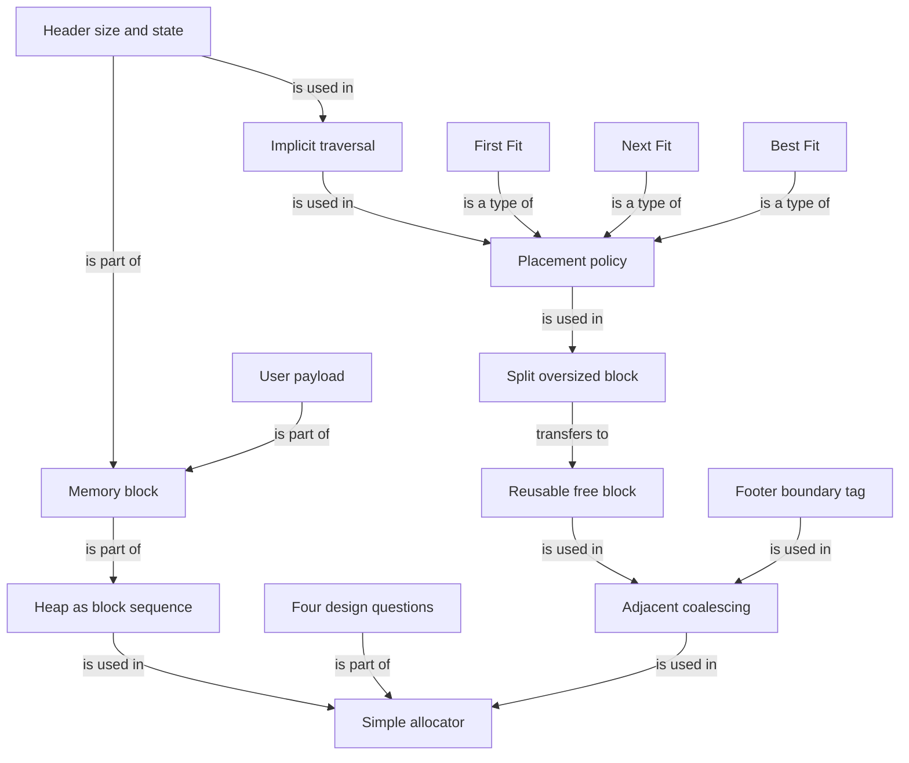

# malloc 内存分配器是怎样实现的

### 1. Topic Overview

- What this is about: 本文不再主要追问 `malloc` 如何通过 `brk/mmap` 向操作系统取得虚拟内存，而是把一段 heap 当作字节数组，设计一个简化的用户态内存分配器。
- Why it matters: 它解释了分配器如何知道哪些块空闲、如何挑选块、为什么需要切分和合并，以及 `free(p)` 只收到指针仍能找到块边界的底层思路。
- Difficulty level: 中等。难点是同时跟踪块布局、查找时间、元数据开销和碎片。
- Prerequisites: heap 是进程虚拟地址空间的一个动态区域；`malloc/free` 是用户态分配器接口；块被 `free` 后可留在内存池中复用，不代表使用者仍可访问它。
- Source: 小林coding，[《面试官：malloc内存分配器是怎样实现的？》](https://mp.weixin.qq.com/s/Flt85kKbDEn_XD83mtYxUA?token=1646973705&lang=zh_CN)，发布于 2024-12-30。

> 范围边界：这是一个教学型简化分配器，不是 glibc/ptmalloc 源码的完整说明。文中为了讲解假设不考虑内存对齐、单块最大 `2GB`，用 `4B` header 中的 31 位记录大小、1 位记录分配状态，并在后文引入 footer。这些数值和布局不是 C 标准保证。

### 2. Core Concepts

#### Schema 1: 用“表示、选择、切分、合并”四问设计分配器

- Definition: 任何基本的动态内存分配器都要回答四类问题：如何表示哪些块空闲；多个候选块中选哪个；大块分配后的余量怎么处理；块归还后如何处理相邻空闲空间。
- Intuition: 停车场不只要“找到空位”，还要有车位地图、选位策略、处理大车位剩余部分，并在车离开后重新整理连续空位。
- Example: 用户向一个 `32B` 空闲块申请 `12B` 负载：分配器先要识别该块空闲，再决定是否选它，然后切分大块；日后释放时还要检查相邻空闲块能否合并。
- Common mistakes: 以为实现 `malloc` 只需要找到一段足够大的地址；只考虑分配速度，不考虑内存利用率和后续复用。

#### Schema 2: 把块元数据放回块自身，从而隐式遍历 heap

- Definition: 简化分配器在每个块的开头放置 header，记录块总大小和已分配/空闲状态；用户指针指向 header 之后的 payload。
- Intuition: 分配器不能为了建立普通链表而反过来调用一个尚未实现的分配器；最直接的办法是让被管理的内存自带标签。
- Example: 文中 `16/1` 表示一个总大小 `16B`、已分配的块；`32/0` 表示一个 `32B` 空闲块。已知当前块地址与大小，就能以 `next = current + block_size` 找到下一块。末尾的 `0/1` 是遍历终止标记。
- Common mistakes: 把 header 当成用户可用容量；忘记块大小通常包含分配器开销；认为一个普通 C 指针自带长度。

#### Schema 3: 用“查找成本 vs 空间利用”比较置放策略

- Definition: 置放策略决定多个空闲块都足够大时选择哪一个。文章比较 First Fit、Next Fit 和 Best Fit。
- Intuition: 越少搜索通常越快，越仔细地挑选尺寸通常越耗时；没有无条件最优的策略。
- Example:
  - First Fit: 每次从头搜索，返回第一个足够大的块。简单，但前部容易积累小空洞，搜索链可能变长。
  - Next Fit: 从上次找到位置的地方继续搜索，减少反复扫描前端；文章指出其速度优势但利用率可能不及 First Fit。
  - Best Fit: 找遍候选块，选能容纳请求的最小块；文章强调它更节省空间，但完整扫描使分配更慢。
- Common mistakes: 只背算法名称，说不出搜索起点、停止条件和取舍；把文章的教学性比较扩大为所有工作负载下的绝对结论。

#### Schema 4: 通过切分大块抑制内部碎片

- Definition: 若找到的空闲块大于“用户负载 + 元数据”所需的块，分配器可将它切成一个已分配块和一个较小的空闲块。
- Intuition: 若将整个大车位都给一辆小车，块内剩余空间无法被其他申请使用，形成内部碎片。
- Example: 文中的 `32B` 空闲块遇到 `12B` payload 请求时，取 `4B` 作 header，形成 `16B` 已分配块；剩余 `16B` 建立新 header 后作为空闲块。
- Common mistakes: 忽略新空闲块也需要元数据；余量小到无法形成有效块时仍强行切分。后一点是实际实现需补充的最小块边界，文章为了简化没有展开。

#### Schema 5: 通过合并相邻空闲块恢复大块能力

- Definition: `free` 不只是把 allocated 标记改成 free。若相邻块也空闲，分配器可将连续空闲块 coalesce 成一个更大块。
- Intuition: 总空闲量足够不等于有足够大的连续块。两个相邻 `16B` 空闲块如果不合并，就不能单独满足 `20B` 块请求。
- Example: 本文的简单分配器选择释放时立即合并。它实现简单，但对“释放 `12B` 后立即又申请 `12B`”的循环可能反复合并、切分，产生无用功。因此真实分配器常会引入延迟合并或快速复用机制。
- Common mistakes: 把“总空闲字节”当成“最大连续空闲块”；认为立即合并永远无成本；把 heap 内合并误解为已经将内存解映射给 OS。

#### Schema 6: 用边界标记同时快速定位前后块

- Definition: 当每块尾部再保存一份与 header 一致的 footer 时，当前块 header 前的一个字就是前一块 footer。由它可得到前块大小与状态，再向前跳到前块 header。这种思路称为 boundary tag。
- Intuition: header 让分配器知道如何往后跳；前一块末尾的 footer 则在当前位置附近留下了“如何往前跳”的索引。
- Example: 在文章的 `4B` 标记设定中，从当前 header 向前读 `4B` 得到前一块 footer；由 footer 中的块大小找到前块开头，从而在 `free` 时判断前块是否可合并。
- Common mistakes: 以为只有 header 就能 O(1) 找到前块；把 footer 当成用户负载；把“每块都有同样 footer”当成现代分配器唯一布局。现实实现可仅在空闲块保留 footer，或将前块信息编码在相邻块元数据中。

### 3. Deep Understanding

文章设计的简化分配器可压缩为一条运行链：

`heap 中每块自带 header -> 遍历并用 First Fit 找候选块 -> 大块足够切分时拆成 allocated + free -> 返回 payload 指针 -> free 定位元数据并改为空闲 -> 用 header/footer 检查前后块 -> 立即合并连续空闲块。`

四个设计问题与本文答案的映射是：

| 设计问题 | 文章的简化答案 | 主要代价/边界 |
| --- | --- | --- |
| 怎样跟踪块 | 块内 header，大小 + 分配位 | 占用内存，且可被越界写损坏 |
| 多个块选哪个 | First Fit | 实现简单，但搜索与碎片分布受负载影响 |
| 大块的余量怎么办 | 切分为已分配块 + 新空闲块 | 新块也需元数据，应有最小可切分大小 |
| 释放块怎么办 | 立即合并相邻空闲块 | 改善连续空闲能力，但频繁 free/realloc 可做无用功 |

两类碎片也应分开：

- 内部碎片：分给某个请求的块内，存在由于大小粒度、对齐或不切分而无法利用的剩余。切分大块主要针对它。
- 外部碎片：空闲空间散落为多个不连续小块，总量足够却没有单个足够大的连续块。合并相邻空闲块主要针对它。

与上一章的关系：上一章解释“内存池不够时，分配器如何用 `brk/mmap` 向 OS 扩容”；本文解释“分配器已经拿到一段 heap 后，怎样在内部管理大小不一的块”。本文中 `free` 后的合并仍是分配器内部操作，不等于该 heap 区域已归还 OS。

### 4. Minimal Working Example

忽略对齐与 footer 后的额外开销，沿用文章的 `4B` header 教学模型。初始 heap 中有：

```text
[16/1][32/0][16/1][0/1]
```

- `16/1`: 总大小 `16B`，已分配。
- `32/0`: 总大小 `32B`，空闲。
- `0/1`: heap 末尾标记。

现在调用 `malloc(12)`：

1. 从头遍历 header，First Fit 选中 `32/0`。
2. `12B payload + 4B header = 16B` 已分配块。
3. 原 `32B` 块可切为 `16/1` 和 `16/0`。
4. 向用户返回新 `16/1` 中 header 之后的 payload 起始地址。

```text
[16/1][16/1][16/0][16/1][0/1]
          ^ payload pointer
```

如果后来右侧 `16/1` 也被释放，则它与前方 `16/0` 相邻；本文的立即合并策略会把它们重新组成更大空闲块。在引入 footer 后，分配器可从当前块附近同时找到前后邻块，无需从 heap 起点重新遍历才找前块。

### 5. Knowledge Graph



### 6. Self-Test Questions

Recall:

1. 实现一个基本内存分配器必须回答哪四类设计问题？
2. header 至少需要保存哪两类信息？为什么由它能找到下一块？
3. First Fit、Next Fit 和 Best Fit 的搜索起点与停止条件分别是什么？

Application / transfer:

4. 空闲块为 `40B`，header 为 `4B`，用户请求 `12B payload`。在允许切分的简化模型中，已分配块和剩余空闲块分别多大？
5. 相邻的两个 `16B` 空闲块为什么不合并时不能满足一个 `20B` 连续块请求？footer 如何帮助合并？

Explain like I am 5:

6. 用“大小不一的停车位”解释为什么分配器要同时考虑选择、切分和合并。

### 7. Weak Point Detection

- 只说 `malloc` “找一块空闲地址”，但说不出分配器如何知道块大小与状态。
- 把 header/footer 算进用户可用 payload，或忘记切分出的新块也需元数据。
- 能背 First/Next/Best Fit 名称，但无法对一组空闲块实际选择。
- 混淆内部碎片与外部碎片；不知道切分和合并各自主要解决什么。
- 认为 `free` 只需改一个状态位，不需处理相邻空闲块。
- 以为只有 header 就能直接找到前一块，或不能说明 footer 为何可以提供前块大小。
- 把文章的 `2GB`、`4B header`、`31+1 bit`、每块 footer 和不考虑对齐当成所有 `malloc` 的通用实现。
