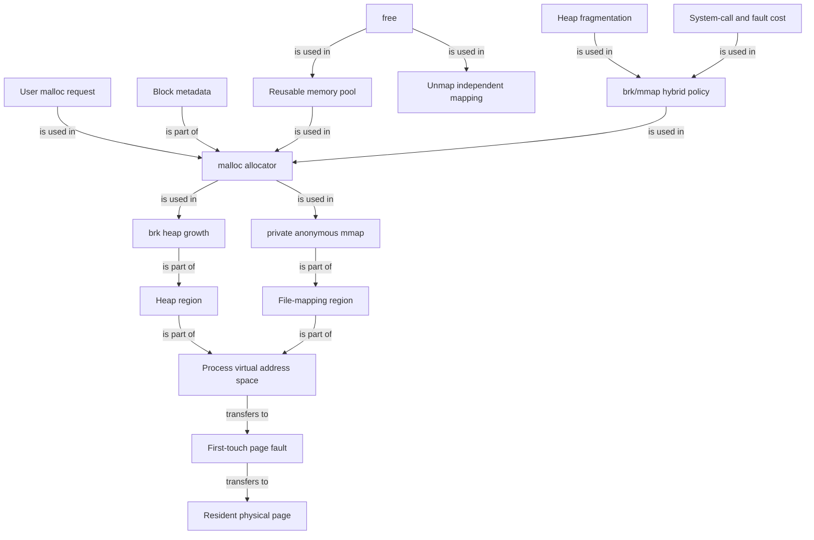

# malloc：从用户请求到虚拟内存和物理页

### 1. Topic Overview

- What this is about: 本章从 Linux 进程虚拟地址空间出发，解释 C 库的 `malloc()` 如何在 `brk()` 和匿名 `mmap()` 之间选择，虚拟内存何时获得物理页，`free()` 为什么会有不同的归还行为，以及分配器如何记住块大小。
- Why it matters: 能区分“程序向分配器要多少”“分配器向内核要多少虚拟空间”和“实际驻留了多少物理页”。这是理解 RSS、内存池、缺页、堆碎片和内存占用现象的基础。
- Difficulty level: 中等。难点是不要把库函数、系统调用、虚拟地址、物理页和分配器块元数据混成一层。
- Prerequisites: Linux 用户态/内核态，进程虚拟地址空间，分页与可恢复缺页异常。
- Source: `materials/os/3_memory/malloc.md`。笔记依照原文顺序整理；原文的 `128KB` 切换点、`132KB` 预分配和 `16B` 块头都带有 glibc/ptmalloc 版本与实验环境边界，不是 C 标准对所有分配器的固定保证。

### 2. Core Concepts

#### Schema 1: 用“库函数 -> 系统调用 -> 地址区域”定位 malloc

- Definition: `malloc()` 是 C 库分配器的接口，不是系统调用。当分配器现有内存池不够时，它可以调用 `brk()` 扩展连续的 heap，也可以通过私有匿名 `mmap()` 在文件映射区取得独立映射。
- Intuition: 程序只向“仓库管理员” `malloc` 要一块。管理员先看仓库里有没有可复用的块；不够时才通过 `brk` 或 `mmap` 向内核扩容。
- Example: 按文中 glibc/ptmalloc 的简化规则，较小请求通常从 heap 内存池满足，较大请求通常使用独立匿名映射。
- Common mistakes: 说 `malloc` 本身每次都直接进入内核；说 `mmap` 在 heap 上分配；把文中阈值当成所有 glibc 版本和所有运行时都不变的规则。

与本章有关的用户虚拟地址主干为：

`text -> initialized data -> uninitialized data -> heap -> file mapping -> stack`

- heap 通常向高地址扩展，`brk` 调整堆顶。
- 文件映射区可容纳动态库、共享内存和匿名 `mmap` 区域。
- 用户态不能直接访问内核空间；不同进程用户映射独立，而内核地址部分通常关联公共的内核物理内存。

#### Schema 2: 区分“获得虚拟空间”与“获得物理页”

- Definition: `malloc()` 返回可供进程使用的虚拟地址。新获得的虚拟页在尚未访问时，不一定已经配有驻留物理页。
- Intuition: 先拿到“可使用的门牌号范围”，真正第一次读写时才可能因缺页让内核安排物理页并建立映射。
- Example: `p = malloc(4096)` 成功后，`p` 是虚拟地址；随后首次写 `p[0]` 可能触发可恢复缺页，内核建立映射后恢复该指令。
- Common mistakes: 把虚拟地址范围的增长直接等同于 RSS 立刻增长；把这类首次访问缺页一律当成程序错误或段错误。

#### Schema 3: 区分“用户请求大小”与“分配器/操作系统实际批量”

- Definition: 分配器不需要每次按用户请求的精确字节数向内核要空间。它会考虑对齐、块头元数据和内存池批量预留。
- Intuition: “程序获得一块 1B 的可用负载”不等于“分配器只从内核取 1B”。批量取货可以让后续小请求留在用户态快速复用。
- Example: 文中在 glibc 2.17 的某次实验中，`malloc(1)` 后 `/proc/<pid>/maps` 显示 heap 范围为 `132KB`。这说明该次分配伴随了更大的 heap 预留，不代表每次 `malloc(1)` 都会新增 `132KB`。
- Common mistakes: 把请求大小、块总大小、虚拟映射增量和已驻留物理内存当成同一数值。

#### Schema 4: 先判断来源路径，再判断 free 是否归还 OS

- Definition: `free()` 先把分配块交还给用户态分配器。在原文简化模型中，来自 `brk` heap 内存池的小块通常被缓存供之后复用；独立 `mmap` 映射在释放时可解映射并归还给内核。
- Intuition: `free` 的直接对象是分配器管理的块，不是抽象地保证“进程内存占用立刻下降”。
- Example: 文中 `malloc(1)` 的 heap 映射在 `free` 后仍存在；`128KB` 的实验请求走匿名 `mmap` 后，释放时对应映射消失。
- Common mistakes: 不看分配路径就绝对化地说 `free` 一定或一定不归还 OS；把“留在分配器内存池”与“用户仍可访问该已释放指针”混淆。`free(p)` 后再使用 `p` 仍是错误的。

边界：文章在教学上用 `brk 块留池中` 对比 `mmap 块归还 OS`。真实分配器还会合并空闲块、修剪 heap 顶部或动态调节阈值，所以应将这一对比用作默认行为模型，而非语言规范的绝对承诺。

#### Schema 5: 用“调用/缺页成本 vs 碎片/驻留成本”理解混合策略

- Definition: 频繁使用独立 `mmap` 会增加系统调用和重新首次访问的缺页成本；只用连续 heap 内存池则可能累积难以利用的空洞，并使进程长时间保留较大的堆。
- Intuition: `mmap` 侧重“独立、易归还”，`brk` 内存池侧重“批量获取、快速复用”。分配器在 CPU 成本和空间利用之间折中。
- Example: 连续分配 `10KB`、`20KB`、`30KB` 后释放前两块。若新请求能放进这些空闲块则可复用；若需要更大的连续块，总空闲量即使不小，也可能仍需要再向 OS 扩容。
- Common mistakes: 只说 `mmap` 好在能归还，忽略系统调用和首触缺页；只说 `brk` 复用快，忽略碎片与高水位。

原文把这种进程占用看似持续增长称为一种 valgrind 无法报告的“泄漏”。更精确地说，这通常是分配器碎片或已释放但尚保留在内存池的空闲空间，不同于程序丢失引用、永远无法 `free` 的真实内存泄漏。

#### Schema 6: 用“用户指针前的块头”解释 free 如何知道大小

- Definition: 分配器会在用户可见负载周围保存内部元数据，例如块大小和状态。`free(p)` 使用 `p` 定位对应块头，所以 API 无需让调用者再传长度。
- Intuition: 用户拿到的是“货物区”起点，紧挨着的内部标签记录整个块的管理信息。
- Example: 文中实验里用户指针比 heap 起始地址高 `0x10`，文章用前方 `16B` 元数据解释 `free()` 获得块大小。
- Common mistakes: 认为 C 语言会从普通指针类型中自动得知长度；把 `16B` 当成所有平台固定块头；越界写入块头导致后续 `free` 异常，却误判为 `free` 自身随机出错。

### 3. Deep Understanding

本章的完整因果链是：

`malloc 收到用户请求 -> 查找可复用块 -> 不足时用 brk 扩展 heap 或用匿名 mmap 建立独立映射 -> 返回虚拟地址中的负载指针 -> 首次访问时可能通过可恢复缺页落实物理页 -> free 根据块头识别大小 -> 空闲块留在内存池复用，或解映射归还 OS。`

| 视角 | 关心的数量 | 不能直接推导的结论 |
| --- | --- | --- |
| 用户请求 | `malloc(n)` 中的 `n` | 不能推出 OS 恰好新增 `n` 字节 |
| 分配器块 | 负载 + 对齐 + 块头 | 不能推出整个堆只增加一个块 |
| 虚拟地址空间 | heap 范围或 mmap 区域 | 不能推出所有页已驻留物理内存 |
| 物理驻留 | 实际已建立的物理页映射 | 不能仅看 `malloc(n)` 返回值就得知 |
| 分配器空闲块 | 已 `free` 但仍由分配器保留的块 | 不意味着调用者仍有权访问该指针 |

`brk` 和 `mmap` 不是简单的“小/大”背诵题，而是成本取舍：

- `brk` + 内存池：通过批量扩容与复用减少系统调用和重复缺页，但可能留下碎片与较高的驻留/虚拟空间高水位。
- 独立 `mmap`：大块可独立解映射，但频繁建立与销毁映射需要更多内核交互，重新分配后的首次访问还可能再发生缺页。

### 4. Minimal Working Example

以同一进程中的两个请求为例，沿用文章的简化 glibc/ptmalloc 模型：

```c
char *small = malloc(1);
char *large = malloc(128 * 1024);
small[0] = 'A';
large[0] = 'B';
free(small);
free(large);
```

Reasoning flow:

1. `malloc(1)` 先试图从分配器现有空闲块取货；不够时可扩展 heap，而且扩展量可远大于 `1B`。
2. 返回指针前后还有分配器自用的元数据/对齐空间；用户只能访问获授权的负载区。
3. `small[0]` 首次访问所在页时，若页还未驻留，发生可恢复缺页并建立物理页映射。
4. 在文章的实验条件下，大请求走独立匿名 `mmap`；`large[0]` 的首触也可能落实物理页。
5. `free(small)` 使该块可被分配器复用，heap 映射通常仍在；这不允许程序再使用 `small`。
6. `free(large)` 在文章模型中解除独立映射，相应地址区域从进程映射中消失。

### 5. Knowledge Graph



### 6. Self-Test Questions

Recall:

1. `malloc()`、`brk()` 和 `mmap()` 分别属于哪一层，各自做什么？
2. 为什么 `malloc()` 成功返回不代表相同大小的物理内存已立即驻留？
3. `free(p)` 只收到指针，分配器通常如何找到块大小？

Application / transfer:

4. 某进程 `free` 大量小块后 RSS 没有立刻明显下降。这能否单独证明 `free` 失败或程序仍持有泄漏引用？还需要考虑什么？
5. 为什么一个分配器不会无条件地把每个请求都做成独立 `mmap`，也不会只使用一个不断增长的 heap？

Explain like I am 5:

6. 用“商店、仓库和政府批地”解释 `malloc`、内存池和 `brk/mmap` 之间的关系。

### 7. Weak Point Detection

- 把 `malloc` 当成系统调用，或认为每次调用必然进内核。
- 把请求字节数、分配块总大小、堆/映射范围和物理驻留量当成一个量。
- 把首触缺页异常当成非法访问，或认为分配虚拟空间后所有物理页已存在。
- 不先判断分配路径，就绝对化地回答 `free` 会/不会归还 OS。
- 把分配器保留的空闲块与真实不可达内存泄漏完全等同。
- 把文中 `128KB`、`132KB` 和 `16B` 当成 C 标准或所有分配器的固定常数。
- 认为分配器保留已释放块就意味着用户可以继续解引用旧指针。
