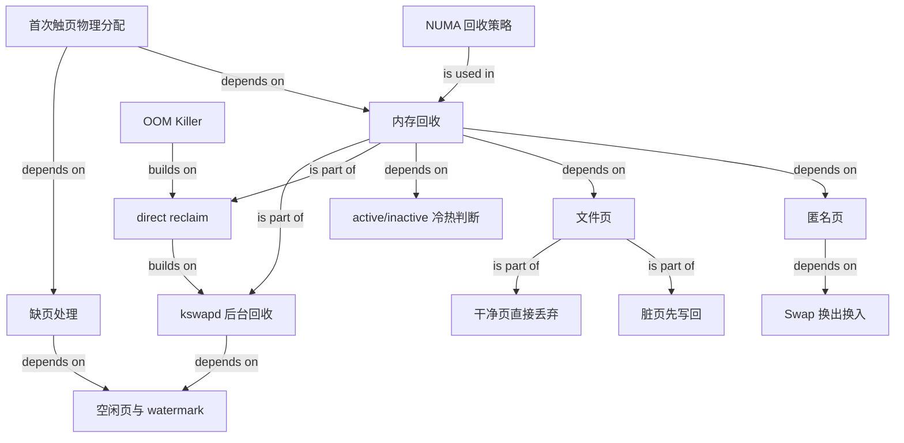

# Linux 内存回收：从首次触页到 OOM

### 1. Topic Overview

- What this is about: 本章回答“系统内存紧张时会发生什么”：应用首次访问虚拟内存后，内核如何分配物理页；物理页不足时如何在后台回收、直接回收和 OOM 之间逐级升级；不同页面如何回收；以及如何观察和调整回收行为。
- Why it matters: 它把 `malloc`、缺页处理、文件页、匿名页、Swap、LRU、watermark、NUMA 与 OOM 串成一条运行时链路，可用于解释系统卡顿、`pgscand/s` 飙高和“机器还有内存却频繁回收”等现象。
- Difficulty level: 中高。主要难点是同时区分“什么时候回收”“谁在回收”“回收哪种页”“是否阻塞申请进程”和“是否发生磁盘 I/O”。
- Prerequisites: 虚拟地址与物理页、页表、可恢复缺页异常、`malloc` 返回虚拟地址、文件缓存、堆和栈。
- Source: `materials/os/3_memory/mem_reclaim.md`，按源文顺序整理。
- Source boundary: 本笔记保留文章给出的教学模型、示例公式和调参建议；具体内核实现会随版本、架构、NUMA 拓扑和工作负载变化。文章中的比例或建议应先作为理解框架，生产调参仍需结合当前内核文档与观测数据。

### 2. Core Concepts

#### Schema 1: 用“首次触页 → 回收 → OOM”追踪物理页申请

- Definition: `malloc()` 主要取得虚拟地址空间，并不等于立刻取得等量物理页。进程首次读写尚未映射的合法虚拟页时，会触发缺页异常，由缺页处理函数寻找物理页；空闲页不足时进入内存回收，回收仍失败才可能触发 OOM。
- Intuition: `malloc` 像先拿到一张“可用房号证明”；第一次真正入住时才需要实体房间。没有空房时，系统先整理房间，整理不出来才淘汰一个占用者。
- Example: `p = malloc(1GB)` 成功后，进程第一次写 `p[0]`。若该页尚未驻留，执行路径是：`首次写入 → 缺页异常 → 内核检查空闲物理页 → 分配并建映射`。若没有足够空闲页，则加入回收分支。
- Common mistakes: 把 `malloc` 成功等同于物理页已全部驻留；把合法的首次触页缺页当成段错误；认为一发现内存不足就立刻 OOM。

文章给出的升级主线是：

`malloc 获得虚拟地址 → 首次访问触发缺页处理 → 有空闲页则分配并建立映射 → 内存紧张时由 kswapd 后台回收 → 后台回收跟不上时直接回收 → 仍无法满足申请时触发 OOM`

术语边界：原文使用“缺页中断”，更精确地说它是 CPU 产生的缺页异常（page fault）；合法缺页可由内核修复并恢复原指令。

#### Schema 2: 用“执行者 + 是否阻塞”区分后台回收和直接回收

- Definition: 后台回收由 `kswapd` 内核线程异步执行，不直接阻塞当前申请进程；直接回收由处在内存申请路径上的进程同步参与，进程必须等待回收，因此会增加延迟。
- Intuition: 后台回收是保洁员提前整理；直接回收是顾客到了以后自己停下来腾位置。
- Example: `pages_free` 低于低水位时唤醒 `kswapd`。如果申请速度太快、空闲页继续跌到最小水位以下，分配路径可能进入 direct reclaim。
- Common mistakes: 认为“后台”表示没有 CPU 或 I/O 成本；认为 direct reclaim 是另一个独立后台线程；只记同步/异步，却说不出谁被阻塞。

关键性能边界：

- 后台回收仍会消耗 CPU，也可能产生写回或 Swap I/O，只是它与当前申请进程异步。
- 直接回收既有扫描和 I/O 成本，又把这些成本放进申请进程的关键路径，因此容易造成长尾延迟、CPU 利用率和系统负载升高。

#### Schema 3: 先按“是否有磁盘后备”分类，再决定页的回收动作

- Definition: 可回收页主要分成文件页和匿名页。文件页有文件作为后备；匿名页如堆、栈没有对应文件。文件页还要继续区分干净页与脏页。
- Intuition: 有原件的副本可以丢；改过但尚未保存的副本要先写回；没有原件的数据只能先另存到 Swap，不能直接丢弃。
- Example:
  - 干净文件页：可直接释放；以后需要时再从文件读取。
  - 脏文件页：先写回文件，再释放。
  - 匿名页：若启用 Swap，将冷匿名页换出到 Swap 后释放；再次访问时换入。
- Common mistakes: 认为所有文件页都可直接丢弃；认为匿名页没有文件后备就完全不能回收；把 Swap 当成匿名页的永久存储而忘记后续换入。

| 页面类型 | 后备载体 | 回收动作 | 主要 I/O 边界 |
| --- | --- | --- | --- |
| 干净文件页 | 原文件 | 直接丢弃内存副本 | 回收当下无需写盘；未来重读可能有 I/O |
| 脏文件页 | 原文件，但内容尚未同步 | 先写回再释放 | 回收路径产生写 I/O |
| 匿名页 | 无原文件 | 换出到 Swap 后释放 | 换出和以后换入都可能有 I/O |

源文一处概括“回收内存基本都会发生磁盘 I/O”；应结合上表理解：干净文件页的当次回收是重要例外，不能把每一次 reclaim 都等同于当场写盘。

#### Schema 4: 用“页类型 × 活跃度”理解 LRU 回收候选

- Definition: 文件页和匿名页都按近期访问活跃度组织。源文用 `active_list` 和 `inactive_list` 两类双向链表描述：最近访问的页位于活跃集合，很少访问的页位于不活跃集合；越靠近链表尾部越不常访问，越优先成为回收候选。
- Intuition: 先回收“最近最不像还会用”的页，而不是随机挑页。
- Example: `/proc/meminfo` 可观察 `Active(anon)`、`Active(file)`、`Inactive(anon)` 和 `Inactive(file)`，也就是活跃度与页面类型两个维度的组合。
- Common mistakes: 只把 active/inactive 当成文件页分类；认为进入 inactive 后必然立即被释放；把教学模型中的 LRU 理解成对每次访问都维护绝对精确的全局时间顺序。

可复用判断顺序：

1. 先判断页是 file 还是 anon，确定可能的回收动作。
2. 再看活跃度，优先从较冷的候选中回收。
3. 真正释放前仍要处理脏页写回或匿名页换出等约束。

#### Schema 5: 用 `pgscank/pgscand/pgsteal` 定位回收型抖动

- Definition: 源文使用 `sar -B 1` 区分后台扫描、直接扫描与实际回收：`pgscank/s` 是 `kswapd` 每秒扫描页数，`pgscand/s` 是申请路径每秒直接扫描页数，`pgsteal/s` 是每秒从扫描候选中成功回收的页数。
- Intuition: “谁在扫”回答卡顿是否进入了申请进程的关键路径，“扫后拿回多少”说明扫描是否产生了回收结果。
- Example: 系统抖动时间段内 `pgscand/s` 明显升高，是 direct reclaim 的强线索；还需结合 I/O、缺页、Swap 和业务延迟确认，而不是仅凭一个数值宣布根因。
- Common mistakes: 把 `pgscank` 与 `pgscand` 说反；把 `pgsteal` 当成只属于后台回收；看到 `pgscand` 非零就不看时间相关性和其他证据。

性能链路：

`内存压力 → 扫描候选页 → 脏页写回或匿名页 Swap I/O → direct reclaim 把等待放进申请路径 → 响应延迟和负载上升`

#### Schema 6: 用“回收对象倾向 + 触发时机”理解两个调节旋钮

- Definition: `swappiness` 主要影响文件页与匿名页的回收倾向；`min_free_kbytes` 影响保留空闲内存与 watermark，从而影响后台回收启动时机。
- Intuition: 一个旋钮回答“更愿意回收哪类页”，另一个回答“多早开始腾页”。
- Example:
  - `/proc/sys/vm/swappiness` 范围为 `0–100`。文章模型中值越大越积极使用 Swap、越倾向匿名页；值越小越倾向文件页。`0` 表示强烈降低 Swap 倾向，不代表匿名页绝不会被回收。
  - 文章给出的简化比例是 `pages_low = pages_min × 5/4`、`pages_high = pages_min × 3/2`；`min_free_kbytes` 用来间接抬升这些水位。
- Common mistakes: 把 `swappiness=0` 说成彻底关闭 Swap；认为提高 `min_free_kbytes` 只有收益；把文章比例当成所有内核中不含单位换算、分区计算的精确实现公式。

watermark 状态机：

- `pages_free > pages_high`：空闲页充足。
- `pages_low < pages_free ≤ pages_high`：已有压力，但仍能满足一般申请。
- `pages_min ≤ pages_free ≤ pages_low`：唤醒 `kswapd` 后台回收，目标是回收到高水位以上。
- `pages_free < pages_min`：申请路径可能触发直接回收并阻塞。

调参取舍：提高 `min_free_kbytes` 能更早启动后台回收，可能降低 direct reclaim 的长尾延迟；代价是为系统保留更多空闲内存、减少应用可用量。设置过大甚至可能让应用更容易遭遇 OOM。因此应以 `sar -B` 等观测验证，而不是只按固定推荐值修改。

#### Schema 7: 在 NUMA 上先比较“远端内存”与“本地回收”成本

- Definition: SMP/UMA 中多个 CPU 共享内存且访问代价近似一致；NUMA 把 CPU 和内存组织成 Node，CPU 可访问本地或远端 Node 内存，但远端访问更慢。本地 Node 内存不足时，可以去其他 Node 分配，也可以先回收本地页。
- Intuition: “整台机器还有空闲内存”不代表“当前 Node 还有本地空闲内存”。此时要比较远端访问的稳定额外延迟与本地 direct reclaim 的扫描、阻塞和 I/O 代价。
- Example: 文章建议一般将 `/proc/sys/vm/zone_reclaim_mode` 设为 `0`：本地回收前先寻找其他 Node 的空闲内存，以避免机器总体仍有大量空闲内存时，仅因本地 Node 紧张就频繁直接回收。
- Common mistakes: 只看全机 `free` 就否认 Node 局部压力；认为远端内存慢，所以本地回收必然更好；把 `zone_reclaim_mode` 的值当普通枚举而忽略它在内核接口中具有位标志语义。

源文列出的值是：`0` 关闭本地优先回收；`1` 本地回收；`2` 允许本地回收时写回脏文件页；`4` 允许使用 Swap 回收。理解重点是策略取舍；具体组合与语义应以目标内核文档为准。

#### Schema 8: 用“物理页占用 + 校准值”理解 OOM 牺牲者

- Definition: 当直接回收后仍不能满足物理页申请，OOM Killer 扫描可杀进程并评分，分数高者更容易先被终止。文章模型中的两项主要输入是进程已用物理页数和 `oom_score_adj`。
- Intuition: 默认更偏向杀占用物理内存大的进程，但管理员可以给关键进程降低分数，改变被选择的概率。
- Example: 原文给出的简化公式为：

```plain
points = process_pages + oom_score_adj × totalpages / 1000
```

`oom_score_adj` 可在 `-1000` 到 `1000` 间调整；默认 `0`。设为 `-1000` 会给进程最强 OOM 保护。

- Common mistakes: 认为 OOM 只按 RSS 排序；认为降低分数能解决内存不足本身；给可能泄漏的业务进程设 `-1000`，结果 OOM Killer 反复牺牲其他进程。

运维边界：文章建议可强保护 `sshd` 一类恢复入口，但不建议无条件保护普通业务。`oom_score_adj` 改变的是“牺牲谁”，不是增加内存或修复泄漏；实际评分细节还可能随内核版本与 OOM 范围变化。

### 3. Deep Understanding

全章可以用两条正交主线压缩。

第一条是时间上的升级链：

`虚拟地址申请 → 首次触页 → 缺页处理 → 空闲页分配 → kswapd 后台回收 → direct reclaim → OOM`

越向右，处理越接近故障兜底：后台回收尽量把工作移出业务关键路径；直接回收以阻塞换取继续分配；OOM 则通过终止进程释放资源。

第二条是回收对象的决策链：

`先按 file/anon 判断后备载体 → file 再按 clean/dirty 判断是否需要写回 → 用 active/inactive 近似冷热 → 选择较冷候选 → 执行丢弃、写回或 Swap`

把两条线合起来，才能解释“为什么内存回收会卡”：卡顿不是“内存少”这个抽象事实直接造成的，而是申请路径进入同步扫描，且候选页需要写回或换出，使 CPU 扫描和磁盘 I/O 同时出现在业务延迟中。

| 问题 | 先看什么 | 再做什么 | 主要取舍 |
| --- | --- | --- | --- |
| 是否发生 direct reclaim | `pgscand/s` 与抖动时间是否重合 | 看 I/O、Swap、缺页与业务延迟 | 相关线索 vs 完整证据 |
| 更倾向回收哪类页 | `swappiness` 与工作集性质 | 观察 file/anon 与 I/O 变化 | 文件缓存命中 vs Swap 成本 |
| 是否更早后台回收 | watermark、`min_free_kbytes` | 小步调整并复测 `pgscand/s` | 低延迟 vs 可用内存量 |
| NUMA Node 局部紧张 | 全机空闲量与各 Node 空闲量 | 比较远端分配和本地回收 | 远端访问延迟 vs reclaim 阻塞 |
| OOM 保护谁 | 内存占用、服务重要性、泄漏风险 | 谨慎调 `oom_score_adj` | 可恢复性 vs 牺牲其他进程风险 |

### 4. Minimal Working Example

假设进程执行：

```c
char *p = malloc(512 * 1024 * 1024);
p[0] = 1;
```

Reasoning flow:

1. `malloc` 成功先说明获得了一段可用虚拟地址，不说明 512MB 已全部驻留。
2. 第一次写 `p[0]` 时，如果对应页尚未映射，会触发可恢复缺页异常。
3. 内核若有空闲页，分配物理页、更新映射并恢复写指令。
4. 若 `pages_free` 已低于低水位，`kswapd` 在后台回收冷页：干净文件页可直接丢，脏文件页先写回，匿名页需要 Swap 才能换出。
5. 若申请速度超过后台回收、空闲页跌破最小水位，申请进程进入 direct reclaim，因此本次写入可能出现明显延迟。
6. 若 direct reclaim 仍无法提供所需页面，OOM Killer 才进入选择牺牲者的兜底阶段。
7. 若抖动时 `sar -B 1` 中 `pgscand/s` 同步升高，可把 direct reclaim 作为重点假设，再结合磁盘 I/O、Swap 和 Node 内存分布验证。

### 5. Knowledge Graph



### 6. Self-Test Questions

Recall:

1. 后台回收与直接回收分别由谁执行，哪一个会阻塞申请进程？
2. 干净文件页、脏文件页和匿名页的回收动作分别是什么？
3. `pgscank/s`、`pgscand/s`、`pgsteal/s` 分别观察什么？

Application / transfer:

4. 一台机器抖动时 `pgscand/s` 飙高，而 `pgscank/s` 长期很低。按文章模型给出一个机制解释和一个调节方向，并说明调节代价。
5. NUMA 机器全局仍有 40% 空闲内存，但某 Node 上的进程频繁 direct reclaim。你会先检查哪个参数和哪两类内存位置？

Explain like I am 5:

6. 用“有原件的草稿、改过的草稿、没有原件的草稿”解释三类页面为什么不能用同一种回收动作。

### 7. Weak Point Detection

- 看到 `malloc` 就直接说物理内存已分配，说明“虚拟地址 vs 物理驻留”前置边界不稳。
- 把 `kswapd` 和 direct reclaim 都说成后台线程，说明没有按“执行者 + 是否阻塞”建模。
- 说“文件页直接删、匿名页不能回收”，说明遗漏了 dirty writeback 与 Swap。
- 把 inactive 当成“已经无用”，说明把回收候选误当成回收结论。
- 说“每次回收都写磁盘”，说明遗漏干净文件页可直接丢弃的边界。
- 说 `swappiness=0` 等于禁用 Swap，或提高 `min_free_kbytes` 没有代价，说明把倾向参数和触发参数绝对化。
- 只看全机空闲内存，不看 NUMA Node，说明缺少局部内存压力模型。
- 把 `oom_score_adj=-1000` 当成解决内存泄漏，说明混淆“改变牺牲者”与“消除内存压力”。
