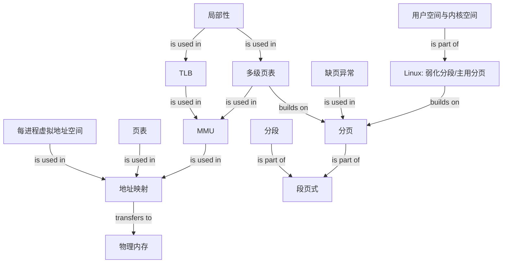

# 虚拟内存：从地址隔离到 Linux 地址空间

### 1. Topic Overview

- What this is about: 本章解释操作系统为什么让程序使用虚拟地址，以及分段、分页、多级页表、TLB、段页式管理和 Linux 地址空间如何组成一条完整的内存管理链。
- Why it matters: 没有地址转换时，多个程序直接使用相同物理地址会互相覆盖。虚拟内存把进程看到的地址与真实物理内存解耦，同时提供隔离、按需装入、换入换出和页级权限控制。
- Difficulty level: 中等。难点是同时追踪“地址由哪些字段组成”“查了哪些表”“这一步解决空间还是时间问题”。
- Prerequisites: 二进制地址与 `2^n`、内存/硬盘速度差异、进程与用户态/内核态的基本概念。
- Source: `materials/os/3_memory/vmem.md`。本文按源文顺序整理，并对几个容易误读的表述补充了边界说明。

### 2. Core Concepts

#### Schema 1: 用“进程页表 + MMU 映射”解释地址隔离

- Definition: 程序发出的地址是虚拟地址，真实内存位置是物理地址。每个进程拥有独立的虚拟地址空间和映射关系；操作系统建立并维护映射，CPU 中的 MMU 在访问时完成地址转换。
- Intuition: 两个进程都可以认为自己在使用虚拟地址 `0x1000`，但各自页表可把它映射到不同物理页，因此不会因为虚拟地址数值相同就互相覆盖。
- Example: 进程 A 的 `0x1000 -> 物理页 5`，进程 B 的 `0x1000 -> 物理页 19`。CPU 执行 A 时使用 A 的页表，执行 B 时使用 B 的页表。
- Common mistakes: 认为虚拟地址本身是一块额外硬件内存；说“每个进程有自己的物理内存”；只说操作系统转换地址而漏掉实际执行转换的 MMU。

虚拟内存的三项核心作用：

1. 隔离：不同进程的相同虚拟地址可以映射到不同物理页。
2. 容量抽象：不常用页可以换出到磁盘，程序当前可用的虚拟空间可以大于已驻留的物理内存。
3. 保护：页表项除物理页号外，还能保存存在位、读写/执行权限等属性。

#### Schema 2: 用“段号查表 + 偏移验界”完成内存分段转换

- Definition: 分段按代码、数据、堆、栈等逻辑单元组织内存。虚拟地址包含段选择因子和段内偏移；段号索引段表，段表项给出段基地址、段界限和特权级。
- Intuition: 先找到哪一段，再确认偏移没有越界，最后计算 `物理地址 = 段基地址 + 段内偏移`。
- Example: 段 3 的基地址为 `7000`，界限允许偏移 `500`，则地址为 `7000 + 500 = 7500`。
- Common mistakes: 没有先检查段内偏移是否越界；把段选择因子整体等同于段号；认为逻辑分段天然等长。

分段的取舍：

- 段按实际需求分配，通常不产生“固定分配单位内部剩余”的内部碎片。
- 段长不固定，释放后会留下不连续空洞，产生外部碎片。
- 可通过把段换出再换入来紧凑内存，但大段磁盘 I/O 很慢，交换效率低。

#### Schema 3: 用“页号换页框号，偏移保持不变”完成分页转换

- Definition: 分页把虚拟地址空间和物理内存都切成固定大小的页；源文以 Linux 常见的 `4KB` 页为例。虚拟地址由虚拟页号和页内偏移组成，页表把虚拟页号映射为物理页框号。
- Intuition: 翻译时只替换“页号”，页内位置不变：`虚拟页号 | 页内偏移 -> 物理页框号 | 同一页内偏移`。
- Example: `4KB = 2^12`，所以低 12 位是页内偏移。若虚拟地址 `0x00123ABC` 的虚拟页 `0x123` 映射到物理页框 `0x7F0`，物理地址就是 `0x7F0ABC`。
- Common mistakes: 把“物理页号加偏移”理解成两个普通整数直接相加；认为分页没有任何碎片；把所有页都预先装入物理内存。

分页的取舍：

- 固定页紧密排列，消除分段式分配的外部碎片。
- 分配最小单位是一页，最后一页未用完会形成内部碎片。
- 内存紧张时可按一个或少数页面换出/换入，比交换大段更灵活。
- 程序可按需装入：页首次真正被访问时再分配或从磁盘载入。

缺页边界：页表项不在场时会触发缺页异常，内核判断访问是否合法；合法时分配/调入页面并更新页表，非法访问则可能终止进程。并非所有缺页都一定成功分配。

#### Schema 4: 用“稀疏才创建下级表”理解多级页表

- Definition: 单级页表必须用连续结构覆盖整个虚拟地址空间。多级页表保留覆盖全空间的顶级目录，只在某段虚拟空间实际使用时创建对应下级页表。
- Intuition: 不是减少“可能的虚拟页”，而是避免为大量未使用区域提前保存末级页表项。
- Example: 32 位地址、`4KB = 2^12` 页、4 字节页表项：共有 `2^(32-12) = 2^20` 个虚拟页，单级页表需 `2^20 * 4B = 4MB`。二级页表把地址拆成 `10 位一级页号 + 10 位二级页号 + 12 位偏移`。一级表为 `1024 * 4B = 4KB`；若只需 20% 的二级表，源文估算总量为 `4KB + 20% * 4MB = 0.804MB`。
- Common mistakes: 认为增加层级在所有情况下都更省空间；忽略“地址空间稀疏”这个前提；误以为未创建下级表会使顶级目录无法覆盖全地址空间。

边界：如果整个 4GB 都已映射，二级结构会比单级页表多出顶级目录的开销。多级页表的收益来自多数进程只使用虚拟空间的一小部分，也就是局部性和稀疏性。

源文给出的 64 位 Linux 四级名称是：

`PGD -> PUD -> PMD -> PTE`

#### Schema 5: 用“TLB 缓存翻译”补偿多级页表时间成本

- Definition: TLB 是 CPU 内用于缓存常用页表项的高速缓存。MMU 先查 TLB；命中即可快速得到物理页框号，未命中才进行常规页表遍历。
- Intuition: 多级页表节省了空间，却可能增加多次内存访问；程序有局部性，所以缓存最近常用的地址翻译能让多数转换避开完整页表遍历。
- Example: CPU 访问某虚拟页：`TLB hit -> 直接取得页框号`；`TLB miss + PTE present -> 遍历页表、填充 TLB、继续访问`。
- Common mistakes: 把 TLB 当成数据 Cache；把 TLB miss 等同于缺页异常；认为 TLB 保存实际程序数据。

关键对比：

- TLB miss：缓存里没有这条翻译，页表里可能仍然有，通常只需 page walk。
- Page fault：有效页表映射当前不在场或访问不合法，需要进入内核处理。

#### Schema 6: 用“段号 -> 页表 -> 页框”追踪段页式地址

- Definition: 段页式先按逻辑意义分段，再把每个段切成固定大小的页。地址由段号、段内页号、页内位移组成。
- Intuition: 分段负责逻辑组织和保护，分页负责固定单位的物理分配。
- Example: 第一次访问段表取得该段页表的起始地址；第二次访问页表取得物理页框号；第三次使用“页框号 + 页内位移”访问实际数据。
- Common mistakes: 只数了两次查表，忘记源文所说的第三次是实际数据访问；把段号直接当成物理页号。

#### Schema 7: 用“弱化分段、主用分页”理解 Linux

- Definition: x86 历史路径是 `逻辑地址 -> 分段 -> 线性地址（虚拟地址）-> 分页 -> 物理地址`。Linux 在 x86 上把段基址设为 0，使分段映射近似恒等映射，主要依靠分页；段机制保留访问控制与保护作用。
- Intuition: 硬件要求先走分段，Linux 就让这一步尽量“不改地址”，把真正的内存管理重点放到分页。
- Example: 源文的 32 位常见布局中，用户空间约 3GB，内核空间位于高地址 1GB。每个进程的用户映射彼此独立，而高地址内核部分关联相同的内核物理内存。
- Common mistakes: 说 Linux 完全没有分段；认为用户态能直接访问内核空间；认为每个进程都复制了一份物理内核内存。

源文按低地址到高地址给出的 32 位用户空间主干为：

`text -> data -> bss -> heap（向高地址增长） -> file mapping -> stack（向低地址增长）`

- `.text`: 可执行代码。
- `.data`: 已初始化的全局/静态数据。
- `.bss`: 未初始化或零初始化的全局/静态数据。
- Heap: `malloc()` 等动态分配常用区域。
- File mapping: 动态库、共享内存和 `mmap()` 映射。
- Stack: 局部变量与函数调用上下文。

布局边界：源文中的 `3G/1G`、64 位用户/内核各 `128T`、栈一般 `8MB` 都是文章采用的典型配置图，不应当作所有架构、内核版本和进程配置的固定常数；ASLR 也会改变具体地址。

### 3. Deep Understanding

全章的因果链是：

`程序直接使用物理地址会冲突 -> 每个进程改用独立虚拟地址 -> MMU 依据操作系统维护的表完成翻译 -> 分段提供逻辑组织但产生外部碎片和大块交换 -> 分页以固定单位消除外部碎片并支持按需装入 -> 单级页表太大，于是使用按需创建下级表的多级页表 -> 多级遍历变慢，于是 TLB 缓存高频翻译 -> Linux 在 x86 上弱化分段并主要使用分页。`

这条链中的每项设计都在解决上一项的新代价：

| 机制 | 主要解决 | 新代价或边界 | 后续补偿 |
| --- | --- | --- | --- |
| 虚拟地址 | 多进程地址冲突、保护 | 需要地址翻译 | MMU + 映射表 |
| 分段 | 按代码/数据/栈等逻辑组织 | 外部碎片、大段交换 | 分页 |
| 分页 | 外部碎片、交换粒度过大 | 内部碎片、页表很大 | 多级页表 |
| 多级页表 | 稀疏地址空间的页表占用 | page walk 更慢 | TLB |
| TLB | 高频地址翻译延迟 | miss 时仍需 page walk | 利用局部性提高命中率 |

### 4. Minimal Working Example

场景：进程 A 第一次读取虚拟地址 `0x00123ABC`，页大小为 `4KB`。

1. MMU 把地址拆成虚拟页号 `0x123` 与页内偏移 `0xABC`。
2. MMU 先查 TLB。
3. 若 TLB 命中，直接得到物理页框号。
4. 若 TLB 未命中，则遍历页表：
   - PTE 存在且页面在内存：取得页框号并回填 TLB；
   - PTE 表示页面不在内存：触发缺页异常，内核合法性检查后从磁盘调入或分配；
   - 地址或权限非法：内核不能建立合法映射，进程可能收到段错误。
5. 假设最终页框号是 `0x7F0`，MMU 组成物理地址 `0x7F0ABC`，再访问真实内存。

注意：两个进程即使都访问 `0x00123ABC`，只要页表不同，就可以得到不同的物理地址。

### 5. Knowledge Graph

### 6. Self-Test Questions

Recall:

1. 虚拟地址与物理地址分别是谁看到、谁真实存在？MMU 与操作系统各承担什么职责？
2. 分段为什么有外部碎片，分页为什么可能有内部碎片？
3. 32 位地址、4KB 页时，为什么页内偏移是 12 位，虚拟页数是 `2^20`？

Application / transfer:

4. 某次访问 TLB 未命中，但页表项存在且 present，此时是否发生缺页异常？接下来做什么？
5. 两个进程都写虚拟地址 `0x4000`，在什么条件下它们互不影响？在什么条件下它们可能有意共享同一物理页？

Explain like I am 5:

6. 用“每户门牌号”和“城市真实地块”解释为什么两个进程都能拥有地址 `0x1000`。

### 7. Weak Point Detection

- 只会背“虚拟内存更大”，说不出隔离、换入换出和权限控制。
- 混淆内部碎片与外部碎片，或认为分页完全没有碎片。
- 把页号与偏移直接做普通加法，未理解“换页号、保留页内位置”。
- 认为多级页表无条件比单级更省，漏掉稀疏地址空间前提。
- 把 TLB miss 与 page fault 当成同一事件。
- 说 Linux 只分页、完全不涉及 x86 分段机制。
- 把文章中的典型地址空间大小或栈大小当成所有系统固定值。
