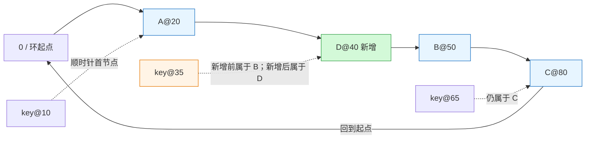
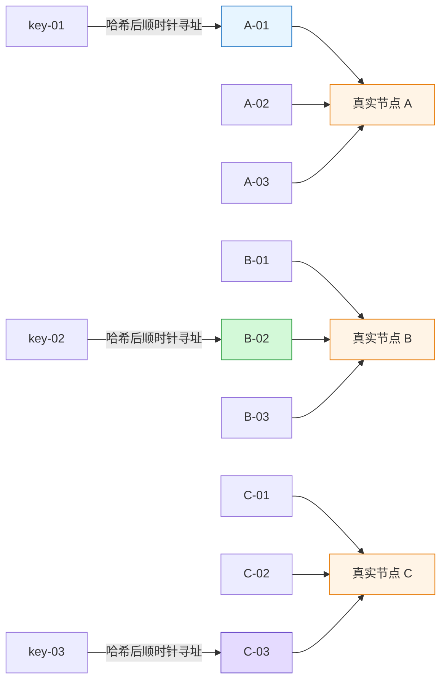
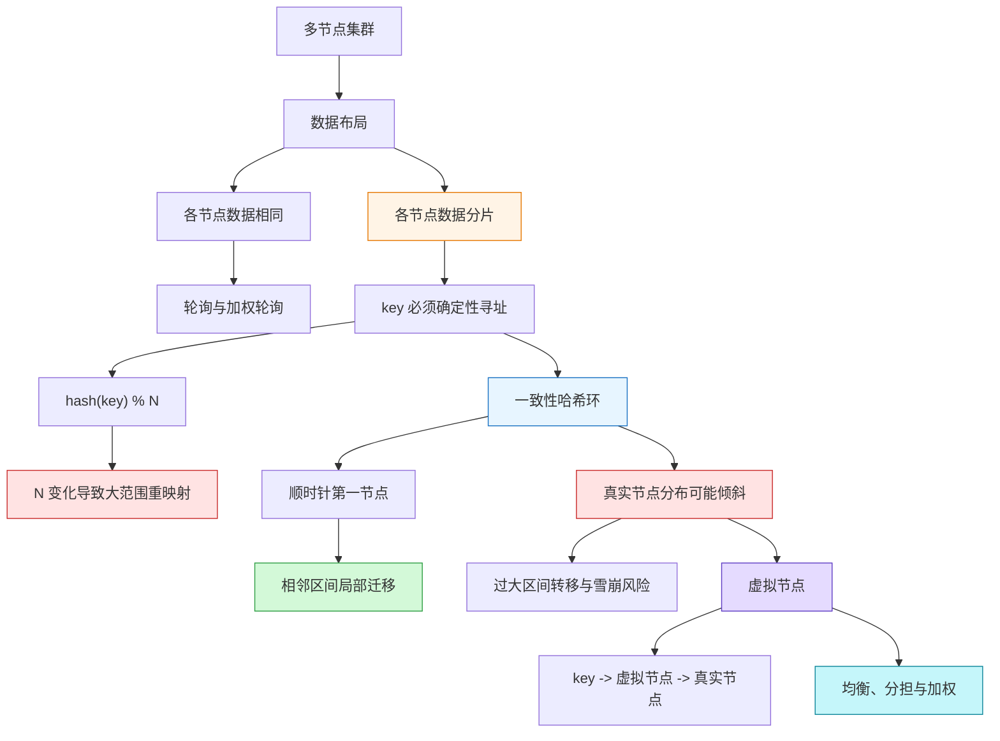

# 一致性哈希：从数据定位到局部迁移

> Source: [`materials/os/8_network_system/hash.md`](../../../materials/os/8_network_system/hash.md)（已逐行阅读全文 203 行，并按原文顺序核对请求分配、普通取模哈希、一致性哈希环、节点倾斜与虚拟节点）  
> Durable goal: 不只背“一致性哈希减少迁移”，而是能根据数据布局选择路由策略，运行一次环上寻址，精确说出扩容/缩容时哪个区间的 key 会迁移，以及虚拟节点为什么能改善均衡和稳定性。

### 1. Topic Overview

- **What this is about:** 当集群各节点存储的数据不同时，请求必须稳定地找到持有目标 key 的节点。原文从轮询的适用前提出发，逐步引出普通取模哈希、一致性哈希和虚拟节点。
- **Why it matters:** 分布式 KV 缓存、分片存储等系统不仅要分担请求，还要保持 `key -> node` 的可重现映射。节点扩缩容是常态，映射变化的范围直接决定迁移成本和故障扩散范围。
- **Difficulty level:** 中等。难点不在哈希函数本身，而在于区分“请求均衡”与“数据定位”，理解取模基数为什么导致全局重映射，以及用环上区间而不是含糊的“只影响一个节点”来解释局部迁移。
- **Prerequisites:** 哈希函数对同一输入给出可重现的结果；取模；分布式集群中的数据副本与水平分片。
- **Source order:** 多节点请求分配 -> 轮询/加权轮询的数据前提 -> `hash(key) % N` -> 节点数变化与 `O(M)` 最坏迁移 -> 固定 `2^32` 哈希环 -> 节点与数据的两次哈希 -> 顺时针第一节点 -> 局部迁移 -> 环上倾斜与雪崩 -> 虚拟节点两层映射。
- **Source boundary:** 原文以 `2^32` 作为固定哈希空间的教学模型；核心不是必须使用这个数，而是环的坐标空间不再随真实节点数 `N` 改变。文中 Nginx “每个权重 1 的真实节点有 160 个虚拟节点”按文章示例记录，不在本笔记中外推为所有实现的通用常量。

#### Roadmap

1. 用“副本同构 vs 数据分片”选择请求分配策略。（Stable）
2. 用“取模基数是映射函数的一部分”诊断普通哈希的全局重映射。（Stable；算术表为 deliberate skip）
3. 用“固定环 + 顺时针后继”运行一致性哈希寻址与局部迁移。（Stable）
4. 用“所有权区间大小”诊断节点倾斜与雪崩传导。（Stable）
5. 用“key -> 虚拟节点 -> 真实节点”运行均衡、容灾和加权。（Stable）

Final transfer：给定一个分片 KV 集群的环坐标、key 坐标与节点变化，先完成寻址，再标出迁移区间，最后判断是否需要虚拟节点与权重。（Current）

### 2. Core Concepts

#### Schema 1：用“副本同构 vs 数据分片”选择请求分配策略

- **Definition:** 负载均衡不只有“把请求数量分开”一个目标。如果每个节点都有相同数据，请求可以轮询或按权重发往任意节点；如果数据已水平分片，路由必须让同一 key 稳定地定位到存放它的节点。
- **Intuition:** 三个仓库若都有同一件商品，顾客去哪个都行；若三个仓库各放不同商品，调度员不能只看哪家空闲，还必须知道这件商品在哪家。
- **Example:** A、B、C 是分布式 KV 缓存的三个分片，`key-01` 只在 A。即使 C 当前负载最低，简单轮询把查询发到 C 也只会未命中；系统需要一个可重现的 `key -> node` 映射。
- **Common mistakes:** 把“流量分得平均”当成唯一目标；忽略数据是全量副本还是分片；认为加权轮询会自动找到持有 key 的节点；把确定性寻址等同于节点数变化后映射仍不变。

| 数据布局 | 对请求路由的最低要求 | 适合的入口策略 |
| --- | --- | --- |
| 各节点数据相同 | 任意健康节点都能回答 | 轮询、加权轮询 |
| 各节点保存不同分片 | 同一 key 必须定位到对应节点 | 普通哈希或一致性哈希等确定性路由 |

#### Schema 2：用“取模基数是映射函数的一部分”诊断全局重映射

- **Definition:** 普通方案用 `node_index = hash(key) % N`。对同一 key，`hash(key)` 可以不变，但节点数 `N` 也是函数输入的一部分；扩容或缩容改变 `N` 时，大量余数会变。
- **Intuition:** 问题不是哈希值突然不稳定，而是用了一把会随节点数变长的“刻度尺”。同一个数被 3 和 4 取模，余数通常不同。
- **Example:** 原文中 `hash(key-01)=6`、`hash(key-02)=7`、`hash(key-03)=8`。

| key | `% 3` 原节点 | `% 4` 新节点 | 是否重映射 |
| --- | --- | --- | --- |
| key-01 / 6 | 0 / A | 2 / C | 是 |
| key-02 / 7 | 1 / B | 3 / D | 是 |
| key-03 / 8 | 2 / C | 0 / A | 是 |

- **Consequence:** 若数据仍留在旧节点，新公式会把查询导向其他节点，从而查不到数据。要恢复一致，必须按新公式重新分布数据。若总数据量为 `M`，原文给出最坏迁移规模 `O(M)`。
- **Boundary:** 不是每次变更都数学上必然迁移全部 `M` 条数据；原文的结论是“大部分映射可能改变，最坏为 `O(M)`”。
- **Common mistakes:** 认为只要 `hash(key)` 确定，节点定位就永远不变；扩容后只迁往新节点的数据，却不重新按新映射检查其他 key；把最坏 `O(M)` 说成无条件“永远全迁”。

#### Schema 3：用“固定环 + 顺时针后继”运行寻址与局部迁移

- **Definition:** 一致性哈希先建立不随真实节点数改变的环形坐标空间。真实节点通过节点标识（原文举 IP 地址）哈希到环上；数据 key 也哈希到同一环上。key 的所属节点是它沿顺时针遇到的第一个节点。
- **Two hashes, one coordinate system:** “两次哈希”是指先后对节点标识和数据 key 做映射，两者必须进入同一固定环空间，才能比较顺序。
- **Lookup:** `hash(key) -> 环坐标 -> 顺时针第一个节点 -> 读/写该节点`。越过环的最大坐标后回到 0，所以最后一段也有归属。
- **Local migration:** 在环上已有相邻节点 `P -> S` 时，若在两者之间加入新节点 `D`，原来由 S 拥有的区间 `(P, D]` 改由 D 拥有；其他区间的顺时针第一节点不变。若移除 D，D 原来拥有的 `(P, D]` 交给它的顺时针后继 S。

#### Visual Model：新节点为什么只接管一段 key 区间？



- **How to read:** 从 key 坐标顺时针走到第一个节点；D 插入 A 和 B 之间后，只截走原属于 B 的 `(A,D]` 区间，例如 `key@35`。
- **Source anchor:** [`hash.md`“使用一致性哈希算法有什么问题？”](../../../materials/os/8_network_system/hash.md#使用一致性哈希算法有什么问题)。
- **Boundary:** 原文说“仅影响该节点在哈希环上顺时针相邻的后继节点”，精确含义是所有权区间只在新节点/被删节点与其后继之间移交，不是“只有一条数据变化”。
- **Common mistakes:** 选环上数值距离最近的节点；逆时针寻址；忘记最大坐标后要回绕；仍用 `% 真实节点数`；说一致性哈希完全没有迁移。

#### Schema 4：用“所有权区间大小”诊断倾斜和雪崩

- **Definition:** 一致性哈希保证映射变化局部化，但不自动保证少量真实节点在环上均匀分布。每个节点承担的 key 范围是其前驱到它自己的顺时针区间；区间越长，理想均匀 key 下它承担的数据和请求就越多。
- **Example:** 若 A、B、C 都挤在环的右半边，A 的前驱到 A 可能跨越左半边的大段空间，于是大量 key 都会顺时针首先遇到 A。
- **Failure chain:** `真实节点稀少且不均 -> 某节点拥有过大区间 -> 数据量/请求量倾斜 -> 该节点故障 -> 整段负载转给后继 -> 后继过载 -> 可能连锁崩溃`。
- **Boundary:** “只影响相邻区间”描述变化的范围，不描述该范围的大小。若那段弧很长，局部变化仍可以很大。
- **Common mistakes:** 从“局部迁移”直接推出“负载必然均衡”；只数真实节点个数而不看环上间隔；认为故障节点的压力会自动被所有其他真实节点均分。

#### Visual Model：为什么节点倾斜会把局部故障放大？


- **How to read:** 雪崩不是“哈希环”四个字自动导致；它的机制是过大所有权区间在节点故障后整段压到一个后继。
- **Source anchor:** [`hash.md`一致性哈希的不均衡与雪崩段落](../../../materials/os/8_network_system/hash.md#使用一致性哈希算法有什么问题)。

#### Schema 5：用“key -> 虚拟节点 -> 真实节点”运行均衡、容灾和加权

- **Definition:** 虚拟节点是真实节点在哈希环上的多个逻辑标识，不是新增物理服务器。环上放置 A-01、A-02、A-03 等虚拟节点，每个虚拟节点再指回真实节点 A。
- **Two-level lookup:** `hash(key) -> 顺时针第一个虚拟节点 -> 该虚拟节点对应的真实节点`。
- **Balance:** 环上的逻辑点变多且更分散，每个真实节点拥有多段较小区间，较不容易因为一个大空档而承担过大份额。
- **Stability:** 移除真实节点 A 时，A 的多个虚拟节点分别移除；它们各自的后继虚拟节点可能分属 B、C 等不同真实节点，因而故障负载由多个真实节点分担。
- **Weight:** 高配置真实节点可配置更多虚拟节点，从而在环上获得更多所有权区间。这是通过“环上逻辑份额”表达权重，不是对已选定的目标再做一次轮询。

#### Visual Model：虚拟节点的“两层映射”到底映射什么？



- **How to read:** key 不直接命中真实节点；第一层在环上找到虚拟节点，第二层再查到它所属的真实节点。同一真实节点的多个逻辑身份可分散在环上不同位置。
- **Source anchor:** [`hash.md`“如何通过虚拟节点提高均衡度？”](../../../materials/os/8_network_system/hash.md#如何通过虚拟节点提高均衡度)。
- **Boundary:** 虚拟节点提高的是统计上的均衡度和变更时的分担范围，不代表每个真实节点一定精确承担相同数据和实时请求。热点 key 本身仍可能形成热点。
- **Common mistakes:** 把虚拟节点当成真实虚拟机；只会写虚拟节点名却说不出两层映射；认为一个真实节点故障后仍必然只由一个后继真实节点承担；认为虚拟节点能消除所有热点。

### 3. Deep Understanding

#### 3.1 三个机制必须连起来

```text
固定哈希空间
-> 环坐标不因真实节点数 N 改变

顺时针第一节点规则
-> 每个节点只拥有“前驱之后到自己”的 key 区间

节点插入或删除
-> 只改变一段相邻所有权区间
-> 局部迁移，而不是按新 N 全局重分配
```

“固定取模空间”只是第一步；若没有顺时针后继所定义的所有权区间，仍无法得出局部迁移。

#### 3.2 用区间表达扩缩容，避免含糊口号

将环上 token 顺时针排序为 `v0, v1, ..., vn-1`。对任意 key 坐标 `h`，它归顺时针第一个 token。

- 节点 `vi` 拥有区间 `(v(i-1), vi]`，首节点的区间跨越环尾和环头。
- 在 `vi` 与 `v(i+1)` 之间新增 `x`：只有 `(vi, x]` 从 `v(i+1)` 迁到 `x`。
- 移除 `x`：`x` 原有的 `(vi, x]` 迁到 `x` 的顺时针后继 `v(i+1)`。

所以，一致性哈希降低的是“所有被重新求余导致的全局重映射”，并不把迁移量降为零。

#### 3.3 虚拟节点同时修复两个问题

1. **空间均衡:** 一个真实节点不再只押在环上一个位置，而是通过多个虚拟节点分散拥有多段弧。
2. **故障分担:** 一个真实节点下线后，它的多段弧通常分别交给不同后继虚拟节点，不再把所有新压力集中到同一真实后继。

加权也是同一个机制的延伸：能力更高的真实节点配置更多虚拟节点，使它在环上获得更多逻辑份额。

#### 3.4 一致性哈希的能力边界

- 它解决的是节点变化时映射扰动过大的问题，不等于完整的副本一致性、故障检测、数据复制或迁移执行协议。
- 它在 key 哈希大致均匀时改善数据份额，但不自动消除超热 key，也不保证各 key 的请求频率相同。
- 虚拟节点越多，均衡效果通常越稳定，但原文没有讨论 token 数量、路由表大小和管理成本的工程取舍，因此不在本章替原文做具体参数结论。

### 4. Minimal Working Example

为了手算，把原文 `0 ... 2^32-1` 的固定环缩小为 `0 ... 99`。这只简化坐标，不改变顺时针寻址规则。

已有节点：`A@20`、`B@50`、`C@80`。

| key 坐标 | 顺时针路径 | 所属节点 |
| --- | --- | --- |
| `10` | `10 -> 20` | A |
| `35` | `35 -> 50` | B |
| `65` | `65 -> 80` | C |
| `90` | `90 -> 99 -> 0 -> 20` | A |

**扩容：加入 `D@40`**

- D 插入 A 与 B 之间。
- 只有 `(20,40]` 内的 key 从 B 迁到 D；因此 `key@35` 迁移。
- `key@10`、`key@65`、`key@90` 的顺时针第一节点没有改变。

**缩容：在原始 A/B/C 环上移除 `A@20`**

- A 原来拥有跨越环尾和环头的 `(80,20]`。
- 这一整段交给 A 的顺时针后继 B；`key@90` 和 `key@10` 迁到 B。
- C 拥有的 `(50,80]` 不变。

这个环例子的最小运行模板是：

```text
先排节点/token 坐标
-> 再从 key 坐标顺时针找首节点
-> 节点变化时先标它的前驱和后继
-> 只检查被切分或被交接的所有权区间
```

### 5. Chapter Knowledge Map



### 6. Self-Test Questions

#### Recall

1. 为什么加权轮询适合各节点数据相同的场景，却不足以路由已分片的 KV 数据？
2. 在 `hash(key) % N` 中，为什么 `hash(key)` 不变仍不能保证节点映射不变？
3. 一致性哈希中，节点标识和数据 key 各自被映射到哪里？key 选哪个节点？

#### Application / Transfer

4. 环上已有 `A@20`、`B@50`、`C@80`，新增 `D@40`。哪个哈希坐标区间的 key 需要迁移，它们从谁迁到谁？
5. 若真实节点 A 的多个虚拟节点分散在环上，A 故障后为什么压力可能由 B、C 共同分担，而不是只压给一台真实节点？

#### Explain Like I Am 5

6. 用“钟表、商品标签、仓库标签”解释顺时针第一节点规则，并说明新仓库插入后为什么只接管一段商品。

### 7. Weak Point Detection

- **场景误判:** 看到多节点就默认轮询，不先判断数据是全量副本还是分片。
- **函数边界混淆:** 只看 `hash(key)` 稳定，忽略 `% N` 中 `N` 改变后整个映射函数已变。
- **寻址失败:** 在环上选最近节点或逆时针节点，而不是顺时针第一节点。
- **迁移边界失败:** 只背“影响后继”却标不出被切分的 `(predecessor, new_node]` 区间；或误认为一致性哈希零迁移。
- **均衡失败:** 把局部迁移当成负载均衡的证明，不看每个节点的所有权弧长。
- **虚拟节点对象混淆:** 把虚拟节点当成新增物理机或虚拟机，说不出 `key -> virtual node -> real node` 两层映射。
- **过度承诺:** 认为虚拟节点能精确均分实时负载、消除热 key，或替代复制、故障检测和数据一致性协议。
