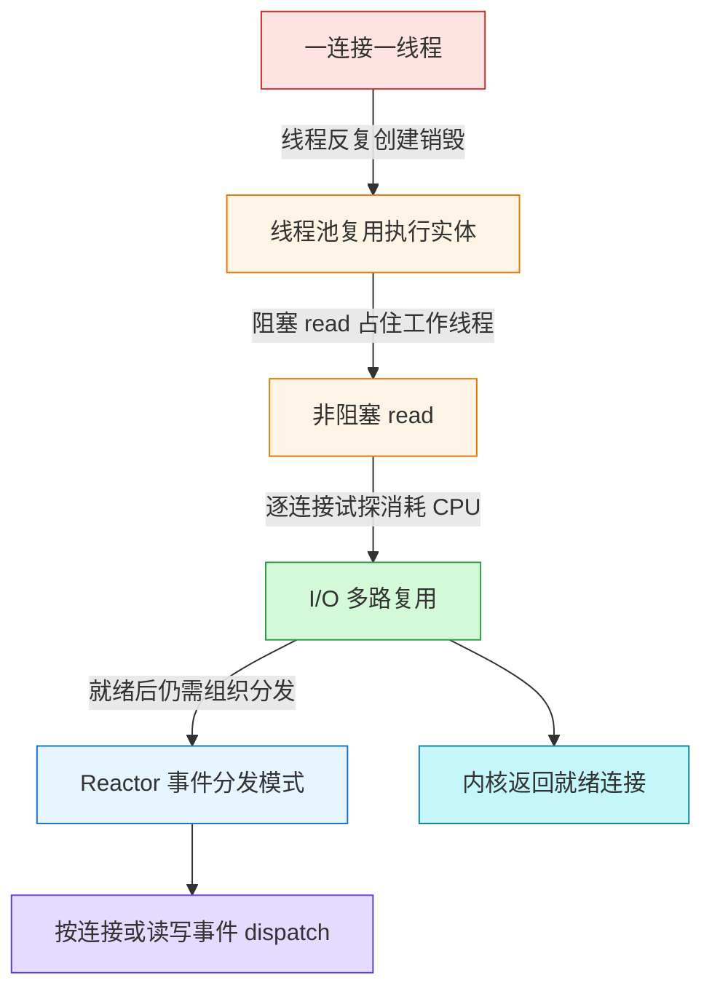
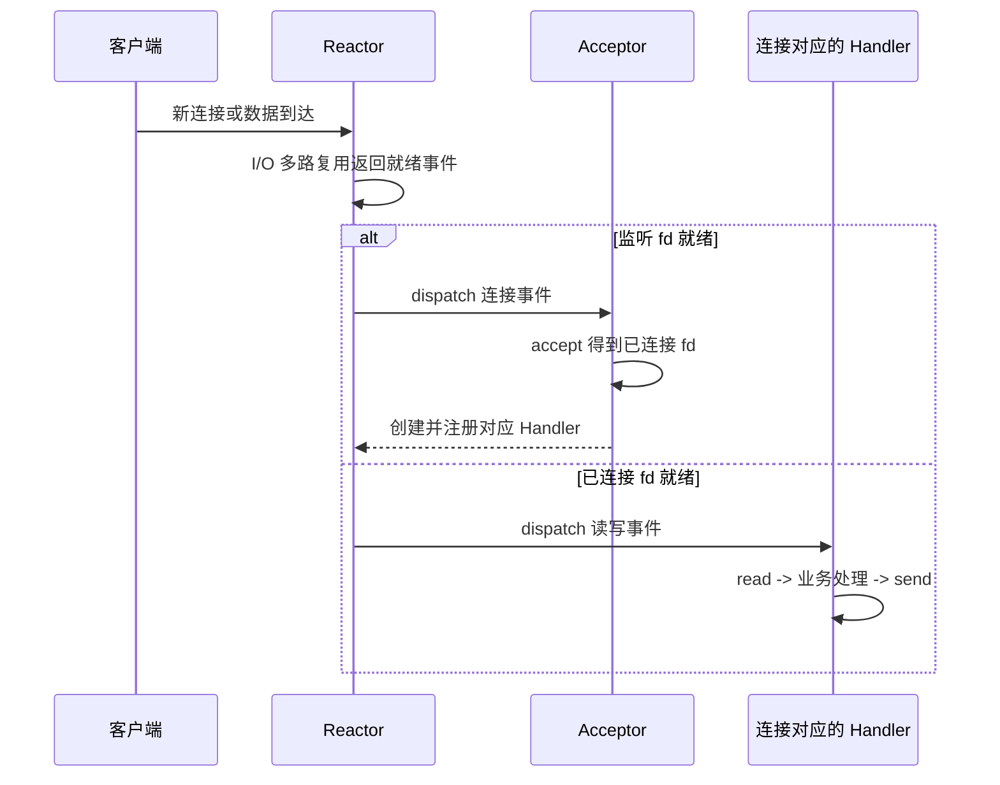
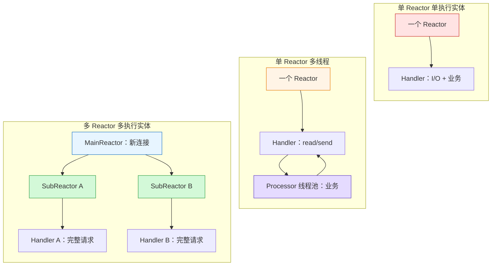
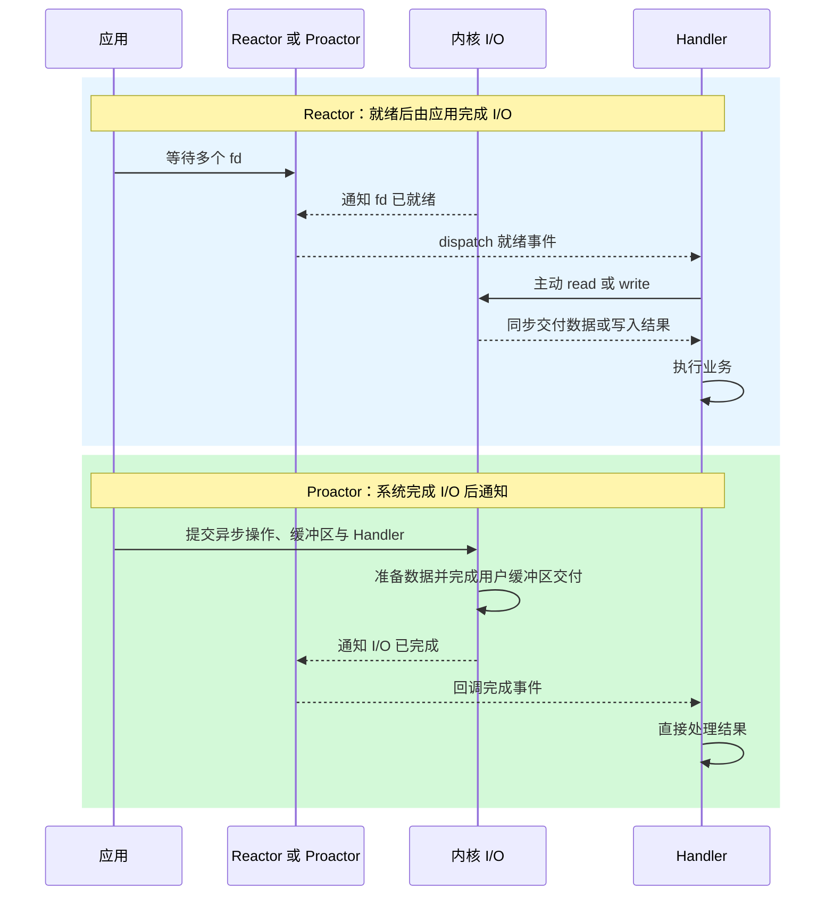
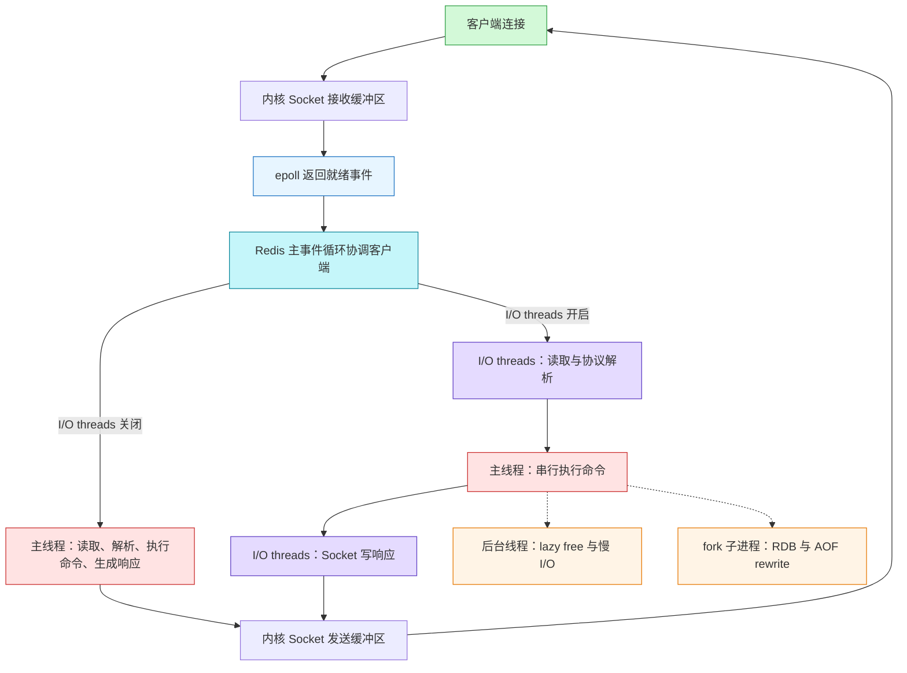
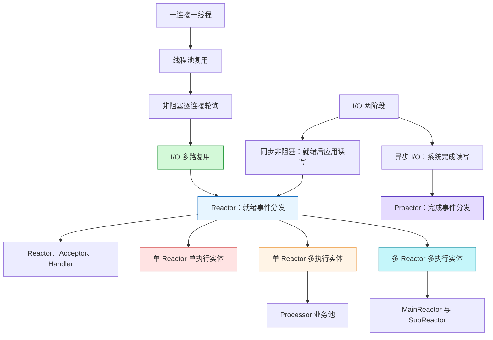

# 高性能网络模式：Reactor 和 Proactor

> Source: [`materials/os/8_network_system/reactor.md`](../../../materials/os/8_network_system/reactor.md)（已逐行阅读正文 311 行，并核对演进提纲、I/O 多路复用、三种 Reactor、阻塞/非阻塞/异步 I/O、Proactor 共 9 张核心原图）  
> Durable goal: 不把 Reactor 背成“用了 epoll”，也不把 Proactor 背成“更异步”；而是能沿“通知的是什么、谁执行实际 I/O、业务放在哪里、哪个执行实体会被拖住”四个问题，运行并选择网络模式。

### 1. Topic Overview

- **What this is about:** 文章先从“一连接一线程”的扩展问题出发，经线程池、非阻塞轮询和 I/O 多路复用引出 Reactor；再比较三种经典 Reactor 组织方式，最后用 I/O 两阶段解释 Reactor 与 Proactor 的边界。
- **Why it matters:** I/O 多路复用只解决“怎样高效发现哪些连接已就绪”；高性能服务器还要决定连接事件交给谁、业务计算放在哪里、如何利用多核，以及怎样避免某个慢任务拖住整个事件循环。Reactor/Proactor 回答的是这一层组织问题。
- **Difficulty level:** 中等偏高。最容易混淆的边界是：I/O 多路复用机制与 Reactor 设计模式、就绪通知与完成通知、Handler 与 Processor 的责任、Reactor 数量与业务线程数量、并发连接与并行执行。
- **Prerequisites:** Socket 监听 fd 与已连接 fd；线程/进程；阻塞与非阻塞 I/O；select/poll/epoll；`N` 个关注连接与 `k` 个就绪连接。此前已稳定掌握这些局部 schema，本章直接复用。
- **Source order:** 一连接一线程 -> 线程池 -> 非阻塞轮询 -> I/O 多路复用 -> Reactor 的两类核心资源 -> 单 Reactor 单执行实体 -> 单 Reactor 多执行实体 -> 多 Reactor 多执行实体 -> I/O 两阶段 -> Proactor -> 平台示例与总结。
- **Source boundary:** 原文用 `select` 代表 Reactor 底层的 I/O 多路复用接口；理解模式时也可代入 poll/epoll，但不能因此把 Reactor 等同于某一个系统调用。原文关于 Linux POSIX `aio`、Socket 异步 I/O 与 Windows IOCP 的结论记录为文章语境下的平台说明，不外推为所有年代、所有 Linux 异步 I/O 接口的完整现状。

#### Roadmap

1. 用“就绪发现机制 ≠ 事件协调模式”区分 I/O 多路复用与 Reactor。（Stable）
2. 用“监听 -> 按类型分发 -> 专属处理”运行 Reactor、Acceptor、Handler。（Stable）
3. 用“一个事件循环的串行临界路径”判断单 Reactor 单执行实体的适用边界。（Stable）
4. 用“网络 I/O 留主线程、业务计算进资源池”运行单 Reactor 多线程。（Stable）
5. 用“主 Reactor 接连接、子 Reactor 管连接”运行多 Reactor 多执行实体。（Stable）
6. 用“就绪事件 vs 完成事件”区分 Reactor 与 Proactor。（Stable）

Applied transfer：用“命令执行路径 ≠ 整个进程”分析现代 Redis 的线程模型。（Current）

Final transfer：给定连接规模、业务耗时、CPU 核数与平台 I/O 能力，选择一种模式，并逐步指出一次连接事件和一次读事件由谁监听、分发、读写和执行业务。（Pending after Redis transfer）

### 2. Core Concepts

#### Schema 1：用“就绪发现机制 ≠ 事件协调模式”区分多路复用与 Reactor

- **Definition:** select/poll/epoll 是内核提供的 I/O 多路复用接口，负责让一个执行实体等待多个 fd，并返回已就绪事件；Reactor 是建立在这种接口之上的事件分发模式，进一步规定“收到哪类事件后，分发给哪个对象或执行实体”。
- **Intuition:** 多路复用像一个能同时显示很多门铃状态的总控屏；Reactor 像值班调度员，看到“新访客”就叫接待员，看到“某房间来消息”就叫该房间的处理员。
- **Example:** `epoll_wait` 返回监听 fd 可读，只说明有连接可 `accept`；Reactor 的 dispatch 再把这个连接事件交给 Acceptor。若返回某个已连接 fd 可读，则分发给该连接对应的 Handler。底层“发现就绪”相同，后续责任不同。
- **Common mistakes:** 说“Reactor 就是 epoll”；认为线程池自动解决了就绪发现；认为多路复用已经替应用执行 `accept/read/send`；只记“事件驱动”却说不出事件类型与处理对象的映射。

线程模型的演进不是简单地“线程越来越少”，而是把**等待**与**处理**逐步解耦：

#### Visual Model：Reactor 是怎样从连接处理问题中演进出来的？



- **How to read:** 每一步都修复上一步的一个瓶颈：资源复用没有解决阻塞，非阻塞没有解决忙轮询，多路复用解决就绪发现，Reactor 再把发现结果组织成可复用的事件处理结构。
- **Source anchor:** [`reactor.md`“演进”](../../../materials/os/8_network_system/reactor.md#演进)。
- **Boundary:** I/O 多路复用线程在没有事件时可以阻塞在一次等待调用上，这与逐个 fd 不断调用非阻塞 `read` 的用户态忙轮询不同；事件就绪后，应用仍要执行相应系统调用和业务逻辑。

#### Schema 2：用“监听 -> 按类型分发 -> 专属处理”运行 Reactor 三角色

Reactor 的核心可压缩为两类资源：

- **Reactor:** 监听连接、读、写等事件，并根据事件类型 dispatch。
- **处理资源:** 对事件做实际响应；可以只有当前进程/线程，也可以是线程池或进程池。

原文的对象分工如下：

| 对象 | 收到什么 | 负责什么 | 不应偷换成什么 |
| --- | --- | --- | --- |
| Reactor | I/O 多路复用返回的就绪事件 | 监听并按事件类型分发 | 不等于业务处理器，也不自动完成 `read/send` |
| Acceptor | 监听 fd 的连接建立事件 | 调用 `accept`，得到已连接 fd，并创建或绑定 Handler | 不负责后续连接上的普通读写业务 |
| Handler | 某个已连接 fd 的读写事件 | 对该连接执行 `read/send`；业务是否也在这里取决于具体变体 | 不是所有连接共享的一个无状态函数标签 |
| Processor | 单 Reactor 多线程中的业务任务 | 在线程池中做较重的业务计算，把结果交回 Handler | 不负责持续监听 fd |

#### Visual Model：连接事件和数据事件为什么走向不同对象？



- **How to read:** 先判断“哪个 fd、什么事件”，再决定处理对象；监听 fd 走 Acceptor，已连接 fd 走该连接的 Handler。
- **Source anchor:** [`reactor.md`“单 Reactor 单进程 / 线程”](../../../materials/os/8_network_system/reactor.md#单-reactor-单进程--线程)。
- **Common mistakes:** 让 Acceptor 处理客户端数据；把 `dispatch` 当系统调用；以为创建 Handler 就创建一个新线程；忽略 Handler 必须与具体连接建立对应关系。

#### Schema 3：用“一个事件循环的串行临界路径”判断单 Reactor 单执行实体

- **Definition:** 一个 Reactor 和全部 Acceptor/Handler 都在同一个进程或线程的事件循环中运行。连接事件与数据事件被逐个分发，Handler 完整执行 `read -> 业务处理 -> send` 后，事件循环才继续处理别的事件。
- **Advantage:** 结构简单；没有跨进程通信，也没有多线程共享数据竞争。
- **Two source-level limits:** 只有一个执行实体，不能把业务同时铺到多个 CPU 核；任何耗时业务都会占住唯一事件循环，延迟其他连接的事件响应。
- **Example:** A、B 两个连接都已可读。Reactor 先把 A 交给 Handler A；若 A 的业务计算花 100ms，B 即使早已就绪，也要等 A 的 Handler 返回后才能被分发。
- **Use boundary:** 适合业务非常快、计算不是主要瓶颈的场景。原文以 Redis 的内存内快速命令处理说明这一选择；这里把它理解为文章示例，不把所有版本和所有后台工作都简化为一条线程。
- **Common mistakes:** 认为使用 I/O 多路复用后任何 Handler 都可以随意阻塞；把“一个进程维护很多连接”说成“一个进程在同一时刻并行处理很多业务”；只看到实现简单，忽略尾延迟会被慢 Handler 放大。

#### Schema 4：用“网络 I/O 留主线程、业务计算进资源池”运行单 Reactor 多线程

- **Definition:** 主线程的 Reactor 仍负责全部事件监听与分发；Handler 负责 `read` 与 `send`，把读到的数据交给子线程中的 Processor 做业务处理，完成结果再交回主线程的 Handler 发送。
- **Benefit:** 业务计算可以利用多核，主事件循环不必同步完成每个重任务。
- **New cost:** 工作结果要回到主线程；共享任务队列、结果队列或连接状态可能发生竞争，需要互斥或其他正确的并发协议。
- **Remaining bottleneck:** 只有一个 Reactor 在主线程承担所有连接和读写事件的监听、分发与响应；瞬间高并发下，它本身可能成为瓶颈。
- **Process variant boundary:** 单 Reactor 多进程还需要父子进程双向通信，并让父进程知道结果属于哪个客户端；原文因此认为它比共享地址空间的多线程实现更麻烦，实际少见。
- **Common mistakes:** 把整个 Handler 都扔进线程池，从而说不清谁持有连接与发送结果；认为多线程共享数据无需同步；认为业务并行后单 Reactor 就不会再成为瓶颈。

#### Schema 5：用“主 Reactor 接连接、子 Reactor 管连接”运行多 Reactor

- **Definition:** MainReactor 只监控连接建立事件；Acceptor `accept` 后把新连接分配给某个子线程或子进程。该执行实体的 SubReactor 将连接加入自己的多路复用集合，创建 Handler，并在后续事件上执行 `read -> 业务处理 -> send`。
- **Intuition:** 总前台只办入住并分配楼层；每层自己的值班台负责该层住客之后的所有请求。
- **Why the interaction is simpler:** 主、子执行实体的交互主要是一次“移交新连接”；后续响应由 SubReactor 所在执行实体直接发给客户端，不必把每个业务结果再送回主 Reactor。
- **Examples in the source:** Netty、Memcache 被列为多 Reactor 多线程例子。Nginx 被列为相近的多 Reactor 多进程变体：主进程初始化监听 Socket，子进程竞争 accept，并用锁控制同一时刻只有一个子进程 accept，以避免惊群；接受连接的子进程自己继续处理，不再二次分配。

#### Visual Model：三个经典变体把并行性插在哪里？



- **How to read:** 第一种没有业务并行；第二种只并行业务计算但网络事件入口仍单一；第三种连后续事件循环也按连接分摊到多个 SubReactor。
- **Source anchor:** [`reactor.md`三个 Reactor 方案](../../../materials/os/8_network_system/reactor.md#reactor)。
- **Boundary:** 原文排除“多 Reactor 单执行实体”，因为增加 Reactor 结构却没有增加可并行的执行实体，复杂度上升而没有相应性能收益。

#### Schema 6：用“I/O 两阶段”区分阻塞、非阻塞与异步

一次输入可拆成两个阶段：

1. **数据准备:** 数据从设备或网络到达内核接收缓冲区。
2. **数据交付:** 数据从内核缓冲区复制到应用提供的用户缓冲区。

| I/O 类型 | 数据未准备好时 | 内核到用户的交付 | 应用何时拿到结果 |
| --- | --- | --- | --- |
| 阻塞 `read` | 调用者等待 | 调用者继续等待同步复制 | 两阶段都完成后 `read` 返回 |
| 非阻塞 `read` | 立即以 `EWOULDBLOCK/EAGAIN` 返回，可稍后再试 | 数据就绪后的那次 `read` 仍同步等待复制 | 这次 `read` 完成后拿到数据 |
| 异步 `aio_read` 教学模型 | 提交后立即返回 | 内核在后台准备并复制到给定用户缓冲区 | 两阶段完成后收到通知 |

- **Core boundary:** “调用在数据未就绪时立即返回”只说明非阻塞；若应用仍要再次主动 `read`，并在该调用中等待数据从内核复制到用户缓冲区，它仍是同步 I/O。
- **Connection to the prior chapter:** select/poll/epoll 只替应用等待“哪些 fd 已就绪”；收到通知后，应用仍主动 `read/write`，所以原文把 Reactor 称为非阻塞同步网络模式。
- **Common mistakes:** 把非阻塞直接等同异步；只看第一阶段是否等待，忽略第二阶段由谁完成；认为 epoll 返回可读时数据已经自动进入业务缓冲区。

#### Schema 7：用“就绪事件 vs 完成事件”区分 Reactor 与 Proactor

| 判断问题 | Reactor | Proactor |
| --- | --- | --- |
| 感知什么事件 | fd 已经可读/可写，即 I/O **待应用完成** | 异步读写已经完成，即 I/O **已由系统完成** |
| 谁发起实际读写 | 应用的 Handler 主动调用 `read/write` | 应用先提交异步操作与缓冲区；系统完成实际 I/O |
| 通知到达时用户缓冲区 | 尚未因这次通知自动填好，仍需 `read` | 已完成读写，可直接处理结果 |
| 处理器收到通知后做什么 | 先实际 I/O，再做业务 | 直接对完成结果做业务 |

#### Visual Model：同样是事件分发，通知点差在哪里？



- **How to read:** 两条路径都按事件分发；分界点是通知发生在实际 I/O 之前还是之后。
- **Source anchor:** [`reactor.md`“Proactor”](../../../materials/os/8_network_system/reactor.md#proactor)。
- **Mnemonic with boundary:** Reactor 是“可以取了，你来取”；Proactor 是“已经送到了，你来处理”。这个比喻只压缩责任边界，不能替代 I/O 两阶段。
- **Proactor participants:** Proactor Initiator 创建 Proactor 与 Handler，并向 Asynchronous Operation Processor 注册异步操作；后者完成 I/O 后通知 Proactor；Proactor 再按完成事件类型回调相应 Handler。
- **Source platform note:** 原文称 Linux POSIX `aio` 主要是用户态模拟且针对本地文件，Socket 高性能程序因而主要采用 Reactor；Windows IOCP 提供操作系统级 Socket 异步 I/O，可实现 Proactor。该段按原文理解，不作为对当前全部平台 API 的独立普查。
- **Common mistakes:** 把 Reactor 的“事件发生”理解成“数据已复制完”；把 Proactor 说成只是把 Handler 放在线程池；用“同步一定阻塞、异步一定非阻塞”替代“谁完成两个 I/O 阶段”的机制判断。

### 3. Deep Understanding

#### 3.1 底层机制与上层协调必须分层

```text
I/O 多路复用
-> 回答：哪些 fd 现在就绪？

Reactor
-> 回答：就绪后按事件类型交给谁？谁执行实际 I/O 和业务？

Proactor
-> 回答：异步 I/O 完成后按完成类型回调谁？
```

因此不能从“用了 epoll”直接推出程序采用哪种 Reactor 线程组织，更不能推出业务已经并行。系统调用提供 transport/notification primitive；Reactor/Proactor 提供 coordination protocol。

#### 3.2 三种 Reactor 是沿两个独立轴组合出来的

| 设计轴 | 一个 | 多个 |
| --- | --- | --- |
| Reactor 数量 | 一个事件入口，结构简单但可能集中成瓶颈 | 连接或后续事件分摊到多个事件循环 |
| 处理执行实体数量 | 无共享竞争，但慢业务阻塞同一循环 | 可利用多核，但要处理通信、共享与归属 |

理论上有四种组合；原文保留三种经典方案，排除“多 Reactor + 单执行实体”，因为多个 Reactor 最终仍在同一执行流串行运行，没有形成对应的并行收益。

#### 3.3 优化不是消灭瓶颈，而是让瓶颈逐步迁移

```text
一连接一线程
-> 线程数量、创建销毁和切换
线程池 + 阻塞 read
-> 某个空连接占住可复用工作线程
非阻塞逐 fd 轮询
-> CPU 消耗在无效试探
I/O 多路复用 + Reactor
-> 慢 Handler 占住事件循环
单 Reactor + 业务线程池
-> 单 Reactor 与结果回传/共享竞争
多 Reactor
-> 连接分配、各 SubReactor 负载和真实业务成本
```

选择模式时应问“当前最贵的是什么”，而不是默认层级越高就越好。

#### 3.4 判断拖累范围：先找执行业务的实体

- 单 Reactor 单执行实体：某 Handler 做慢业务，会拖住该进程/线程中的全部连接。
- 单 Reactor 多线程：Processor 的慢业务主要占住一个工作线程；Reactor 仍可处理其他网络事件，但线程池耗尽或结果队列争用仍会形成背压。
- 多 Reactor 多执行实体：慢 Handler 至少先拖住其所在 SubReactor 的执行实体；若业务仍在 SubReactor 内同步运行，同一 SubReactor 管理的其他连接也会延迟。
- Proactor：内核代做实际 I/O 不等于代做业务；Handler 的业务计算放置不当，仍可能阻塞完成事件分发线程。

#### 3.5 Redis 迁移：单线程的是命令执行主路径，不是整个进程

原文把 Redis 放在“单 Reactor 单进程”下，是对经典请求主路径的有效压缩，但不能字面理解成“Redis 进程里永远只有一个线程”。更精确的模型是：

| 执行实体 | 主要责任 | Reactor/OS 边界 |
| --- | --- | --- |
| 主事件循环/命令线程 | 接收事件、协调客户端、串行执行命令、修改共享 keyspace | 命令不会因为启用 I/O threads 而自动并行；慢命令会拖住其他客户端 |
| 可选 I/O threads | Socket 读写；当前官方配置还包括读取时的协议解析 | 并行的是网络搬运和解析，不是命令业务；默认关闭，应用先测量网络 I/O 是否真是瓶颈 |
| 后台线程 | `UNLINK` 等 lazy free、部分慢 I/O 工作 | 把适合异步完成的辅助任务移出主线程，但不改变命令串行核心 |
| 后台子进程 | `BGSAVE`、AOF rewrite | `fork` 后借助 COW 生成持久化文件；子进程不处理普通客户端命令 |

Redis 在 Linux 上的 `ae` 事件库把监听 fd 注册为可读事件；epoll 返回监听 fd 后执行 accept 回调，得到已连接 fd，再为其注册读事件。因此它确实具有 Reactor 的“就绪发现 -> 回调分发 -> 应用主动 I/O”骨架。[Redis Event library](https://redis.io/docs/latest/operate/oss_and_stack/reference/internals/internals-rediseventlib/)

现代 Redis 的 I/O 线程不是原文“单 Reactor 多线程”中负责业务计算的 Processor。两者的放置几乎相反：

```text
原文单 Reactor 多线程：Handler read -> Processor 执行业务 -> Handler send

现代 Redis I/O threads：I/O threads 读写/解析 -> 主线程串行执行命令 -> I/O threads 写响应
```

官方当前说明仍把命令处理描述为单线程事件循环；Redis 6.0 起可用 I/O threads 卸载网络读写，而命令执行留在主线程。当前官方 `unstable` 配置进一步说明，启用后线程可处理 Socket 读写和协议解析，并且默认关闭，应只在测量到 I/O 压力时启用。[Redis thread model](https://redis.io/tutorials/what-is-redis/#is-redis-single-threaded), [redis.conf threaded I/O](https://raw.githubusercontent.com/redis/redis/unstable/redis.conf)

#### Visual Model：Redis 到底哪里单线程、哪里可以并行？



- **How to read:** 紫色 I/O 路径可以跨核并行，红色命令执行仍串行；后台线程/子进程承担辅助工作，不会让同一个实例同时并行修改 keyspace。
- **Source anchor:** 本地 [`reactor.md` Redis 示例](../../../materials/os/8_network_system/reactor.md#单-reactor-单进程--线程)，以及 Redis 官方的 [事件库](https://redis.io/docs/latest/operate/oss_and_stack/reference/internals/internals-rediseventlib/)、[线程模型](https://redis.io/tutorials/what-is-redis/#is-redis-single-threaded)、[延迟诊断](https://redis.io/docs/latest/operate/oss_and_stack/management/optimization/latency/) 和 [持久化](https://redis.io/docs/latest/operate/oss_and_stack/management/persistence/) 文档。
- **Boundary:** 这是基于当前官方文档与 `unstable` 配置的架构级模型；具体版本、配置与模块可能增加执行实体，但不能据此假设普通命令已经在同一实例内并行执行。

从 OS 角度，Redis 快的因果链不是“纯内存所以不用线程”，而是：非阻塞 Socket + epoll 避免大量等待线程；多数命令短小且数据在内存；串行命令执行减少 keyspace 锁竞争。代价是任何占住主命令线程的操作都会形成事件循环串行瓶颈，例如大集合上的慢命令、慢 Lua 脚本、Swap 换入引起的缺页等待，以及大数据集 `fork` 时的页表复制。官方延迟文档明确指出慢命令会让其他客户端等待，`fork` 本身也可能造成延迟；RDB/AOF rewrite 虽由子进程完成，父进程仍要先执行 `fork` 并承受 COW 内存压力。[Redis latency](https://redis.io/docs/latest/operate/oss_and_stack/management/optimization/latency/), [Redis persistence](https://redis.io/docs/latest/operate/oss_and_stack/management/persistence/)

判断扩展手段时先定位瓶颈：网络读写/协议解析成为瓶颈，才考虑 I/O threads；命令 CPU 成为瓶颈，应避免慢命令或通过多实例/Redis Cluster 分片把命令执行分散到多个主线程，而不是期待 I/O threads 并行执行命令。

### 4. Minimal Working Example

场景：服务器有 10,000 条连接，本轮 A、B 两条连接同时可读；A 的业务计算需 100ms，B 只需 1ms。底层 I/O 多路复用已返回 A、B 就绪。

#### 单 Reactor 单执行实体

1. Reactor dispatch A 给 Handler A。
2. Handler A 执行 `read -> 100ms 业务 -> send`。
3. 这 100ms 内唯一事件循环无法 dispatch B。
4. A 返回后，B 才执行 `read -> 1ms 业务 -> send`。

结论：多路复用已经高效找出 `k=2` 个就绪连接，但没有消除单事件循环中的串行业务延迟。

#### 单 Reactor 多线程

1. Reactor dispatch A；Handler A `read` 后把数据提交给 Processor 线程池。
2. Handler 很快归还事件循环，Reactor 继续 dispatch B。
3. A、B 的业务可在不同工作线程并行。
4. 结果回到各自 Handler；主线程负责对应连接的 `send`。

结论：业务计算利用了多核，但要维护“结果属于哪个连接”的归属，并安全传递共享状态。

#### 多 Reactor 多执行实体

1. MainReactor 只在连接建立时 `accept`，把 A、B 所属连接分给不同 SubReactor。
2. SubReactor A 与 B 各自监听和 dispatch 自己的连接。
3. 两个执行实体可独立完成各自 `read -> 业务 -> send`。

结论：监听新连接与后续连接事件分层，后续 I/O 入口也不再集中在一个 Reactor；但若某 SubReactor 内仍同步执行长业务，它管理的其他连接仍会排队。

#### 把同一次 A 读取改成 Proactor

```text
Reactor:
A 可读通知 -> Handler A 主动 read -> 内核复制到用户缓冲区 -> 业务

Proactor:
先提交 async read 和用户缓冲区
-> 内核等待 A 数据并复制到用户缓冲区
-> 完成通知
-> Handler A 直接处理已完成结果
```

### 5. Chapter Knowledge Map



### 6. Self-Test Questions

#### Recall

1. I/O 多路复用与 Reactor 分别回答什么问题？
2. 在单 Reactor 多线程方案里，Handler 与 Processor 各负责什么？
3. MainReactor 把新连接交给 SubReactor 后，后续读写事件由谁监听和响应？

#### Application / Transfer

4. 一个单 Reactor 单线程服务器的 `epoll_wait` 很快，但某 Handler 做 200ms 图像计算。为什么其他已就绪连接仍会延迟？应优先增加业务工作线程还是更换就绪 API？
5. 某库在“可读”通知后要求应用调用 `read`，另一库在回调时已把数据放进应用提供的缓冲区。分别更接近 Reactor 还是 Proactor？说明实际 I/O 由谁完成。

#### Explain Like I Am 5

6. 用“门铃总控屏、前台、楼层值班台、送餐员”解释 I/O 多路复用、单/多 Reactor 和 Proactor，但必须指出“谁把东西真正送到手里”。

### 7. Weak Point Detection

- **层次混淆:** 把 select/poll/epoll 与 Reactor 当成同一层，或认为换成 epoll 就自动拥有线程池和事件对象。
- **事件边界混淆:** 把“可读就绪”说成“数据已进入应用缓冲区”，无法区分待完成与已完成事件。
- **角色混淆:** 说不清 Acceptor、Handler、Processor 的输入与输出，或让 Acceptor 处理普通连接数据。
- **并发位置混淆:** 只看到“多线程”三个字，却说不出网络 I/O、业务计算、结果发送分别在哪个执行实体。
- **拖累范围混淆:** 认为使用多路复用后慢 Handler 不会影响其他连接；没有沿事件循环或 SubReactor 归属追踪延迟传播。
- **模式选择失败:** 默认多 Reactor 或 Proactor 一定更快，不根据业务耗时、连接事件率、核数、共享成本和平台 I/O 支持判断。
- **平台结论外推:** 把原文对 POSIX `aio` 与 IOCP 的教学说明当成所有现代系统和接口的永久、完整结论。
