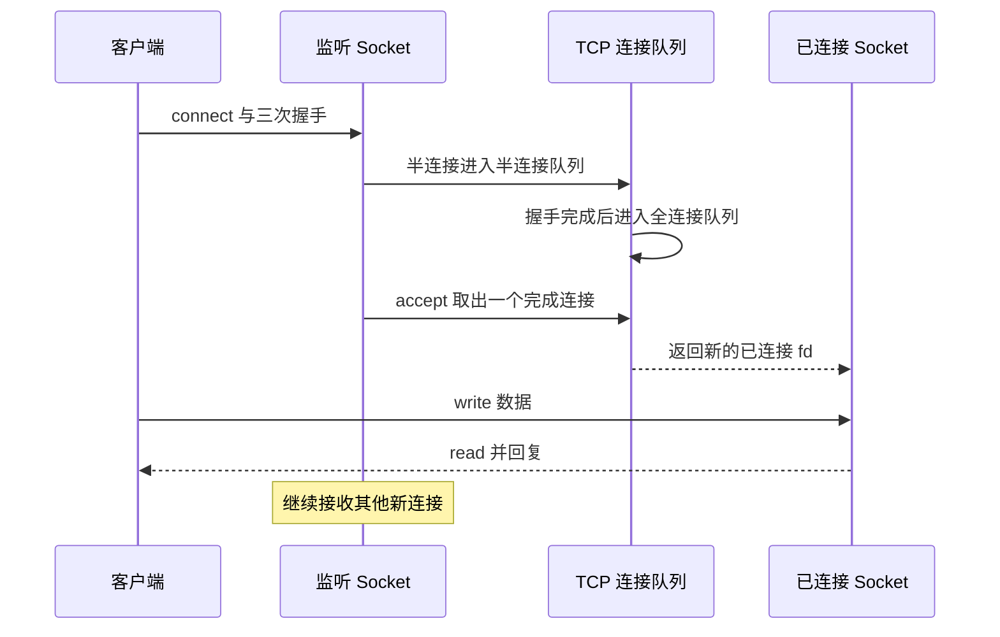
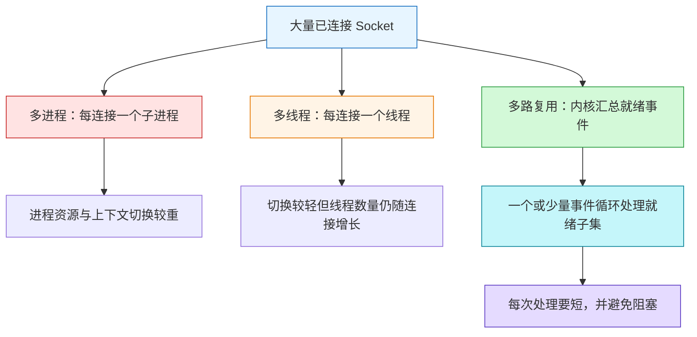
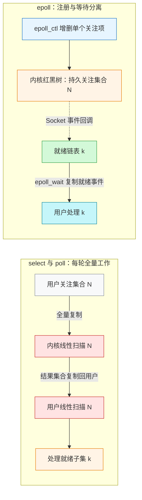
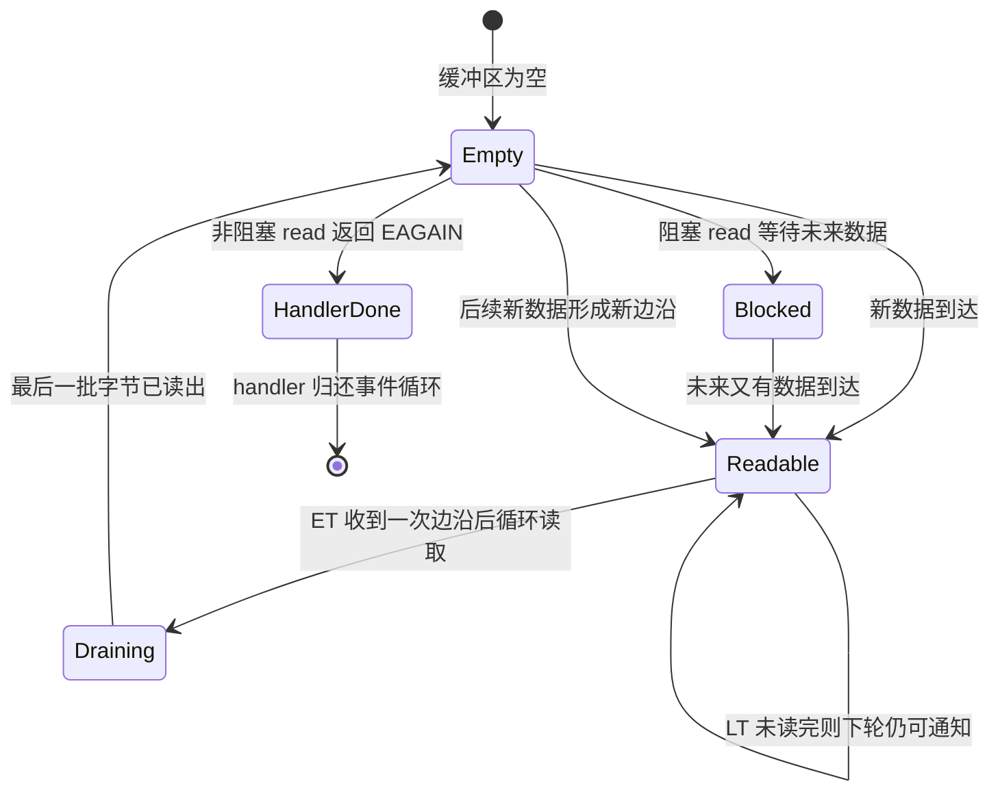
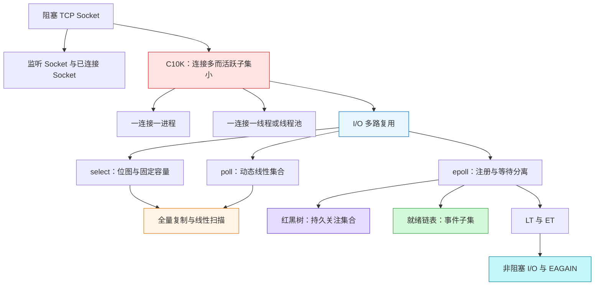

# I/O 多路复用：select、poll 与 epoll

> Source: [`materials/os/8_network_system/selete_poll_epoll.md`](../../../materials/os/8_network_system/selete_poll_epoll.md)（已逐行阅读正文 264 行，并核对 TCP 调用链、多路复用、epoll 结构与 `__put_user` 四张原图）  
> Durable goal: 不把三个 API 背成一张优缺点表，而是能沿“关注集合怎样保存、内核怎样发现就绪、结果怎样返回、应用怎样读完数据”四个问题，自己推出 select、poll、epoll 及 LT/ET 的差异。

### 1. Topic Overview

- **What this is about:** 文章从最基本的阻塞 TCP Socket 出发，先说明“一连接一进程/线程”为什么难以扩展到 C10K，再引出一个执行实体同时等待多个 Socket 事件的 I/O 多路复用，最后比较 select、poll、epoll 以及 LT/ET。
- **Why it matters:** 高并发服务器的核心问题不是“系统能否给很多连接编号”，而是“等待大量大多不活跃的连接时，要重复维护多少执行实体、扫描多少 fd、复制多少监控状态”。
- **Difficulty level:** 中等。容易混淆的边界有：监听 Socket 与已连接 Socket、连接容量与处理能力、关注集合与就绪集合、事件通知与实际 `read/write`、ET 的一次通知与“永远只通知一次”。
- **Prerequisites:** 文件描述符、用户态/内核态、阻塞与非阻塞 I/O、进程/线程和 TCP 建连。此前已经稳定掌握“监听 Socket + 每连接一个已连接 Socket”，本章把它作为前置而不重复训练。
- **Source order:** TCP Socket 调用链与内核对象 -> 理论连接数和 C10K -> 多进程 -> 多线程/线程池 -> I/O 多路复用 -> select/poll -> epoll -> LT/ET -> 非阻塞 I/O。
- **Source boundary:** 本笔记以原文的 Linux 教学模型为主，不展开每个系统调用的参数和所有内核版本细节。原文一处把 select/poll 在大集合上的损耗说成“指数级增长”，但同段给出的机制和复杂度是线性扫描 `O(n)`；本笔记按 `O(n)` 理解，不把“指数级”当严格复杂度结论。

#### Roadmap

1. 用“监听入口 + 每连接一个数据端点”运行 TCP 服务端调用链。（Stable prerequisite）
2. 用“连接身份空间 ≠ 实际服务能力”解释理论上限与 C10K 瓶颈。（Stable）
3. 用“连接数 ≠ 执行实体数”理解多进程、多线程与多路复用的模型变化。（Stable）
4. 用“全量集合复制 + 内核/用户双扫描”运行 select/poll。（Stable）
5. 用“持久关注集合 + 就绪列表”运行 epoll，并反驳共享内存误解。（Stable）
6. 用“条件持续 vs 状态边沿”选择 LT/ET，并说明为什么要配非阻塞 I/O。（Stable）

Final transfer：在同一“大量连接、少量活跃”场景中，运行 select/poll 的 `N` 成本、epoll 的 `N/k` 分工与 ET 的非阻塞读空流程。（当前）

### 2. Core Concepts

#### Schema 1：用“监听入口 + 每连接一个数据端点”运行 TCP 服务端

- **Definition:** 服务端先执行 `socket -> bind -> listen` 创建监听 Socket；`accept` 从全连接队列取出一个已完成握手的连接，并返回一个新的已连接 Socket。监听 Socket 继续接新连接，已连接 Socket 才负责与某个客户端 `read/write`。
- **Intuition:** 监听 Socket 像总机号码，已连接 Socket 像接通后分配给某位来电者的独立通话线路。总机不会因为接通一个客户端就变成那条通话线路。
- **Example:** 客户端 A 和 B 完成连接后，服务端仍保留一个监听 fd，同时分别持有 A、B 的两个已连接 fd；关闭 A 的 fd 不应把监听入口一并关闭。
- **Connection queues:** 三次握手未完成的连接位于半连接队列，完成握手的连接位于全连接队列；`accept` 消费的是后者。

#### Visual Model：`accept` 前后究竟有几个 Socket？



- **How to read:** `accept` 不是把监听 fd 改造成数据 fd，而是从全连接队列产生一个新的已连接 fd。
- **Source anchor:** [`selete_poll_epoll.md`“最基本的 Socket 模型”](../../../materials/os/8_network_system/selete_poll_epoll.md#最基本的-socket-模型)。
- **Kernel object path:** 进程的文件描述符数组用整数下标找到打开文件；Socket 文件再关联内核 Socket 结构，其中有发送队列和接收队列，队列元素以 `sk_buff` 组织。协议栈上下行通过移动 `skb->data` 指针增加或剥离首部，避免每经过一层都重新复制整包。
- **Common mistakes:** 在监听 Socket 上直接传输某个客户端的数据；认为 `accept` 返回原监听 fd；把半连接队列与已完成握手、可由 `accept` 取出的全连接队列混在一起。

#### Schema 2：用“连接身份空间 ≠ 实际服务能力”理解 C10K

- **Definition:** TCP 四元组决定连接身份；在服务端本地 IP 和端口固定时，理论组合主要来自客户端 IP 与客户端端口，因此原文给出 IPv4 下约 `2^32 × 2^16 = 2^48` 个组合。但组合数量只是“可区分多少连接”，不是机器真的能维护和处理多少连接。
- **Intuition:** 门牌号足够多，不等于楼里有足够的房间、内存和工作人员。
- **Example:** 即使把进程 fd 上限从默认值调高，10,000 个连接仍要占用 Socket/TCP 内核对象和缓冲内存；若还为每个连接创建一个进程或线程，栈、调度和上下文切换会成为额外瓶颈。

| 问题轴 | 它回答什么 | 原文中的约束 |
| --- | --- | --- |
| 四元组身份空间 | 理论上能区分多少条连接 | 固定服务端端点后，主要变化是客户端 IP 与端口 |
| 文件描述符预算 | 进程能引用多少 Socket | 进程/系统 fd 上限 |
| 内存预算 | 能保存多少连接状态 | 每条 TCP 连接的内核数据结构和缓冲区 |
| 执行模型 | 能否高效等待和处理连接 | 进程/线程数量、上下文切换、就绪检测方式 |
| CPU/网络工作量 | 实际能处理多少请求 | 每个事件处理时长、带宽和业务成本 |

- **Source anchor:** [`selete_poll_epoll.md`“如何服务更多的用户？”](../../../materials/os/8_network_system/selete_poll_epoll.md#如何服务更多的用户)。
- **Boundary:** C10K 是“同时维护并处理约一万客户端”的系统问题，不会仅靠扩大 fd 上限自动解决。
- **Common mistakes:** 把 `2^48` 当成单机可承载量；只看连接身份数量，不看内存、fd 和执行模型；认为调大 `ulimit` 就已经解决 C10K。

#### Schema 3：用“连接数 ≠ 执行实体数”理解多路复用

- **Definition:** 多进程/多线程模型把并发等待近似映射为“一条连接一个执行实体”；I/O 多路复用把“等待哪些 Socket 就绪”交给内核，使一个或少量执行实体能同时关注大量连接，只处理当前有事件的那部分。
- **Intuition:** 一连接一执行实体像给每扇门安排一个一直等候的人；多路复用像一个总控台同时看很多门铃，哪几扇响了才去处理哪几扇。
- **Example:** 有 10,000 条已建立连接，但某一时刻只有 20 条可读。连接对象仍是 10,000 个；多路复用不要求同时维护 10,000 个阻塞中的进程/线程，而可让事件循环拿到这 20 个就绪事件后逐个处理。

| 模型 | 等待关系 | 主要收益 | 主要代价/边界 |
| --- | --- | --- | --- |
| 多进程 | 常见为一个连接一个子进程 | 隔离直观；阻塞一个连接不阻塞其他子进程 | `fork`、地址空间/内核状态、重上下文切换；子进程退出还需 `wait/waitpid` 回收 |
| 多线程 | 常见为一个连接一个线程 | 同进程资源共享，切换通常比进程轻 | 大量线程仍占栈和调度资源；线程池任务队列需要同步 |
| I/O 多路复用 | 一个执行实体关注多个 fd 的就绪事件 | 把“连接数”与“等待执行实体数”解耦 | 事件处理必须短小；某个处理器若做长计算或阻塞 I/O，仍会拖住同一事件循环 |

#### Visual Model：三种模型真正改变的是什么？



- **How to read:** 三条路径都要保留连接本身；差别是是否为每条连接绑定一个正在等待的进程/线程，以及由谁集中发现就绪事件。
- **Source anchor:** [`selete_poll_epoll.md`“多进程模型”到“I/O 多路复用”](../../../materials/os/8_network_system/selete_poll_epoll.md#多进程模型)。
- **Boundary:** “一个进程处理多个 Socket”不表示同一时刻在一个 CPU 核上并行执行多个请求；它通过快速轮转就绪事件形成并发。若单个事件处理时间很长，仍需线程池、多进程或其他并行机制配合。
- **Common mistakes:** 认为多路复用减少了 Socket 数量；把“一个进程关注多个 fd”说成“一个进程同一时刻并行执行多个处理函数”；在事件循环中继续执行会长期阻塞的操作。

#### Schema 4：用“全量集合复制 + 内核/用户双扫描”运行 select/poll

- **Definition:** 每次等待时，select/poll 都把用户关心的 fd 线性集合交给内核；内核线性检查哪些 fd 就绪，再把结果写回用户空间；应用还要线性遍历结果集合找出可读/可写 fd。
- **Intuition:** 每次询问“谁准备好了”，都要把整本名单送进去；内核从头点名一次，名单送回来后应用再从头找一次被标记的人。
- **Example:** 关注 `N=10,000` 个 fd、当前只有 `k=8` 个就绪时，主要重复工作仍与 `N` 相关，而不是只与 `k` 相关。

select 的一次等待可压缩为：

```text
用户 fd_set
-> 整体复制到内核
-> 内核遍历并标记就绪 fd
-> 整体复制回用户
-> 用户再遍历找出就绪 fd
```

- **select:** 使用固定长度位图表示 fd 集合；原文按 Linux 默认 `FD_SETSIZE=1024` 说明只能覆盖 fd `0..1023`。
- **poll:** 改用动态线性数组，避免 select 固定位图的 1024 上限；实际仍受进程/系统 fd 预算限制。
- **共同本质:** 都要把关注集合带入内核、由内核线性检查，并由应用再扫描结果；等待成本是 `O(n)`，不会因为只有少量 fd 就绪就自动降为 `O(k)`。
- **Source anchor:** [`selete_poll_epoll.md`“select/poll”](../../../materials/os/8_network_system/selete_poll_epoll.md#selectpoll)。
- **Boundary:** poll 解决的是固定集合容量表示问题，不是“只返回就绪子集”的检测机制问题；所以它并未消除全量复制与线性扫描。
- **Common mistakes:** 说 poll 没有 fd 上限就等于无限连接；只记 select 的 1024，不会运行两次复制/两次遍历；把原文的口语“指数级”误写成严格复杂度，忽略同段明确给出的 `O(n)`。

#### Schema 5：用“持久关注集合 + 就绪列表”运行 epoll

- **Definition:** epoll 把两个角色分开：内核中的红黑树保存进程长期关注的 fd，`epoll_ctl` 增删改单个关注项；Socket 状态变化时，回调把就绪项加入就绪链表；`epoll_wait` 只把已就绪的事件记录复制给用户空间。
- **Intuition:** 总名单长期留在内核档案柜里；事件发生时把对应号码放进“待处理篮子”。应用来取的是篮子里的就绪项，不必每次重新提交并扫描整本总名单。
- **Example:** `N=10,000`、`k=8` 时，10,000 个关注项已经由此前的 `epoll_ctl` 保存在内核；本次 `epoll_wait` 面向就绪列表，将 8 个事件记录复制到用户提供的事件数组，并返回本次事件数。

#### Visual Model：select/poll 与 epoll 把重复工作放在哪里？



- **How to read:** select/poll 的等待调用反复承担与 `N` 相关的工作；epoll 把总关注集合持久化，只在增删改时更新，并让等待路径围绕就绪子集 `k` 工作。
- **Source anchor:** [`selete_poll_epoll.md`“epoll”](../../../materials/os/8_network_system/selete_poll_epoll.md#epoll)。
- **No-shared-memory boundary:** 文章专门用 `__put_user` 截图反驳“epoll_wait 通过共享内存零拷贝返回就绪链表”的说法。稳定表述是：epoll 避免每轮复制**整个关注集合**，但仍会把本次**就绪事件记录**从内核复制到用户空间。
- **Complexity boundary:** 红黑树的增删查通常为 `O(log n)`，就绪列表避免每轮扫描全部关注 fd；这不表示 epoll 的所有操作都是零成本或永远 `O(1)`，事件回调、就绪记录复制和用户处理仍有开销。
- **Common mistakes:** 把红黑树说成“就绪队列”；说 `epoll_wait` 直接共享内核链表、完全不复制；认为每次 `epoll_wait` 仍传入所有 fd；把“监听很多 fd 时更稳”夸大成任何负载下都无成本。

#### Schema 6：用“条件持续 vs 状态边沿”区分 LT 与 ET

- **Definition:** LT（水平触发）关注“当前条件是否仍成立”：只要接收缓冲区仍有数据，后续等待仍可继续得到可读通知。ET（边缘触发）关注“状态是否从不就绪变为就绪”：一次边沿通知后，应用应把当前可处理的数据尽量读/写到 `EAGAIN`。
- **Intuition:** LT 像快递未取就反复提醒；ET 像快递刚放入时提醒一次。ET 的“一次”是针对这次状态边沿，不是这个 fd 一生只通知一次；读空后将来又到新数据，会产生新的边沿。
- **Example:** Socket 缓冲区来了 8KB。LT 处理器只读 2KB 后返回事件循环，剩余 6KB 仍使“可读”条件成立，所以还会再通知。ET 若只读 2KB 后停止，剩余数据通常不会因同一边沿自动重发通知；应使用非阻塞循环继续读，直到 `read` 返回 `EAGAIN/EWOULDBLOCK`。

#### Visual Model：同一批未读数据为什么导致不同通知？



- **How to read:** LT 根据 `Readable` 条件是否持续决定重复返回；ET 在 `Empty -> Readable` 时通知。ET 读出最后一批字节后还要再调用一次 `read` 探测是否已空：非阻塞 fd 用 `EAGAIN` 结束 handler，阻塞 fd 则会睡眠等待未来数据。
- **Source anchor:** [`selete_poll_epoll.md`“epoll”中的 LT/ET 小节](../../../materials/os/8_network_system/selete_poll_epoll.md#epoll)。
- **Why nonblocking:** ET 必须循环读写，但一次成功的 `read` 只说明“这次取到了多少”，不能证明缓冲区已经为空。例如缓冲区有 `8KB`、每次最多读 `4KB`：前两次都返回 `4KB`，程序仍要进行第三次 `read` 才能确认没有更多数据。若 fd 是阻塞模式，第三次调用会睡眠等待未来数据，让整个事件循环停在这个 Socket；若 fd 是非阻塞模式，第三次调用立即返回 `-1`，并以 `EAGAIN/EWOULDBLOCK` 表示“当前已读空”，handler 就能退出并处理其他 Socket。原文还引用 Linux 手册指出多路复用可能偶尔报告伪就绪，因此即使使用 select/poll/LT，非阻塞 fd 也更安全。
- **Mode boundary:** select/poll 只有 LT；epoll 默认 LT，可选择 ET。ET 可能减少重复 `epoll_wait` 唤醒，但程序必须正确排空、处理半包/写不完和 `EAGAIN`。
- **Common mistakes:** 把 ET 说成 fd 永远只通知一次；ET 每次只读一小段就返回；把 `EAGAIN` 当成连接错误；认为“已经通知可读”就绝不可能因特殊情况阻塞。

### 3. Deep Understanding

三个接口都在做 I/O 多路复用，真正的差异可以用四问运行：

1. **关注集合放在哪里、多久更新一次？** select/poll 每轮重新带入线性集合；epoll 用 `epoll_ctl` 把集合长期保存在内核。
2. **内核怎样发现就绪？** select/poll 在等待路径扫描集合；epoll 通过 Socket 事件回调把就绪项加入链表。
3. **结果怎样回用户？** select/poll 返回可供用户再次扫描的集合；epoll 复制本轮就绪事件记录。三者都不是让用户代码直接操作内核对象。
4. **应用拿到可读后怎样处理？** LT 可在未读完时再次收到通知；ET 应以非阻塞循环排空到 `EAGAIN`。

核心因果链是：

```text
大量连接中只有少量活跃
-> 不值得为每条连接维持一个阻塞执行实体
-> 用一个等待接口汇总多个 fd 的就绪事件
-> select/poll 仍在每轮为全量 N 付出复制和扫描成本
-> epoll 把关注集合持久化，并把就绪项单独排队
-> LT/ET 再决定“未处理完的就绪条件”怎样继续通知
```

因此，epoll 的优势不是“它能多路复用而 select/poll 不能”，也不是“红黑树直接保存就绪事件”；优势是把**长期关注关系**和**本轮就绪结果**分离，避免等待调用反复处理整个关注集合。

### 4. Minimal Working Example

场景：服务器已经维护 `N=10,000` 条连接，本轮只有 `k=8` 条连接收到数据。

#### select/poll 路径

1. 用户把 10,000 个关注 fd 的集合交给内核。
2. 内核检查这 10,000 个 fd 的状态并标出 8 个就绪项。
3. 结果集合写回用户空间。
4. 用户仍要遍历集合，找出 8 个就绪 fd。
5. 对这 8 条连接执行非阻塞读取与业务处理。

主要重复成本围绕 `N`，即使 `k` 很小也不能跳过全量路径。

#### epoll 路径

1. 10,000 个关注关系已经通过先前的 `epoll_ctl` 存在内核红黑树中。
2. 8 个 Socket 发生事件时，回调把它们加入就绪链表。
3. `epoll_wait` 将 8 个就绪事件记录复制到用户事件数组并返回数量 8。
4. 用户只遍历这 8 个事件。
5. 若使用 ET，则每个 fd 都循环读取到 `EAGAIN`；若使用 LT，未读完的 fd 之后仍可再次返回。

这个例子说明：当 `N` 很大而 `k` 很小时，epoll 的“持久关注集合 + 就绪子集”才发挥最大价值。若所有 fd 始终活跃、每个事件业务计算很重，瓶颈还会转向实际读写、CPU 处理和下游资源，不能只靠换 API 解决。

### 5. Chapter Knowledge Map



### 6. Self-Test Questions

#### Recall

1. `accept` 返回的已连接 Socket 与原监听 Socket 分别负责什么？
2. select 一轮等待为什么可概括为两次集合复制和两次线性遍历？
3. epoll 中红黑树与就绪链表分别保存什么？

#### Application / Transfer

4. 关注 50,000 个 fd、每轮只有 30 个活跃时，为什么 poll 即使没有 select 的 1024 位图限制，仍可能明显慢于 epoll？
5. ET 模式下收到可读事件后只读一次 1KB 就返回事件循环，为什么可能留下数据却收不到同一边沿的再次提醒？正确处理模式是什么？

#### Explain Like I Am 5

6. 用“总名单、响铃名单、快递提醒”解释 select/poll、epoll 和 LT/ET，不使用红黑树、复杂度或系统调用等术语。

### 7. Weak Point Detection

- **对象边界失败:** 把监听 Socket、已连接 Socket、关注集合、就绪集合当成同一个对象。
- **容量边界失败:** 认为 poll 去掉 1024 限制后就同时去掉了扫描、复制、内存和 fd 限制。
- **机制边界失败:** 把 epoll 红黑树说成就绪队列，或认为每次 `epoll_wait` 仍提交全部 fd。
- **拷贝边界失败:** 说 epoll 通过共享内存直接暴露内核就绪链表；忽略 `epoll_wait` 仍复制就绪事件记录。
- **复杂度失败:** 把 select/poll 的线性 `O(n)` 说成严格指数复杂度，或把 epoll 说成所有操作都无条件 `O(1)`。
- **触发边界失败:** 把 ET 的“每个边沿一次”说成“每个 fd 一生一次”，或没有把 ET 与非阻塞排空到 `EAGAIN` 绑定。
- **迁移失败:** 只会背 epoll 更快，却无法在给定 `N` 个关注 fd、`k` 个就绪 fd 时指出成本围绕 `N` 还是 `k`。
