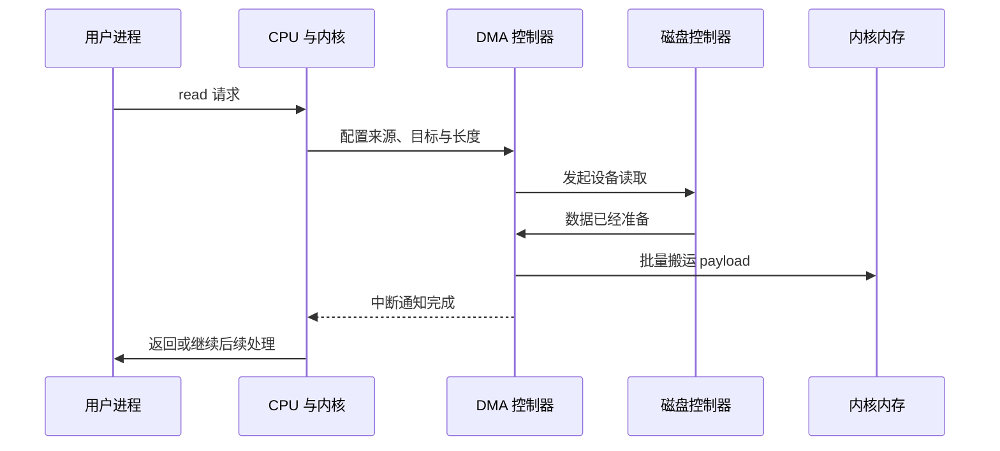
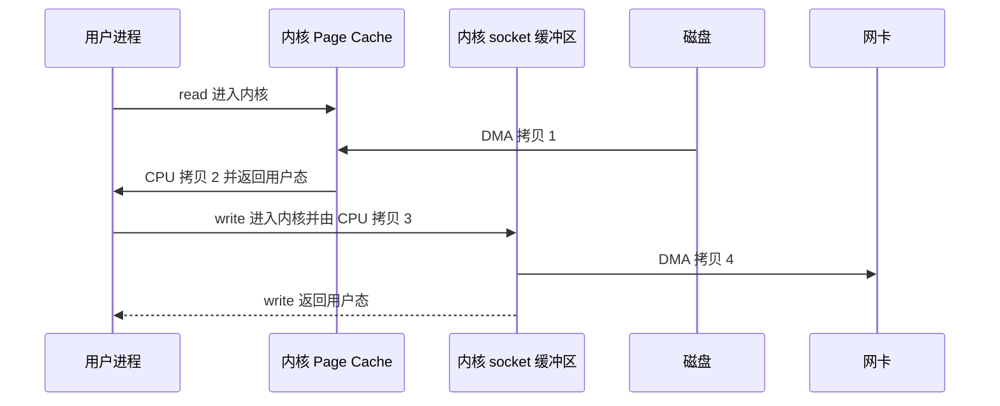
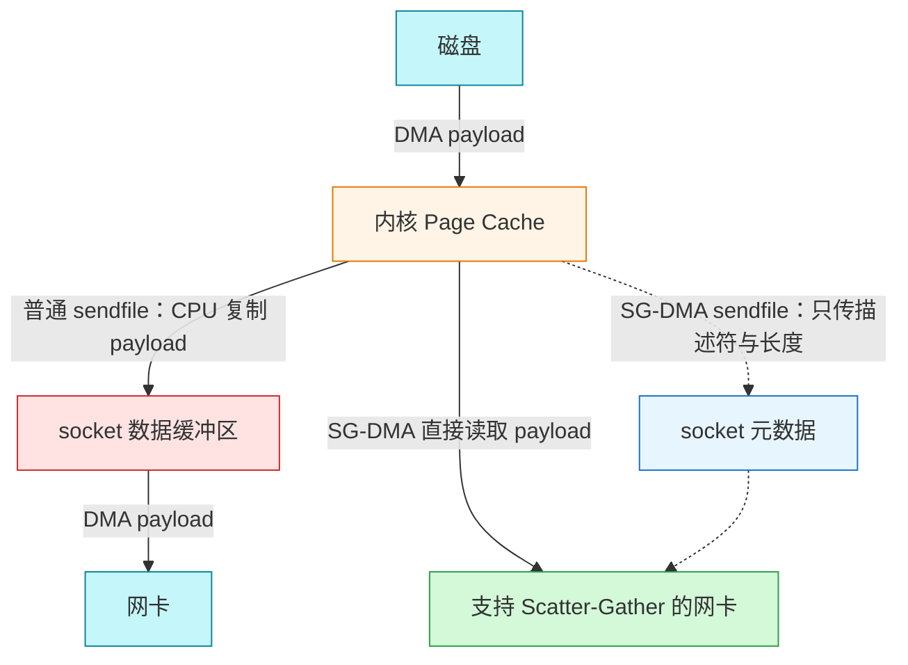
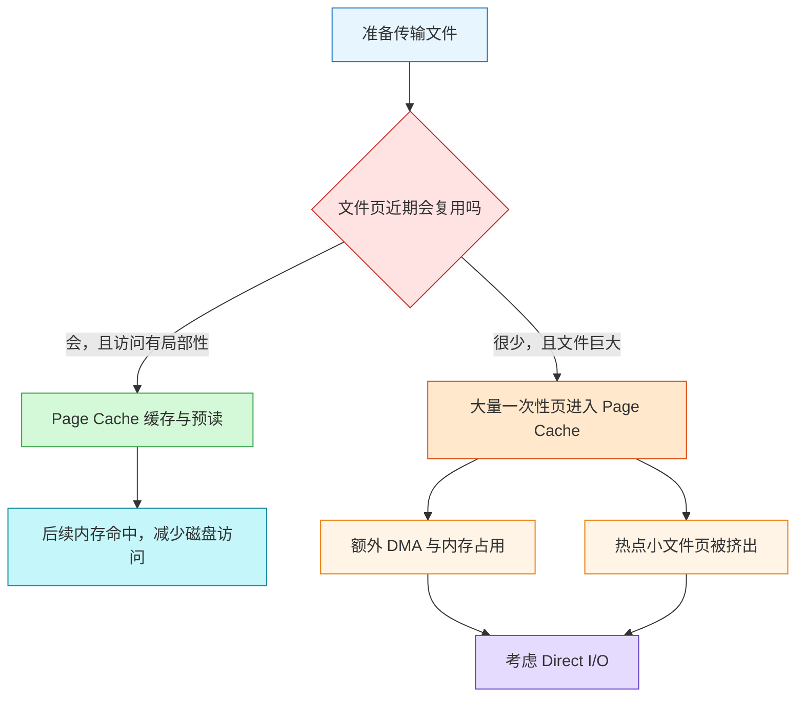
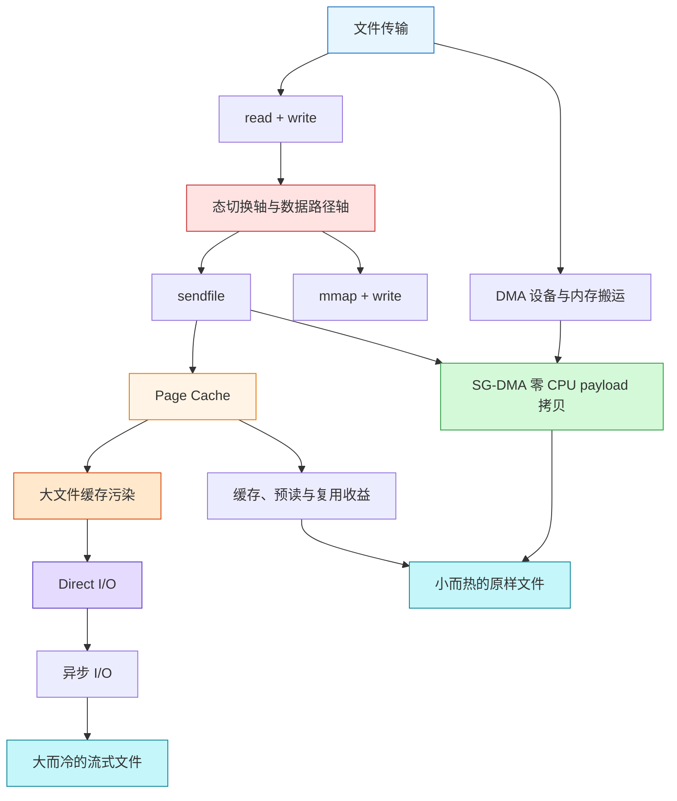

# OS 零拷贝：从 DMA 数据路径到文件传输选型

> Source: [`materials/os/8_network_system/zero_copy.md`](../../../materials/os/8_network_system/zero_copy.md)（已按原文顺序逐行阅读，共 354 行）  
> Durable goal: 不把“零拷贝”背成一个 API 名称，而是能沿 `磁盘 -> 内核 -> 用户空间 -> socket -> 网卡` 追踪数据，分别计算态切换、CPU 拷贝和 DMA 拷贝，再按工作负载选择传输路径。

### 1. Topic Overview

- **What this is about:** 以服务端发送磁盘文件为场景，解释 DMA 为什么出现，传统 `read + write` 为什么昂贵，`mmap + write` 与 `sendfile` 分别消掉了什么，以及 Page Cache 为什么既可能加速小文件，也可能被大文件污染。
- **Why it matters:** “零拷贝”是 I/O 面试中的高频概念。真正可复用的能力不是背 `4 次变 2 次`，而是能够自己数出系统调用、用户态/内核态切换、CPU 内存拷贝和 DMA 设备传输。
- **Difficulty level:** 中等。主要难点是把“控制流切换”和“数据流搬运”分开，以及理解“零”通常指没有 CPU 参与的 payload 内存拷贝，不是数据完全没有移动。
- **Prerequisites:** 用户态与内核态、系统调用、文件描述符、socket、Page Cache、设备控制器、中断与 DMA。
- **Source order:** DMA -> 传统文件传输 -> 两条优化轴 -> `mmap + write` -> `sendfile` -> SG-DMA -> Page Cache -> 大文件的异步 I/O + Direct I/O -> 文件大小选型。
- **Source boundary:** 本笔记忠实于原文的教学模型。原文把“小文件用零拷贝、大文件用异步 I/O + Direct I/O”作为高并发文件传输的主选择框架；现实系统还受设备类型、内核版本、缓存容量、访问复用、协议处理和实现支持影响，最终仍需测量。原文的次数模型默认讨论静态文件 payload，不包含协议栈内部所有元数据操作。

#### Roadmap

1. 用“CPU 配置、DMA 搬运、中断通知”定位 DMA 的职责边界。
2. 用“态切换轴 + 数据路径轴”数清传统 `read + write` 的开销。
3. 判断用户缓冲区何时是冗余中转站，并比较 `mmap + write` 与普通 `sendfile`。
4. 用“是否还有 CPU payload 拷贝”理解 `sendfile + SG-DMA` 为什么叫零拷贝。
5. 用“复用收益 vs 缓存污染”判断 Page Cache 是加速器还是负担。
6. 用“文件大小 + 是否加工 + 等待方式”选择零拷贝或异步 Direct I/O。

### 2. Core Concepts

#### Schema 1：用“CPU 配置、DMA 搬运、中断通知”定位 DMA

- **Definition:** DMA（Direct Memory Access）让专门的控制器承担 I/O 设备与内存之间的大块数据传输。CPU 仍负责描述传输任务、启动操作、处理完成通知并使用结果，但不再逐字节搬运设备数据。
- **Intuition:** CPU 是调度搬运任务的人，DMA 是搬运工，中断是任务完成后的门铃。三者不是互斥替代关系。
- **Example:** 磁盘读取时，CPU 告诉 DMA 数据来源、目标内存位置和长度；磁盘控制器准备数据；DMA 把数据送入内核缓冲区；足量数据到位后再中断 CPU。

| 问题 | 主要负责者 | 作用 |
| --- | --- | --- |
| 传什么、从哪里到哪里、传多少 | CPU/内核 | 配置和启动 I/O |
| 设备与内存之间的大块 payload 搬运 | DMA 控制器 | 降低 CPU 搬运负担 |
| 告知传输已经完成 | 中断 | 让 CPU 回来收尾 |
| 内核缓冲区到用户缓冲区的普通内存复制 | CPU | 这不是 DMA 自动消除的路径 |

#### Visual Model：DMA 让 CPU 退出的是哪一段工作？



- **How to read:** CPU 出现在开始和结束；中间的设备到内存 payload 传输由 DMA 完成，结束仍可通过中断通知 CPU。
- **Source anchor:** [`zero_copy.md`“为什么要有 DMA 技术？”](../../../materials/os/8_network_system/zero_copy.md#为什么要有-dma-技术)。
- **Boundary:** 原文个别句子把 DMA 概括成“全程搬运”，但同一流程随后明确还有“内核缓冲区 -> 用户缓冲区”的 CPU 拷贝。稳定边界应是：DMA 主要卸载设备与内存之间的数据搬运，不会自动消除所有内存到内存复制。
- **Common mistakes:** 把中断当成 payload 搬运者；认为 DMA 后 CPU 完全不配置也不收尾；把 DMA 传输和用户态/内核态切换算成同一种事件。

#### Schema 2：用“态切换轴 + 数据路径轴”追踪传统文件传输

- **Definition:** 传统静态文件传输使用 `read(file, tmp_buf, len)` 和 `write(socket, tmp_buf, len)`。分析成本时必须同时画两条互不替代的轴：控制流经过几次用户态/内核态边界，payload 又经过几次数据搬运。
- **Intuition:** “人进出仓库几次”和“货物被搬了几次”是两本账。一次系统调用通常带来进入内核和返回用户态两次切换，但并不等价于两次数据复制。
- **Example:** `read` 把文件数据从 Page Cache 复制到用户缓冲区；`write` 再把它复制回内核 socket 缓冲区。应用若只是原样转发，这个用户缓冲区就是一次来回中转。

```c
read(file, tmp_buf, len);
write(socket, tmp_buf, len);
```

| 次序 | payload 路径 | 搬运者 |
| --- | --- | --- |
| 1 | 磁盘 -> 内核 Page Cache | DMA |
| 2 | Page Cache -> 用户缓冲区 | CPU |
| 3 | 用户缓冲区 -> 内核 socket 缓冲区 | CPU |
| 4 | socket 缓冲区 -> 网卡缓冲区 | DMA |

#### Visual Model：传统文件传输的四次拷贝与四次态切换在哪里？



- **How to read:** 两个系统调用各有“进入内核、返回用户态”，所以共 4 次态切换；payload 的四条移动边中，两条由 CPU 完成、两条由 DMA 完成。
- **Source anchor:** [`zero_copy.md`“传统的文件传输有多糟糕？”](../../../materials/os/8_network_system/zero_copy.md#传统的文件传输有多糟糕)。
- **Common mistakes:** 把两次系统调用说成两次态切换；漏算系统调用返回；把磁盘到 Page Cache 说成 CPU 拷贝；把上下文切换次数与数据拷贝次数混为一谈。

传统路径的账本是：

| 指标 | 次数 |
| --- | ---: |
| 系统调用 | 2 |
| 用户态/内核态切换 | 4 |
| payload 数据拷贝 | 4 |
| 其中 CPU 拷贝 | 2 |
| 其中 DMA 拷贝 | 2 |

#### Schema 3：先判断“用户空间是否加工数据”，再消除冗余中转

- **Definition:** 如果应用只把文件原样发送到 socket，不读取、修改、压缩或加密 payload，那么把数据复制进用户缓冲区再复制回内核没有提供业务价值，可以尝试让数据留在内核路径中。
- **Intuition:** 优化不是机械地删缓冲区，而是先问用户代码是否真的需要触碰这些字节。若需要加工，用户态访问不是冗余；若只转发，它才是中转站。
- **Example:** 静态图片原样发送可以绕过用户缓冲区；若发送前必须由进程压缩图片，进程就必须访问内容，原文所述 `sendfile` 零拷贝主路径不再直接适用。
- **Optimization axes:** 减少系统调用才能减少态切换；删除无业务价值的用户态中转才能减少 CPU 数据拷贝。这两个动作要分别判断。

##### `mmap + write`

`mmap` 把文件的内核缓冲页映射到用户地址空间，避免 `Page Cache -> 用户缓冲区` 的 CPU 复制；随后 `write` 仍把 payload 从已映射的内核页复制到 socket 缓冲区。

```c
buf = mmap(file, len);
write(sockfd, buf, len);
```

- 系统调用仍是 2 次，因此仍有 4 次用户态/内核态切换。
- payload 拷贝降为 3 次：磁盘到 Page Cache 的 DMA、Page Cache 到 socket 缓冲区的 CPU 拷贝、socket 缓冲区到网卡的 DMA。
- **Boundary:** “映射”是让用户虚拟地址引用同一批文件缓存页，不是先复制一份同内容的新用户缓冲区。

##### 普通 `sendfile`

`sendfile(out_fd, in_fd, offset, count)` 把“读文件”和“写 socket”合并为一个系统调用，数据不经过用户缓冲区。

- 系统调用降为 1 次，因此只有 2 次用户态/内核态切换。
- 在原文 Linux 2.1 模型中仍有 3 次 payload 拷贝：磁盘到 Page Cache 的 DMA、Page Cache 到 socket 缓冲区的 CPU 拷贝、socket 缓冲区到网卡的 DMA。
- 相比 `mmap + write`，它既不把 payload 复制到用户空间，也减少了一次系统调用。

| 路径 | 系统调用 | 态切换 | 总数据拷贝 | CPU payload 拷贝 | DMA 拷贝 |
| --- | ---: | ---: | ---: | ---: | ---: |
| `read + write` | 2 | 4 | 4 | 2 | 2 |
| `mmap + write` | 2 | 4 | 3 | 1 | 2 |
| 普通 `sendfile` | 1 | 2 | 3 | 1 | 2 |

- **Source anchor:** [`zero_copy.md`“如何优化文件传输的性能？”与“如何实现零拷贝？”](../../../materials/os/8_network_system/zero_copy.md#如何优化文件传输的性能)。
- **Common mistakes:** 认为 `mmap` 自动把两个系统调用合成一个；认为普通 `sendfile` 已经没有任何 CPU payload 拷贝；忽略应用是否需要加工数据。

#### Schema 4：用“是否还有 CPU payload 拷贝”理解 SG-DMA 零拷贝

- **Definition:** 当网卡支持 scatter-gather DMA，`sendfile` 可以把内核缓冲区的描述符和数据长度交给 socket 路径，让网卡的 SG-DMA 直接从 Page Cache 所在内核页读取 payload，而无需 CPU 再把整份 payload 复制到 socket 数据缓冲区。
- **Intuition:** socket 侧传的是“货物在哪、长度多少”的清单，不再复制整车货物。网卡按清单从若干内存片段取走数据。
- **Example:** Linux 2.4 起原文所述的 SG-DMA 路径中，先由磁盘 DMA 把文件读入 Page Cache，再由网卡 SG-DMA 从这些内核页把数据送到网卡；payload 没有进入用户缓冲区，也没有被 CPU 在内存缓冲区之间复制。

#### Visual Model：普通 `sendfile` 与 SG-DMA 版差在哪一条边？



- **How to read:** 普通路径中间有一条 CPU payload 复制边；SG-DMA 路径只在 socket 侧传描述信息，网卡直接从 Page Cache 页取 payload。
- **Source anchor:** [`zero_copy.md`“sendfile”](../../../materials/os/8_network_system/zero_copy.md#sendfile)。
- **Boundary:** “零拷贝”不是数据没有物理移动。磁盘到内存、内存到网卡仍有 2 次 DMA 传输；“零”指该模型中没有 CPU 介导的 payload 内存拷贝。描述符和长度等元数据仍需处理。
- **Project examples in the source:** Kafka 的 Java NIO `FileChannel.transferTo` 在支持条件下可落到 `sendfile`；Nginx 的 `sendfile on` 使用该路径。它们说明的是静态文件传输的机制应用，不意味着所有 Kafka/Nginx I/O 都只走这一条路径。

最终账本：

| 路径 | 系统调用 | 态切换 | 总 payload 拷贝 | CPU payload 拷贝 | DMA 拷贝 |
| --- | ---: | ---: | ---: | ---: | ---: |
| `sendfile + SG-DMA` | 1 | 2 | 2 | 0 | 2 |

#### Schema 5：用“复用收益 vs 缓存污染”判断 Page Cache

- **Definition:** 零拷贝的文件数据通常先进入 Page Cache。Page Cache 利用局部性缓存最近访问的数据，并对顺序访问进行预读；后文还强调请求合并，从而减少磁盘寻址和重复设备访问。
- **Intuition:** Page Cache 是公共书架。会反复读的小文件放上去很划算；一次扫过的巨大文件占满书架，就可能把真正反复使用的热点书挤走。
- **Example:** 应用本次读 `0–32KB`，内核预读 `32–64KB`。若马上顺序读取后一段，就省下一次等待；若后续不读，它既浪费 I/O 和内存，还可能挤出热点页。

| Page Cache 能力 | 获益条件 | 失效或代价 |
| --- | --- | --- |
| 最近访问数据缓存 | 相同文件页会再次访问 | 一次性流式数据几乎不复用 |
| 预读相邻数据 | 顺序访问继续发生 | 随机访问或预读后未使用 |
| 合并 I/O 请求 | 可把相邻或积累的请求组织成更大 I/O | Direct I/O 绕过这层后应用需承担更多调度责任 |

#### Visual Model：什么时候 Page Cache 从加速器变成污染源？



- **How to read:** 关键判断不是抽象的“缓存好不好”，而是文件页是否会在淘汰前复用；大而冷的顺序流可能同时产生无收益缓存和热点挤出。
- **Source anchor:** [`zero_copy.md`“PageCache 有什么作用？”](../../../materials/os/8_network_system/zero_copy.md#pagecache-有什么作用)。
- **Boundary:** “大文件不能用零拷贝”是原文为高并发、缓存污染明显的场景给出的选择规则，不是只看文件大小就永远成立的系统定律；是否有复用、内存压力和具体实现同样重要。
- **Common mistakes:** 认为进入 Page Cache 就一定命中；只看到大文件占内存，没看到它还会挤出热点；认为 Direct I/O 绕过 Page Cache 后仍自动享有同样的预读与合并。

#### Schema 6：用“文件大小 + 是否加工 + 等待方式”选择路径

- **Definition:** 原文最后把文件传输选择压成三项：payload 是否要经过用户态加工、Page Cache 是否能产生复用收益，以及进程是否应在磁盘数据未就绪时继续做别的工作。
- **Intuition:** `sendfile` 优化的是原样转发；Direct I/O 优化的是绕开不值得使用的 Page Cache；异步 I/O 优化的是等待方式。三者回答不同问题。
- **Example:** 高频小静态资源可从 Page Cache 命中并用 `sendfile` 原样发出。GB 级一次性视频流在高并发下可能污染 Page Cache，原文建议异步 I/O + Direct I/O。若发送前必须压缩，则不能只靠原文的零拷贝路径，因为用户逻辑要读取并改变 payload。

| 决策轴 | 问题 | 对路径的影响 |
| --- | --- | --- |
| 内容加工 | 用户进程是否要压缩、加密或修改 payload？ | 要加工时不能把用户态触碰数据视为冗余 |
| 缓存价值 | 文件页会否在 Page Cache 中复用？ | 热点/小文件倾向缓存；大而冷的流倾向 Direct I/O |
| 等待方式 | 磁盘未就绪时进程是否要继续处理其他任务？ | 需要时使用异步 I/O 模型 |
| 硬件能力 | 网卡是否支持 SG-DMA？ | 决定 `sendfile` 能否消除最后一条 CPU payload 拷贝 |

原文的 Nginx 示例：

```plain
location /video/ {
    sendfile on;
    aio on;
    directio 1024m;
}
```

在原文解释中，大于 `directio` 阈值的文件走异步 I/O + Direct I/O；阈值以下走 `sendfile` 零拷贝。

- **Source anchor:** [`zero_copy.md`“大文件传输用什么方式实现？”](../../../materials/os/8_network_system/zero_copy.md#大文件传输用什么方式实现)。
- **Boundary:** Direct I/O 只回答是否绕过 Page Cache，不自动提供断电持久化语义；异步 I/O 只改变提交与完成通知方式，也不等于零拷贝。原文此处讨论读文件并网络发送，不是在讨论可靠写入确认。
- **Common mistakes:** 说异步 I/O 就是 Direct I/O；说 Direct I/O 完全绕过内核；把 `O_DIRECT` 误当成持久化保证；只凭“大文件”二字忽略访问复用与工作负载测量。

### 3. Deep Understanding

全章的机制链可以压缩为：

```text
传统 read + write
-> 两个系统调用带来 4 次态切换
-> payload 经过磁盘、Page Cache、用户缓冲、socket 缓冲、网卡，共 4 次拷贝
-> 若用户不加工 payload，用户缓冲区是冗余中转
-> mmap 消掉 Page Cache 到独立用户缓冲区的复制，但未减少系统调用
-> sendfile 合并读与发送，减少系统调用，并让 payload 不进入用户缓冲区
-> SG-DMA 再消掉 Page Cache 到 socket 数据缓冲区的 CPU payload 复制
-> 最终仍有磁盘到内存、内存到网卡两次 DMA，所以“零”不是零移动
```

三个容易混淆但必须独立的优化目标：

1. **减少系统调用：** 主要减少用户态/内核态切换，如 `sendfile` 合并 `read + write`。
2. **减少 CPU payload 拷贝：** 让数据不进入不必要的用户缓冲区，并在 SG-DMA 支持下由网卡直接读取内核页。
3. **避免无收益缓存与等待：** 大而冷的文件可考虑 Direct I/O 避免 Page Cache 污染，并用异步 I/O 避免进程同步等待数据就绪。

关键边界对：

- **控制流 vs 数据流:** 态切换不等于数据拷贝。
- **DMA vs 中断:** DMA 搬 payload，中断通知完成。
- **映射 vs 复制:** `mmap` 建立共享页映射，不是复制出另一份 payload。
- **零 CPU 拷贝 vs 零物理传输:** SG-DMA 路径仍有两次设备 DMA。
- **缓存路径 vs 持久化:** Direct I/O 绕开 Page Cache，不自动等于断电安全。
- **原样转发 vs 内容加工:** `sendfile` 主路径适合应用不需要修改 payload 的场景。

### 4. Minimal Working Example

场景：服务器把一个已经存在磁盘上的静态文件发给客户端。

#### A. `read + write`

1. 用户进程进入内核执行 `read`。
2. 磁盘 DMA 把文件页送到 Page Cache。
3. CPU 把 Page Cache 数据复制到 `tmp_buf`，`read` 返回用户态。
4. 用户进程再次进入内核执行 `write`。
5. CPU 把 `tmp_buf` 复制到 socket 缓冲区。
6. 网卡 DMA 把数据取到网卡，`write` 返回用户态。
7. 账本：2 个系统调用、4 次态切换、4 次拷贝，其中 2 次 CPU、2 次 DMA。

#### B. `sendfile + SG-DMA`

1. 用户进程只发起一次 `sendfile`，进入内核。
2. 磁盘 DMA 把文件页送到 Page Cache。
3. 内核把页描述符和长度交给 socket 路径。
4. 网卡 SG-DMA 直接读取这些内核页。
5. `sendfile` 返回用户态。
6. 账本：1 个系统调用、2 次态切换、2 次 DMA、0 次 CPU payload 拷贝。

#### C. GB 级低复用文件

1. 如果仍把整份文件装入 Page Cache，许多页只访问一次。
2. 这些页既消耗一次设备到 Page Cache 的传输，又占用缓存并可能挤出热点小文件。
3. 原文建议绕过 Page Cache 使用 Direct I/O，并用异步 I/O 让提交者在数据未就绪时继续做别的工作。
4. 这改变的是缓存路径和等待方式，不提供额外的写入持久化保证。

### 5. Chapter Knowledge Map



- **How to read:** 先用双轴比较传输实现，再用 Page Cache 的复用/污染分叉决定工作负载；SG-DMA 优化小而热的原样转发，异步 Direct I/O 对应原文的大而冷路径。
- **Source anchor:** 原文全部章节的压缩关系图。

### 6. Self-Test Questions

#### Recall

1. 传统 `read + write` 为什么是 4 次态切换，而不是 2 次？
2. 四次 payload 拷贝分别发生在哪里，其中哪些由 CPU、哪些由 DMA 完成？
3. `mmap + write`、普通 `sendfile`、`sendfile + SG-DMA` 分别还剩几次 CPU payload 拷贝？

#### Application / Transfer

4. 一个静态图片服务不修改图片内容，网卡支持 SG-DMA。请自行推导最合适路径及其态切换、CPU 拷贝和 DMA 拷贝次数。
5. 一个高并发视频服务发送 8GB、几乎不会复用的文件。为什么 Page Cache 可能同时浪费本次传输成本并伤害其他请求？原文建议怎样改变缓存路径和等待方式？

#### Explain Like I Am 5

6. 用“仓库、搬运工、门铃、公共书架”解释 CPU、DMA、中断和 Page Cache，并说明零拷贝的“零”到底少了什么。

### 7. Weak Point Detection

- **计数混轴:** 把系统调用数、态切换数和数据拷贝数写成同一数字，却说不出每一条边。
- **DMA 绝对化:** 认为用了 DMA 后 CPU 不做配置、不中断、不做任何内存复制。
- **零字面化:** 认为零拷贝意味着数据没有从磁盘移动到内存或网卡。
- **`mmap` 误解:** 把共享映射说成把内核缓冲区复制到一个新的用户缓冲区。
- **`sendfile` 版本混淆:** 不区分普通 `sendfile` 的 1 次 CPU payload 拷贝与 SG-DMA 路径的 0 次。
- **忽略加工边界:** 认为压缩、加密、修改 payload 时仍可无条件沿用同一 `sendfile` 路径。
- **缓存万能化:** 认为所有大文件进入 Page Cache 都有收益，不检查复用与热点挤出。
- **Direct I/O 误迁移:** 把绕过 Page Cache 误说成完全绕过内核、必然更快或自动获得断电持久性。
