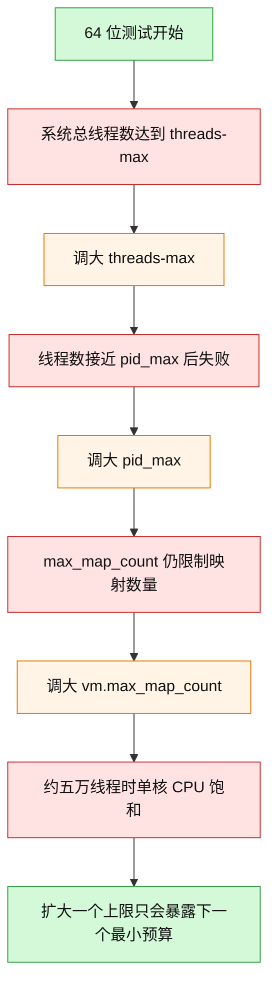
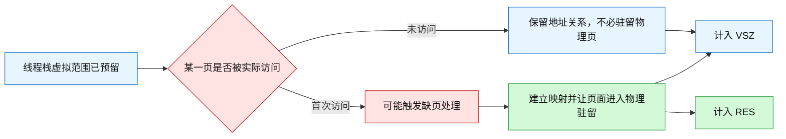
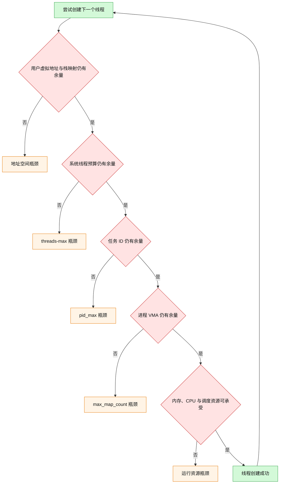
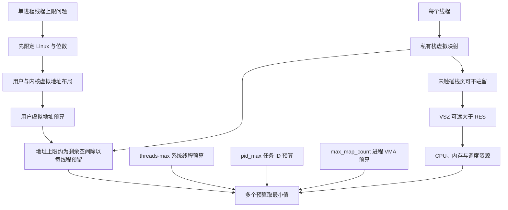

# 5.6 一个进程最多可以创建多少个线程？

### 1. Topic Overview

- What this is about: 这章用 Linux 上的线程创建实验回答“一个进程最多能有多少线程”。关键结论不是某个固定数字，而是：线程上限由虚拟地址空间、每线程栈、系统级线程/PID/VMA 限制和机器实际资源共同决定，最先耗尽的预算就是当次实验的瓶颈。
- Why it matters: 面试题常把“32 位/64 位”“虚拟内存/物理内存”“单进程/全系统限制”混在一起。只有先限定环境、再逐项找瓶颈，答案才不会把某台机器的实验值误当成通用定律。
- Difficulty level: 中等。难点在于区分地址空间预留与物理页驻留，并把多个上限看成同时存在的约束，而不是依次背三个参数名。
- Prerequisites: 进程与线程；线程私有栈；32/64 位寻址；虚拟地址空间、VMA、按需分配与物理驻留的基本概念。
- Source: `materials/os/4_process/create_thread_max.md`，共 180 行。原文顺序是“地址空间布局 → 32 位估算 → 64 位系统参数实验 → 大虚拟空间与小物理驻留 → 总结”。
- Source boundary: 原文中的 `3G`、`128T`、`14553`、`32768`、`65530` 和实验线程数都属于文中系统布局或当时测试机的快照，不是所有 Linux 系统的固定当前值。原文先正确写出 `/proc/sys/vm/max_map_count`，后面的修改命令却写成了 `/proc/sys/kernel/max_map_count`；笔记按前者理解，并把后者视为路径笔误。

本章路线：

1. 先限定操作系统、位数与用户虚拟地址空间。
2. 用“可用地址预算 ÷ 每线程栈预留”估算 32 位上限。
3. 用“多个预算取最小值”解释 64 位系统的真实瓶颈。
4. 区分虚拟空间预留与物理页驻留，解释 `25T VSZ` 与 `2G` 物理内存为何能同时出现。

### 2. Core Concepts

#### Schema 1: 先限定环境，再回答线程上限

- Definition: “一个进程最多创建多少线程”没有脱离环境的唯一答案。至少要先说明操作系统、32/64 位、进程用户虚拟地址空间布局和线程栈设置，再检查系统参数及机器资源。
- Intuition: 问“最多能装多少箱子”前，必须先知道仓库大小和每个箱子的体积；换一间仓库或换一种箱子，数字就会变。
- Example: 原文采用的 32 位 Linux 模型里，总虚拟地址空间为 `4G`，高端 `1G` 给内核，单进程用户空间约 `3G`。原文采用的 64 位模型里，用户空间可达 `128T`。相同的线程栈在这两种地址预算下，会得到完全不同的地址空间上限。
- Common mistakes:
  - 不说明 Linux/Windows 或 32/64 位，直接回答 `300` 或 `14553`。
  - 把“32 位可表示约 `4G` 地址空间”误说成每个进程能把 `4G` 都用于线程栈。
  - 把文中 `128T` 当成所有 64 位 Linux 机器永远不变的布局。

#### Schema 2: 用“剩余用户地址空间 ÷ 每线程栈预留”估算地址瓶颈

- Definition: 创建线程时要为它安排私有栈的虚拟地址范围。若可供新增线程使用的用户虚拟地址空间为 `A_free`，每个线程的栈及相关映射平均预留为 `S_thread`，则地址空间给出的粗略上限为：

  ```text
  N_va ≈ A_free / S_thread
  ```

  这是容量估算，不是精确承诺；代码、堆、共享库、已有映射、线程控制数据和地址碎片都会占用空间。
- Intuition: 每多一个线程，就从同一张虚拟地址“地图”中划出一块私有栈区域；地图先画满时，即使还有 CPU 或物理内存，也无法继续按原配置创建线程。
- Example: 原文在 32 位模型中用 `3G` 用户空间和每线程约 `10M` 的假设估算：`3G / 10M ≈ 300` 个线程。把线程栈调到 `512K` 后，地址预算的理论线程数会显著增加，所以原文建议可借此尝试创建上千线程。

#### Visual Model: 为什么减小线程栈会提高地址空间上限？


- How to read: 分母越小，地址空间这一项允许的线程数越大；但最终上限仍要与其他预算一起取最小值。
- Source anchor: `create_thread_max.md` 第 35-69 行。
- Boundary: 栈不是越小越好；线程真实调用深度和局部变量超过栈容量时会发生栈溢出。`ulimit -s` 也应在启动测试程序前设置，不能把它当成对任意已运行线程无条件重塑栈大小的按钮。

- Common mistakes:
  - 用整个 `3G` 做精确除法，忽略进程已有映射，所以把约数说成硬上限。
  - 看到默认栈 `8M`，又看到原文估算用 `10M`，误以为二者矛盾；前者是示例系统的栈限制，后者是原文为了粗算采用的每线程占用假设。
  - 把“预留栈虚拟地址”直接等同于“立刻占用同样多的物理内存”。

#### Schema 3: 用“多个预算取最小值”寻找 64 位真实瓶颈

- Definition: 64 位用户地址空间很大时，线程栈地址预算通常不再最先耗尽。原文继续检查三个限制：系统级总线程数 `threads-max`、任务 ID 数值空间 `pid_max`、单进程 VMA 数量 `max_map_count`，最后还遇到 CPU/整机资源瓶颈。
- Intuition: 有四道门串在一起，最窄的门决定当前能通过多少人；只扩大已经不是最窄的门，不会提高最终吞吐。
- Example: 原文测试机先在进程创建约 `14374` 个线程时失败，同时 `top -H` 显示系统总线程数达到 `14553`，与当时的 `threads-max` 相同。调大该参数后，进程在约 `32326` 个线程附近失败，接近当时 `pid_max=32768`。只调大 `pid_max` 仍未突破，继续调大 `max_map_count` 后达到约五万线程，随后单核 CPU 饱和、机器失去响应。

#### Visual Model: 原文实验怎样逐步暴露下一个瓶颈？



- How to read: 每次失败不是自动证明某个参数就是原因；原文通过“观察接近某上限 → 调整 → 再实验”的方式建立因果线索。最终 CPU 饱和说明可创建不等于可高效调度。
- Source anchor: `create_thread_max.md` 第 73-155 行。
- Boundary:
  - `threads-max` 是全系统预算，不是专属于这个进程；原文中进程线程数比参数值少，是因为系统已有其他线程。
  - Linux 中线程也占用任务 ID，所以 `pid_max` 会影响进程与线程创建；可用余量不是简单等于参数原值。
  - `max_map_count` 限制单进程 VMA 数量，而一个线程可能引入栈及保护区等映射，因此它与线程数有关，但不是“一线程严格等于一个 VMA”的固定换算。
  - 原文给出的修改路径应理解为 `/proc/sys/vm/max_map_count`；`/proc/sys/kernel/max_map_count` 是文中笔误。
  - 原文只展示了主要实验瓶颈，并没有穷举生产环境中的所有限制；不能把这三个参数当成完整清单。

- Common mistakes:
  - 认为 64 位虚拟空间足够大，所以线程数近似无限。
  - 把 `threads-max` 当成单个进程的线程上限。
  - 只调大参数而不观察失败位置、系统总量、CPU 和内存代价。
  - 把“能创建五万线程”误说成“五万线程可以高效并发运行”。

#### Schema 4: 区分虚拟地址预留与物理页驻留

- Definition: 线程栈可以先获得一大片虚拟地址范围，但未被线程实际访问的页不必全部驻留在物理内存。`VSZ` 描述进程虚拟地址范围，`RES` 描述当前驻留物理内存；二者不是同一个量。
- Intuition: 虚拟地址像给每个线程画出一大片可扩展的地块，物理内存像真正盖好的房间。地块已经登记，不等于每平方米都已经施工。
- Example: 原文把每线程栈上限调到约 `1000M` 后，约 `26390` 个线程对应进程虚拟空间约 `25T`，但测试机只有 `2G` 物理内存，进程 `RES` 约四百多 MB。原因是大量栈地址只被预留，实际触碰并驻留的页远少于其最大范围。

#### Visual Model: `25T VSZ` 为什么不要求 `25T` 物理内存？



- How to read: 预留的虚拟范围会扩大 `VSZ`；只有实际访问并驻留的页才进入 `RES`，所以两者可相差很多数量级。
- Source anchor: `create_thread_max.md` 第 157-174 行。
- Boundary: 大量虚拟预留并非完全“免费”。线程内核对象、页表、实际触碰的栈页和调度开销仍消耗真实资源；访问越来越多栈页时，物理内存压力也会增加。

- Common mistakes:
  - 看到 `VSZ=25T` 就断言机器至少需要 `25T` RAM。
  - 反过来认为虚拟预留没有任何实际成本。
  - 把局部性只理解为“只执行部分代码”，忽略这里更直接的机制是栈页按访问需求逐步建立物理驻留。

### 3. Deep Understanding

这章可以压缩成一个“容量预算取最小值”模型：

```text
N_max ≈ min(
  N_va,       # 剩余用户虚拟地址空间 / 每线程栈及相关映射
  N_threads,  # 全系统 threads-max 的剩余余量
  N_pid,      # PID/TID 数值空间的剩余余量
  N_vma,      # 单进程 max_map_count 的剩余余量
  N_resource  # 内核内存、物理内存、CPU 与调度等实际资源
)
```

这不是 Linux 内核直接计算的一条公式，而是诊断问题的思维模型：每创建一个线程，会同时消耗多类预算；最先到零的余量决定本次创建失败的位置。

#### Visual Model: 哪个因素最终决定线程上限？



- How to read: 创建成功要求所有闸门都通过；失败只需要任意一个预算先耗尽。调大某个参数后应重新测量，因为新的最小预算会接管瓶颈。
- Source anchor: `create_thread_max.md` 第 33-174 行的整条实验链。
- Boundary: 图按原文主要因素建模，故意不声称列尽所有 Linux 限制，也不把错误信息文本当成唯一诊断证据。

关键因果链：

```text
位数与地址布局
-> 决定用户虚拟地址预算
-> 每线程栈从中预留范围
-> 32 位常先撞地址空间
-> 64 位地址空间变宽后，系统参数与实际资源更可能先成为瓶颈
-> 虚拟预留大不代表物理驻留同样大
```

### 4. Minimal Working Example

#### 场景 A：32 位地址预算估算

给定原文模型：用户空间 `3GiB`，假设每个新线程平均预留 `10MiB`。

```text
N_va ≈ 3 × 1024 MiB / 10 MiB
     ≈ 307
```

回答时应说“地址空间角度约 300 个，真实值通常更低或受其他限制先截断”，而不是“Linux 单进程线程上限就是 300”。

如果把栈设为 `512KiB`：

```text
N_va ≈ 3 × 1024 MiB / 0.5 MiB
     ≈ 6144
```

这只说明地址空间这一项的理论容量变大，不保证系统真的能创建 6144 个线程，也不保证这么小的栈适合程序调用深度。

#### 场景 B：64 位实验诊断顺序

1. 用 `ulimit -a` 或 `ulimit -s` 查看测试程序启动前的栈限制。
2. 读取 `/proc/sys/kernel/threads-max`、`/proc/sys/kernel/pid_max`、`/proc/sys/vm/max_map_count`。
3. 运行受控测试，同时用 `top -H` 观察全系统线程数，并记录失败前的进程线程数、`VSZ`、`RES`、CPU 和错误。
4. 比较“观测值是否接近某预算”，再通过一次只改变一个条件的实验验证瓶颈。
5. 参数扩大后重新测量，不要假定原瓶颈仍然有效。

原文中的只读观察命令：

```bash
ulimit -a
ulimit -s
cat /proc/sys/kernel/threads-max
cat /proc/sys/kernel/pid_max
cat /proc/sys/vm/max_map_count
top -H
```

原文还展示了直接写 `/proc/sys/...` 的全局参数修改。那属于实验机上的高风险管理操作，不应在共享或生产系统上照抄；学习重点是单变量验证瓶颈，而不是把参数一律调大。

### 5. Chapter Knowledge Map



### 6. Self-Test Questions

Recall:

1. 为什么不说明操作系统和位数，就不能给出唯一线程上限？
2. `threads-max`、`pid_max`、`max_map_count` 分别限制什么范围？
3. `VSZ` 与 `RES` 的核心区别是什么？

Application / transfer:

4. 某 32 位进程剩余用户虚拟地址空间约 `2GiB`，每线程栈预留 `4MiB`。只从地址预算估算可再创建多少线程？为什么真实值可能更低？
5. 某 64 位测试把 `threads-max` 调大后线程数完全不变。请给出两个下一步应核对的预算，并说明为什么不能直接断言修改失败。

Explain like I am 5:

6. 用“划地块与盖房子”的比喻解释：为什么进程可以显示占了很大的虚拟空间，却只用了较少的物理内存？

### 7. Weak Point Detection

- **固定数字错觉**：回答 `300`、`14553` 或 `32768`，却不说明测试环境与这些数字属于哪一层预算。
- **范围混淆**：把全系统 `threads-max` 误说成单进程专属限额。
- **精确公式错觉**：把 `用户空间 / 栈大小` 当成内核保证，忽略已有映射和其他限制。
- **虚实混淆**：把栈虚拟范围全部当成立即驻留的物理内存，或反过来把虚拟预留当成零成本。
- **单参数思维**：看到失败就只调一个参数，不重新测量下一个瓶颈。
- **性能与容量混淆**：能创建很多线程就等同于能高效运行很多线程。
- **路径死记**：照抄原文 `/proc/sys/kernel/max_map_count`，没有发现其与前文 `/proc/sys/vm/max_map_count` 不一致。
